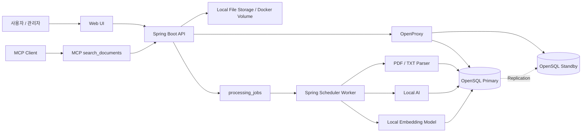
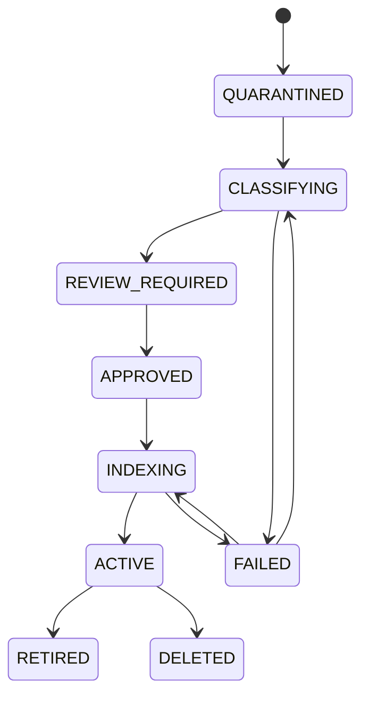
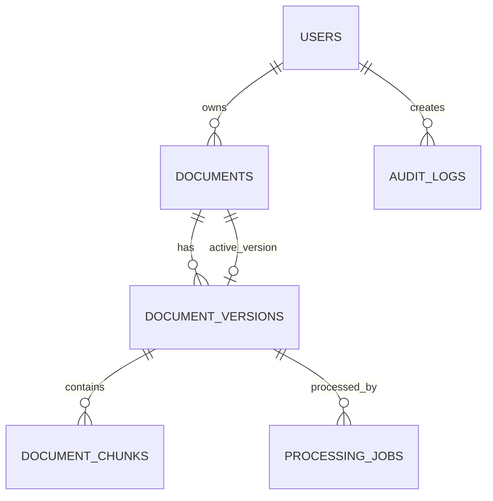

# PRIZM

> **OpenSQL 기반 N2SF 정책 라우팅형 고가용성 AI 문서 검색 플랫폼**

PRIZM은 공공기관 문서를 자동으로 임베딩하여 OpenSQL에 저장하고, 사용자가 자연어로 필요한 정보를 검색할 수 있도록 지원하는 AI 문서 검색 플랫폼입니다.

문서의 **기밀(C)·민감(S)·공개(O)** 등급과 사용자 권한에 따라 검색 범위와 AI 처리 경로를 통제하며, 문서 변경 시 원본과 임베딩의 정합성을 유지합니다. 또한 OpenSQL의 고가용성 구성을 활용해 데이터베이스 장애 이후 검색 서비스의 복구 시간과 요청 성공률을 측정합니다.

> PRIZM은 N2SF 전체 준수를 자동으로 보장하는 상용 보안 제품이 아니라,  
> **OpenSQL 기반 AI 검색에 문서 등급 추천·승인·접근통제·AI 라우팅을 적용한 오픈소스 레퍼런스 구현체**를 목표로 합니다.

---

## 프로젝트 배경

PRIZM은 2026 공개SW 개발자대회 티맥스티베로 기업주제인  
**OpenSQL 기반 AI 검색 및 벡터 데이터 플랫폼 개발**에 대응하기 위해 기획되었습니다.

기업주제의 핵심 요구사항은 다음과 같습니다.

- OpenSQL 기반 AI 문서 검색
- 문서 업로드 및 자동 임베딩
- 벡터 데이터 저장과 검색
- 문서 메타데이터 및 버전 관리
- 문서 변경 시 벡터 데이터 동기화
- MCP 기반 검색 API
- OpenSQL 고가용성과 장애 복구
- 기업 환경에 적합한 보안성과 안정성

PRIZM은 위 요구사항에 N2SF 기반 문서 등급과 사용자 권한에 따른 정책 라우팅을 결합합니다.

---

## 프로젝트명

**PRIZM**

**Policy-Routed Intelligent Zero-downtime MCP Platform**

- **Policy-Routed**: 문서 등급과 사용자 권한에 따른 검색·AI 경로 통제
- **Intelligent**: 문서 자동 임베딩과 자연어 기반 AI 검색
- **Zero-downtime**: 장애 발생 시 중단 시간을 최소화하는 고가용성 구조
- **MCP Platform**: AI 클라이언트가 사용할 수 있는 MCP 검색 도구 제공

완전한 0초 무중단을 주장하지 않으며, 실제 장애 실험을 통해 **RTO와 요청 성공률을 정량적으로 검증**하는 것을 목표로 합니다.

---

## 핵심 기능

### 1. 문서 업로드 및 격리

- PDF, TXT 문서 업로드
- 원본 파일과 메타데이터 분리 저장
- 업로드 직후 `QUARANTINED` 상태 적용
- 승인되지 않은 문서는 검색 대상에서 제외

### 2. AI 문서 등급 추천

- 로컬 AI가 C/S/O 추천 등급 생성
- 판단 근거와 신뢰도 제공
- 관리자가 추천 결과를 검토하고 최종 승인
- AI가 최종 등급을 자동 확정하지 않는 Human-in-the-loop 방식

### 3. 자동 임베딩 및 벡터 검색

- 문서 텍스트 추출
- 문서 청크 분할
- 로컬 임베딩 생성
- OpenSQL `pgvector` 저장
- 코사인 유사도 기반 자연어 검색
- 문서명, 버전, 페이지, 원문 청크, 유사도 표시

### 4. 사용자 권한 기반 접근통제

- 사용자 권한 등급: C / S / O
- 문서 등급에 따른 검색 범위 제한
- 승인되지 않았거나 비활성 상태인 문서 검색 차단
- 애플리케이션 계층의 권한 검사
- 환경 검증 후 OpenSQL RLS 추가 적용

### 5. 문서 버전 및 임베딩 동기화

- 기존 데이터를 직접 덮어쓰지 않는 불변 버전 구조
- 새 버전의 임베딩 완료 후 활성 버전 교체
- 처리 실패 시 기존 활성 버전 유지
- 오래된 청크와 임베딩의 검색 노출 방지

### 6. DB 작업 큐 기반 비동기 처리

- `processing_jobs` 테이블을 작업 큐로 사용
- Spring Scheduler 기반 Worker
- `SELECT ... FOR UPDATE SKIP LOCKED`
- 제한적인 재시도와 지수 백오프
- UNIQUE 제약조건을 이용한 중복 처리 방지

### 7. MCP 검색 API

- `search_documents` MCP 도구 제공
- REST API와 MCP가 동일한 `SearchService` 사용
- 권한 검사를 우회하지 않는 단일 검색 정책
- 관련 문서, 청크, 등급, 점수, AI 경로 반환

### 8. 고가용성 및 장애 복구

- OpenSQL Primary / Standby 구성
- OpenHA 기반 장애 감지와 Standby 승격
- OpenProxy 기반 연결 전환
- Spring Boot DB 재연결
- 장애 발생부터 검색 복구까지 RTO 측정
- 최초 실패 요청과 재시도 후 성공 요청 기록

---

## 전체 처리 흐름

### 문서 등록

```text
문서 업로드
→ 원본 파일 저장
→ 문서 및 문서 버전 생성
→ QUARANTINED
→ AI 등급 추천
→ REVIEW_REQUIRED
→ 관리자 승인
→ APPROVED
→ 문서 파싱
→ 청크 분할
→ 로컬 임베딩 생성
→ OpenSQL 벡터 저장
→ 결과 검증
→ ACTIVE
```

### AI 검색

```text
사용자 질문
→ 사용자 권한 확인
→ 질문 로컬 임베딩
→ 접근 가능한 ACTIVE 문서 필터링
→ OpenSQL 벡터 검색
→ 상위 청크 조회
→ 검색 결과의 최고 보안 등급 계산
→ LOCAL 또는 EXTERNAL AI 경로 결정
→ 답변과 출처 반환
→ 감사 로그 저장
```

### 문서 수정

```text
새 문서 버전 업로드
→ 기존 ACTIVE 버전 유지
→ 새 버전 분류 및 임베딩
→ 처리 결과 검증
→ active_version_id 교체
→ 기존 버전 RETIRED
```

---

## 시스템 아키텍처



---

## 문서 상태



| 상태 | 설명 |
|---|---|
| `QUARANTINED` | 업로드 직후 격리된 상태 |
| `CLASSIFYING` | AI 등급 추천 처리 중 |
| `REVIEW_REQUIRED` | 관리자 검토 대기 |
| `APPROVED` | 관리자가 최종 등급 승인 |
| `INDEXING` | 텍스트 추출·청크·임베딩 생성 중 |
| `ACTIVE` | 검색 가능한 활성 버전 |
| `FAILED` | 처리 실패 |
| `RETIRED` | 이전 활성 버전 |
| `DELETED` | 삭제 처리된 버전 |

---

## 기술 스택

### Backend

- Java 21
- Spring Boot 3
- Spring Web
- Spring Security
- Spring Data JPA
- JdbcTemplate / Native Query
- Spring Scheduler
- Bean Validation
- Flyway

### Database

- OpenSQL
- pgvector
- OpenHA
- OpenProxy

### AI / Document

- Ollama 또는 로컬 AI API
- 로컬 임베딩 모델
- Apache PDFBox 또는 Apache Tika
- TXT Parser

### Frontend

- React 또는 최소한의 Spring 정적 페이지
- 로그인
- 문서 업로드 및 승인
- AI 검색
- 작업 상태 조회

### Test / Infra

- JUnit 5
- Mockito
- Spring Boot Test
- Docker Compose
- k6 또는 부하 테스트 스크립트

---

## 프로젝트 구조

```text
src/main/java/com/prizm
├─ auth
├─ user
├─ document
│  ├─ controller
│  ├─ dto/response
│  ├─ entity
│  ├─ exception
│  ├─ repository
│  └─ service
├─ classification
├─ ingestion
├─ embedding
│  ├─ exception
│  └─ service
├─ search
│  ├─ controller
│  ├─ dto/request
│  ├─ dto/response
│  ├─ exception
│  ├─ repository
│  └─ service
├─ policy
├─ mcp
├─ audit
├─ infrastructure/storage
└─ common/dto/response
```

| 패키지 | 책임 |
|---|---|
| `auth` | 인증과 인가 |
| `user` | 사용자와 권한 등급 |
| `document` | 문서와 문서 버전 관리 |
| `classification` | AI 등급 추천과 관리자 승인 |
| `ingestion` | 파싱·청크·처리 작업 |
| `embedding` | 문서·질문 임베딩 생성 |
| `search` | 벡터 검색과 답변 생성 |
| `policy` | 문서 권한과 AI 경로 결정 |
| `mcp` | MCP 검색 도구 |
| `audit` | 검색·접근·승인 로그 |
| `infrastructure` | OpenSQL, 파일 저장소, AI Adapter |
| `common` | 공통 예외와 응답 형식 |

---

## 데이터베이스 구조

### 주요 테이블

```text
users
documents
document_versions
document_chunks
processing_jobs
audit_logs
```

### 핵심 관계



### 주요 제약조건

- `users.email` UNIQUE
- `document_versions(document_id, version_no)` UNIQUE
- `document_chunks(document_version_id, chunk_no)` UNIQUE
- 문서 등급은 C/S/O만 허용
- 하나의 문서에는 하나의 활성 버전만 허용
- 중복 작업이 실행되어도 청크가 중복 저장되지 않도록 제약조건 적용

---

## 검색 정책

### 사용자 권한

| 사용자 권한 | 검색 가능한 문서 |
|---|---|
| C | C, S, O |
| S | S, O |
| O | O |

### AI 처리 경로

| 검색 결과 | 처리 경로 |
|---|---|
| C 또는 S 문서 포함 | LOCAL AI |
| 모든 문서가 O | EXTERNAL AI 사용 가능 |
| 외부 AI 연결 실패 | LOCAL AI 또는 검색 결과만 반환 |

문서 임베딩과 사용자 질문 임베딩은 모두 로컬에서 생성합니다.

---

## 주요 API

### 인증

```http
POST /api/auth/login
GET  /api/users/me
```

### 문서

```http
POST   /api/documents
GET    /api/documents
GET    /api/documents/{documentId}
POST   /api/documents/{documentId}/versions
DELETE /api/documents/{documentId}
```

### 분류 및 승인

```http
GET  /api/document-versions/{versionId}/classification
POST /api/document-versions/{versionId}/approve
POST /api/document-versions/{versionId}/retry
```

### 검색

```http
POST /api/search
```

### 현재 벡터 검색

질문과 승인된 TXT 청크를 같은 Ollama 임베딩으로 변환하고, pgvector의 exact cosine 거리 연산으로 가장 가까운 활성 문서 청크 한 건을 반환한다. 검색 SQL에서 `document_versions.status = 'ACTIVE'`와 `documents.active_version_id`를 함께 검사하므로 승인 전·색인 중·실패한 버전은 노출되지 않는다.

- 모델: Ollama `bge-m3:latest` (애플리케이션 설정값은 `bge-m3` 별칭)
- 실제 확인 차원: `1024`
- 검색 SQL: 활성 버전 조건 적용 후 `ORDER BY embedding <=> CAST(? AS vector), chunk.id LIMIT 1`
- `distance`는 cosine distance, `score`는 `1 - distance`다. 두 값 모두 검색 결과에서 계산하며 하드코딩하지 않는다.

Ollama를 실행하고 모델을 준비한다.

```powershell
ollama serve
ollama pull bge-m3
```

로컬 DB와 애플리케이션은 다음 순서로 실행한다. `.env`에는 비밀값을 넣을 수 있으므로 커밋하지 않는다.

```powershell
Copy-Item .env.example .env
docker compose up -d
.\gradlew.bat bootRun
```

기존 벡터 검색 회귀 테스트는 아래 세 문장을 같은 `bge-m3` 모델로 임베딩해 의미 검색 결과를 계속 확인한다.

- 연차 신청은 인사 시스템에서 진행합니다.
- 서버 장애가 발생하면 운영 담당자에게 보고합니다.
- 기밀 문서는 외부 AI 서비스에 전송할 수 없습니다.

검색 요청 예시:

```http
POST /api/search
Content-Type: application/json

{
  "query": "휴가는 어디에서 신청하나요?"
}
```

응답에는 실제 문서 출처가 포함된다. 거리와 점수는 실행 시 생성된 임베딩과 DB 검색 결과에 따라 달라진다.

```json
{
  "documentId": 1,
  "documentVersionId": 1,
  "documentTitle": "휴가 신청 안내",
  "versionNo": 1,
  "chunkNo": 1,
  "pageNo": null,
  "content": "연차 신청은 인사 시스템에서 진행합니다.",
  "distance": 0.03939452,
  "score": 0.96060548
}
```

검증 명령:

```powershell
.\gradlew.bat test --no-daemon
.\gradlew.bat integrationTest --no-daemon
```

2026-07-13 기준 두 명령은 모두 성공했다. 통합 테스트는 Docker 또는 Ollama가 없을 때 건너뛰지 않고 실패한다.

### 관리자

```http
GET /api/admin/jobs
GET /api/admin/audit-logs
```

### TXT 문서 등록·승인·검색 연결

TXT 파일을 등록하면 문서 버전은 `QUARANTINED`로 시작하고 `documents.active_version_id`는 `null`이다. 관리자가 승인하면 `processing_jobs`에 색인 작업 하나가 생성되고, Worker가 TXT 읽기·청크 분할·임베딩 저장을 모두 완료한 뒤에만 버전을 `ACTIVE`로 전환한다.

- 파일 형식: `.txt`만 허용
- 파일 크기: 기본 10 MiB (`PRIZM_UPLOAD_MAX_FILE_SIZE_BYTES`로 변경 가능)
- 저장 루트: `PRIZM_STORAGE_ROOT` (기본 `./var/storage`)
- 저장 경로: `documents/{documentId}/{versionId}/{originalFileName}`
- 조회 API: `GET /api/documents`, `GET /api/documents/{documentId}`
- 승인 API: `POST /api/document-versions/{versionId}/approve`
- 공개 조회 응답에는 내부 `storedFilePath`를 포함하지 않음

업로드 예시:

```powershell
curl.exe -X POST http://localhost:8080/api/documents `
  -F "title=연차 안내" `
  -F "file=@.\leave-guide.txt;type=text/plain"
```

```json
{
  "documentId": 1,
  "versionId": 1,
  "title": "연차 안내",
  "originalFileName": "leave-guide.txt",
  "status": "QUARANTINED",
  "createdAt": "2026-07-13T00:00:00Z"
}
```

서버는 문서·버전 ID로 생성한 디렉터리 안에만 파일을 저장하고, 빈 파일·경로 조작 파일명·TXT 이외 확장자·제한 초과 파일을 거부한다. SHA-256 해시를 `document_versions.content_hash`에 기록한다. 파일 저장 후 DB 커밋이 실패하면 저장 파일을 삭제하는 보상 처리를 수행한다. 심볼릭 링크를 이용한 저장 루트 우회는 애플리케이션 전용 디렉터리와 운영체제 권한으로 제한하며, 별도 보안 강화가 필요한 향후 위험요소로 남아 있다.

V3는 운영 데이터가 없는 개발 초기 migration으로 정리했으며 문서나 청크를 자동 삽입하지 않는다. 검증 데이터는 통합 테스트가 직접 만들고 테스트 종료 시 롤백한다. 2026-07-13에 로컬 PostgreSQL에서 V1~V3 적용과 빈 초기 상태를 확인했고, `test` 및 Docker Testcontainers 기반 `integrationTest`가 통과했다. 상세 기록은 [최소 문서 등록 구현·검증 기록](docs/verification/2026-07-13-minimal-document-registration.md)에서 확인할 수 있다.

현재 구현된 상태 전환은 다음 네 경로만 허용한다.

```text
QUARANTINED → APPROVED → INDEXING → ACTIVE
                                  ↘ FAILED
```

`processing_jobs`는 문서 버전과 작업 유형의 조합을 UNIQUE로 제한해 중복 승인이나 Worker 중복 실행에서도 같은 `INDEXING` 작업이 여러 개 생기지 않게 한다. Worker는 `SELECT ... FOR UPDATE SKIP LOCKED` 방식으로 처리 가능한 `PENDING` 작업을 한 건씩 선점한다. 작업 선점 트랜잭션은 즉시 끝내고, 로컬 파일 읽기와 Ollama 호출 동안 DB row lock을 유지하지 않는다.

V5부터 작업 선점 시 `claim_version`을 증가시키고 `lease_expires_at`을 DB `now()` 기준 기본 10분 뒤로 설정한다. 파일 읽기와 청크 생성 후, 임베딩 10개마다, 완료 트랜잭션 진입 전에 현재 `claim_version`이 일치할 때만 lease를 갱신한다. lease가 만료되면 복구 Worker가 `claim_version`을 다시 증가시켜 이전 Worker를 무효화하고 작업을 재예약한다. 따라서 이전 Worker가 늦게 완료 또는 실패를 시도해도 청크·문서 상태·활성 버전·작업 상태를 변경할 수 없다.

TXT 청크 분할 기본값:

- 최대 길이: 800자 (`PRIZM_MAX_CHUNK_LENGTH`)
- overlap: 120자 (`PRIZM_CHUNK_OVERLAP`)
- 공백 청크 제외, `page_no = null`
- `UNIQUE(document_version_id, chunk_no)` 유지

Ollama처럼 복구 가능한 실패와 프로세스 중단으로 발생한 lease 만료는 최대 세 번 재시도한다. 실패 후 대기 시간은 PostgreSQL `now()`를 기준으로 차례로 1분, 5분, 15분이며 `retry_count`와 `next_retry_at`에 기록한다. 파일 누락·잘못된 UTF-8·빈 TXT·임베딩 차원 불일치처럼 반복해도 해결되지 않는 오류는 즉시 최종 실패 처리한다. 최대 횟수를 넘으면 작업과 문서 버전을 `FAILED`로 바꾸고 부분 청크를 삭제한다. 검색 SQL도 ACTIVE와 활성 버전을 모두 검사하므로 처리 중 청크는 결과에 노출되지 않는다.

2026-07-13 기준 `test`와 실제 Testcontainers PostgreSQL 16·pgvector 0.8.2·Ollama `bge-m3`를 사용하는 `integrationTest --rerun-tasks`가 통과했다. 통합 테스트는 업로드부터 승인, 1024차원 청크 저장, 활성 버전 전환, 출처 포함 자연어 검색뿐 아니라 독립 트랜잭션 동시 선점, lease 만료 복구, 이전 Worker fencing, 청크 중복 방지를 검증한다. 문서 API의 내부 저장 경로 비노출과 로컬 저장 경로 조작 차단도 단위 테스트로 확인하며, Docker나 Ollama가 없으면 통합 테스트를 건너뛰지 않고 실패한다. OpenSQL·OpenProxy·OpenHA는 아직 실제 환경에서 검증하지 않았다.

### MCP

```text
search_documents
```

---

## 검색 응답 예시

```json
{
  "answer": "외부 저장장치 사용 시 담당 부서의 사전 승인이 필요합니다.",
  "selectedAiRoute": "LOCAL",
  "sources": [
    {
      "documentTitle": "보안업무지침",
      "version": 2,
      "page": 12,
      "classification": "S",
      "score": 0.87,
      "content": "외부 저장장치 사용 시 담당 부서의 사전 승인을 받아야 한다."
    }
  ]
}
```

---

## 1인 개발 MVP 범위

### 필수 구현

- [ ] PDF, TXT 업로드
- [ ] 문서 격리 상태
- [ ] AI C/S/O 추천
- [ ] 관리자 승인
- [ ] 로컬 임베딩
- [ ] OpenSQL 벡터 검색
- [ ] 검색 출처 표시
- [ ] 사용자 권한 필터
- [ ] 문서 버전 관리
- [ ] DB 작업 큐와 재시도
- [ ] MCP `search_documents`
- [ ] Primary 장애 복구 실험
- [ ] RTO와 요청 성공률 측정

### 시간이 남을 때

- [ ] DOCX
- [ ] 하이브리드 검색
- [ ] HNSW
- [ ] 외부 AI 실제 연동
- [ ] OpenSQL RLS
- [ ] ARIA/SEED 암호화 확장 모듈
- [ ] Spring Boot API 이중화

### 제외 범위

- OCR
- 자체 모델 학습
- 분류 모델 파인튜닝
- Kafka / RabbitMQ
- Kubernetes
- 다중 데이터센터
- 완전한 SSO
- DLP / DRM
- 전체 N2SF 준수 자동화
- 완전한 0초 무중단

---

## 개발 일정

| 주차 | 목표 |
|---|---|
| 1주 차 | OpenSQL·pgvector·PDF·로컬 임베딩 기술 검증 |
| 2주 차 | 업로드부터 벡터 검색까지 기본 AI 검색 완성 |
| 3주 차 | 문서 상태·버전·processing_jobs·재시도 |
| 4주 차 | C/S/O 추천·승인·사용자 권한·AI 라우팅 |
| 5주 차 | MCP·OpenHA·OpenProxy·장애 실험 |
| 6주 차 | 테스트·성능 측정·README·보고서·시연 영상 |

---

## 성능 및 검증 지표

### 검색 품질

- 테스트 문서 20개 이상
- 테스트 질문 20개 이상
- 정답 문서 Top-5 포함률
- 평균 검색시간
- p95 검색시간
- 출처 정확성

### 권한 통제

- 승인 전 문서 검색 노출 0건
- O 권한 사용자의 S/C 문서 노출 0건
- S 권한 사용자의 C 문서 노출 0건
- C/S 데이터의 외부 AI 전달 0건

### 문서 정합성

- 새 버전 실패 시 기존 활성 버전 유지
- 이전 버전 검색 노출 0건
- 중복 작업으로 생성된 중복 청크 0건

### 장애 복구

- 장애 감지 시간
- Standby 승격 시간
- 검색 API 복구 시간
- RTO
- 최초 실패 요청 수
- 재시도 후 성공 요청 수
- 최종 요청 성공률

---

## 시연 시나리오

1. O 권한 사용자와 C 권한 사용자를 준비합니다.
2. PDF 문서를 업로드합니다.
3. 문서가 `QUARANTINED` 상태로 저장됩니다.
4. AI가 C/S/O 추천 등급과 판단 근거를 생성합니다.
5. 관리자가 등급을 승인합니다.
6. Worker가 문서를 파싱하고 임베딩합니다.
7. 문서가 `ACTIVE` 상태로 전환됩니다.
8. 자연어 질문으로 문서를 검색합니다.
9. 답변과 문서명, 페이지, 원문, 등급을 표시합니다.
10. 낮은 권한 사용자의 검색 결과가 제한되는 것을 확인합니다.
11. MCP `search_documents`로 동일한 검색을 수행합니다.
12. 문서의 새 버전을 업로드합니다.
13. 새 버전 활성화 후 검색 결과가 변경되는 것을 확인합니다.
14. 검색 요청을 계속 전송하면서 OpenSQL Primary를 종료합니다.
15. Standby 승격 후 검색 복구 시간과 성공률을 확인합니다.

---

## 개발 상태

현재 PRIZM은 **기획 및 초기 개발 단계**입니다.

기능·리팩토링·설계·검증 이력은 [개발 기록](docs/development-log.md)에 간단히 남깁니다. 구현이 완료된 항목은 체크리스트와 릴리스 노트에 지속적으로 반영할 예정입니다.

---

## 주의사항

- OpenSQL, OpenHA, OpenProxy, ARIA/SEED 확장 모듈의 제공 범위와 라이선스는 확인 중입니다.
- 개발 초기에는 PostgreSQL과 pgvector로 기능을 검증할 수 있지만, 최종 제출과 시연은 OpenSQL 환경을 기준으로 합니다.
- 실제 개인정보나 기밀 문서는 테스트 데이터로 사용하지 않습니다.
- 구현하지 않은 기능은 결과보고서와 발표에서 구현된 것처럼 표현하지 않습니다.

---

## 관련 페이지

- 티맥스티베로 기업주제: https://www.kossa.kr/materials/2026/ossp/tasks-tmax.html
- 공개SW 개발자대회: https://www.oss.kr/pages/2

---

## License

라이선스는 공개SW 개발자대회 제출 정책과 사용 라이브러리의 호환성을 검토한 뒤 확정할 예정입니다.
