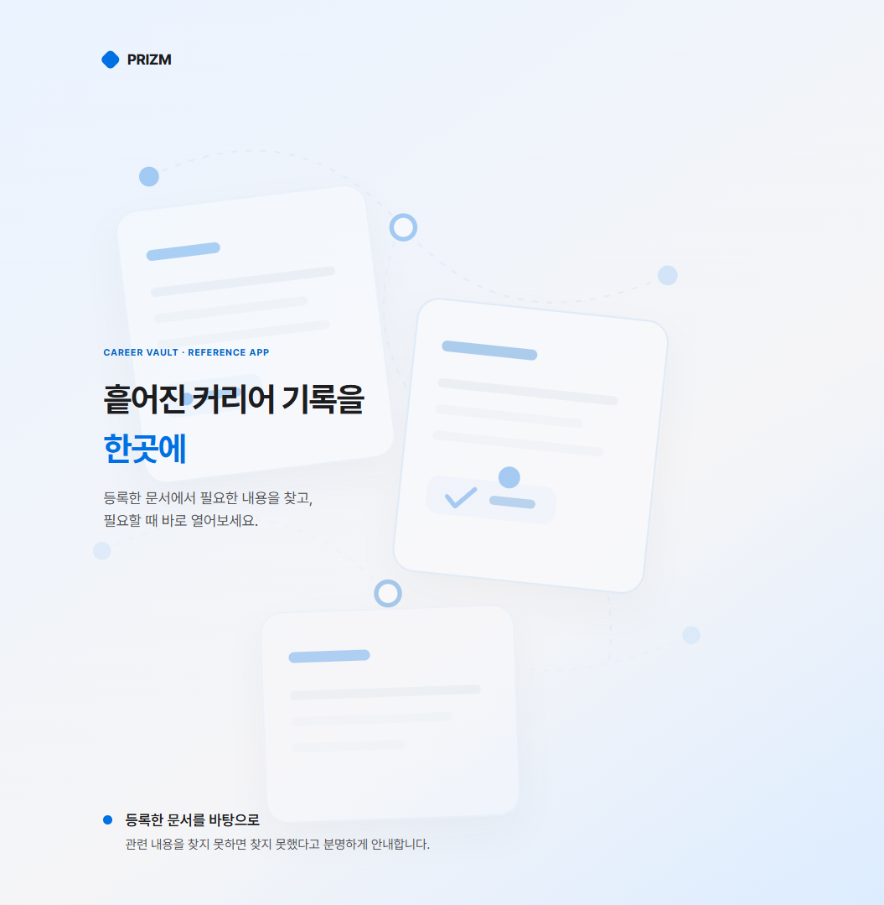
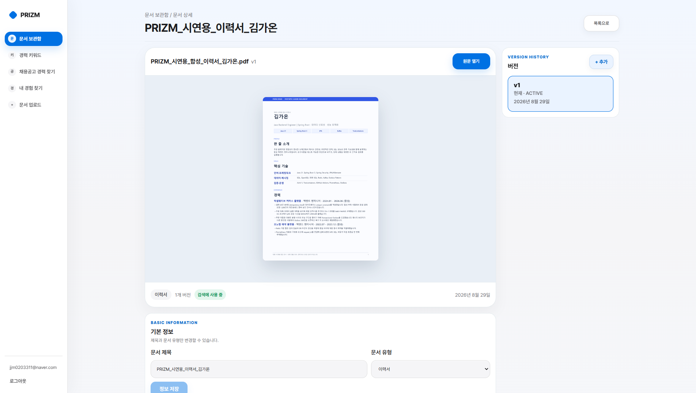
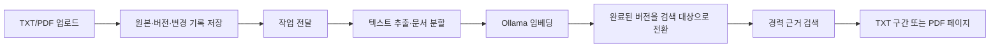

# PRIZM

PRIZM은 이력서·포트폴리오 같은 커리어 문서를 업로드하면 검색할 수 있게 자동으로 정리하고, 필요한 경력 근거와 원문 위치를 찾아주는 오픈소스 도구입니다.

[빠른 시작](docs/quickstart.md) · [아키텍처](docs/architecture.md) · [문서 안내](docs/README.md) · [기여 안내](CONTRIBUTING.md)

## PRIZM이 필요한 이유

경력 기록은 이력서, 경력기술서, 포트폴리오처럼 여러 문서에 흩어져 있고 같은 문서도 버전별로 쌓입니다. 필요한 내용을 찾더라도 어느 문서의 어느 위치에서 나온 정보인지 다시 확인하기 어렵습니다. PRIZM은 원본과 문서 버전을 보존하면서 내용을 검색할 수 있게 정리하고, 관련 원문을 TXT 구간이나 PDF 페이지와 함께 보여 줍니다. 검색 결과는 등록한 문서의 원문에서만 찾으며, 문서에 없는 경력이나 성과를 만들지 않습니다. 관련 근거를 찾지 못하면 결과 없음으로 표시합니다.

현재 저장소에는 Spring Boot backend와 React frontend로 실행하는 self-hosted
**PRIZM 웹 애플리케이션**이 들어 있습니다.

## 제품 화면

PRIZM에 로그인하면 등록한 커리어 문서를 바탕으로 필요한 내용을 찾고, 관련 원문을 다시 열어볼 수 있습니다.

[](docs/assets/screenshots/prizm-welcome.png)

문서 상세 화면에서는 업로드한 PDF를 미리 보고, 보존된 버전과 현재 검색에 사용하는 `ACTIVE` 버전을 함께 확인할 수 있습니다. 아래 화면의 이름과 문서는 기능 설명을 위한 시연용 데이터입니다.

[](docs/assets/screenshots/prizm-document-detail-demo.png)

## 주요 기능

- **TXT/PDF 문서 보관함** — UTF-8 TXT와 텍스트가 포함된 PDF를 업로드하고 원본을 확인합니다.
- **문서 버전 보존** — 기존 문서를 덮어쓰지 않고 새 버전으로 남깁니다.
- **자동 문서 처리** — 변경 기록(ChangeLog), 작업 전달기(Dispatcher), 백그라운드 처리기(Worker)를 거쳐 텍스트를 추출하고 Ollama `bge-m3`로 임베딩합니다.
- **처리가 끝난 버전만 검색** — 새 버전 처리가 실패하면 이전 `ACTIVE` 버전을 계속 사용합니다.
- **관련 원문 검색 및 위치 찾기** — 관련 원문을 최대 5개까지 찾아 TXT 구간이나 PDF 페이지와 함께 보여 줍니다.
- **문서 태그** — 사용자가 만든 태그를 문서에 연결하고 태그 이름으로 관련 근거를 검색합니다.
- **채용공고 항목별 근거 검색** — 채용공고에서 필요한 항목을 골라 내 문서의 관련 근거를 확인합니다.
- **읽기 전용 MCP 연동** — 기존 검색을 `search_career_evidence` 도구로 호출합니다.
- **사용자별 데이터 분리** — 문서, 버전, 처리 작업과 검색 결과를 로그인한 사용자별로 분리합니다.

## 동작 방식



새 버전은 처리가 끝난 뒤에만 `ACTIVE`, 즉 현재 검색에 사용하는 버전이 됩니다. 검색과 MCP는 로그인한 사용자에게 속한 `ACTIVE` 버전만 조회합니다.

## 아키텍처

PRIZM은 하나의 Spring Boot 애플리케이션에서 인증, 문서·버전 관리, 자동 문서 처리, 검색과 MCP를 제공하며 React 웹 화면이 이를 사용합니다. 원본 파일은 로컬 저장소에, 메타데이터와 벡터는 PostgreSQL·pgvector에 저장합니다. 구성 요소의 역할, 상태 변화와 실패 복구 방식은 [아키텍처 문서](docs/architecture.md)에서 확인할 수 있습니다.

## 기술 스택

| 영역 | 기술 |
|---|---|
| Backend | Java 17, Spring Boot 4.1, Spring Security, Spring Data JPA, Flyway |
| Frontend | React 19, TypeScript 6, Vite 8 |
| Database | PostgreSQL 16, pgvector |
| Embedding | Ollama, `bge-m3`(1024차원) |
| Infrastructure | Docker Compose, 별도로 검증한 OpenSQL 단일 서버 경로 |

## 빠른 시작

Windows PowerShell 기준으로 Git, Docker Desktop·Compose와 호스트에서 실행 중인 Ollama가 필요합니다. 먼저 저장소를 받고 로컬 설정 파일을 준비합니다.

```powershell
git clone https://github.com/jaemin-devlog/PRIZM.git
Set-Location PRIZM
if (Test-Path -LiteralPath .env) { throw '.env already exists' }
Copy-Item .env.example .env
```

`.env`의 JWT와 DB 비밀값을 바꾼 뒤 Ollama 모델과 PRIZM을 실행합니다. 이 값들은
서버와 DB가 사용하는 비밀값이며, 브라우저에서 가입할 이메일·비밀번호가 아닙니다.

```powershell
ollama pull bge-m3
docker compose --env-file .env config --quiet
docker compose --env-file .env up -d --build
```

`http://localhost:5173`에서 계정을 만든 뒤 로그인합니다. TXT/PDF 업로드, 검색, MCP 연결과 새 설치 환경 검증은 [로컬 빠른 시작](docs/quickstart.md)을 따릅니다.

> 기본 Compose는 개발용이며 포트를 `127.0.0.1`에만 엽니다. 공개 서비스에 그대로 배포하는 구성이 아닙니다.

## 경력 근거 검색

PRIZM은 사용자의 현재 문서에서 질문과 관련된 원문을 찾고, 문서·버전과 TXT 구간 또는 PDF 페이지를 함께 보여 줍니다.

다음 항목은 판정하지 않습니다.

- 경력 내용의 진위
- 특정 경험의 보유 여부
- 채용 요구사항 충족 여부
- 직무 적합도나 합격 가능성

검색의 현재 동작과 알려진 한계는 [현재 구현 현황](docs/project-status.md)과 [PRZ-016 검색 문서 안내](specs/PRZ-016-search-performance-v2/README.md)를 확인하세요.

## 채용공고 항목별 근거 검색

채용공고를 붙여넣고 필요한 항목을 고르면 등록한 문서에서 관련 원문을 찾습니다. 항목별 결과에서 PDF 페이지나 TXT 문서 상세로 이동할 수 있습니다. 공고를 저장하거나 요구사항 충족 여부를 판정하지는 않습니다.

## MCP 연동

- Endpoint: `POST /mcp`
- Tool: `search_career_evidence`
- Input: `{"query":"..."}`
- Authentication: 활성 `ROLE_USER`의 `Authorization: Bearer <USER_JWT>`

MCP는 별도 검색 정책을 두지 않고 기존 경력 근거 검색을 읽기 전용으로 사용합니다. 연결 예시는 [MCP로 경력 근거 검색하기](docs/quickstart.md#mcp로-경력-근거-검색하기)를 확인하세요.

## OpenSQL 검증

로컬 빠른 시작은 PostgreSQL·pgvector를 사용합니다. 별도 OpenSQL 검증은 단일 서버
direct 연결과 OpenProxy single-Primary 경로에서 수행했습니다. OpenSQL 자산은 저장소에
포함하지 않으며, 정확한 환경·연결 경로와 결과는
[OpenSQL 검증 기록](docs/opensql-gate.md)에서 확인할 수 있습니다.

## 문서 안내

| 문서 | 설명 |
|---|---|
| [빠른 시작](docs/quickstart.md) | 처음 설치하고 핵심 흐름을 실행하는 절차 |
| [아키텍처](docs/architecture.md) | 구성 요소, 데이터 흐름, 상태 변화와 복구 방식 |
| [현재 구현 현황](docs/project-status.md) | 구현된 기능, 검증 범위와 알려진 한계 |
| [OpenSQL 검증 기록](docs/opensql-gate.md) | PostgreSQL 결과와 구분한 OpenSQL 검증 범위 |
| [MCP 연동 안내](docs/quickstart.md#mcp로-경력-근거-검색하기) | 표준 MCP client 연결 예시 |
| [전체 문서 안내](docs/README.md) | 독자별 문서 탐색 경로 |
| [기능별 검증 기록](specs/README.md) | 기능별 Spec과 상세 검증 기록 안내 |
| [기여 안내](CONTRIBUTING.md) | 이슈, 변경, 검증과 PR 기준 |
| [보안 정책](SECURITY.md) | 보안 문제 신고 방법과 지원 범위 |

## 오픈소스 기여

버그 제보와 문서 개선을 환영합니다. 작업을 시작하기 전에 [기여 안내](CONTRIBUTING.md)에서 현재 범위와 검증 기준을 확인해 주세요. 참여할 때는 [행동 강령](CODE_OF_CONDUCT.md)을 따라 주세요.

## 라이선스

PRIZM은 [Apache License 2.0](LICENSE)으로 배포합니다. 재배포 경계와 고지는 [NOTICE](NOTICE), 구성 요소와 모델 정보는 [SBOM 안내](sbom/README.md)를 확인하세요.
