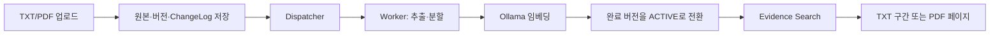

# PRIZM

문서를 업로드하면 자동으로 색인하고, 사용자의 `ACTIVE` 문서에서 관련 경력 근거와 원문 위치를 찾아주는 오픈소스 Career Evidence 플랫폼입니다.

[빠른 시작](docs/quickstart.md) · [아키텍처](docs/architecture.md) · [문서 안내](docs/README.md) · [기여 안내](CONTRIBUTING.md)

## Why PRIZM

경력 기록은 이력서, 경력기술서, 포트폴리오처럼 여러 문서에 흩어져 있고 같은 문서도 버전별로 쌓입니다. 필요한 내용을 찾더라도 어느 문서의 어느 위치에서 나온 정보인지 다시 확인하기 어렵습니다. PRIZM은 원본과 버전을 보존한 채 문서를 자동으로 색인하고, 관련 원문을 TXT 구간이나 PDF 페이지와 함께 보여 줍니다. 검색 결과는 등록 문서의 원문에서 구성하며, 문서 밖의 경력이나 성과를 생성하지 않습니다. 검색에서 관련 근거를 찾지 못하면 결과 없음으로 표시합니다.

현재 저장소는 Spring Boot 애플리케이션과 React로 만든 **Career Vault Reference App**입니다. 장기 방향인 독립 Career Intelligence Engine, CareerFact, 포트폴리오 생성은 아직 구현되지 않았습니다.

## Key Features

- **TXT/PDF Career Vault** — UTF-8 TXT와 텍스트가 포함된 PDF를 업로드하고 원본을 확인합니다.
- **Immutable versions** — 문서를 덮어쓰지 않고 새 버전으로 보존합니다.
- **Automatic ingestion** — ChangeLog, Dispatcher, Worker를 거쳐 텍스트를 추출하고 Ollama `bge-m3`로 임베딩합니다.
- **ACTIVE version safety** — 처리가 끝난 버전만 검색 대상으로 전환하며, 실패하면 이전 `ACTIVE` 버전을 유지합니다.
- **Evidence Retrieval** — 관련 원문과 TXT 구간 또는 PDF 페이지를 최대 5개까지 찾습니다.
- **Document Tags** — 사용자가 만든 태그를 문서에 연결하고 태그 이름을 검색 질의로 사용합니다.
- **Job Posting Evidence** — 채용공고 항목을 선택해 내 문서의 관련 근거를 항목별로 확인합니다.
- **Read-only MCP** — 기존 검색을 `search_career_evidence` 도구로 호출합니다.
- **Owner isolation** — 문서, 버전, 처리 작업과 검색 결과를 사용자별로 분리합니다.

## How It Works



새 버전은 처리에 성공한 뒤 원자적으로 `ACTIVE`가 됩니다. 검색과 MCP는 현재 사용자에게 속한 `ACTIVE` 버전만 조회합니다.

## Architecture

PRIZM은 한 Spring Boot 애플리케이션 안에서 인증, 문서·버전 관리, ChangeLog 기반 색인, 검색과 MCP를 제공하고 React Career Vault가 이를 사용합니다. 원본 파일은 로컬 스토리지에, 메타데이터와 벡터는 PostgreSQL·pgvector에 저장합니다. 구성 요소의 책임, 상태 전이와 복구 계약은 [Architecture](docs/architecture.md)에서 확인할 수 있습니다.

## Tech Stack

| 영역 | 기술 |
|---|---|
| Backend | Java 17, Spring Boot 4.1, Spring Security, Spring Data JPA, Flyway |
| Frontend | React 19, TypeScript 6, Vite 8 |
| Database | PostgreSQL 16, pgvector |
| Embedding | Ollama, `bge-m3` (1024 dimensions) |
| Infrastructure | Docker Compose; 검증된 OpenSQL 단일 서버 경로는 별도 구성 |

## Quick Start

Docker Desktop과 호스트에서 실행 중인 Ollama가 필요합니다. Node `22.17.0`, npm `10.9.2`, Java 17을 사용합니다.

```powershell
node scripts/check-clean-clone-prerequisites.mjs --db-port 15433 --backend-port 18081 --frontend-port 15174
node scripts/prepare-clean-clone-demo-env.mjs --db-port 15433 --backend-port 18081 --frontend-port 15174
node scripts/generate-clean-clone-demo-fixtures.mjs
node scripts/run-clean-clone-compose.mjs config --quiet
node scripts/run-clean-clone-compose.mjs up -d --build
```

기본 화면에서 계정을 만든 뒤 로그인합니다. 문서 업로드부터 `ACTIVE` 전환, 검색, MCP 연결과 종료까지의 절차는 [로컬 Quick Start](docs/quickstart.md)를 따릅니다.

> 기본 Compose는 개발용이며 포트를 `127.0.0.1`에만 엽니다. 공개 서비스에 그대로 배포하는 구성이 아닙니다.

## Evidence Retrieval

PRIZM Search는 **Evidence Retrieval + Localization**을 수행합니다. 사용자의 현재 문서에서 질의와 관련된 원문을 찾고 문서, 버전, TXT 구간 또는 PDF 페이지를 돌려줍니다.

다음 항목은 판정하지 않습니다.

- 경력 내용의 진위
- 특정 경험의 보유 여부
- 채용 요구사항 충족 여부
- 직무 적합도나 합격 가능성

검색의 현재 계약과 알려진 한계는 [현재 구현 현황](docs/project-status.md)과 [검색 최종 요약](specs/PRZ-016-search-performance-v2/SEARCH-FINAL-SUMMARY.md)을 확인하세요.

## Job Posting Evidence

채용공고를 붙여넣고 필요한 항목을 고르면 기존 Evidence Search로 관련 원문을 찾습니다. 항목별 결과에서 PDF 페이지나 TXT 문서 상세로 이동할 수 있습니다. 공고를 저장하거나 요구사항 충족 여부를 판정하지는 않습니다.

## MCP

- Endpoint: `POST /mcp`
- Tool: `search_career_evidence`
- Input: `{"query":"..."}`
- Authentication: 활성 `ROLE_USER`의 `Authorization: Bearer <USER_JWT>`

MCP는 별도 검색 정책을 두지 않고 기존 Career Evidence Search를 읽기 전용으로 사용합니다. 연결 예시는 [MCP Quick Start](docs/quickstart.md#mcp-career-evidence-검색)를 확인하세요.

## OpenSQL

로컬 Quick Start는 PostgreSQL·pgvector를 사용합니다. OpenSQL single-node 검증 환경에서는 Flyway를 OpenSQL에 직접 연결하고, 애플리케이션 트래픽은 OpenProxy의 단일 Primary 경로로 실행했습니다. OpenSQL 자산은 저장소에 포함하지 않으며 다중 노드 OpenHA, DB 장애 전환과 OpenProxy 이중화는 제품 범위가 아닙니다. 상세 근거는 [OpenSQL 기술 Gate](docs/opensql-gate.md)에서 확인할 수 있습니다.

## Documentation

| 문서 | 설명 |
|---|---|
| [Quick Start](docs/quickstart.md) | 처음 설치하고 핵심 흐름을 실행하는 절차 |
| [Architecture](docs/architecture.md) | 구성 요소, 데이터 흐름, 상태 전이와 복구 계약 |
| [Current Status](docs/project-status.md) | 구현된 기능, 검증 경계와 알려진 한계 |
| [OpenSQL Gate](docs/opensql-gate.md) | PostgreSQL 결과와 구분한 OpenSQL 검증 범위 |
| [MCP Guide](docs/quickstart.md#mcp-career-evidence-검색) | 표준 MCP client 연결 예시 |
| [Documentation Index](docs/README.md) | 독자별 문서 탐색 경로 |
| [Spec Registry](specs/README.md) | 기능별 Spec과 상세 Evidence 색인 |
| [Contributing](CONTRIBUTING.md) | 이슈, 변경, 검증과 PR 기준 |
| [Security](SECURITY.md) | 보안 문제 신고 방법과 지원 범위 |

## Open Source / Contributing

버그 제보와 문서 개선을 환영합니다. 작업을 시작하기 전에 [Contributing Guide](CONTRIBUTING.md)에서 현재 범위와 검증 기준을 확인해 주세요. 행동 기준은 [Code of Conduct](CODE_OF_CONDUCT.md)를 따릅니다.

## License

PRIZM은 [Apache License 2.0](LICENSE)으로 배포합니다. 재배포 경계와 고지는 [NOTICE](NOTICE), 구성 요소와 모델 정보는 [SBOM 안내](sbom/README.md)를 확인하세요.
