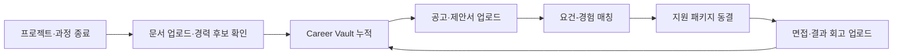
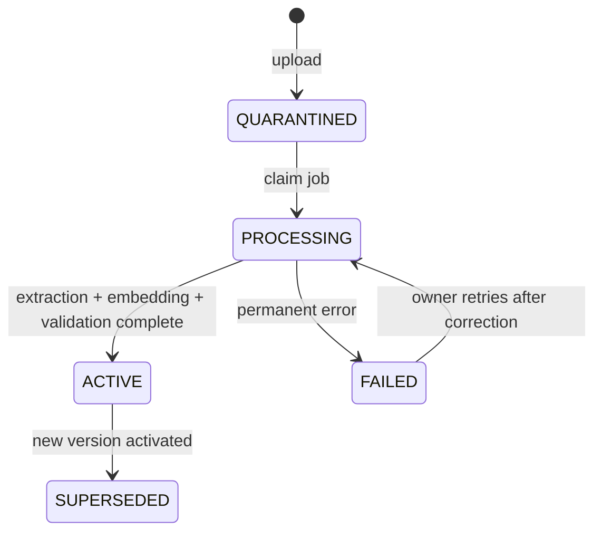
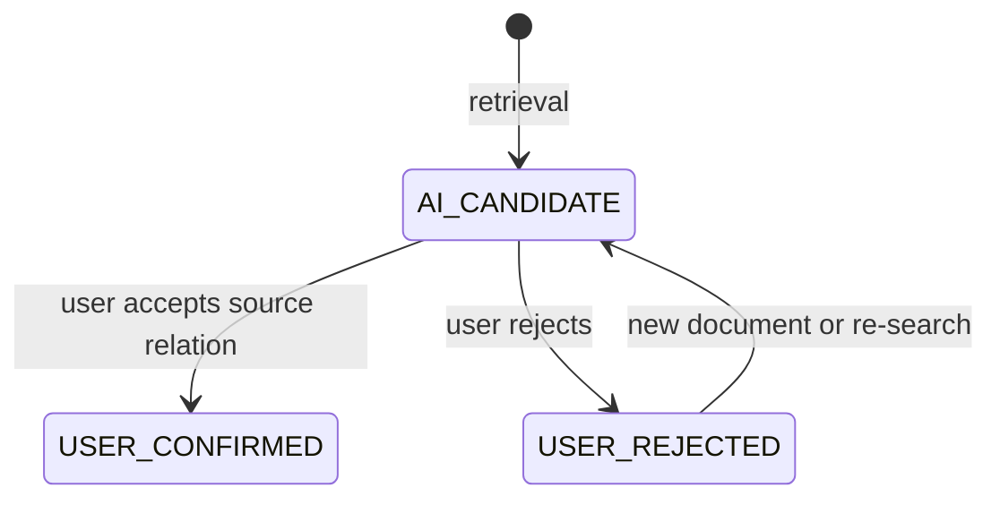
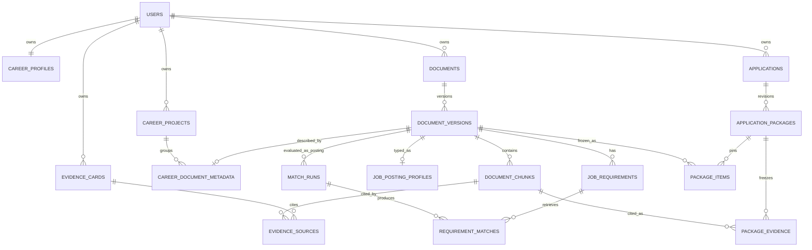
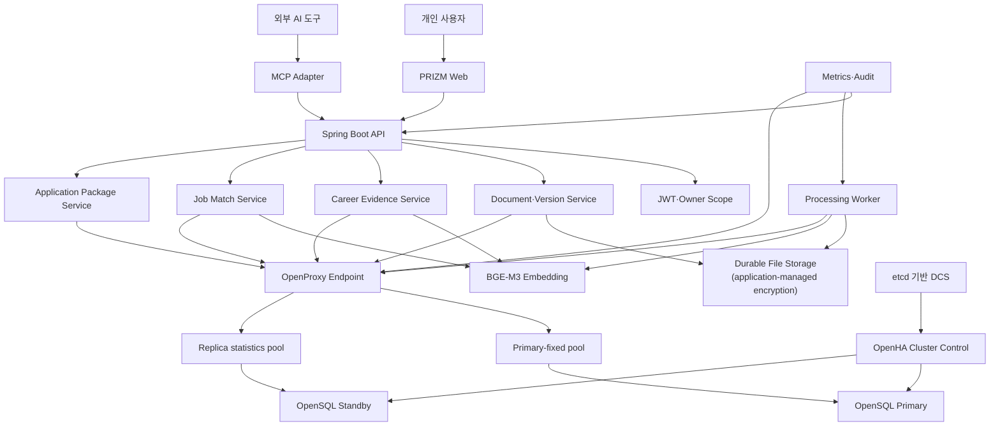

# PRIZM 최종 기획안

**부제:** 커리어 문서의 근거를 구조화하는 오픈소스 Career Intelligence Engine
**문서 버전:** 1.1
**작성 기준일:** 2026-07-13
**방향 현행화:** 2026-07-15
**개발 목표일:** 2026-08-27
**대상 과제:** 2026 공개SW 개발자대회 티맥스티베로 지정과제 — OpenSQL 기반 AI 검색 및 벡터 데이터 플랫폼 개발

> **문서 성격:** 이 문서는 장기 제품 목표와 설계 가설, 그리고 이전 B2C 검토의 역사적 결정을 함께 보존합니다. outbox, generation, MCP, CareerFact, portfolio, OpenSQL HA 등은 구현 예정 항목을 포함합니다. 현재 실제 구현 범위는 [PRIZM 현재 구현 현황](project-status.md), 제품 책임 경계는 [오픈소스 제품 경계](architecture/oss-product-boundary.md)를 기준으로 확인합니다.

### 2026-07-15 오픈소스 엔진 방향 현행화

- 현재 최종 방향은 재사용 가능한 **PRIZM Engine**과 이를 검증하는 Reference App을 제품 경계로 두는 것입니다. `frontend/`의 **Career Vault**는 개인 활용과 통합 방식을 보여주는 첫 Reference App입니다.
- 이전 문서의 B2C 사용자·가격·전환율 검토는 당시 제품가설의 근거를 보존하기 위해 삭제하지 않습니다. 다만 현재 구현 우선순위나 확정 수익모델이 아니며, 오픈소스 엔진의 활용 사례를 검증할 때 다시 평가할 역사적 가설로 내립니다.
- 현재 코드는 아직 단일 Spring Boot project이며 독립 엔진 artifact, CareerFact, portfolio, MCP, OpenSQL HA가 구현된 상태가 아닙니다. 물리적 분리는 [오픈소스 엔진 전환 실행 계획](oss-transition-execution-plan.md)의 후속 단계입니다.

### 2026-07-16 구현 기준선 반영 요약

- 구현됨: JWT 로그인, 사용자별 문서·버전·작업·청크 격리, 12개 문서 유형과 필터, TXT·텍스트 PDF 업로드, PDF 페이지 출처, 비동기 색인과 원자적 ACTIVE 전환, 단일 검색, 최대 5개 Career Evidence 검색 API
- 안전장치: 임베딩 차원·유한값·0-norm 검증, PDF 최대 300페이지·추출 텍스트 2,000,000자 제한
- 프런트엔드: 로그인, Career Vault 목록·단일 유형 필터, TXT·PDF 업로드, 최대 5개 Career Evidence 결과 표시
- 추가 기반: 전체 처리 구간 lease heartbeat, rollback 보상 삭제 실패용 V12 cleanup job 등록과 V13 Cleanup Worker
- Cleanup Worker: `PENDING/PROCESSING/RETRY_WAIT/COMPLETED/FAILED`, PostgreSQL `FOR UPDATE SKIP LOCKED`, lease·claim-version fencing, 1분·5분·15분 retry/backoff·recovery, descriptor-relative `SecureDirectoryStream` 삭제와 부모 symlink·TOCTOU 방어. 삭제 성공 뒤 DB 완료 갱신 실패도 recovery가 멱등 수렴시킨다. `86387e7c227ede3be96c538aafc48b0205bc5e18`가 main에 병합되었고 최종 감사에 CRITICAL/HIGH/MEDIUM finding은 없었다.
- 미구현: 새 문서 version 업로드 API, CareerFact, portfolio, 공고 분석·매칭, MCP, `/api/v1`, OpenSQL·OpenProxy·OpenHA 실환경 검증

OpenSQL profile과 조건부 integration test는 있으나 PostgreSQL 성공은 OpenSQL 성공이 아니다. OpenSQL·OpenProxy·OpenHA는 실제 환경 미검증이며, 다음 기술 우선순위는 OpenSQL 단일 환경 migration·vector 검색, OpenProxy runtime 연결, OpenHA 장애전환·검색 복구 검증 순서다. V13의 `claim_version >= 0` CHECK, populated V12 row V13 backfill 전용 회귀 테스트, `SecureDirectoryStream` 미지원 filesystem의 fail-closed Quickstart·운영 제약 표기는 LOW backlog로 남는다.

---

## 0. 최종 의사결정

PRIZM의 최종 주제는 **PRIZM**으로 확정한다.

PRIZM은 **커리어 문서의 분석, 정보 구조화, 근거 검색 및 포트폴리오 생성을 위한 오픈소스 Career Intelligence Engine과 이를 검증하는 Reference App**이다. 개인뿐 아니라 대학, 취업 지원기관, 기업 및 개발자가 각자의 환경에 맞는 커리어 관리 서비스를 구축할 수 있도록 재사용 가능한 모듈과 확장 지점을 제공하는 것을 목표로 한다. Career Vault는 엔진의 개인용 활용과 통합 방식을 보여주는 첫 Reference App이다.

현재 구현은 이 목표의 기반인 문서 등록·version·원본 보존, 추출·청킹·embedding, owner-scoped 검색과 Worker 복구까지다. CareerFact, portfolio, outbox, MCP, 독립 engine module과 OpenSQL HA는 계획이며 구현된 것처럼 표현하지 않는다.

제품의 핵심은 이력서를 대신 써주는 생성형 AI가 아니다. AI는 사용자의 전체 커리어 문서에서 관련 근거 **후보**를 검색하고, 사용자가 확인한 연결만 경력 근거로 확정한다. 자료에서 확인되지 않은 경험이나 숫자는 만들지 않고 “현재 Vault에서 근거를 찾지 못함”으로 표시한다.

### 30초 피치

> PRIZM은 커리어 문서의 version과 원본을 보존하고, 비동기 추출·embedding과 owner-scoped 검색으로 실제 경험의 원문 근거를 찾는 오픈소스 엔진을 지향합니다. 현재 Career Vault Reference App은 개인용 업로드와 최대 5개 근거 검색을 보여줍니다. CareerFact와 portfolio, MCP, OpenSQL HA는 다음 단계에서 증명할 계획입니다.

### 핵심 결정 7개

1. **본체는 오픈소스 엔진이다.** Career Vault는 개인용 Reference App이며 B2C 가격은 역사적 검증 가설로 보존한다.
2. **문서 업로드가 출발점이다.** 공공데이터 수집이 아니라 사용자가 자신의 문서를 올려 즉시 검색가치를 얻는다.
3. **자소서 생성기가 아니다.** 검색·출처·버전·제출 스냅샷을 핵심으로 삼는다.
4. **AI가 사실을 인증하지 않는다.** 검색된 근거는 후보이며 사용자가 확인한 연결만 확정한다.
5. **현재본과 제출본을 분리한다.** Vault 검색은 최신 ACTIVE 버전을, 지원 패키지는 당시 고정된 버전을 사용한다.
6. **개인정보 격리를 제품의 최우선 불변식으로 둔다.** 다른 사용자의 문서는 검색 후보에도 들어가지 않는다.
7. **현재 수직 슬라이스는 텍스트 PDF·TXT와 개인 Career Vault에 집중한다.** 기관 scope와 완성형 career product를 한 번에 구현하지 않는다.

---

## 1. 공식 지정과제 해석과 적합성

### 1.1 공식 개발 미션

[티맥스티베로 공식 지정과제](https://www.kossa.kr/materials/2026/ossp/tasks-tmax.html)는 기업 환경에 맞춘 OpenSQL을 기반으로, 사용자가 문서를 업로드하면 AI가 내용을 이해하고 맞춤형 검색을 제공하는 **자동화된 AI 문서 관리 플랫폼**을 요구한다.

공식 페이지가 제시한 예시는 다음과 같다.

- 문서 업로드
- 자동 임베딩
- 메타데이터·버전 관리
- 변경 로그 기반 동기화
- MCP 기반 검색 API
- OpenSQL의 고가용성·보안·관리 기능

PRIZM은 이 흐름을 재사용 가능한 Engine으로 구현하고, Career Vault Reference App에서 개인 커리어 문서라는 첫 사용 장면을 검증한다.

| 지정과제 요소 | PRIZM 적용 | 시연 증거 |
|---|---|---|
| 문서 업로드 | 이력서·프로젝트 근거(포트폴리오 포함)·채용공고 PDF/TXT | 사용자가 직접 파일 업로드 |
| 자동 임베딩 | 페이지·문단·경력 근거 단위 BGE-M3 임베딩 | 처리상태와 chunk 수 표시 |
| 메타데이터 | 문서유형, 프로젝트, 기술, 기간, 회사, 지원직무 | 필터 검색과 근거 카드 |
| 버전 관리 | 이력서·포트폴리오·공고의 논리문서별 버전 | v1 검색 유지→완성된 v2 자동 전환 |
| 변경 동기화 | outbox 변경로그와 generation 검증 뒤 ACTIVE pointer 원자 전환 | 처리 중·오래된 Worker의 v2 노출 0 |
| MCP 검색 | 외부 AI 도구가 개인 Vault의 근거를 검색 | 인증된 `search_career_evidence` 호출 |
| 고가용성 | Worker 재처리, stale 완료 차단, DB failover | Worker 30회 시험보고서+Primary 종료 영상 |
| 보안성 | owner 범위 강제, 관리자 기본 열람 금지, 감사 | 교차 사용자 검색 0 테스트 |

### 1.2 티맥스티베로가 보고 싶은 기술적 장면

PRIZM에서 OpenSQL은 단순 저장소가 아니다.

- 관계형 사용자·문서·버전·지원 패키지와 1024차원 벡터를 같은 데이터 경계에서 관리한다.
- 별도 Vector DB 이중쓰기 없이 `active_version_id`와 검색 가능한 chunk를 일치시킨다.
- OpenHA 장애전환과 OpenProxy 연결경로를 실제로 사용하고 복구시간을 측정한다.
- 처리 중 Worker가 죽어도 lease로 재할당하고 `claim_version` fencing으로 오래된 완료를 거부한다.
- 지원 패키지는 미래의 문서 변경과 무관하게 당시 version ID를 가리키며, 사용자가 원문을 삭제하면 내용을 파기하고 `CONTENT_DELETED`로 표시한다.

### 1.3 명시적 사실과 제품 가설

**확인된 사실**

- 공식 과제는 자동화된 문서 업로드·임베딩·버전·동기화·MCP·고가용성을 제시한다.
- 현재 코드에는 TXT·텍스트 PDF 업로드, PDF 페이지 출처, 12개 문서 유형, 사용자별 소유권, pgvector 단일·다중 검색, document version·상태모델, active-only 검색, lease·fencing Worker, JWT, Career Vault 기본 UI와 자동 테스트가 있다.
- 사람인과 원티드는 공고 맞춤 이력서 분석·코칭을 제공하고, Teal은 이력서 작성·지원 추적·공고 맞춤 기능을 제공한다.

**검증이 필요한 가설**

아래 지불의사·가격 가설은 2026-07-13 B2C 검토의 역사적 항목입니다. 현재 오픈소스 엔진 roadmap의 Go/No-Go 기준으로 사용하지 않습니다.

- 사용자는 현재 이력서 한 장보다 과거 자료 전체에서 경험을 찾는 데 가치를 느낀다.
- 출처·페이지·버전이 보이는 결과가 일반 AI 생성보다 신뢰와 지불의사를 높인다.
- 구직기간 외에도 연간 Career Vault를 유지할 충분한 반복가치가 있다.
- 연 49,000원·90일 24,900원의 가치구성과 가격이 각각 수용 가능한지 검증해야 한다.

가설을 사실처럼 발표하지 않는다. MVP 기간에는 인터뷰·사용성 시험, 실제 청구가 없음을 명시한 가격 CTA와 베타 대기등록으로 관심을 측정한다. 실제 지불의사는 이후 조건을 공개한 유료 베타에서 별도로 검증한다.

---

## 2. 해결하려는 문제

### 2.1 사용자의 실제 문제

사용자의 경력정보는 한 문서에 있지 않다.

- 학교 과제와 졸업작품
- 프로젝트 결과보고서와 발표자료
- 과거 이력서·자기소개서·포트폴리오
- 자격증·수료증·교육이수 자료
- 개인이 작성한 업무 성과기록과 회고
- 회사별 채용공고와 실제 제출본
- 면접 질문과 피드백

새 공고가 나올 때마다 사용자는 과거 자료를 다시 뒤지고, 기억에 의존해 성과를 복원하며, 회사마다 수정한 이력서 중 무엇을 제출했는지 잃어버린다. 기존 생성형 AI에 현재 이력서만 넣으면 그 문서에 빠진 과거 경험은 찾을 수 없고, 출처 없는 수치나 표현이 섞일 위험이 있다.

### 2.2 2026년 채용환경과 시의성

한국은행은 최근 신입보다 경력직을 선호하고 정기공채보다 수시채용을 활용하는 흐름이 확대됐다고 분석했다. 해당 분석에서 기업이 채용 시 직무 관련 업무경험을 가장 중요하게 본 비중은 2023년 58.4%에서 2024년 74.6%로 높아졌고, 비경력자의 상용직 취업확률은 경력자의 절반 수준으로 추정됐다. [한국은행 「경력직 채용 증가와 청년 고용」](https://www.bok.or.kr/portal/bbs/P0002353/view.do?depth=200433&menuNo=200433&nttId=10089620&oldMenuNo=201150&programType=newsData&relate=Y)

이는 PRIZM이 취업을 보장한다는 뜻이 아니다. 다만 학업·인턴·개인 프로젝트처럼 흩어진 경험을 직무요건과 연결해 설명할 필요가 커졌다는 문제근거다.

### 2.3 기존 방식의 한계

| 기존 방식 | 장점 | 남는 공백 |
|---|---|---|
| 폴더·Drive | 원본 파일 보관 | 문서 안의 경험과 공고 요건을 의미 기반으로 연결하지 못함 |
| 범용 생성형 AI | 빠른 문장 생성 | 전체 경력문서의 버전·출처·제출이력 관리가 약함 |
| NotebookLM·PDF AI | 여러 출처 기반 질의와 인용 | 커리어 증거상태·공고 매칭·지원 패키지라는 업무모델이 없음 |
| 채용포털·커리어 도구 | 공고 맞춤 코칭, 이력서 관리, 지원 추적 | 공개된 핵심 흐름은 작성·매칭·지원관리에 집중하며, 주장마다 원문·페이지·버전과 동결 제출본을 잇는 provenance 원장은 별도 검증이 필요한 차별점 |
| 스프레드시트 지원관리 | 회사·전형·일정 추적 | 당시 제출한 문서 버전과 주장 근거를 함께 동결하지 못함 |

NotebookLM은 PDF·웹·오디오 등 다양한 출처 업로드와 출처 기반 질의를 제공하고, Acrobat AI도 여러 PDF에 질문하고 인용 위치로 이동할 수 있다. 사람인·원티드·Teal·Huntr 같은 서비스도 이미 공고 맞춤 코칭, 이력서 관리, 지원 추적의 일부를 제공한다. 따라서 PRIZM은 “이 기능을 아무도 하지 않는다”거나 단순 “내 문서와 채팅”이라고 차별화하지 않는다. 검증할 차별점은 **공고 요구사항→경력 주장→원문·페이지·버전→실제 제출본**을 하나의 근거 원장으로 연결하는 전체 흐름이다. [NotebookLM 공식 기능](https://support.google.com/notebooklm/answer/16164461), [Acrobat AI 공식 기능](https://helpx.adobe.com/acrobat/using/get-ai-generated-answers.html)

### 2.4 해결하지 않는 문제

- 합격 가능성을 예측하지 않는다.
- 기업을 대신해 지원자를 평가·순위화하지 않는다.
- 경력의 진위를 외부기관처럼 인증하지 않는다.
- 자동으로 지원서를 제출하지 않는다.
- 회사 기밀문서나 고객 개인정보 업로드를 허용하지 않는다.
- 사용자의 경험보다 좋은 문장을 만들기 위해 사실을 보충하지 않는다.

---

## 3. 제품 정의와 브랜드

### 3.1 한 문장 정의

**PRIZM은 커리어 문서의 분석, 정보 구조화, 근거 검색 및 포트폴리오 생성을 위한 오픈소스 Career Intelligence Engine과 이를 검증하는 Reference App이다. 개인뿐 아니라 대학, 취업 지원기관, 기업 및 개발자가 각자의 환경에 맞는 커리어 관리 서비스를 구축할 수 있도록 재사용 가능한 모듈과 확장 지점을 제공한다.**

### 3.2 브랜드 의미

실제 프리즘이 하나의 빛 속에 숨어 있는 여러 색을 드러내듯, PRIZM은 흩어진 문서 안에 숨어 있는 사용자의 경험을 드러낸다.

| 문자 | 의미 | 제품 구현 |
|---|---|---|
| **P — Provenance** | 모든 경력 주장은 출처를 가진다. | 문서·버전·페이지·원문 인용 |
| **R — Retrieval** | 전체 커리어 문서에서 필요한 경험을 찾는다. | 의미검색+메타데이터 필터 |
| **I — Integrity** | 확인되지 않은 내용을 사실처럼 만들지 않는다. | 후보·사용자확인·근거없음 구분 |
| **Z — Zero-stale by design** | 미완성·비활성 버전을 기본 검색에서 제외한다. | active pointer, lease, fencing |
| **M — Memory** | 학업부터 이직까지 커리어 기억을 누적한다. | 장기 Vault와 지원 패키지 스냅샷 |

`Zero-stale`은 모든 장애에서 절대 무중단을 보장한다는 뜻이 아니다. 미완성본과 오래된 처리결과가 정상 검색경로에 섞이지 않도록 설계하고 실제 복구시간을 측정한다는 목표다.

### 3.3 Career Vault Reference App 핵심 가치제안

#### 대학생·신입 구직자

- 학교 과제·프로젝트·수료증을 직무경험으로 재발견한다.
- 공고요건마다 관련 자료가 있는지 확인한다.
- 없는 경력을 꾸미지 않고 보완해야 할 증거를 구분한다.

#### 직장인·이직자

- 오래된 프로젝트와 성과기록을 다시 찾는다.
- 여러 이력서·포트폴리오 버전을 정리한다.
- 어떤 회사에 무엇을 제출했는지 당시 공고와 함께 복원한다.

#### 프리랜서·프로젝트 근로자

- 프로젝트별 역할·산출물·성과를 장기 축적한다.
- 새 제안이나 지원에 맞는 유사 경험을 빠르게 찾는다.

### 3.4 제품 원칙

1. **Source first:** 모든 결과는 원문 위치로 돌아갈 수 있어야 한다.
2. **Candidate, not verdict:** AI 검색결과는 후보이며 사용자 확인 전 확정 근거가 아니다.
3. **No unsupported invention:** Vault에 없는 수치·역할·성과를 생성하지 않는다.
4. **Owner isolation:** 소유자 범위는 검색 후처리가 아니라 DB 질의 전 단계에서 강제한다.
5. **Current and snapshot coexist:** 최신본 검색과 과거 제출본 재현을 동시에 보장한다.
6. **Recoverable ingestion:** 업로드·임베딩 장애를 정상 운영사건으로 설계한다.
7. **Right to delete wins:** 사용자가 삭제하면 스냅샷 재현성보다 실제 콘텐츠 파기를 우선한다.
8. **Measure before claim:** 취업률·합격률 향상을 주장하지 않고 검색·시간·정합성을 측정한다.

---

## 4. Career Vault Reference App 사용자와 활용 생애주기

### 4.1 핵심 사용자

| 사용자 | 업로드하는 자료 | 핵심 질문 | 반복사용 계기 |
|---|---|---|---|
| 대학생 | 과제, 졸업작품, 수료증, 첫 이력서 | “이 공고에 쓸 프로젝트가 있나?” | 학기·프로젝트·인턴 종료 |
| 취업준비생 | 공고, 이력서, 포트폴리오, 면접기록 | “요건별로 어떤 경험을 써야 하나?” | 지원할 때마다 |
| 직장인 | 개인 성과기록, 공개 가능한 산출물, 평가자료 | “올해 쌓인 경력 근거는 무엇인가?” | 분기회고·평가·이직 탐색 |
| 이직자 | 여러 회사 제출본과 과거 경력자료 | “당시 무엇을 제출했나?” | 공고 탐색·면접 준비 |
| 프리랜서 | 프로젝트 제안·결과·포트폴리오 | “유사 수행경험을 찾아줘.” | 신규 제안·계약 종료 |

### 4.2 지속사용 루프



지속사용은 매일 접속을 강요해서 만들지 않는다. 사용자가 이미 문서를 만드는 사건—학기 종료, 프로젝트 종료, 평가, 지원, 면접—에 업로드를 연결한다. Drive·Notion·GitHub 자동수집은 후속기능이며 MVP는 직접 업로드로 검증한다.

### 4.3 금지 문서

업로드 화면과 이용정책에서 다음 자료를 금지한다.

- 회사의 영업비밀·비공개 전략·고객자료
- 고객·동료의 개인정보가 포함된 원본
- 소스코드 원본과 접근키·비밀번호
- 비공개 계약서·사내 접근제한 문서
- 이용자가 저장·처리할 권한이 없는 저작물

자동으로 모든 기밀을 탐지할 수 있다고 주장하지 않는다. 파일명·정규식 기반 경고와 사용자 확인을 제공하고, 저장 전 금지정책을 명확히 고지한다.

---

## 5. 핵심 사용자 시나리오

### 시나리오 A. 커리어 문서를 처음 구축한다

1. 사용자가 과거 이력서, AirConnect 결과보고서, 포트폴리오 PDF를 업로드한다.
2. 파일은 `QUARANTINED` 상태에서 형식·용량·소유자를 확인한다.
3. Worker가 페이지 텍스트를 추출하고 청크·임베딩을 생성한다.
4. chunk 수·해시·generation 검증이 끝나면 새 버전이 자동으로 `ACTIVE`가 된다.
5. 사용자는 추출 미리보기를 확인하고, 문서유형·프로젝트·기간을 고치면 기존 값을 덮지 않는 metadata-only 새 version을 만든다. 잘못된 업로드는 삭제할 수 있다.
6. 완성된 ACTIVE 버전만 기본 Career Vault 검색에 포함된다.

### 시나리오 B. 새 채용공고와 경험을 연결한다

1. 사용자가 백엔드 개발자 공고 PDF를 업로드한다.
2. 시스템은 `주요업무`, `자격요건`, `우대사항` 구역에서 요구사항 후보를 추출한다.
3. 사용자가 5~10개 요구사항을 확인·수정한다.
4. 각 요구사항마다 본인 ACTIVE 문서에서 관련 chunk와 경력카드 후보를 검색한다.
5. 화면은 `후보 있음`, `부분 근거 후보`, `찾지 못함`을 구분하고 원문을 표시한다.
6. 사용자가 실제 관련성을 확인한 연결만 `USER_CONFIRMED`로 저장한다.

### 시나리오 C. 근거 없는 숫자를 확인한다

1. 사용자가 이력서의 “1,000명이 이용한 서비스를 운영했다”는 문장을 검사한다.
2. 시스템은 문장과 관련된 프로젝트 문서를 검색한다.
3. 기능 구현 근거는 찾았지만 `1,000`이라는 동일 수치나 측정근거를 찾지 못한다.
4. 결과를 “거짓”이 아니라 **“업로드된 자료에서 해당 수치 근거를 찾지 못함”**으로 표시한다.
5. 사용자는 근거 문서를 추가하거나 문장을 수정할 수 있다.

### 시나리오 D. 지원 패키지를 동결한다

1. 사용자가 A회사 지원에 사용할 공고 v1, 이력서 v3, 포트폴리오 v2를 선택한다.
2. PRIZM은 version ID와 사용자확인 근거 연결을 스냅샷으로 저장한다.
3. 이후 이력서 v4가 ACTIVE가 돼도 A회사 패키지는 v3을 유지한다.
4. 면접 준비 화면은 실제 제출한 v3과 당시 공고 v1만 기준으로 사용한다.

### 시나리오 E. 처리·DB 장애가 발생한다

1. 이력서 v4를 임베딩하던 Worker A가 중단된다.
2. lease 만료 뒤 Worker B가 새 `claim_version`으로 작업을 회수한다.
3. 늦게 돌아온 A의 완료 커밋은 fencing으로 거절된다.
4. v4의 추출·임베딩·무결성 검사가 모두 끝나 원자적으로 활성화되기 전까지 기본 검색은 v3만 사용한다.
5. DB Primary 장애 시 OpenHA가 전환하고 애플리케이션이 재연결한다.
6. 복구 뒤에도 기본 active version과 A회사 스냅샷의 고정 version이 각각 동일해야 한다.

---

## 6. 기능 요구사항과 범위

이 절은 장기 목표 요구사항입니다. 표의 `Must`는 현재 구현 완료 표시가 아니며, 구현 여부는 [현재 구현 현황](project-status.md)의 matrix를 따릅니다.

### 6.1 MVP 필수기능 — Must

| ID | 기능 | 인수 기준 |
|---|---|---|
| AUTH-01 | 이메일 기반 회원가입·로그인과 JWT | 다른 사용자 토큰·리소스 접근 거부 |
| DOC-01 | TXT·텍스트 PDF 업로드 | MIME·확장자·magic byte·크기 검증 |
| DOC-02 | `RESUME/PROJECT_REPORT/JOB_POSTING`과 프로젝트·기간 메타데이터 | 소유자 범위 내 수정·조회 가능 |
| VER-01 | 동일 논리문서의 새 버전 업로드 | version number 단조 증가, 중복 active 금지 |
| IDX-01 | 비동기 텍스트 추출·청크·임베딩 | 처리 실패가 기존 ACTIVE 검색에 영향 없음 |
| IDX-02 | lease·retry·claim fencing | stale Worker 완료 성공 0건 |
| ACT-01 | 기술검증 완료 후 ACTIVE 자동 전환 | 미완성·다른 generation 검색 노출 0건 |
| SRCH-01 | Career Vault 의미검색 | 문서·버전·페이지·원문·점수 반환 |
| JD-01 | 채용공고 업로드와 요구사항 후보 추출 | 사용자가 후보를 추가·수정·삭제 가능 |
| MATCH-01 | 요구사항별 경력 근거 후보 검색 | 확인 전 `AI_CANDIDATE`, 확인 후 `USER_CONFIRMED` |
| CLAIM-01 | 이력서 문장 근거 점검 | 수치 근거 미발견을 거짓으로 단정하지 않음 |
| PKG-01 | 지원 패키지 스냅샷 | 이후 active 변경에도 pinned version 불변 |
| MCP-01 | 인증된 `search_career_evidence` tool | REST와 동일 owner·상태·generation 필터 적용 |
| DEL-01 | 문서·계정 삭제 | 원문·quote·chunk·vector 잔존 0; 허용된 비식별 상태표시만 분리 검증 |
| OPS-01 | 처리상태·장애·감사 운영화면 | 관리자는 내용 없이 상태·식별자 중심 조회 |
| HA-01 | OpenSQL/OpenProxy/OpenHA 장애 시연 | 관측 RTO·오류횟수·복구 후 불변식 공개 |

### 6.2 후속기능 — Should

- DOCX·PPTX·Markdown 지원
- Google Drive·Notion·GitHub README 가져오기
- 이력서 문장 단위 claim 일괄 분석
- 사용자확인 경력카드의 프로젝트 타임라인
- 실제 제출한 문서를 기준으로 한 면접 질문 후보
- 자격증·포트폴리오 업데이트 알림
- 브라우저 확장프로그램을 통한 공고 저장
- 개인정보 가림과 기밀 가능성 경고 고도화
- 한국어·영어 교차검색

### 6.3 장기기능 — Could

- 개인 로컬 임베딩·암호화 Vault
- 전문가 검토·모의면접 마켓
- 개인이 승인한 PRIZM 공유 링크
- 대학·부트캠프가 이용권만 제공하는 B2B2C 배포
- 프리랜서 제안서·프로젝트 레퍼런스 패키지
- 사용자 동의 기반의 익명 검색품질 개선

### 6.4 MVP에서 하지 않는 것 — Won't

- OCR이 필요한 스캔 PDF와 이미지
- 자동 지원·메일 발송·채용사이트 로그인
- 합격확률·연봉·인성·적성 예측
- 기업용 지원자 평가·랭킹
- 완전 자동 자소서·이력서 생성
- 회사 내부문서 수집과 협업용 DMS
- 모바일 네이티브 앱
- 범용 에이전트가 문서를 수정·삭제하는 기능
- 전문가 마켓 결제·정산
- ANN/HNSW 검색 최적화

---

## 7. 상태모델과 핵심 불변식

이 절에는 목표 상태모델이 포함됩니다. 현재 version은 `QUARANTINED/PROCESSING/ACTIVE/FAILED`, processing job은 `PENDING/RETRY_WAIT/PROCESSING/COMPLETED/FAILED`만 구현하며 `SUPERSEDED`, `generation`, application snapshot은 아직 없습니다.

### 7.1 문서 버전 상태



문서는 파일검사·추출·임베딩·chunk 수와 해시 검증을 통과하면 자동으로 `ACTIVE`가 된다. 새 버전의 활성화와 기존 버전의 `SUPERSEDED` 전환은 한 트랜잭션이다. 사용자는 추출 미리보기를 확인하고 잘못된 문서를 삭제·재업로드할 수 있지만, 매번 승인 버튼을 눌러야 검색되는 흐름은 만들지 않는다. 사용자 확인이 필요한 대상은 문서 자체가 아니라 AI가 제안한 **근거 연결**이다.

lease 재시도는 문서 상태가 아니라 처리 job 상태로 관리한다. job은 `READY→LEASED→SUCCEEDED`로 진행하고, 일시 실패나 lease 만료 시 `LEASED→RETRY_WAIT→READY`, 재시도 한도 초과 시 `DEAD`가 된다. retry 가능한 동안 문서 version은 `PROCESSING`을 유지한다.

### 7.2 경력 근거 연결 상태



근거 연결의 생애주기와 요구사항 충족판정을 섞지 않는다.

- `AI_CANDIDATE`: 의미적으로 관련 가능성이 있는 검색결과
- `USER_CONFIRMED`: 사용자가 해당 경험과 원문의 관련성을 확인
- `USER_REJECTED`: 사용자가 무관하다고 판단

별도의 coverage 결과는 다음과 같다.

| 결과 | 판정규칙 |
|---|---|
| `SUPPORTED` | 사용자확인 근거가 있고, claim의 필수 숫자·단위·기간·제품명이 원문과 일치 |
| `PARTIAL` | 관련 경험은 있으나 역할·규모·성과·수치 등 필수요소 일부가 없음 |
| `NOT_FOUND` | 현재 검색 컨텍스트에서 기준 이상 후보를 찾지 못함 |

`USER_CONFIRMED`나 `SUPPORTED`도 제3자가 경력의 진위를 인증했다는 뜻이 아니다. **사용자 본인의 업로드 자료에서 주장과 원문을 연결했고 필요한 표현요소를 찾았다는 뜻**이다.

### 7.3 검색 컨텍스트 두 종류

| 컨텍스트 | 사용하는 버전 | 목적 |
|---|---|---|
| Current Vault | 논리문서별 현재 `active_version_id` | 최신 커리어 검색과 새 지원 준비 |
| Application Snapshot | 패키지에 고정한 `document_version_id` | 과거 제출내용·면접근거 재현 |

새 버전 활성화는 Current Vault만 바꾼다. 이미 생성된 Application Snapshot은 자동 업데이트하지 않는다.

### 7.4 데이터 불변식

1. 한 사용자·한 논리문서에 ACTIVE pointer는 최대 하나다.
2. `PROCESSING`·`FAILED`·`SUPERSEDED` 버전은 Current Vault 검색에 포함되지 않는다.
3. 모든 검색 query는 `owner_user_id`를 먼저 제한한다.
4. vector·chunk·version·document의 owner가 서로 달라질 수 없다.
5. 지원 패키지 항목은 논리문서가 아니라 구체적인 version ID를 가리킨다.
6. frozen package의 version ID는 수정하지 않고 새 package revision을 만든다.
7. 오래된 `claim_version`을 가진 Worker는 완료를 커밋할 수 없다.
8. 같은 업로드 idempotency key는 하나의 version만 만든다.
9. 사용자가 원문을 삭제하면 관련 chunk·embedding·evidence link도 삭제한다.
10. 삭제된 콘텐츠 때문에 재현할 수 없는 스냅샷은 `CONTENT_DELETED`로 표시한다.
11. 검색 가능한 chunk의 `generation`은 version의 `ready_generation`과 반드시 같다.
12. Job posting도 별도 우회 테이블이 아니라 `documents.type=JOB_POSTING`으로 같은 업로드·버전·삭제 파이프라인을 사용한다.
13. query와 chunk의 embedding model·차원이 같아야 한다. MVP는 하나의 고정 embedding epoch를 사용하고 모델 교체는 전체 재색인·회귀시험 뒤에만 허용한다.
14. `FROZEN` package의 version·근거 참조는 자동 변경되지 않지만, 사용자의 삭제권이 우선한다. 삭제된 원문·quote·vector는 파기하고 package에는 `CONTENT_DELETED` 가용성만 남긴다.
15. Current Vault에서 evidence source가 현재 active version·`ready_generation`과 다르면 `STALE_SOURCE`로 표시하고 확정 근거로 재사용하지 않는다. 과거 Application Snapshot에서는 당시 source로만 재현한다.
16. `(document_id, version_number)`는 unique이며 새 version number 배정과 active 전환 때 document row를 잠가 동시 업로드의 순서를 보장한다.

---

## 8. 검색·AI·근거판정 설계

### 8.1 AI의 역할

AI가 하는 일:

- 서로 다른 표현의 직무요건과 경험문장을 의미 기반으로 연결
- 긴 문서에서 관련 페이지·문단 후보를 순위화
- 문서유형과 프로젝트·기술 메타데이터 후보 제안
- 사용자확인 결과를 이용해 같은 사용자 안에서 재검색 품질 개선

AI가 하지 않는 일:

- 경력의 사실 여부 인증
- 합격 가능성 판정
- 근거 없는 성과·수치 생성
- 기업의 지원자 평가
- 사용자의 승인 없이 경력카드 확정

### 8.2 MVP 검색 파이프라인

```text
사용자 질문 또는 공고 요구사항
→ JWT 사용자 확인
→ owner_user_id + ACTIVE 또는 snapshot version filter
→ Vault에 고정된 BGE-M3 model version의 1024차원 query embedding
→ pgvector exact cosine top-k
→ 문서유형·프로젝트·기간 metadata 재정렬
→ 중복 chunk 축약
→ 문서명·버전·페이지·원문과 함께 후보 반환
→ 사용자 확인·기각 기록
```

개인 Vault는 사용자별 문서량이 작으므로 MVP는 exact cosine을 유지한다. ANN은 데이터가 커져 p95 목표를 넘은 뒤 exact 결과 대비 recall 회귀시험을 통과할 때만 도입한다.

### 8.3 공고 요구사항 추출

현재 구현에는 생성형 모델이 없다. 일정 안에서 안정적으로 완성하기 위해 MVP는 다음 순서를 사용한다.

1. PDF에서 `주요업무`, `자격요건`, `우대사항` 제목과 목록을 규칙으로 탐지한다.
2. 문장 단위 후보를 생성한다.
3. 사용자가 실제 매칭할 5~10개 요구사항을 확인·수정한다.
4. 확인된 요구사항만 Career Vault 검색에 사용한다.

외부 LLM 기반 구조화 추출은 선택 adapter로만 두고 핵심 데모·테스트는 규칙+사용자확인 경로로 통과시킨다.

### 8.4 경력 근거 카드

경력카드는 AI가 작성한 새로운 경력문장이 아니라 사용자가 선택한 원문을 구조화한 인덱스다.

```json
{
  "title": "중복 매칭 방지 구현",
  "project": "AirConnect",
  "skills": ["Spring Boot", "Redis", "PostgreSQL"],
  "role": "백엔드 개발",
  "evidenceState": "USER_CONFIRMED",
  "source": {
    "documentId": "doc_airconnect",
    "version": 2,
    "page": 12,
    "chunkId": "chunk_1203",
    "quote": "Redis 큐와 DB 재검증을 통해 중복 매칭을 방지하였다."
  }
}
```

MVP에서 사용자는 검색결과의 원문을 선택해 카드를 저장한다. 자동 카드 생성은 후보만 제안하고 사용자 확인 전에는 검색의 확정 근거로 사용하지 않는다.

### 8.5 수치·성과 claim 검사

수치가 포함된 주장은 의미 유사도만으로 `SUPPORTED` 처리하지 않는다.

- 주장과 근거에 동일 수치·단위가 있는지 확인한다.
- 수치가 다르면 관련 경험 후보와 수치 불일치를 함께 보여준다.
- 수치가 없으면 `PARTIAL` 또는 `NOT_FOUND`다.
- “거짓”, “허위경력” 같은 법적·도덕적 표현을 사용하지 않는다.

### 8.6 검색 결과 계약

모든 결과는 다음 필드를 반환한다.

```json
{
  "matchState": "AI_CANDIDATE",
  "score": 0.81,
  "documentId": "doc_airconnect",
  "documentTitle": "AirConnect 결과보고서",
  "documentVersionId": "ver_2",
  "versionNumber": 2,
  "page": 12,
  "chunkId": "chunk_1203",
  "quote": "Redis 큐와 DB 재검증을 통해 중복 매칭을 방지하였다.",
  "current": true,
  "userConfirmed": false
}
```

점수만 제공하지 않고 source locator와 상태를 강제한다. 화면은 유사도 점수를 “사실 확률”로 표현하지 않는다.

---

## 9. 평가 설계

### 9.1 평가 데이터셋

실사용자 개인정보를 공개 저장소에 넣지 않는다. 다음 합성·자기소유 데이터로 평가한다.

- 합성 사용자 4명, ACTIVE version 32개
- 그중 4개 논리문서에 연결된 SUPERSEDED·PROCESSING version 8개
- 공개 가능한 합성 프로젝트 보고서·이력서·포트폴리오·채용공고
- 요구사항 query 60개: 관련 원문 존재 30개, 일부 필수요소만 존재 15개, 관련 원문 없음 15개
- 수치가 일치·불일치·부재한 claim 10개
- 교차 사용자 공격 query 최소 1,000개

60개 중 20개는 개발용, 40개는 최종시험용으로 고정한다. retrieval gold label인 `관련/부분 관련/무관`과, 사용자확인 뒤 계산하는 coverage `SUPPORTED/PARTIAL/NOT_FOUND`를 분리한다. 수치근거 있음/없음 기준과 예시를 저장소에 공개하고 키워드 기준선과 BGE-M3 exact cosine을 같은 test set에서 비교한다.

### 9.2 핵심 지표와 목표

| 층위 | 지표 | MVP 목표·측정법 |
|---|---|---|
| 검색 | Evidence Recall@5 | 정답쌍에서 ≥0.85 목표; 표본·오답 공개 |
| 검색 | MRR·nDCG@5 | nDCG@5≥0.75 목표; 키워드 기준선과 exact cosine 비교 |
| 출처 | source locator 정확도 | 문서·버전·페이지·quote 일치 100% |
| 수치 | unsupported-number false support | 합성 수치셋에서 0건 |
| 버전 | 비활성·미완성·generation 불일치 노출 | 검색 500회에서 0건 |
| 격리 | 다른 사용자 문서 노출 | 공격 query 1,000회에서 0건 |
| 스냅샷 | frozen package 자동변경 | 버전전환 시험에서 0건 |
| Worker | stale completion 성공 | 장애주입 30회에서 0건 |
| 성능 | 검색 p95 | 목표 <2초; 하드웨어·코퍼스 크기 명시 |
| HA | DB 장애 RTO·오류횟수 | 실측값 공개, 목표 RTO ≤60초 |

목표를 달성하지 못해도 수치를 숨기지 않는다. 검색 품질이 키워드 기준선을 이기지 못하면 벡터의 비중을 낮추고 메타데이터 검색을 중심으로 축소한다.

### 9.3 사용자 가치 지표

- 한 공고에 쓸 근거를 찾는 데 걸린 시간
- 과거 문서에서 새로 발견한 유효 경험 수
- AI 후보 중 사용자가 확인한 비율과 기각률
- 지원 패키지 생성 완료율
- 첫 업로드 후 7일·30일 내 두 번째 문서 업로드율
- 무료→Job Sprint·Annual 전환율

합격률은 MVP 성과지표로 사용하지 않는다. 표본편향과 외부요인이 너무 크기 때문이다.

---

## 10. 데이터 모델

### 10.1 기존 자산 재사용

| 기존 자산 | PRIZM에서의 역할 |
|---|---|
| `documents` | 사용자 소유 논리문서와 active pointer |
| `document_versions` | 원본·추출상태·버전·해시 |
| chunk·embedding | BGE-M3 1024차원 검색 단위와 TXT/PDF 출처 |
| `processing_jobs` | 추출·임베딩 비동기 작업 |
| lease·`claim_version` | Worker 복구와 stale 완료 차단 |
| JWT·SYSTEM_ADMIN/USER | 인증기반과 초기 역할 |
| ACTIVE-only 검색 | Current Vault 검색의 출발점 |

### 10.2 신규 핵심 엔터티

| 엔터티 | 주요 필드 | 역할 |
|---|---|---|
| `career_profiles` | `user_id`, target_roles, settings | 개인 검색·표시 설정 |
| `career_projects` | `id`, `owner_user_id`, title, period | 여러 문서를 프로젝트로 묶음 |
| `career_document_metadata` | `document_version_id`, type, project_id, occurred_at | 검색에 쓰이는 version 귀속 메타데이터; 공고는 `type=JOB_POSTING` |
| `evidence_cards` | owner, title, skills, state, confirmed_at | 사용자확인 경력 근거 |
| `evidence_sources` | card_id, version_id, chunk_id, quote, current_status | 카드와 원문 연결; active 교체 시 `STALE_SOURCE` |
| `job_posting_profiles` | `document_version_id`, company, role | JOB_POSTING version에 붙는 도메인 메타데이터 |
| `job_requirements` | posting_version_id, category, text, confirmed | 사용자확인 공고 요건 |
| `requirement_matches` | match_run_id, requirement_id, source_version_id, source_chunk_id, state, score, rank | 특정 실행의 요건-경험 후보와 확인결과 |
| `match_runs` | owner, posting_version_id, active_set_hash, model_version | 어떤 문서집합·모델로 매칭했는지 재현 |
| `applications` | owner, company, role, status | 개인 지원 단위 |
| `application_packages` | application_id, revision, frozen_at, frozen_structure_hash | version·근거가 자동 변경되지 않는 제출 스냅샷 |
| `package_items` | package_id, document_version_id, item_role, display_metadata | 제출한 구체 버전과 당시 표시 메타데이터 |
| `package_evidence` | package_id, requirement_text_at_freeze, evidence_card_id, source_version_id, source_chunk_id, quote_hash, coverage_at_freeze | 동결 당시 요건문구·확인 근거·coverage |
| `audit_events` | actor, action, object, before/after, time | 상태·권한·삭제 감사 |
| `consent_events` | owner, policy_version, granted/revoked | 약관·선택동의 이력 |
| `outbox_events` | aggregate, event_type, payload, idempotency_key, processed_at | 상태변경과 단일 소비자의 멱등 변경로그 |

추가로 `document_versions.ready_generation`과 `document_chunks.generation`을 두고, generation마다 `parser_version`, `chunking_version`, `embedding_model`, `embedding_dim`을 기록한다. Worker는 자신이 획득한 `claim_version`을 generation으로 사용해 chunk를 쓰고, 최종 검증을 통과한 승자만 `ready_generation`과 ACTIVE pointer를 갱신한다. 검색은 generation과 model version이 같은 chunk만 허용하므로 lease가 끝난 오래된 Worker가 뒤늦게 쓴 벡터나 다른 모델의 벡터가 노출되지 않는다.

검색·표시·매칭에 영향을 주는 type, project, occurred_at, company, role은 version에 귀속한다. 수정하려면 새 version을 만들고, `FROZEN` package에는 당시 표시 메타데이터를 함께 복사한다.

`FROZEN` package는 version뿐 아니라 사용자가 확인한 evidence 연결도 `package_evidence`에 고정한다. `frozen_structure_hash`는 content나 quote hash가 아니라 item role·version ID·coverage 구조로 계산한다. 개별 문서 삭제 시 원본 key·추출텍스트·quote·quote hash·chunk·embedding과 source FK를 파기하고 package item에는 `CONTENT_DELETED`와 삭제시각만 남긴다. 원래 구조 hash와 현재 `content_availability`는 별도 필드다. 계정 삭제 시 package·tombstone까지 삭제하며, 운영 감사에는 사용자를 재식별할 수 없는 최소 사건만 보존정책에 따라 남긴다.

### 10.3 관계도



### 10.4 소유권 무결성

- 모든 사용자 데이터 테이블에 `owner_user_id` 또는 소유자까지 이어지는 강제 FK 경로를 둔다.
- 서비스 메서드는 사용자 ID를 인자로 받지 않고 인증 principal에서만 가져온다.
- document·version·chunk·card·package를 연결할 때 owner 일치를 검증한다.
- 가능하면 `(id, owner_user_id)` 복합 unique/FK로 교차 소유자 참조를 DB에서도 차단한다.
- `(document_id, version_number)`와 `(match_run_id, requirement_id, source_chunk_id)`에 unique 제약을 둔다.
- OpenSQL 호환성을 확인한 뒤 PostgreSQL RLS를 방어층으로 추가하되, 지원 여부를 검증하지 않고 전제하지 않는다.
- `generation != ready_generation`인 stage chunk는 검색에서 즉시 제외하고 보존기간 뒤 정리 job으로 파기한다.

---

## 11. 목표 시스템 아키텍처

아래 그림은 전환이 끝난 뒤의 목표입니다. 현재는 단일 Spring Boot 서버, host Ollama, local file storage, PostgreSQL 16+pgvector와 별도 React Reference App이며 MCP, Career/Job/Package service, OpenProxy/OpenHA topology는 구현되지 않았습니다.



### 11.1 컴포넌트 책임

| 컴포넌트 | 책임 |
|---|---|
| Web | 업로드, 검토, 검색, 공고 매칭, 패키지·삭제 UI |
| Spring Boot API | 인증, owner 격리, 상태전이, 멱등성, 감사 |
| Worker | 파일추출, 청크, 임베딩, lease·retry·fencing |
| BGE-M3 | 문서·질의 1024차원 임베딩 |
| File Storage | 원본 파일 암호화 저장; DB에는 식별자·해시·상태 |
| OpenSQL | 관계형 상태·벡터·메타데이터·감사의 단일 일관성 경계 |
| OpenProxy/OpenHA | 연결경로 단일화와 장애전환 |
| MCP Adapter | 외부 도구용 읽기 중심 tool schema |
| Observability | job·version·failover·격리·오류 지표 |

최신 ACTIVE pointer와 vector 검색, 모든 쓰기는 Primary 고정 pool을 사용한다. Replica pool은 복제지연을 허용할 수 있는 비식별 운영통계에만 사용한다. 원본 파일 암호화는 애플리케이션·파일스토리지 계층의 별도 통제이며 OpenSQL 암호화 기능과 동일하게 표현하지 않는다. MVP 파일저장소는 durable volume과 백업·복원시험을 갖추지만 다중노드 무중단 저장소까지 보장하지 않는다.

### 11.2 트랜잭션 경계

- 새 버전 생성과 processing job 등록은 한 트랜잭션에서 수행한다.
- 외부 임베딩 호출은 DB 트랜잭션 안에 넣지 않는다. Worker는 claim generation으로 결과를 멱등 저장한다.
- Worker 최종화는 `lease_owner`·`claim_version`이 일치하고 예상 chunk 수·해시가 맞을 때만 `ready_generation`, 새 version `ACTIVE`, 이전 version `SUPERSEDED`, document의 active pointer, job `SUCCEEDED`, outbox event를 **하나의 트랜잭션**으로 커밋한다.
- package 초안은 Web client에서만 편집한다. `POST /api/applications/{id}/packages`는 pinned version, 사용자확인 `package_evidence`, 당시 표시 메타데이터와 구조 hash를 한 트랜잭션으로 저장해 즉시 `FROZEN` revision을 만든다. 저장 뒤 수정은 금지하고 새 revision만 만든다.
- 사용자확인 match는 requirement·source·상태의 owner 일치를 검증한 뒤 저장한다.
- 삭제는 신규 검색 차단→원본·파생데이터 삭제→비식별 tombstone 감사 순으로 처리한다.

### 11.3 배포 프로필

| 프로필 | 목적 | 구성 |
|---|---|---|
| `local-pg` | 빠른 로컬 개발·CI | PostgreSQL 16+pgvector, 단일 앱 |
| `opensql-single` | OpenSQL 호환성 시험 | OpenSQL 단일 DB, 앱·Worker |
| `opensql-ha` | 최종 시연·장애평가 | OpenProxy, OpenHA가 관리하는 Primary/Standby, 앱·Worker |

같은 migration과 domain test를 세 프로필에서 실행한다. OpenSQL 전용 기능에 기대는 코드는 adapter 또는 profile로 격리한다.

---

## 12. REST API와 MCP 설계

### 12.1 권장 REST API

아래 목록은 현재 API와 향후 목표 API를 함께 나타냅니다. 현재 제공되는 endpoint와 계약은 [현재 구현 현황](project-status.md)의 API 표를 기준으로 합니다.

```text
POST   /api/auth/signup
POST   /api/auth/login

POST   /api/documents
POST   /api/documents/{documentId}/versions
GET    /api/documents
GET    /api/documents/{documentId}/versions/{versionId}
GET    /api/document-versions/{versionId}/extracted-preview
POST   /api/document-versions/{versionId}/retry
DELETE /api/documents/{documentId}

POST   /api/search                         # 현재 단일 결과 검색
POST   /api/career-evidence/search         # 현재 최대 5개 근거 검색
POST   /api/evidence-cards
PATCH  /api/evidence-cards/{cardId}
DELETE /api/evidence-cards/{cardId}

POST   /api/job-postings
GET    /api/job-postings/{id}/requirements
PATCH  /api/job-requirements/{id}
POST   /api/job-requirements/{id}/matches
POST   /api/claims/check

POST   /api/applications
POST   /api/applications/{id}/packages
GET    /api/application-packages/{id}

GET    /api/me/export
DELETE /api/me
GET    /api/operations/jobs              # SYSTEM_ADMIN, content-minimized
```

`POST /api/job-postings`는 별도 저장경로가 아니라 `documents`의 `JOB_POSTING` 업로드·버전 파이프라인을 호출하는 convenience facade다. `POST /api/applications/{id}/packages`는 선택한 문서 version과 사용자확인 근거를 받아 즉시 `FROZEN` revision을 생성한다.

### 12.2 MCP MVP tool

| Tool | 목적 | 쓰기 여부 |
|---|---|---|
| `search_career_evidence` | 질문·기술·프로젝트와 관련된 개인 근거 후보 검색 | 읽기 |

MVP는 `search_career_evidence` 하나를 완성한다. `match_job_requirements`, `check_claim_support`, `get_application_package`는 REST 화면으로 제공하고 MCP 후속범위로 남긴다. 검색·매칭 확정·패키지 변경을 MCP에서 수행하지 않는다.

MCP를 구현하는 단계에서는 당시 최신 공식 규격의 Streamable HTTP와 JSON-RPC를 검토하고 `/mcp` 단일 endpoint를 목표로 한다. 현재 MCP endpoint는 없다. 제출 직전 규격을 다시 확인하고, 실제 검증한 호환 client 이름·version과 호출 로그가 있을 때만 지원을 주장한다. [MCP 공식 전송 규격](https://modelcontextprotocol.io/specification/2025-11-25/basic/transports)

### 12.3 MCP 보안규칙

- MVP는 기존 JWT 체계에서 발급한 짧은 수명의 Bearer access token을 사용한다. 이를 완전한 OAuth 2.1 구현이라고 표현하지 않는다.
- Streamable HTTP의 `Origin`을 allowlist로 검증하고 로컬 profile은 loopback에만 bind한다.
- `MCP-Protocol-Version`과 session ID를 검증하고 token·session을 로그에서 마스킹한다.
- tool schema에 `owner_user_id`를 입력받지 않는다. 서버가 principal에서 결정한다.
- 외부 도구는 원본 전체가 아니라 최소한의 검색결과와 짧은 quote만 받는다.
- 문서 업로드·삭제·재처리·패키지 수정은 MVP MCP에서 제외한다.
- 사용자별·client별 rate limit과 감사 이벤트를 남긴다.
- 검색결과가 0건이면 다른 사용자의 범위를 넓히지 않는다.

### 12.4 MCP가 억지가 아닌 이유

사용자는 PRIZM 전용 채팅창만 쓰는 것이 아니라 이미 사용하는 ChatGPT·Codex·IDE·개인 AI 비서에서 “내 Redis 경험 근거를 찾아줘”라고 질문할 수 있다. MCP는 Career Vault를 재구축하지 않고 승인된 개인 검색도구로 연결하는 표준 경로다. 단, MCP 자체가 사업가치는 아니며 동일 domain service의 별도 adapter로만 구현한다.

---

## 13. 개인정보·보안·책임 경계

### 13.1 보호대상

이력서·포트폴리오·평가자료·면접기록과 그 임베딩은 모두 민감한 개인 커리어 정보다. 2026년 7월 시행된 개인정보 안전성 확보조치 기준은 접근기록과 분실·도난·유출·위변조 방지를 위한 기술적·관리적 조치를 요구한다. [국가법령정보센터 「개인정보의 안전성 확보조치 기준」](https://www.law.go.kr/LSW/admRulInfoP.do?admRulSeq=2100000281400&chrClsCd=010201)

개인정보보호위원회도 생성형 AI 서비스 이용자가 개인정보 처리구조와 옵트아웃 등 통제권을 이해할 수 있어야 한다고 안내한다. [개인정보위 생성형 AI 이용자 가이드 발표](https://www.pipc.go.kr/np/cop/bbs/selectBoardArticle.do?bbsId=BS074&mCode=C020010000&nttId=12084)

### 13.2 MVP 필수 보안통제

- 모든 사용자 리소스의 서버측 owner scope 강제
- IDOR·교차사용자 검색에 대한 통합·property 기반 테스트
- TLS 전송, 원본 파일과 백업의 저장 암호화
- password hash는 검증된 adaptive algorithm 사용
- access token 단기화, refresh rotation 또는 MVP 단순 재로그인
- 관리자 기본 문서열람 금지와 content-minimized 운영화면
- 원본·추출텍스트·embedding·query log의 보존기간 분리
- 사용자 문서를 모델 학습에 사용하지 않는 기본정책
- 계정 삭제 시 원본·파생데이터·벡터 삭제 확인
- 업로드 허용목록, 크기제한, 파일 signature 검사, path traversal 차단
- 보안이벤트·상태변경·지원접근의 감사기록

### 13.3 개인정보 최소화

- 주민등록번호·주소·전화번호는 검색에 필요하지 않으므로 업로드 전 가림을 권고한다.
- 이력서 연락처 구역은 기본 임베딩 대상에서 제외할 수 있게 한다.
- raw query를 장기 로그에 남기지 않고 운영지표는 가명 식별자로 집계한다.
- 사용자가 삭제·내보내기·동의철회를 직접 수행할 수 있게 한다.
- 지원을 위한 관리자 열람은 MVP에서 제공하지 않는다. 향후에는 명시적 동의와 시간제한 access grant가 필요하다.

### 13.4 AI 고지와 책임 경계

2026년 시행된 인공지능기본법령은 생성형 AI 서비스의 사전 고지 경로를 규정한다. PRIZM은 화면과 이용약관에 AI 검색·추출 사용 사실, 오류 가능성, 사용자확인 필요성을 표시한다. [인공지능기본법 시행령 제23조](https://www.law.go.kr/LSW/lsLinkCommonInfo.do?chrClsCd=010202&lspttninfSeq=198075)

제품 문구는 다음 경계를 유지한다.

> PRIZM은 업로드된 문서 안에서 관련 원문을 찾고 연결합니다. 결과는 경력의 객관적 진위, 기업의 평가 또는 합격 가능성을 인증하지 않습니다. 자료에서 찾지 못했다는 결과는 해당 경험이 존재하지 않는다는 뜻이 아닙니다.

### 13.5 기밀 업로드 모순에 대한 대응

PRIZM의 가장 큰 제품위험은 실제 성과근거가 회사 기밀문서에 있을 수 있다는 점이다. 해결책은 기밀 업로드를 묵인하는 것이 아니다.

- 공개 포트폴리오, 개인 회고, 수료증, 본인이 배포할 권한이 있는 자료를 우선한다.
- 사용자가 회사명·고객명·금액을 제거한 개인 성과노트를 만들 수 있게 한다.
- 업로드 전 “이 문서를 저장할 권한이 있는가?” 확인과 예시를 제공한다.
- 파일명·본문 패턴으로 `CONFIDENTIAL`, 주민번호, API key 가능성을 경고한다.
- 기밀탐지 기능은 보조수단이며 완전탐지를 보장하지 않는다고 명시한다.

---

## 14. 목표 OpenSQL·고가용성 설계

이 절은 실제 환경에서 검증해야 할 목표입니다. 현재 성공 근거는 PostgreSQL 16+pgvector 통합 테스트이며 OpenSQL, OpenProxy, OpenHA 지원을 증명하지 않습니다. 확인 절차는 [OpenSQL 기술 Gate](opensql-gate.md)에 분리합니다.

### 14.1 OpenSQL의 역할

일반 PostgreSQL과 별도 HA 도구로도 유사 기능을 구성할 수 있다. PRIZM이 OpenSQL을 사용하는 이유는 기능 독점이 아니라 다음 운영능력을 통합해 보여주기 위해서다.

- PostgreSQL 호환 관계형·벡터 저장
- 문서상태·active pointer·지원 snapshot·embedding의 단일 데이터 경계
- OpenProxy 기반 접속경로
- OpenHA와 etcd 기반 DCS의 장애 감지·리더선출·split-brain 방지
- 암호화·백업·운영·국내 기술지원 경로

공식 과제에 언급된 ARIA·SEED 등 보안기능은 제공 OpenSQL version과 설정에서 실제 사용 가능 여부를 확인하고, 적용한 알고리즘·범위·키관리 방식을 호환성 보고서에 기록한다. 이 기능과 별개로 원본 파일 저장소의 암호화와 애플리케이션 비밀관리는 독립적으로 적용한다.

[OpenSQL 공식 문서](https://docs.tibero.com/tmaxopensql)를 기준으로 실제 설치 버전에서 pgvector·migration·pool·failover 동작을 검증한다. 확인하지 않은 호환기능을 문서상 전제로 두지 않는다.

### 14.2 장애 시나리오

#### Worker 장애

1. v2 처리 중 Worker A 종료
2. lease 만료 뒤 Worker B 재할당
3. A가 늦게 완료를 시도
4. `claim_version` 불일치로 A의 커밋 거부
5. 처리 중에는 v1만 검색
6. v2 완료·검증 뒤 Current Vault만 v2로 자동 전환

#### DB Primary 장애

1. OpenSQL Primary 강제 종료
2. OpenHA가 DCS 상태를 기준으로 장애를 감지하고 새 Primary 선출
3. OpenProxy 경유 애플리케이션 재연결
4. 멱등키로 실패한 쓰기 재시도
5. Current Vault active pointer, frozen package version, job claim을 재조회
6. 장애 전후 불변식과 오류횟수·복구시간 비교

### 14.3 장애 중 동작원칙

- MVP 고가용성 검증범위는 **OpenSQL Primary 장애와 애플리케이션 재연결**이다. 단일 API·OpenProxy·파일저장소 프로세스 장애까지 포함한 전체 서비스 HA는 보장하지 않는다.
- 연결상태가 불확실하면 ACTIVE 전환·패키지 생성 쓰기는 실패로 응답하고 재시도한다.
- replica lag 가능성이 있는 경로에서 read-after-write 결과를 확정하지 않는다.
- 이전 ACTIVE 버전 조회가 안전하게 가능하면 검색을 제공하되 미완성 새 버전은 사용하지 않는다.
- 무중단을 선언하지 않고 관측된 RTO와 사용자 오류를 공개한다.
- 전체 서비스 HA로 확장하려면 OpenProxy 이중화·VIP, API 다중화, durable shared storage와 복원시험을 별도 구현해야 한다.

### 14.4 목표 SLO

| 항목 | MVP 목표 | 비고 |
|---|---:|---|
| 정상상태 검색 성공률 | 30분 scripted run ≥99% | 계획된 failover 구간은 별도 RTO로 측정 |
| DB failover RTO | ≤60초 | 실제 환경에서 측정 |
| committed RPO | 0 목표 | 동기화 설정이 뒷받침될 때만 주장 |
| stale Worker 완료 | 0건/30회 | 자동 장애주입 |
| 중복 active version | 0건 | DB 제약+동시성 테스트 |
| frozen package 변조 | 0건 | version 전환 100회 |
| cross-owner 노출 | 0건 | 실패 1건이면 출시 중단 |

---

## 15. 목표 MVP 4화면·UX 기획

현재 Reference App은 로그인, Career Vault 목록·단일 유형 필터, TXT/PDF 업로드, 최대 5개 원문 근거 검색만 제공합니다. 아래 4화면은 구현 완료 목록이 아닙니다.

### 화면 1. Career Vault·업로드

- 업로드 가능·금지 문서, 텍스트 PDF/TXT 제한, 개인정보·회사기밀 가림 안내
- 첫 가치 도달을 위한 “이력서+프로젝트자료+공고” 3개 업로드 동선
- 프로젝트·기술·문서유형 filter와 자연어 검색
- ACTIVE·처리중·실패·이전 version, page·quote, 추출 미리보기
- 검색에 영향을 주는 type·project·기간 수정은 기존 version을 덮지 않고 metadata-only 새 version 생성
- 설정 drawer에서 저장용량, MCP client, 최소 JSON 내보내기, 개별·계정 삭제, AI 고지 확인

### 화면 2. Evidence Map·Claim

| 공고 요건 | AI 후보 | 연결상태 | coverage | 원문 |
|---|---|---|---|---|
| Spring Boot 개발 | AirConnect·MoneyWay | 사용자확인 | SUPPORTED | 보고서 12p |
| Redis 활용 | AirConnect | 사용자확인 | SUPPORTED | 보고서 16p |
| 대규모 트래픽 | 구현 후보, 처리량 없음 | 사용자확인 | PARTIAL | 성능기록 4p |
| Kubernetes | 후보 없음 | — | NOT_FOUND | — |

- 공고 요구사항 수정, 후보 확인·기각, 정확한 원문 page 이동을 한 화면에서 수행한다.
- 이력서 claim을 선택하면 관련 source와 숫자·단위 일치 여부를 오른쪽 panel에 표시한다.
- source version이 SUPERSEDED되면 `STALE_SOURCE` 배지를 표시하고 현재 근거로 쓰려면 새 ACTIVE version에서 다시 확인한다.
- 유사도 퍼센트를 합격가능성처럼 보이지 않고, `AI_CANDIDATE`와 사용자확인·coverage를 분리한다.

### 화면 3. Application Package

- 회사·직무·지원단계와 당시 공고·이력서·포트폴리오 version
- 사용자확인 근거와 coverage, 당시 표시 메타데이터
- frozen 시각·structure hash·revision과 이후 current version 차이 배지
- 새 revision 생성, 원문 삭제 시 `CONTENT_DELETED` 표시

### 화면 4. Operations·Demo

- version·job ID·claim generation·outbox·RTO와 오류수
- `stale 0/30`, `cross-owner 0/1,000`, source·package 검증 결과
- SYSTEM_ADMIN에게 원문을 숨기고 상태·식별자·측정치만 표시
- 일반 사용자 메뉴에는 노출하지 않고 대회 시연·운영진단에만 사용

### UX 원칙

- 첫 유효 근거를 5분 안에 보여준다.
- 사용자가 문서 전체를 다시 읽지 않도록 정확한 페이지로 이동한다.
- AI 후보와 사용자확인 상태를 색상·문구로 구분한다.
- 점수보다 출처와 부족한 요소를 먼저 보여준다.
- 오류·장애·처리중 상태를 숨기지 않는다.

---

## 16. 1인 MVP 정의

### 16.1 데모 도메인

- 직군: 백엔드 개발자
- 합성 사용자: 경력 2~4년 또는 프로젝트 경험이 있는 취업준비생 1명
- 논리유형: `RESUME`, `PROJECT_REPORT`, `JOB_POSTING` 3종
- 문서: 이력서 2버전, 프로젝트 근거 5건(포트폴리오 1건 포함), 공고 2건
- 지원형식: TXT와 텍스트 PDF
- 검색: 한국어 BGE-M3 exact cosine
- UI: 반응형 Web 단일 사용자 흐름

### 16.2 기존 코드 재사용

- Java 17·Spring Boot 애플리케이션 골격
- PostgreSQL 16·pgvector 0.8.2와 BGE-M3 1024차원 embedding
- exact cosine 검색
- documents·document_versions 구조
- QUARANTINED, ACTIVE-only 검색 로직과 원자적 버전전환의 도메인 전환
- processing_jobs, `SKIP LOCKED`, lease, retry, `claim_version` fencing
- JWT·SYSTEM_ADMIN/USER와 단위·통합 테스트
- 12개 문서 유형과 사용자별 목록 필터
- TXT `TEXT_CHUNK`와 PDF `PAGE` 출처
- PDFBox 페이지 추출, 업로드 검증과 처리량 제한
- 단일 검색과 최대 5개 Career Evidence 검색 API
- 임베딩 차원·유한값·0-norm 검증
- 로그인·목록·필터·TXT/PDF 업로드·단일 검색 프런트엔드

pgvector는 로컬 PoC의 기준선이자 OpenSQL 목표 구현경로다. OpenSQL 제공환경에서 설치·거리연산·복제·장애전환을 확인한 뒤에만 최종 채택하며, 실패하면 일반 PostgreSQL로 조용히 대체하지 않고 주최 측이 승인한 호환경로를 확인한다.

기존 관리자 승인 흐름은 제거한다. 문서는 기술검증 뒤 자동 활성화하고, 사용자 확인은 AI가 제안한 요구사항·근거 연결에만 적용한다. SYSTEM_ADMIN은 기본적으로 사용자 문서 내용을 읽지 않는다.

### 16.3 새로 개발할 기능

1. 새 document version 업로드 API
2. career metadata·project·evidence card
3. job posting·requirement 후보와 사용자확인
4. requirement-evidence 매칭과 claim checker
5. version-pinned application package revision
6. MCP `search_career_evidence` adapter
7. 데이터 삭제·내보내기·최소 감사
8. OpenSQL/OpenProxy/OpenHA profile과 장애 시험

### 16.4 완료 시나리오

1. 사용자 A가 프로젝트 자료 v1을 업로드하고, 처리가 끝난 문서가 자동 활성화된다.
2. 자연어 검색이 관련 문서·페이지·원문을 반환한다.
3. 공고 요구사항별 후보를 찾고 사용자가 관련성을 확인한다.
4. 근거 없는 숫자를 `NOT_FOUND` 또는 `PARTIAL`로 표시한다.
5. A회사 패키지가 공고·이력서·포트폴리오 version을 고정한다.
6. v2 Worker를 죽이고 lease·fencing으로 복구한다.
7. v2 활성화 후 Current Vault는 v2, 기존 package는 v1을 유지한다.
8. DB Primary 장애 뒤 REST로 같은 package 구조 hash를 확인하고, MCP가 같은 source를 조회한다.
9. 사용자 B의 문서는 모든 과정에서 후보에 들어오지 않는다.

---

## 17. 3분 시연 설계

### 17.1 시연이 증명할 한 문장

> 흩어진 커리어 문서를 한 번 올리면, PRIZM이 공고에 맞는 경험의 원문을 찾아주고, 실제 제출한 버전을 고정하며, 처리·DB 장애 뒤에도 미완성 자료나 다른 사용자의 자료를 보여주지 않는다.

기능 수를 자랑하는 영상이 아니라 **문서 업로드→자동 처리→근거 검색→버전 고정→장애복구**라는 하나의 인과관계를 보여준다. 데이터는 실존 인물 자료가 아닌 공개 가능한 합성 데이터임을 첫 화면에 표시한다.

### 17.2 180초 타임라인

| 시간 | 화면과 행동 | 심사위원이 확인할 것 |
|---:|---|---|
| 0~15초 | “이력서 한 장에 빠진 과거 경험을 어떻게 찾을까?” 문제와 제품 한 문장 | 문제·대상·범위 |
| 15~40초 | 프로젝트 v2 업로드→자동 추출·임베딩→version·chunk 표시 | 업로드·자동 처리·version |
| 40~75초 | Evidence Map 한 화면에서 Redis 원문 12p와 “1,000명” 수치 미발견 표시 | 맞춤검색·source·책임경계 |
| 75~100초 | v2 자동 ACTIVE 뒤 Current Vault는 v2, 기존 지원 package는 v1 유지 | 원자 전환·version 고정 |
| 100~125초 | MCP `search_career_evidence`로 같은 개인 근거·페이지 조회 | 실제 MCP·owner scope |
| 125~170초 | OpenSQL Primary 종료→재연결→같은 검색결과와 REST package hash·RTO 표시 | OpenSQL HA·정합성 |
| 170~180초 | `stale 0/30`, `cross-owner 0/1,000` 시험결과와 최종 문장 | 공개된 검증·기억할 결론 |

### 17.3 시연 운영원칙

- 업로드·검색·패키지 생성은 실제 실행하고, 긴 임베딩 대기는 작은 파일과 사전 준비 데이터로 줄인다.
- DB 장애주입은 타임랩스를 사용해도 종료 명령·시각·새 Primary·RTO가 한 화면에서 이어지게 한다.
- Worker lease·fencing 장애는 영상에서 별도로 재연하지 않고 `stale completion 0/30` 자동시험 결과를 표시하며 상세 로그는 결과보고서에 연결한다.
- 장애 전후 같은 자동검증 suite를 실행해 `cross-owner=0`, `inactive=0`, `snapshot changed=0`을 표시한다.
- 외부 인터넷이나 외부 생성형 AI 호출 없이 핵심 시연이 끝나야 한다.
- 실패 화면을 숨기지 않고, 목표 미달 수치는 측정환경과 함께 그대로 공개한다.

---

## 18. 시장성·경쟁구도

이 절은 Career Vault 활용 사례를 선택할 때 조사한 시장 배경입니다. PRIZM Engine의 채택·기여·통합 수요를 검증하는 오픈소스 지표와는 구분합니다.

### 18.1 왜 지금 필요한가

고용노동부가 공개한 2025년 조사에서 응답 기업 396개사의 52.8%는 청년 채용 시 `전문성`을 우선 요구했고, 85.4%는 지원자의 일경험이 입사 후 조직·직무 적응에 도움이 된다고 평가했다. 경험 평가 시에는 직무 관련성 84.0%, 경험을 통해 만든 성과 43.9%가 주요 기준으로 나타났다. 이는 사용자가 경험을 단순 나열하지 않고 공고와 연결해 구체적으로 설명해야 한다는 문제근거다. [고용노동부 기업 채용동향 조사](https://www.moel.go.kr/news/enews/report/enewsView.do?news_seq=18595)

같은 기관 조사에서 청년 재직자 중 42.3%가 취업준비 시 AI를 사용했고, 그중 77.2%가 이력서·자기소개서 작성에 활용했으며 86.6%는 도움이 됐다고 답했다. 별도로 AI 채용전형 경험자들은 우려사항으로 자기표현 왜곡 불안 18.4%를 꼽았다. PRIZM은 AI 사용을 막는 대신 생성 이전에 원문 근거와 부족한 부분을 보여주는 안전장치로 자리 잡는다. [고용노동부 청년층 AI 취업준비 조사](https://www.moel.go.kr/news/enews/report/enewsView.do?news_seq=18662)

2024년 일자리이동통계에서 기업체 간 이동률은 전체 14.7%, 29세 이하 21.4%, 30대 15.7%였다. 이는 연간 상당한 일자리 이동 수요가 있음을 보여주지만, 동일 이용자의 반복사용이나 결제를 입증하지는 않는다. [국가데이터처 2024년 일자리이동통계](https://mods.go.kr/board.es?act=view&bid=11113&list_no=445347&mid=a10301030500)

이 수치는 PRIZM의 구매를 보장하지 않는다. **직무경험 설명의 중요성, AI 취업도구의 사용, 반복되는 이동**이 존재한다는 시장배경이며, 실제 업로드 의향과 결제는 별도 실험으로 검증한다.

### 18.2 역사적 B2C 우선 사용자 가설

| 순위 | 사용자 | 핵심 상황 | 지불가치 가설 |
|---:|---|---|---|
| 1 | 개발·데이터·기획·디자인·마케팅 2~8년차 | 프로젝트 자료가 많고 이직 시 여러 공고를 비교 | 잊힌 경험 탐색, 수치 점검, 제출본 재현 |
| 2 | 인턴·프로젝트 경험이 있는 취업준비생 | 경험은 있으나 직무요건과 연결하기 어려움 | 무료 Vault로 유입, 구직기간 Sprint 전환 |
| 3 | 프리랜서·프로젝트형 종사자 | 제안서마다 유사 경력을 다시 조합 | 프로젝트 근거 패키지의 반복사용 |

기업 채용담당자를 MVP 고객으로 두지 않는다. 사용자 범위를 넓히려고 지원자 평가·랭킹을 추가하면 개인정보·차별·규제 부담이 커지고 제품의 원문 중심 원칙도 흐려진다.

### 18.3 경쟁서비스와 정직한 차별화

| 서비스군 | 현재 제공가치 | PRIZM이 검증할 차이 |
|---|---|---|
| 사람인 AI 이력서 코칭 | 공고 맞춤 이력서 진단·코칭과 횟수형 유료상품 | 문장 코칭 전, 여러 원문에서 근거와 누락을 찾고 제출 version을 보존 |
| 원티드 이력서 | 기존 이력서 업로드·형식 변환·포지션 개선 | 채용플랫폼 밖 개인 자료까지 묶는 장기 provenance Vault |
| Teal | Master Resume, 다중 이력서, Job Tracker, 공고 매칭 | 각 주장에 문서·페이지·version·quote를 강제하는 근거 계약 |
| Huntr | 이력서·지원 추적·공고 매칭·Application Packet | 지원 패키지마다 사용한 근거카드·원문·version을 함께 고정해 이후 수정돼도 당시 제출내용을 재현 |
| Rezi·Jobscan | 이력서 생성·ATS 최적화·scan | ATS 점수보다 사용자가 가진 원문과 수치근거를 우선 |
| NotebookLM·Acrobat AI | 개인 문서 질의와 인용 | 공고요건 상태·사용자확인·동결 제출본이라는 커리어 업무모델 |

사람인의 공식 도움말과 판매페이지에는 공고 맞춤 이력서 코칭 및 횟수형 상품이, 원티드에는 기존 이력서 업로드와 포지션 제안 기능이 안내돼 있다. Teal은 Master Resume·Job Tracker·JD matching과 주·월·분기형 유료제를, Huntr는 문서·지원관리와 Application Packet을 제공한다. 가격·기능은 바뀔 수 있으므로 발표자료에는 **2026-07-13 확인 기준**을 명시한다. [사람인 기능](https://www.saramin.co.kr/zf_user/help/help-word/main?inquiryCode=1646&memberCode=per), [사람인 상품](https://www.saramin.co.kr/zf_user/store/product?salePrdCd=PM6d7ddddfac5640b1bf), [원티드 이력서](https://www.wanted.co.kr/cv/intro), [Teal 요금·기능](https://help.tealhq.com/en/articles/9530153-teal-vs-teal), [Teal Master Resume](https://www.tealhq.com/post/how-to-create-a-master-resume), [Huntr 요금](https://help.huntr.co/en/articles/10714568-plan-types-and-pricing), [Huntr Application Packet](https://help.huntr.co/en/articles/14367332-application-hub-and-packets)

따라서 발표에서 “경쟁자가 없다”라고 말하지 않는다. 핵심 진입점은 다음 한 줄이다.

> Career Vault Reference App은 이력서를 대신 쓰는 도구가 아니라, 공고 요구사항→경력 주장→원문·페이지·버전→실제 제출본을 잇는 개인 커리어 근거 원장 활용 시나리오다.

### 18.4 제품가설 검증 게이트

| 가설 | 시험 | 통과 기준 | 실패 시 결정 |
|---|---|---:|---|
| 사용자는 여러 과거 자료를 올린다 | 제출 전 5명 탐색→제출 후 누적 20명 | 20명 중 15분 내 3개 이상 업로드 ≥50% | 자동 가져오기보다 먼저 가치제안 재설계 |
| 검색이 잊힌 경험을 되찾는다 | 첫 사용 관찰 | 참여자 ≥40%가 새 유효 경험 1개 이상 발견 | 범용 검색 대신 프로젝트 타임라인으로 축소 |
| 후보가 실제로 쓸 만하다 | 라벨링+사용자 확인 | AI 후보 승인율 ≥70% | 재랭킹·메타데이터 강화; 미달 지속 시 “Proof” 표현 축소 |
| 출처가 신뢰를 높인다 | 출처 있음/없음 비교 20명 | 출처형 선호 ≥65%(13명), 1주 내 자발 재사용 ≥50% | 차별점 재검토 |
| 가격에 관심이 있다 | 무청구 고지 가격 CTA·베타 대기등록 | CTA 클릭률 ≥10% | 가격·가치구성 재설계 |
| 실제 결제가 가능하다 | 조건을 공개한 유료 베타 | 90일권 전환 ≥5%; 3~5%는 재시험 | 3% 미만이면 유료 B2C 가설 중단 |
| 제출 전 선행 재방문 | 사용자 5명의 7일 관찰 | 두 번째 문서 업로드 2명 이상; 탐색지표 | 온보딩·첫 가치 수정 |
| 비구직기에도 돌아온다 | 출시 후 12주 코호트 | 새 문서 추가·유효 재방문 ≥20% | 연간제보다 Sprint 중심으로 운영 |

20명 시험의 기준은 탐색적 제품판단선이며 통계적 유의성이나 시장검증 완료를 뜻하지 않는다.

---

## 19. 역사적 B2C 사업모델 가설

이 절은 2026-07-13에 검토한 개인용 hosted product 가설과 가격 실험안을 의사결정 이력으로 보존합니다. 2026-07-15 현재 PRIZM의 본체는 오픈소스 엔진이고 Career Vault는 Reference App이므로, 아래 가격·전환율·매출 민감도는 현재 roadmap의 결론이나 확정 수익모델이 아닙니다. 향후 hosted distribution을 실제로 검토할 때만 최신 비용·수요 자료로 다시 검증합니다.

### 19.1 요금제 가설

아래 가격은 확정가격이나 매출예측이 아니라 인터뷰와 결제의향 시험을 위한 시작점이다.

| 요금제 | 가격 가설 | 포함가치 | 대상 |
|---|---:|---|---|
| Free Vault | 무료 | 문서 10개, 기본 검색, 공고 1개, 근거카드·내보내기 | 첫 가치 경험과 장기 유입 |
| Job Sprint | 90일 24,900원 | 문서 50개, 공고·Evidence Map·Claim Checker·패키지 10개 | 집중 구직·이직기간 |
| Career Memory | 연 49,000원 | 문서 100개, version·프로젝트 기록, 기본검색, 패키지 3개 | 비구직기 기록 유지 |

핵심은 월구독을 억지로 유지시키는 것이 아니다. 구직은 계절성이 있으므로 Evidence Map·Claim Checker·집중 패키지는 90일 Job Sprint에 두고, 연간 Career Memory는 기록·기본검색에 집중한다. 연간 사용자가 집중 구직할 때 Sprint를 추가할 수 있게 하되 중복과금은 명확히 고지한다. 연간제는 프로젝트 종료마다 기록하는 사용자가 실제로 존재할 때만 확대한다. 전문가 마켓·광고·사용자 데이터 판매는 MVP 수익모델에서 제외한다.

### 19.2 매출 민감도 예시

“활성화 사용자”를 문서 3개 이상을 올리고 첫 원문 근거를 본 사람으로 정의한다. 활성화 사용자 1,000명의 서로 겹치지 않는 가상 코호트에서 5%가 Job Sprint, 3%가 Career Memory를 선택하면 첫 결제 총액은 다음과 같다.

- Job Sprint: 50명 × 24,900원 = 1,245,000원
- Career Memory: 30명 × 49,000원 = 1,470,000원
- 합계: 2,715,000원

이는 확보경로·시장규모·매출예측이 아니라 세금·결제수수료·저장·추론·고객지원비와 갱신·환불을 반영하지 않은 **민감도 계산**이다. 사업성 판단은 가입자 수가 아니라 `활성화율`, `유료전환`, `90일 이후 재구매`, `연간 갱신`, `사용자당 저장·임베딩 원가`, `유료 고객획득비용(CAC)`, `CAC 회수기간`, `환불률`로 한다.

### 19.3 비용을 통제할 수 있는 구조

- 문서 임베딩은 버전당 한 번 생성하고 query 때 재사용한다.
- 작은 개인 Vault는 exact search로 시작해 별도 Vector DB 운영비를 만들지 않는다.
- 핵심기능은 BGE-M3 검색과 규칙 기반 추출로 동작하며 유료 생성형 API를 필수경로에 두지 않는다.
- 원본·파생데이터의 저장량과 보존기간을 요금제별로 명시하고 “무제한”을 판매하지 않는다.
- 중복 파일 hash와 idempotency로 같은 문서의 중복 처리비용을 줄인다.
- 목표 공헌이익률은 실제 100명 베타 원가를 계산한 뒤 정하며, 계산 전 고마진 SaaS라고 주장하지 않는다.

### 19.4 지속사용과 획득전략

지속사용 사건은 `프로젝트 종료→성과노트 추가→이력서 갱신→공고 매칭→제출 패키지→면접 회고`다. 알림은 “매주 접속”이 아니라 프로젝트 종료·자격 취득·지원 마감처럼 사용자가 선택한 사건에만 보낸다.

초기 획득은 대규모 광고보다 다음 순서로 검증한다.

1. 개발자·기획자 포트폴리오 커뮤니티에 합성 데모와 무료 오픈소스 로컬 버전 공개
2. “경력 근거 체크리스트”, “성과 수치 근거표” 같은 검색 가능한 무료 템플릿 배포
3. 부트캠프·대학 동아리에는 기업용 관리기능이 아니라 개인 이용코드만 제공
4. 사용자가 만든 패키지를 PDF/JSON으로 내보낼 때 제품표시는 선택사항으로 유지
5. 추천 유입보다 먼저 `첫 근거까지 걸린 시간≤5분`을 달성

장기적으로 교육기관 이용권은 B2B2C 유통채널이 될 수 있지만, 제품과 데이터의 주체는 끝까지 개인이다.

---

## 20. 공개SW 개발·사업화 전략

### 20.1 대회 제출물의 정체성

PRIZM은 B2C 화면을 중심으로 한 SaaS가 아니다. 다음 두 층의 경계를 순서대로 확정한다.

1. **PRIZM Engine**: 문서·version·원본, processing, source-preserving retrieval을 기반으로 CareerFact와 검증된 portfolio까지 확장하는 self-hosted 오픈소스 엔진
2. **Career Vault Reference App**: 개인이 엔진의 업로드·검색 흐름을 사용하는 예제 제품

즉, 개인 커리어 문제는 엔진의 첫 활용 사례이지 제품 본체의 가격정책을 결정하는 경계가 아니다. 대학·취업지원기관과 다른 개발자는 같은 엔진을 별도 adapter와 Reference App으로 재사용할 수 있어야 한다. 현재는 단일 project이므로 이 재사용성은 후속 단계에서 package dependency와 두 번째 예제로 증명한다.

### 20.2 공개 범위와 라이선스

- 자체 작성 코드는 **Apache License 2.0**으로 공개한다.
- API·Worker·MCP Server·Web·migration·합성 평가데이터·장애주입 시험을 포함한다.
- `LICENSE`, `NOTICE`, `CONTRIBUTING.md`, `CODE_OF_CONDUCT.md`, `SECURITY.md`, `CHANGELOG.md`를 제공하고 기여는 DCO 방식으로 받는다.
- 의존성 license report와 CycloneDX SBOM을 release마다 생성한다.
- 임베딩 모델·폰트·샘플문서 등 제3자 자산은 원 라이선스를 표기하고 재배포 불가 자산은 다운로드 절차만 제공한다.
- OpenSQL 구성파일·설치·호환성 문서는 공개하되 OpenSQL 바이너리는 재배포하지 않는다.

제3자 라이브러리·모델·폰트·샘플문서는 각 원 라이선스를 유지하고 NOTICE와 SBOM에 기록한다. release 전 특허·상표·모델 라이선스 충돌과 재배포 조건을 검사한다.

### 20.3 역사적 hosted distribution 가설

현재 수익모델은 확정하지 않습니다. 아래 내용은 향후 hosted distribution을 선택할 때 오픈소스 엔진과 유료 운영편의를 어떻게 구분할지 검토한 원칙으로만 보존합니다.

오픈소스 코어의 기능을 일부러 망가뜨려 유료화를 강제하지 않는다. 개인이 로컬 PostgreSQL 프로필로 직접 운영할 수 있게 하고, 유료 Hosted PRIZM은 다음 운영편의에 과금한다.

- 안전한 원본 저장·백업·복구와 용량
- 패치·모니터링·OpenSQL 고가용성 운영
- 이메일 로그인·연결관리·데이터 내보내기·삭제 처리
- 사전 계산된 임베딩과 빠른 검색
- 지원기간용 Job Sprint UX와 패키지 보관

이 구조는 “코드는 공개됐는데 왜 돈을 내는가?”에 대해 설치·보안·가용성·저장·운영이라는 명확한 답을 준다.

### 20.4 커뮤니티가 기여할 수 있는 경계

- 파일 추출기 SPI: DOCX·PPTX·Markdown·로컬 폴더
- 임베딩 adapter: 로컬 모델·다른 차원 모델
- 직군별 requirement parser와 합성 benchmark
- 저장소 adapter와 개인정보 가림 규칙
- MCP client 예제와 도메인 템플릿
- OpenSQL/PostgreSQL 호환성 matrix

issue template에 재현환경·문서유형·개인정보 제거 여부를 강제하고, 실제 이력서나 회사문서를 공개 issue에 첨부하지 말라는 보안정책을 둔다. `good first issue`는 합성문서 extractor·UI 접근성·문서화처럼 개인정보를 다루지 않는 범위부터 연다.

---

## 21. 역사적 6.5주 제출 일정과 의사결정 게이트

이 절은 2026-07-13 기획 당시의 일정과 의사결정 이력입니다. 2026-07-15 이후 구현 순서와 완료 상태는 [오픈소스 엔진 전환 실행 계획](oss-transition-execution-plan.md)이 대체하며, 아래 날짜가 현재 단계의 완료를 뜻하지 않습니다.

### 21.1 공식 일정

| 일정 | 날짜 |
|---|---|
| 참가접수 마감 | 2026-07-17 18:00 |
| 오리엔테이션 | 2026-07-23 |
| 출품작 제출기간 | 2026-07-18~2026-08-27 18:00 |
| 1차 평가 | 2026-09-03~2026-09-04 |

세부 평가기준은 오리엔테이션 공지 뒤 공식 요구 추적표에 반영한다. 현재 문서는 2026년 배점을 추정하지 않는다. [2026 공개SW 개발자대회 공식 개요](https://osscontest.kr/overview)

### 21.2 2026-08-27까지 압축 실행계획

| 기간 | 개발범위 | 종료조건 |
|---|---|---|
| 7/13~7/17 | 참가접수·범위동결·OpenSQL 기술게이트 | migration, vector·암호화·OpenProxy·OpenHA·RLS 결과와 허용경로 기록 |
| 7/18~7/24 | owner 격리·PDF/TXT·문서 version·자동 ACTIVE | 문서 3종, page source, 교차사용자·동시 version 시험 통과 |
| 7/25~7/31 | BGE-M3 검색·generation·outbox·평가셋 | source 100%, active/generation 노출 0, keyword baseline 보고서 |
| 8/1~8/7 | 공고 요구사항·Evidence Map+Claim·package | 원문·수치 미발견, version·근거 고정 revision을 한 흐름으로 완료 |
| 8/8~8/14 | MCP tool 1개·삭제·보안·4화면 Web | 실제 client 호출, 본문·quote·vector 삭제, 사용자 관찰 5명 |
| 8/15~8/21 | Worker·OpenSQL 장애시험·통합·코드동결 | stale 0/30, DB RTO 측정, package/source 불변식 통과 |
| 8/22~8/27 18:00 | license·SBOM·설치문서·결과보고서·3분 영상 | 새 환경 재현, 제출물 교차검수, 마감 전 업로드 완료 |

20명 시장검증과 12주 retention은 이 제출기간 안에 완료됐다고 주장하지 않는다. 제출 전에는 사용자 5명의 첫 근거 시간·7일 재방문·두 번째 문서 업로드를 선행지표로 보고, 장기 코호트는 제출 후 계속 측정한다.

### 21.3 단계별 Go/No-Go

- **7/17 기술 Go**: 실제 제공환경에서 관계형 migration과 목표 vector 경로를 재현한다. 실패하면 즉시 주최 측에 지원범위와 허용 adapter를 확인한다.
- **7/31 데이터 Go**: source locator 100%, 다른 사용자·비활성 version·stale generation 노출 0건이다. 검색품질이 keyword보다 낮으면 hybrid를 단순화한다.
- **8/14 통합 Go**: MCP에서도 REST와 동일한 owner 필터를 증명하고, 사용자 5명이 5분 안에 첫 원문근거를 찾는다.
- **8/21 제출 Go**: Worker stale 완료 0건, package version 자동변경 0건, DB 장애 후 같은 source와 structure hash를 확인한다. RTO 목표 미달은 실제값과 원인을 공개한다.

### 21.4 일정이 밀릴 때 자르는 순서

1. 실제 결제연동과 가격화면 고도화
2. 이메일 알림·추천인·고급 내보내기
3. Claim Checker의 다중문장 일괄처리
4. 고급 프로젝트 타임라인과 통계
5. 두 번째 직군용 parser
6. `match_job_requirements` 등 추가 MCP tool

끝까지 남겨야 할 것은 문서 업로드, 자동 임베딩, 버전·generation 정합성, source 검색, 공고요건 매칭, version 고정 package, owner 격리, `search_career_evidence`, Worker 복구, OpenSQL Primary 장애 시연이다.

---

## 22. 위험·대응·중단조건

### 22.1 핵심 위험대장

| 위험 | 조기 신호 | 예방·완화 | 실패 시 결정 |
|---|---|---|---|
| 회사 기밀을 올려야만 유용함 | 사용자 자료의 다수가 반출금지 | 권리 있는 자료·개인 성과노트 우선, 업로드 경고·가림 | 안전한 자료만으로 가치가 없으면 직장인 세그먼트 축소 |
| 다른 사용자 자료 노출 | IDOR·검색 부정시험 1건 실패 | principal 기반 scope, 복합 FK, RLS 검증, 부정시험 | 즉시 출시·공개데모 중단 후 원인 제거 |
| “PRIZM”이 진위인증으로 오해됨 | 사용자·심사위원이 인증서로 이해 | 모든 화면에 “업로드 자료 내 근거” 문구, `확인/부분/찾지 못함` | 브랜드 보조문구 변경, 인증·합격 표현 금지 |
| 검색후보가 쓸모없음 | 사용자 승인율 <70% | 문서유형·기간·프로젝트 재랭킹, keyword baseline | 2회 개선 후에도 미달이면 범용 AI 매칭 축소 |
| 수치근거를 잘못 지원 처리 | false support 1건 | exact 숫자·단위 rule, semantic score와 분리 | 해당 기능 출시 차단 |
| 업로드가 번거로움 | 15분 내 3개 업로드 <50% | 첫 3개 안내, drag/drop, 추출 미리보기 | 자동연동보다 먼저 대상·가치제안 재검토 |
| 구직기 외 재방문 없음 | 출시 후 12주 재방문·새문서 <20% | 프로젝트 종료·자격취득 사건 중심 기록 | 연간제 축소, 90일 Sprint 중심 전환 |
| 결제의향 부족 | 활성 구직자 전환의향 <3% | 가격·한도·패키지 A/B 테스트 | 유료 B2C 가설 중단 또는 비용구조 재설계 |
| 경쟁사가 provenance를 복제 | 유사 source/version 기능 출시 | frozen package·정합성·오픈 benchmark를 빠르게 축적 | 기능 독점 대신 신뢰·이식성·커뮤니티로 방어 |
| OpenSQL의 vector·RLS 제약 | 7/17 호환시험 실패 | 목표 경로인 pgvector의 버전·거리연산·복제 결과와 공식 지원범위 확인 | 승인된 호환경로가 없으면 과제 적합성 재심사 |
| 장애전환 중 중복 쓰기 | structure hash·active pointer 불일치 | 멱등키, primary 쓰기 경로, retry 제한, fencing | 원인 해결 전 HA 성공 주장 금지 |
| 삭제했지만 파생데이터 잔존 | 삭제검증에서 chunk/vector 발견 | deletion manifest, cascade+검증 job | 개인정보 베타 중단 |
| 1인 범위 과대 | 7/31에 owner·source 시험 미완료 | Won't 고정, MCP tool 1개, format 2개, 직군 1개 | 부가기능 제거하고 코어 시연만 완성 |

### 22.2 제품가설 중단·전환 기준

다음 중 하나가 재시험 후에도 지속되면 “시장성이 확인됐다”고 발표하지 않고 제품 범위 또는 주제를 전환한다.

- 타깃 사용자 중 여러 프로젝트 자료를 올릴 의향이 있는 비율이 30% 미만
- 실제 업로드의 60% 이상이 이력서와 공고 두 종류에만 머물러 일반 JD matcher와 차이가 사라짐
- evidence candidate 사용자 승인율이 70% 미만
- 활성 구직자의 유료 전환의향이 3% 미만
- 출시 후 비구직기 12주 내 유효 재방문·새 문서 추가가 20% 미만

### 22.3 무조건 출시를 막는 조건

- 교차 사용자 원문·embedding·메타데이터 노출 1건
- 원문 quote와 페이지·version이 다른 source locator 1건
- 처리 중 또는 오래된 Worker generation이 ACTIVE 검색에 노출 1건
- 사용자 삭제가 아닌데 frozen package의 version 참조나 structure hash가 자동 변경 1건
- 사용자 삭제 후 복구 가능한 원문·추출텍스트·벡터 잔존
- 해결되지 않은 critical 보안취약점 또는 재배포 불가 라이선스 위반

---

## 23. 예상 심사질문 15개

### Q1. NotebookLM 같은 문서 AI와 무엇이 다른가?

범용 문서대화가 아니라 공고 요구사항 분해, 경력 근거 상태, 원문·페이지·version 추적, 실제 제출본 동결까지 수행하는 커리어 전용 흐름이다. 단순 질의응답만 구현하면 차별점이 없다고 인정한다.

### Q2. 사용자가 자료를 계속 올릴 만큼 문제가 큰가?

매일 입력시키지 않는다. 프로젝트 종료, 이력서 수정, 지원 시점에 추가하고 구직기간에 집중 활용한다. 장기 지속성은 제출 후 12주 코호트까지 확인해야 하므로 무료 Vault·90일권·연간제를 따로 시험한다.

### Q3. 거짓 자료를 올리면 어떻게 “증명”하는가?

진위를 인증하지 않는다. 사용자가 업로드한 자료 안에서 해당 주장을 뒷받침할 원문을 찾고, 없거나 일부만 있으면 그대로 표시한다. 제3기관의 경력·자격 검증은 범위 밖이다.

### Q4. 기업용 OpenSQL 지정과제인데 왜 개인용 Career Vault가 있는가?

Career Vault는 엔진의 개인 활용을 검증하는 Reference App이다. 민감한 개인문서를 다루므로 owner 격리, 관계형 상태와 vector의 정합성, version 전환과 장애복구가 필요하며, 같은 공개SW 엔진을 교육기관의 portfolio service 같은 별도 애플리케이션에서 재사용하는 것이 목표다. OpenSQL 적합성은 실제 환경 Gate를 통과한 범위만 주장한다.

### Q5. PostgreSQL로도 가능한데 OpenSQL이 왜 필요한가?

기능 자체가 일반 PostgreSQL에서 불가능하다고 주장하지 않는다. 대회에서는 OpenSQL의 OpenHA·OpenProxy를 포함한 기업형 운영경로를 사용하고, 실제 Primary 장애전환의 RTO와 불변식을 측정한다. 로컬 개발은 PostgreSQL, 최종 검증은 OpenSQL로 분리한다.

### Q6. OpenSQL에서 pgvector가 공식 지원되는가?

지원된다고 추정해 발표하지 않는다. 제공 버전에서 extension 설치·vector type·거리연산·migration·복제·failover를 7/17 기술게이트에서 시험하고 호환성 보고서를 남긴다. 실패하면 주최 측과 확인한 지원경로만 사용한다.

### Q7. 외부 임베딩 호출과 DB를 한 트랜잭션으로 묶는가?

묶지 않는다. Worker가 claim generation으로 결과를 멱등 저장하고, 모든 chunk·vector·hash가 완성된 뒤 승자 Worker만 `ready_generation`, 새 ACTIVE·이전 SUPERSEDED, active pointer, job 완료와 outbox event를 짧은 DB 트랜잭션으로 확정한다.

### Q8. 사용자 확인을 기다리면 자동화가 아닌 것 아닌가?

문서는 기술검증 후 자동 활성화한다. 사용자가 확인하는 것은 AI가 제안한 공고 요구사항과 경력 근거의 의미적 연결뿐이다. 따라서 검색은 바로 가능하면서 AI 판단을 사실처럼 확정하지 않는다.

### Q9. 어떤 파일이 이전 문서의 새 버전인지 어떻게 아는가?

업로드 시 사용자가 기존 논리문서의 새 버전인지 선택한다. 시스템은 파일명·문서유형·hash로 후보만 제안한다. `document_id` 아래 version number가 증가하고 지원 패키지는 당시 `version_id`를 고정한다.

### Q10. Worker가 죽었다가 뒤늦게 완료하면 어떻게 막는가?

현재 구현은 DB 시간 기반 lease, 전체 처리 구간 heartbeat와 증가하는 `claim_version`을 사용한다. 완료 transaction이 현재 claim을 다시 확인하므로 stale Worker는 청크 저장과 ACTIVE 전환을 커밋할 수 없다. chunk generation과 `ready_generation`은 아직 없으며 processing provenance 단계에서 도입 여부를 검증한다.

### Q11. DB 장애조치가 정말 무중단인가?

0초 중단을 약속하지 않는다. OpenHA가 새 Primary를 선출하고 OpenProxy 경로로 재연결하며, 클라이언트는 멱등한 요청만 제한적으로 재시도한다. 측정된 RTO·오류횟수와 미완성 version 노출 0건을 제시한다.

### Q12. Replica를 읽으면 최신 이력서가 늦게 보이지 않는가?

active 전환 직후와 핵심 검색은 Primary 전용 경로를 사용하거나 복제 위치를 확인한다. 지연이 허용되는 통계만 Replica 후보로 둔다. read-after-write 일관성을 확인하지 못한 값을 확정 결과로 보여주지 않는다.

### Q13. 다른 사용자의 문서가 한 건이라도 섞이면 어떻게 하는가?

사용자 ID를 요청값으로 받지 않고 인증 principal에서 결정한다. 모든 관계와 vector 검색에 owner를 강제하고, 복합 FK와 검증된 경우 RLS를 이중방어로 사용한다. 1,000회 부정시험 중 1건이라도 실패하면 출시를 막는다.

### Q14. `SUPPORTED/PARTIAL/NOT_FOUND`도 AI의 주관 아닌가?

두 축을 분리한다. 의미검색은 `AI_CANDIDATE`만 만들고 사용자가 관련성을 `USER_CONFIRMED/USER_REJECTED`로 정한다. 그 뒤 숫자·기간·제품명 같은 필수 제약이 원문에 모두 있을 때만 coverage를 `SUPPORTED`로 표시하며, 일부면 `PARTIAL`, 후보가 없으면 `NOT_FOUND`다. 라벨링한 test set에서 Recall@5와 false support를 함께 공개한다.

### Q15. 단순 SaaS이지 공개SW 프로젝트는 아닌 것 아닌가?

본체를 PRIZM Engine으로 정의하고 Career Vault를 Reference App으로 분리한다. 현재 구현된 업로드·version·검색·owner 격리·lease/fencing을 먼저 재현 가능하게 공개하고, outbox·MCP·snapshot·SBOM·OpenSQL 호환성은 실제 구현과 검증 이후에만 제출 범위에 넣는다. hosted 수익은 과거 가설이며 오픈소스 엔진의 기능 경계를 훼손하는 전제가 아니다.

---

## 24. 제출물·저장소·검증계획

### 24.1 대회 제출 기준

2026년 대회 공식 개요에 따라 결과보고서, 소스코드, 3분 이내 시연 영상을 제출 기준으로 삼는다. 서면평가 뒤 실제 기능·라이선스 검증과 발표평가에 대비하되, 세부 평가항목·배점은 공식 오리엔테이션 공지를 확인해 최종 traceability 표를 갱신한다. 과거 배점을 2026년 확정기준처럼 사용하지 않는다. [2026 공개SW 개발자대회 공식 개요](https://osscontest.kr/overview)

### 24.2 공식 과제 추적표

| 공식 요구 | 구현 산출물 | 증명방법 |
|---|---|---|
| 문서 업로드 | TXT·텍스트 PDF API·Web, 파일검증 | 합성 파일 업로드와 page locator 확인 |
| 자동 임베딩 | Worker·BGE-M3 adapter·processing job | 업로드 뒤 chunk/vector 수와 model version 표시 |
| 메타데이터·버전 | document family, version, active pointer | v1 검색 유지→완성된 v2 원자 전환 |
| 변경로그 동기화 | `outbox_events`, idempotency key, `processed_at` | Worker 중단·재시작 후 중복·누락 0 시험 |
| 맞춤형 검색 | owner·문서유형·공고요건 기반 exact cosine | keyword 대비 Recall@5·nDCG@5와 source 반환 |
| MCP 검색 API | 읽기 tool 1개와 token scope | MCP client에서 본인 근거 조회·교차사용자 거부 |
| 고가용성 | OpenSQL Primary/Standby, OpenHA, OpenProxy | Primary 장애의 RTO·오류·불변식 측정 |
| 보안·정합성 | owner 복합 FK, RLS 호환검증, generation, frozen package | 부정·동시성·삭제·장애 자동시험 |
| 공개SW성 | Apache License 2.0, 합성자료, 설치문서, SBOM | 새 환경 재현과 license scan |

### 24.3 권장 저장소 구조

현재 오픈소스 전환의 canonical target은 [오픈소스 엔진 전환 실행 계획](oss-transition-execution-plan.md) 단계 8의 목표 구조입니다. 아래 구조는 이를 그대로 옮긴 것이며 현재 저장소의 실제 디렉터리 구조가 아닙니다. 단계 3에서 논리적 port·adapter 경계를 안정화하고 단계 7에서 public contract를 확정한 뒤에만 단계 8에서 물리적 멀티모듈 분리를 수행합니다.

```text
modules/
  prizm-contracts
  prizm-document-core
  prizm-ingestion
  prizm-evidence-search
  prizm-career-analysis
  prizm-portfolio
  adapter-parser-pdfbox
  adapter-embedding-ollama
  adapter-search-pgvector
  adapter-storage-local
  prizm-spring-boot-starter

apps/
  prizm-server
  career-vault-reference-web

examples/
  personal-vault
  university-portfolio
```

database, deploy, benchmark, test, docs와 거버넌스 파일은 이 module graph를 지원하는 저장소 구성요소이지 별도의 경쟁하는 제품 모듈 경계가 아닙니다. canonical target이 바뀌면 실행 계획 단계 8을 먼저 변경하고 이 절은 그 결정을 따라야 합니다.

### 24.4 시험 매트릭스

| 시험층 | 핵심 시험 | 통과조건 |
|---|---|---|
| Domain unit | 상태전이, 숫자·단위, package revision | 금지전이·변조 전부 거부 |
| DB integration | migration, vector, 복합 FK, outbox | PostgreSQL·OpenSQL 검증결과 기록 |
| Owner isolation | REST·검색·MCP의 IDOR와 무작위 UUID | 1,000회 노출 0 |
| Version/generation | PROCESSING·SUPERSEDED·stale chunk 주입 | Current Vault 노출 0/500 |
| Worker concurrency | lease 만료·동시 claim·늦은 완료 | stale 완료 0/30, job 최종상태 1개 |
| Snapshot | active version 반복전환·삭제 | 전환 시 structure hash 변화 0; 삭제는 availability만 변경 |
| Search evaluation | keyword vs exact cosine | Recall@5≥0.85, nDCG@5≥0.75 목표 |
| Source integrity | 페이지·quote·version 재조회 | 불일치 0 |
| Claim safety | 숫자 일치·불일치·부재 | unsupported false support 0 |
| MCP contract | schema, auth, 최소필드, rate limit | REST와 같은 결과범위·쓰기 0 |
| Data rights | 내보내기·문서삭제·계정삭제 | 본문·quote·vector 잔존 0; 정책상 비식별 tombstone만 예외 |
| HA | Primary 종료·재연결·retry | 실측 RTO 공개, 불변식 위반 0 |
| Supply chain | dependency·container·SBOM·license | critical 미해결 0, 금지 license 0 |
| Reproducibility | 깨끗한 환경 설치·합성데모 | 문서만 따라 핵심 흐름 재현 |

### 24.5 Definition of Done

다음이 모두 충족돼야 “최종 완성”으로 표시한다.

1. Must 기능이 실제 Web/API/MCP에서 연결되고 mock 화면만 남지 않는다.
2. 공식 요구 추적표의 각 행에 코드·시험·영상 timestamp가 연결된다.
3. 합성 test set, 실패사례, 측정환경, 목표 미달 수치를 공개한다.
4. 7/17 OpenSQL 호환성 matrix와 8/21 장애보고서가 있다.
5. 교차사용자·source·generation·snapshot·삭제 출시차단 시험이 전부 통과한다.
6. 새 기여자가 합성데이터로 개인정보 없이 실행할 수 있다.
7. 결과보고서의 모든 수치가 자동 생성 report 또는 원시 로그로 추적된다.
8. 시연 영상에 편집으로 숨긴 실패나 외부 수동 DB 수정이 없다.

---

## 25. 최종 제출용 요약

### 25.1 프로젝트명

**PRIZM — 커리어 문서의 근거를 구조화하는 오픈소스 Career Intelligence Engine**

### 25.2 “그래서 무슨 프로젝트인가?”에 대한 쉬운 답

> 커리어 문서를 version과 원본 출처를 보존한 채 처리하고, 필요한 경험이 어느 문서의 어떤 구간이나 페이지에 있는지 찾는 self-hosted 오픈소스 엔진이다. 현재 Career Vault는 개인이 TXT·PDF를 올리고 원문 근거를 찾는 Reference App이며, 문서에 없는 경력은 만들지 않는다.

### 25.3 제출용 500자 요약

PRIZM은 커리어 문서를 version과 원본 출처를 보존한 채 처리하고 검색하는 self-hosted 오픈소스 엔진을 지향합니다. 현재 Spring Boot 기반은 JWT owner 격리, TXT·텍스트 PDF 원본 저장, 비동기 추출·청킹·BGE-M3 embedding, lease·heartbeat·fencing 복구, PostgreSQL pgvector exact 검색과 원자적 ACTIVE 전환을 제공합니다. React Career Vault Reference App은 개인용 목록·필터·업로드와 최대 5개 원문 근거 검색을 보여줍니다. 등록 문서에서 확인되지 않은 경력·기술·성과·수치는 만들지 않습니다. CareerFact, 검증된 portfolio, `/api/v1`, MCP, 교체 가능한 adapter와 OpenSQL HA는 향후 구현·검증 범위입니다.

### 25.4 최종 결정표

| 항목 | 최종안 |
|---|---|
| 제품 본체 | self-hosted 오픈소스 PRIZM Engine |
| Reference App | 개인용 Career Vault |
| 첫 사용자 | 2~8년차 지식근로자, 프로젝트형 취업준비생, 프리랜서 |
| 핵심 입력 | 사용자가 권리를 가진 이력서·프로젝트자료·포트폴리오·채용공고 |
| 현재 출력 | 문서·version·TXT 구간/PDF 페이지가 연결된 단일 또는 최대 5개 검색 결과 |
| 목표 출력 | CareerFact와 source manifest가 있는 검증된 portfolio |
| AI 책임 | 후보 검색·정렬·메타데이터 제안; 진위·합격 판정과 근거 없는 생성 금지 |
| 현재 기술 | PostgreSQL 16+pgvector, BGE-M3, version·owner 격리, lease/heartbeat/fencing |
| 검증 전 목표 | OpenSQL/OpenProxy/OpenHA, outbox, generation, MCP |
| 수익가설 | 현재 결론 없음; 이전 B2C 가격안은 역사적 가설로 보존 |
| 공개SW | 재사용 가능한 Engine, 기본 adapter, Reference App과 합성 benchmark |
| 제외 | 기업 지원자 랭킹, 자동지원, 합격예측, OCR, 회사 내부문서 수집, 완전자동 작성 |

### 25.5 최종 판단

PRIZM은 문서 업로드가 부가절차가 아니라 가치의 출발점이고, 진위인증·합격예측을 제외해 오판 피해를 좁게 통제한다. 현재 구현은 version·vector 검색·owner 격리·Worker 장애복구라는 엔진 기반을 증명한다. MCP와 OpenSQL HA는 제품가치에 연결할 목표이지만 아직 구현·검증 근거가 없다.

현재 결론은 **오픈소스 엔진 전환과 Career Vault Reference App 유지**다. 기술 기반은 다음 단계로 진행하되 재사용 가능한 package, clean-clone 실행, CareerFact·portfolio와 OpenSQL 환경은 각각 실행 가능한 증거가 생길 때만 완료로 판단한다. B2C 시장·가격은 현재 우선 결론이 아니며, 향후 hosted distribution을 선택할 때만 별도 Gate로 다시 검증한다.

> 최종 권고: 프로젝트명은 PRIZM으로 유지하고, 본체는 오픈소스 커리어 인텔리전스 엔진, Career Vault는 그 개인용 Reference App으로 제출한다.

---

## 26. 근거자료

확인일: **2026-07-13**. 가격·대회 일정·제품기능·법령은 변경될 수 있으므로 제출 직전에 다시 확인한다.

### 대회·지정과제

- [티맥스티베로 지정과제](https://www.kossa.kr/materials/2026/ossp/tasks-tmax.html)
- [2026 공개SW 개발자대회 공식 개요](https://osscontest.kr/overview)

### OpenSQL 기술

- [OpenSQL 공식 문서](https://docs.tibero.com/tmaxopensql)
- [OpenSQL 개요](https://docs.tibero.com/tmaxopensql/overview)
- [OpenProxy 구성](https://docs.tibero.com/tmaxopensql.en/installation/configuration/openproxy)
- [OpenProxy 로드밸런싱](https://docs.tibero.com/tmaxopensql.en/administration/openproxy/load-balancing)
- [MCP 2025-11-25 Streamable HTTP 전송 규격](https://modelcontextprotocol.io/specification/2025-11-25/basic/transports)

### 채용·시장

- [한국은행 「경력직 채용 증가와 청년 고용」](https://www.bok.or.kr/portal/bbs/P0002353/view.do?depth=200433&menuNo=200433&nttId=10089620&oldMenuNo=201150&programType=newsData&relate=Y)
- [고용노동부 기업 채용동향 조사](https://www.moel.go.kr/news/enews/report/enewsView.do?news_seq=18595)
- [고용노동부 청년층 AI 취업준비 조사](https://www.moel.go.kr/news/enews/report/enewsView.do?news_seq=18662)
- [국가데이터처 2024년 일자리이동통계](https://mods.go.kr/board.es?act=view&bid=11113&list_no=445347&mid=a10301030500)

### 경쟁·대체재

- [NotebookLM 공식 기능](https://support.google.com/notebooklm/answer/16164461)
- [Adobe Acrobat AI 공식 기능](https://helpx.adobe.com/acrobat/using/get-ai-generated-answers.html)
- [사람인 AI 이력서 코칭 도움말](https://www.saramin.co.kr/zf_user/help/help-word/main?inquiryCode=1646&memberCode=per)
- [사람인 AI 이력서 코칭 상품](https://www.saramin.co.kr/zf_user/store/product?salePrdCd=PM6d7ddddfac5640b1bf)
- [원티드 이력서](https://www.wanted.co.kr/cv/intro)
- [Teal 기능·요금](https://help.tealhq.com/en/articles/9530153-teal-vs-teal)
- [Teal Master Resume](https://www.tealhq.com/post/how-to-create-a-master-resume)
- [Huntr 요금](https://help.huntr.co/en/articles/10714568-plan-types-and-pricing)
- [Huntr Application Packet](https://help.huntr.co/en/articles/14367332-application-hub-and-packets)
- [Rezi 요금](https://www.rezi.ai/pricing)
- [Jobscan](https://www.jobscan.co/)

### 개인정보·AI 책임

- [국가법령정보센터 「개인정보의 안전성 확보조치 기준」](https://www.law.go.kr/LSW/admRulInfoP.do?admRulSeq=2100000281400&chrClsCd=010201)
- [개인정보보호위원회 생성형 AI 이용자 가이드 발표](https://www.pipc.go.kr/np/cop/bbs/selectBoardArticle.do?bbsId=BS074&mCode=C020010000&nttId=12084)
- [인공지능기본법 시행령 제23조](https://www.law.go.kr/LSW/lsLinkCommonInfo.do?chrClsCd=010202&lspttninfSeq=198075)
