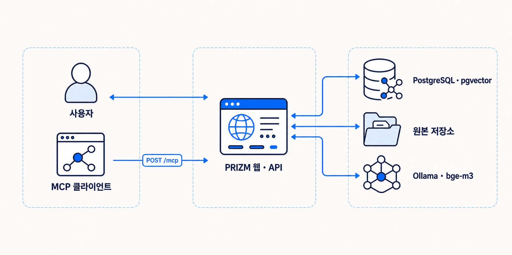
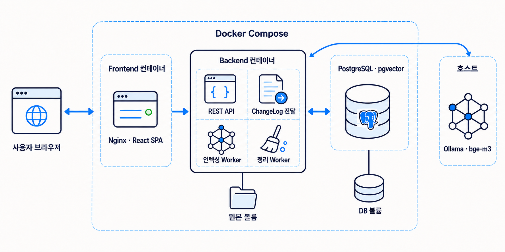
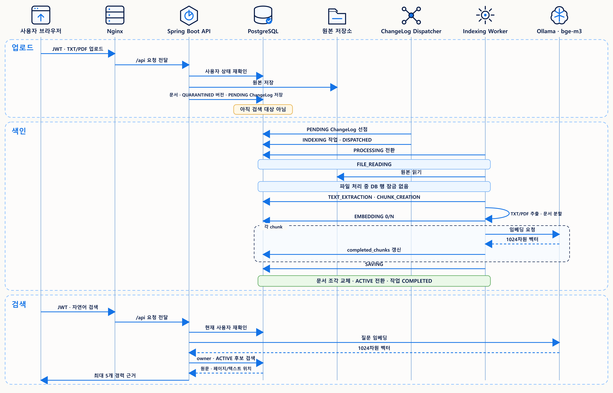
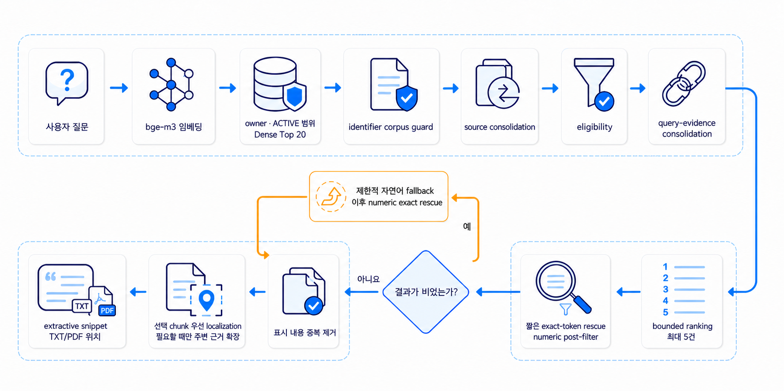
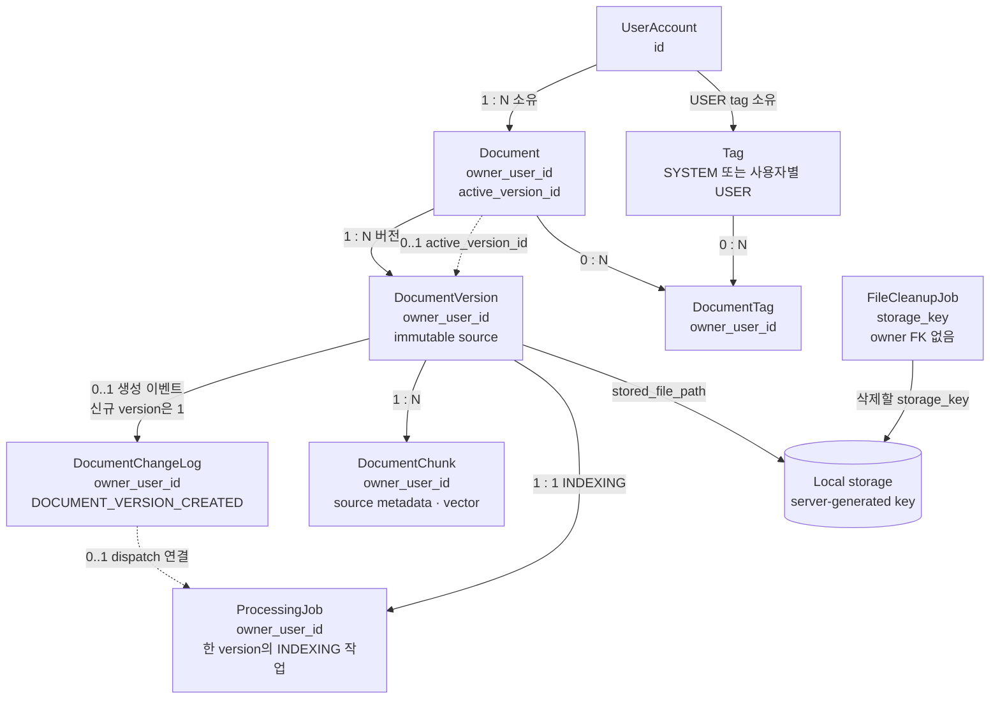
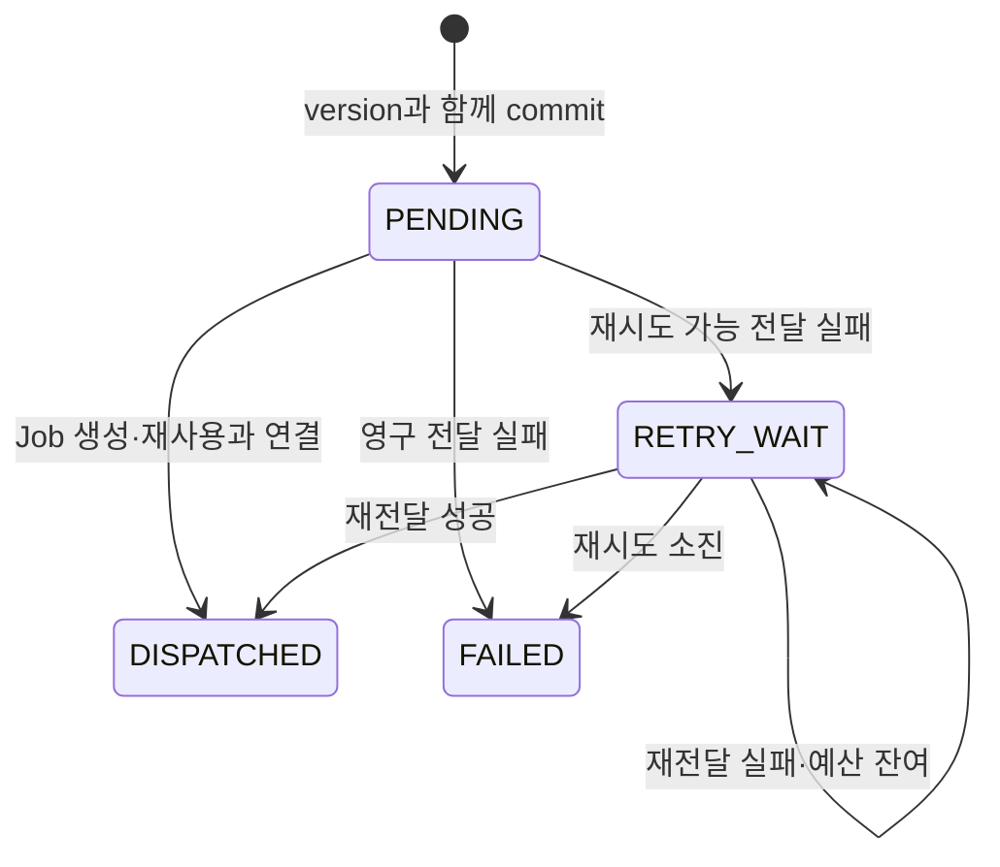
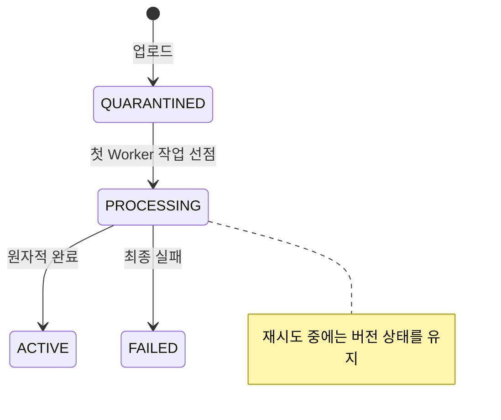
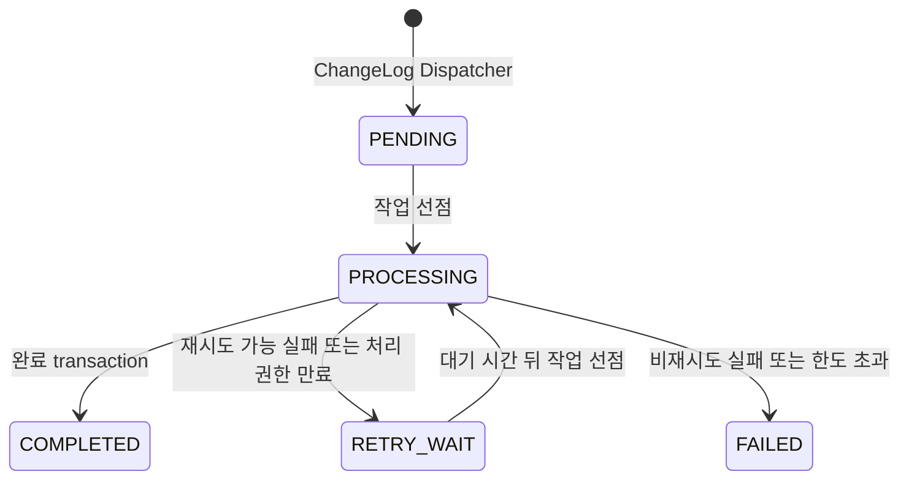

# PRIZM 아키텍처

> 문서 기준일: 2026-08-27
>
> 범위: Spring Boot 애플리케이션과 React 기반 PRIZM 웹 애플리케이션

## 1. 문서 목적과 범위

이 문서는 현재 PRIZM의 구성 요소, 책임, 데이터 흐름, 상태 전이, 실패 복구와
코드 위치를 한 흐름으로 설명합니다. PRIZM은 하나의 Spring Boot backend와
React frontend로 실행하는 self-hosted 웹 애플리케이션입니다.

제품 관점에서는 문서 업로드, 변경 기록(ChangeLog) 기반 작업 전달,
자동 임베딩(텍스트를 검색용 벡터로 변환), 안전한 `ACTIVE` 전환과 사용자별 원문 근거 검색을 연결한 커리어 문서 관리·근거
검색 도구입니다. 표준 MCP client도 같은 경력 근거 검색을 읽기 전용으로
호출할 수 있습니다.

세부 기능의 구현·검증 상태는 [현재 구현 현황](project-status.md), 제품 정의와 변경
원칙은 [PRIZM 제품 범위](roadmap.md), 설치와 실행 절차는
[로컬 빠른 시작](quickstart.md)을 따릅니다. 이 문서는 실행 명령이나 날짜별 검증
결과를 반복하지 않습니다.

## 2. 설계 기준과 핵심 불변식

PRIZM의 구조는 다음 조건을 지키기 위해 선택되었습니다.

- 사용자가 볼 수 있는 문서 목록뿐 아니라 검색 후보도 현재 사용자 소유 데이터로
  먼저 제한합니다.
- 업로드만 되었거나 처리에 실패한 문서 버전은 검색에 노출하지 않습니다.
- 새 버전 처리가 실패해도 이미 검색 중인 `ACTIVE` 버전은 그대로 유지합니다.
- Worker가 중단되면 만료된 작업을 다시 가져갈 수 있어야 합니다. 이전 Worker가
  늦게 돌아와 최신 결과를 덮어쓰지 못하도록 선점 세대도 확인합니다.
- 검색 결과에는 원문과 함께 TXT 텍스트 구간 또는 PDF 페이지 위치가 포함됩니다.
- PDF 추출과 Ollama 호출처럼 오래 걸리는 작업 중에는 DB 행 잠금을 계속 잡지
  않습니다.
- 파일을 경로 바꿔치기 위험 없이 지울 수 없는 환경에서는 삭제를 중단합니다.
- PostgreSQL에서 얻은 결과와 OpenSQL에서 얻은 결과를 서로의 검증 근거로
  바꾸어 쓰지 않습니다.

이 불변식의 구현 근거는 뒤 절의 소스·migration·test 링크로 연결합니다.

## 3. 시스템 구성

사용자는 브라우저의 PRIZM 웹 애플리케이션이나 Bearer JWT를 설정한 MCP client로 PRIZM을
사용합니다. PRIZM은 원본 파일과 관계형·벡터 데이터를 각각 저장하고 외부 Ollama에
임베딩 생성을 요청합니다.
Ollama는 벡터를 만들 뿐 사용자 권한이나 검색 가능 여부를 판단하지 않습니다.

[](assets/diagrams/prizm-system-architecture.png)

MCP 경로는 연결 상태를 서버에 저장하지 않는(stateless) Streamable HTTP와 통신
규격(protocol) `2025-11-25`를 사용합니다.
`search_career_evidence({"query":"..."})` 도구는 활성 `ROLE_USER`의 Bearer JWT를
검증한 뒤 `CurrentUserProvider.userId()`와 기존
`SearchService.searchCareerEvidenceV2(...)`를 호출합니다. 별도 검색 구현이 없으므로
REST와 마찬가지로 사용자별 데이터와 현재 `ACTIVE` 버전만 반환합니다.

구현·검증 근거:

- [경력 근거 MCP 도구](../src/main/java/com/prizm/mcp/CareerEvidenceMcpTool.java)
- [PRZ-015 검증 기록](../specs/PRZ-015-mcp-career-evidence-search/evidence.md)

로컬 실행 환경의 DB는 PostgreSQL 16+pgvector입니다. OpenSQL은 별도
단일 서버 환경에서 SQL 호환성과 direct `5432` 애플리케이션 E2E를 검증했으며,
로컬 배포 그림에 PostgreSQL과 같은 런타임으로 합치지 않습니다.

## 4. 로컬 배포 아키텍처

Docker Compose는 `db`, `backend`, `frontend` 세 컨테이너와 두 named volume을
구성합니다. Ollama `bge-m3`는 Compose 서비스가 아니라 호스트에서 별도로
실행합니다.

[](assets/diagrams/prizm-local-deployment-architecture.png)

Frontend 이미지는 Node build stage에서 React 정적 파일을 만든 뒤, 최종 Nginx
실행 stage에 결과만 복사합니다. 실제 요청은 Nginx가 `/api`와 `/actuator`를
backend로 전달합니다. ChangeLog Dispatcher와 Indexing·Cleanup Scheduler·Worker는
별도 컨테이너나 서비스가 아니라 API와 같은 Spring Boot 프로세스 안에서
실행됩니다. Dispatcher는 짧은 DB transaction만 수행하고, 검색 요청은 API 경로에서,
문서 처리는 Indexing Worker 경로에서 Ollama를 호출합니다.

근거:

- [Docker Compose](../compose.yaml)
- [Frontend 다단계 Dockerfile](../frontend/Dockerfile)
- [Nginx reverse proxy 설정](../frontend/nginx.conf)
- [React 진입점](../frontend/src/App.tsx)
- [Spring Boot 설정](../src/main/resources/application.yml)
- [ChangeLog Dispatcher](../src/main/java/com/prizm/changelog/worker/ChangeLogDispatchScheduler.java)
- [문서 처리 Scheduler](../src/main/java/com/prizm/ingestion/worker/IndexingScheduler.java)
- [파일 정리 Scheduler](../src/main/java/com/prizm/cleanup/worker/FileCleanupScheduler.java)

## 5. 구성요소별 책임

| 구성요소 | 책임 | 직접 접근 대상 |
|---|---|---|
| React 웹 화면 | 로그인, 문서 목록·상세·업로드·관리, 검색 결과와 사용자 관리형 태그 표시 | 같은 origin의 Nginx `/api` |
| Nginx | React SPA 정적 파일 제공, `/api`·`/actuator` reverse proxy | Spring Boot backend |
| Spring Boot API | JWT·DB 사용자 재검증, 문서·태그 관리와 경력 근거 검색 처리 | PostgreSQL, 파일 저장소, Ollama |
| ChangeLog Dispatcher | PENDING 변경 로그 선점, INDEXING 작업 생성·재사용과 DISPATCHED 확정 | PostgreSQL |
| Indexing Scheduler / Worker | 작업 선점, 추출·문서 분할(chunking)·임베딩, `ACTIVE` 전환과 실패 복구 | PostgreSQL, 파일 저장소, Ollama |
| Cleanup Scheduler / Worker | 보상 삭제와 문서 삭제에서 생긴 파일 정리 작업의 재시도·복구 | PostgreSQL, 파일 저장소 |
| PostgreSQL+pgvector | 사용자·문서·버전·작업 상태 저장과 사용자별 exact cosine 검색 | Spring Boot 프로세스 |
| Local storage | 서버가 만든 상대 경로에 업로드 원본 저장 | Spring Boot 프로세스 |
| Ollama `bge-m3` | 문서 조각과 검색 질문의 1024차원 임베딩 생성 | Spring Boot 프로세스 |

문서 목록과 열린 상세는 `PENDING`, `PROCESSING`, `RETRY_WAIT` 등 처리가 끝나지 않은 작업이
있는 동안 약 2초 간격으로 사용자별 문서 API를 다시 조회합니다. 응답이
`COMPLETED`, `FAILED` 또는 다른 종료 상태가 되면 polling을 중지합니다. 이 polling은
별도 push 채널이나 Worker 제어 경로가 아니라 기존 읽기 API의 화면 갱신 책임입니다.

## 6. 문서 업로드부터 검색까지

문서를 검색할 수 있게 처리하는 과정을 이 문서에서는 색인(indexing)이라고 부릅니다.
구현 이름인 `Indexing Scheduler`와 `Indexing Worker`는 이 과정을 예약하고 실행하는
구성 요소입니다. 정상 흐름은 다음과 같습니다. DB 작업을 짧게 나누기 때문에 파일 읽기,
PDF 추출, 문서 분할과 Ollama 호출 중에는 완료 트랜잭션의 행 잠금을 유지하지 않습니다.

[](assets/diagrams/prizm-upload-index-search.png)

업로드 트랜잭션이 원본 저장 뒤 rollback되면 보상 삭제를 시도합니다. 이 삭제도
실패하면 정리 작업을 등록합니다. 문서 처리 완료 시에는 생성한 모든 임베딩을 다시
검증하고, 기존 미완성 문서 조각 교체·저장 개수 확인·버전 `ACTIVE` 전환·문서의
`active_version_id` 교체·작업 완료를 하나의 transaction에서 확정합니다.

근거:

- [DB 사용자 재확인](../src/main/java/com/prizm/auth/security/DatabaseJwtAuthenticationConverter.java)
- [문서 업로드 서비스](../src/main/java/com/prizm/document/service/DocumentUploadService.java)
- [ChangeLog migration](../src/main/resources/db/migration/V14__create_document_change_logs.sql)
- [ChangeLog dispatch transaction](../src/main/java/com/prizm/changelog/service/ChangeLogDispatchTransaction.java)
- [텍스트 추출](../src/main/java/com/prizm/ingestion/service/DocumentTextExtractor.java)
- [작업 선점 서비스](../src/main/java/com/prizm/ingestion/service/ProcessingJobClaimService.java)
- [문서 처리](../src/main/java/com/prizm/ingestion/service/DocumentIndexingProcessor.java)
- [문서 처리 완료](../src/main/java/com/prizm/ingestion/service/IndexingCompletionService.java)
- [검색 서비스](../src/main/java/com/prizm/search/service/SearchService.java)
- [PostgreSQL 통합 테스트](../src/integrationTest/java/com/prizm/infrastructure/PgVectorInfrastructureTest.java)

### 검색 결과의 생성과 해석

PRIZM 검색은 사용자의 `ACTIVE` 문서에서 질문과 관련된 원문을 찾고 위치를
연결합니다. 즉, 관련 원문 검색 및 위치 찾기를 수행합니다. 현재 적용된 검색은 다음
순서로 동작합니다.

[](assets/diagrams/prizm-search-result-pipeline.png)

검색 질문과 문서 조각은 같은 `bge-m3` 모델의 1024차원 임베딩을 사용합니다.
저장과 검색 전에는 차원 수, 모든 값의 유한성, 0이 아닌 norm을 검사합니다.
PostgreSQL pgvector의 exact cosine distance 연산자 `<=>`로 최대 20개 후보를 가져오며,
SQL 단계에서 owner와 `ACTIVE` version을 제한합니다.

직접 구현·완료·identifier 질의에는 strong identifier가 문서 집합에 실제로 있는지
먼저 확인합니다. 이후 실제로 겹치는 source span을 축약하고, Dense score와 exact
identifier anchor, numeric anchor와 query core term 같은 제한된 신호로 후보 자격을
판정합니다. 자격을 통과한 후보에서 같은 질문 근거의 반복을 다시 축약하고, GENERAL
검색은 `EvidenceQualityReranker`의 제한된 보정값을 포함해 순위를 정한 뒤 최대 5건을
선택합니다. 같은 PDF page라도 다른 프로젝트나 독립된 원문 근거라면 합치지 않습니다.

GENERAL 검색은 기본 `0.50` floor를 유지합니다. 결과가 비어 있고 정규화된 질의가
단일 2–4자 token이며 본문에서 exact token이 일치할 때만 `0.49 <= score < 0.50`
후보 한 건을 제한적으로 복구합니다. 부분 문자열은 인정하지 않으며 원래 score와
distance를 반환합니다. 완료 배포·출시 검색은 이 복구 경로를 사용하지 않습니다.
`legacy-dense-v1`은 명시적 rollback 경로로 남아 있습니다.

단위가 붙은 숫자 질의는 선택 결과에 숫자 주변 문맥이 함께 있는지 다시 확인합니다.
결과가 비어 있고 질의 형태가 허용될 때만 최대 두 개의 제한된 자연어 변형을 순서대로
조회합니다. 변형 질의는 후보를 넓히는 데만 쓰고, 최종 선택과 위치 찾기는 원래 질의를
기준으로 합니다. 그래도 결과가 없고 단위가 붙은 숫자가 있으면 숫자 경계를 정확히
일치시키는 rescue를 마지막으로 시도합니다. 최종 응답에서는 표시할 원문이 같은 결과를
한 번 더 정리합니다.

최종 후보에서는 선택된 chunk 안에서 먼저 원문 위치를 찾습니다. 그 chunk가 충분하면
다른 위치로 옮기지 않고, 부족할 때만 같은
owner·document·`ACTIVE` version 범위에서 주변 근거를 확인합니다. 이 과정은 결과의
선택과 순위, score를 다시 계산하지 않으며 전체 `content`도 유지합니다. 마지막에는
가능하면 원문 offset을 보존한 연속 1–3문장을 `snippet`으로 구성하고, 문장을 분리할 수
없거나 위치화가 실패하면 선택된 chunk 원문으로 돌아갑니다. TXT는
`TEXT_CHUNK`와 텍스트 구간 번호를, PDF는 `PAGE`와 1-based 페이지 번호를 반환합니다.

`score = 1 - distance`는 후보 정렬을 위한 유사도이지 정확도나 사실 확률이 아닙니다.
Search는 사용자가 해당 경험을 실제로 수행했는지, 경력 내용이 사실인지, 원문의
주체가 사용자인지, 채용 요구를 충족하는지, 직무에 적합한지 또는 합격 가능성이
있는지 판정하지 않습니다. PostgreSQL FTS, BGE-M3 Sparse와 별도 BGE reranker는
현재 적용된 검색 경로에 포함되지 않습니다.

추가 근거:

- [vector schema](../src/main/resources/db/migration/V2__create_document_chunks.sql)
- [출처 metadata migration](../src/main/resources/db/migration/V10__add_chunk_source.sql)
- [PDF 페이지 출처 migration](../src/main/resources/db/migration/V11__support_pdf_page_sources.sql)
- [임베딩 검증](../src/main/java/com/prizm/embedding/service/EmbeddingValidator.java)
- [벡터 검색 SQL](../src/main/java/com/prizm/search/repository/VectorSearchRepository.java)
- [제한된 근거 품질 재정렬](../src/main/java/com/prizm/search/profile/EvidenceQualityReranker.java)
- [제한적 자연어 fallback](../src/main/java/com/prizm/search/profile/NaturalLanguageQueryFallback.java)
- [짧은 exact-token rescue](../src/main/java/com/prizm/search/profile/ShortGeneralExactTokenRescueProfile.java)
- [numeric exact rescue](../src/main/java/com/prizm/search/profile/NumericAnchorRescueProfile.java)
- [주변 근거 확장](../src/main/java/com/prizm/search/service/EvidenceExpansionService.java)
- [extractive snippet 생성](../src/main/java/com/prizm/search/service/SearchSnippetGenerator.java)
- [검색 서비스 테스트](../src/test/java/com/prizm/search/service/SearchServiceTest.java)
- [주변 근거 확장 테스트](../src/test/java/com/prizm/search/service/EvidenceExpansionServiceTest.java)
- [경력 근거 API 테스트](../src/test/java/com/prizm/search/controller/CareerEvidenceSearchControllerTest.java)
- [Composite Search Profile](../src/main/java/com/prizm/search/profile/CompositeSearchProfile.java)
- [경력 근거 v2 API](../src/main/java/com/prizm/search/controller/CareerEvidenceSearchV2Controller.java)

### 채용공고 항목별 근거 검색

채용공고 항목별 근거 검색은 붙여넣은 채용공고를 줄바꿈, 목록과 문장 경계로 일정하게
분리합니다. section heading은 항목을 묶는 표시 정보로 유지하고, 사용자가 고를 수 있는
하위 항목과 구분합니다. 사용자가 선택한 항목만 기존 경력 근거 검색에
전달합니다. 분리와 query 구성에는 Qwen, 다른 chat LLM, prompt와 response parser를
사용하지 않습니다. Ollama `bge-m3`는 기존 검색의 query 임베딩에만 사용합니다.

각 분리 항목은 기존 검색 입력 조건에 맞춰 500자 이하이고 문자·숫자 2개 이상을
유지합니다. 한 입력에서 반환하는 항목은 최대 100개이며 이를 넘으면 일부를 잘라 내지 않고
`400 JOB_POSTING_ITEM_LIMIT_EXCEEDED`로 거부해 항목별 Search 요청 증폭을 제한합니다.

단순 선택 항목은 원문으로 기존 `POST /api/career-evidence/search`를 호출합니다. 명확한
`A / B`, compact slash 목록, `또는`, 독립 영문 `or` 구조는 원문과 최대 5개 alternative
query로 제한합니다. 결과는 원문 query부터 순서대로
`documentId + documentVersionId + chunkId`로 중복을 제거하고 최종 5건만 원래 항목 하나에
표시합니다. 이 기능은 검색의 사용자·`ACTIVE` 버전 범위, 순위화, 관련성 기준,
보조 검색과 원문 위치 찾기 방식을 바꾸지 않으며 query별 score를 재정렬하지 않습니다.

분리 결과는 section별 선택 modal로 표시하며 heading에는 checkbox를 만들지 않습니다.
결과 화면은 선택 항목별로 문서·버전과 근거 결과를 묶어 보여 줍니다. 동일한
원문 위치와 표시 원문만 화면 표시 단계에서 정리하고 snippet, 주변 원문과 문서 위치는
유지합니다.

PDF `PAGE`는 기존 인증된 original Blob viewer에서 표시 근거의 1-based page로
이동하고, TXT `TEXT_CHUNK`는 기존 문서 상세를 엽니다. 채용공고 입력, 분리 결과와
선택은 영구 저장하지 않습니다. 별도 table, migration, PDF viewer, Tag filter를 두지
않으며 현재 적용된 검색도 수정하지 않습니다. 구현·검증 상세는
[PRZ-017 검증 기록](../specs/PRZ-017-job-posting-evidence-v1/evidence.md)을 확인하세요.

### 사용자가 관리하는 문서 태그

문서 태그는 사용자가 문서에 직접 연결하는 메타데이터입니다. `tags`는 표시 이름과
NFKC·공백·대소문자를 정규화한 이름, `SYSTEM|USER` source와 nullable owner를
저장합니다. SYSTEM tag는 모든 USER에게 보이고 USER tag는 생성 owner에게만 보입니다.
`document_tags`는 document와 tag의 다대다 연결이며 document owner와 같은 owner
범위에서만 읽고 씁니다.

SYSTEM tag는 추천 목록이며 whitelist가 아닙니다. 사용자는 별도 USER tag를 만들 수
있고 같은 owner의 정규화 이름 중복은 재사용합니다. 최초 upload에서는 tag 접근
가능성을 확인한 뒤 문서 생성 transaction 안에서 연결합니다. 새 문서 버전은
문서 단위 태그를 바꾸지 않습니다.

React의 공용 Tag Modal은 tag 검색, 다중 선택과 USER tag 생성을 제공하며 upload와
document detail에서 함께 사용합니다. 경력 키워드 화면은 현재 owner 문서에 실제로
연결된 tag와 문서 수를 보여 줍니다. tag를 선택하면 이름을 경력 근거 검색의
원본 query로 전달해 사용자의 `ACTIVE` 문서 전체에서 근거를 찾습니다. tag가 연결된
문서로 검색 범위를 제한하지 않습니다.

태그는 문서 분류 메타데이터이며 검색 필터나 순위 신호가 아닙니다. 사용자가 tag
상세를 열 때 선택한 이름만 명시적 query가 됩니다. tag 추가·삭제는 기존 문서 조각,
임베딩, `ACTIVE` 포인터와 PDF 페이지 위치 정보를 변경하지 않습니다.

근거:

- [V16 tag schema](../src/main/resources/db/migration/V16__create_document_tags.sql)
- [사용자별 tag repository](../src/main/java/com/prizm/documenttag/repository/DocumentTagRepository.java)
- [tag service](../src/main/java/com/prizm/documenttag/service/DocumentTagService.java)
- [공용 Tag Modal](../frontend/src/TagModal.tsx)
- [React 경력 키워드 화면](../frontend/src/App.tsx)
- [PRZ-009 검증 기록](../specs/PRZ-009-career-keyword-map/evidence.md)

## 7. 핵심 데이터 관계

`owner_user_id`는 문서에서 버전·문서 조각·처리 작업까지 전달됩니다. 복합 외래 키는
상위와 하위 row의 사용자가 달라지는 것을 막습니다. `active_version_id`는 한
문서가 보존한 여러 버전 중 검색에 사용할 한 버전을 가리킵니다.



`DocumentChangeLog`는 `(document_version_id, event_type)`와 `event_key`가 unique이고,
연결된 `ProcessingJob`과 사용자·버전이 일치하도록 복합 외래 키로 보호됩니다.
`ProcessingJob`은 `(document_version_id, job_type)`가 unique이고 현재 job type은
`INDEXING` 하나이므로 버전마다 최대 한 건입니다. `FileCleanupJob`은 사용자나
버전에 대한 외래 키를 두지 않고 서버가 생성한 `storage_key`만 보관합니다.
`DocumentTag`는 문서 사용자를 복합 외래 키로 보존하고, service가 `SYSTEM` 또는 같은
사용자의 `USER` tag만 연결하도록 검증합니다.
브라우저가 임의 경로를 등록하는 API는 없으며, 사용자별 문서 작업이나 업로드
rollback 보상 경로가 정리 작업을 만듭니다.

### Search V3 shadow 저장 경계

V18은 Search V2의 `document_chunks`를 유지한 채 Search V3 색인 세대를 나란히 저장할 수 있는
shadow schema를 추가합니다. `SearchIndexGeneration`은 `DocumentVersion`과 분리돼 같은 원본 version을
정책·모델 계약이 다른 여러 세대로 다시 색인할 수 있습니다. 각 세대에는 독립 manifest, V3 전용 작업,
`RetrievalPassage`, `EvidenceChild`와 두 종류의 BGE-M3 vector가 연결됩니다.

`documents.active_search_v3_generation_id`는 nullable입니다. 최초 업로드나 V3 색인이 없는 문서는 null이
정상이며, 값이 있으면 owner·문서·현재 `active_version_id`가 같은 generation만 가리킬 수 있습니다. 실제
검색 가능 조건인 `ACTIVE generation + COMPLETED V3 job` 확인과 원자적 pointer 교체는 후속 service
transaction 책임입니다. 현재 Production Search와 Worker는 이 schema를 읽거나 쓰지 않습니다.

복합 FK는 generation부터 Passage·Child·vector까지 owner·문서·version 계보가 섞이지 않게 합니다.
vector PK/FK는 artifact별 중복과 orphan을 막고, frozen manifest와 실제 inventory가 모두 존재하는지는
READY/activation service가 잠금 아래 확인해야 합니다.

근거:

- [사용자 entity](../src/main/java/com/prizm/user/entity/UserAccount.java)
- [문서 entity](../src/main/java/com/prizm/document/entity/Document.java)
- [문서 버전 entity](../src/main/java/com/prizm/document/entity/DocumentVersion.java)
- [ChangeLog entity](../src/main/java/com/prizm/changelog/entity/DocumentChangeLog.java)
- [처리 작업 entity](../src/main/java/com/prizm/ingestion/entity/ProcessingJob.java)
- [문서·버전 migration](../src/main/resources/db/migration/V3__create_documents_and_document_versions.sql)
- [처리 작업 migration](../src/main/resources/db/migration/V4__create_processing_jobs.sql)
- [소유권 migration](../src/main/resources/db/migration/V8__add_document_ownership.sql)
- [ChangeLog migration](../src/main/resources/db/migration/V14__create_document_change_logs.sql)
- [파일 정리 migration](../src/main/resources/db/migration/V12__add_file_cleanup_jobs.sql)
- [문서 태그 migration](../src/main/resources/db/migration/V16__create_document_tags.sql)
- [Search V3 shadow storage migration](../src/main/resources/db/migration/V18__create_search_v3_shadow_storage.sql)

## 8. 상태 전이

### DocumentChangeLog

업로드 transaction이 신규 `DocumentVersion`과 `PENDING` ChangeLog를 함께
commit합니다. 작업 전달기(Dispatcher)가 `ProcessingJob` 생성·재사용과 연결을 같은 짧은
transaction에서 확정하면 `DISPATCHED`가 됩니다. 전달 실패는 별도 실패 기록기가
1분·5분·15분 간격의 `RETRY_WAIT` 또는 최종 `FAILED`로 기록합니다.



`DISPATCHED`는 문서 처리 완료가 아니라 기존 Indexing Worker에 작업을 전달했다는 뜻입니다.
그 뒤의 처리 재시도·실패는 `ProcessingJob`과 `DocumentVersion`에 기록하며 ChangeLog를
되돌리지 않습니다. 전달이 최종 실패하면 아직 `QUARANTINED`인 새 version도
`FAILED`로 전환하지만 기존 `active_version_id`는 유지합니다.

근거:

- [ChangeLog 상태](../src/main/java/com/prizm/changelog/entity/ChangeLogDispatchStatus.java)
- [ChangeLog dispatch](../src/main/java/com/prizm/changelog/service/ChangeLogDispatchTransaction.java)
- [ChangeLog 실패 기록](../src/main/java/com/prizm/changelog/service/ChangeLogDispatchFailureRecorder.java)

### DocumentVersion

업로드 직후 버전은 `QUARANTINED`이며 검색할 수 없습니다. 첫 작업 선점(claim)에서
`PROCESSING`으로 바뀝니다. 재시도할 때 버전 상태는 `PROCESSING`을 유지하고
처리 작업만 `RETRY_WAIT`와 `PROCESSING` 사이를 이동합니다.



### ProcessingJob



수동 재시도나 terminal 상태에서 되돌아가는 경로는 현재 구현에 없습니다.

현재 선점한 작업의 실제 처리 단계는 `FILE_READING → TEXT_EXTRACTION → CHUNK_CREATION →
EMBEDDING → SAVING → COMPLETED`로 별도 저장합니다. 단계와 청크 진행 갱신은
`processing_job_id`, `owner_user_id`, `PROCESSING`, `claim_version`을 모두 만족하는
Worker만 수행할 수 있습니다. 전체 청크 수가 확정되기 전에는 청크 수와 퍼센트를
제공하지 않으며, 확정 뒤에는 `completed_chunks / total_chunks`만 사용합니다.
임베딩 중 DB 저장은 이 실제 비율의 정수 퍼센트가 바뀌거나 최종 청크가
완료될 때만 중간 상태로 기록하고, 단계 변경과 완료·실패·재시도 전이는
기존의 짧은 transaction 방식을 유지합니다.
재시도·실패 시 내부 예외는 서버 로그와 제한된 내부 필드에 남기고 API에는
Ollama 연결, model 미설치, GPU/model 실행, 일반 처리 실패의 allowlist 코드만
노출합니다.

근거:

- [문서 버전 상태 enum](../src/main/java/com/prizm/document/entity/DocumentVersionStatus.java)
- [문서 버전 전이](../src/main/java/com/prizm/document/entity/DocumentVersion.java)
- [처리 작업 상태 enum](../src/main/java/com/prizm/ingestion/entity/ProcessingJobStatus.java)
- [처리 작업 전이](../src/main/java/com/prizm/ingestion/entity/ProcessingJob.java)
- [자동 처리 전환 migration](../src/main/resources/db/migration/V7__transition_to_automatic_document_processing.sql)
- [진행 상태 migration](../src/main/resources/db/migration/V15__add_processing_job_progress.sql)
- [진행 상태 갱신](../src/main/java/com/prizm/ingestion/service/ProcessingJobProgressService.java)
- [상태 전이 단위 테스트](../src/test/java/com/prizm/document/entity/DocumentVersionStateTest.java)

## 9. 사용자 소유권과 신뢰 경계

- 브라우저에서 받은 사용자 ID나 문서 ID만 믿지 않습니다. API는 인증된 JWT의
  subject를 현재 사용자 ID로 사용합니다.
- JWT 서명이 맞아도 사용자 상태가 확정된 것은 아닙니다. 매 요청마다 DB에서
  계정이 enabled인지 확인하고 JWT의 email·role이 현재 값과 같은지 비교합니다.
- 개인 문서와 검색 API는 활성 `USER` 역할에만 열려 있으며 역할 기반 우회 권한은
  없습니다.
- document·version·ChangeLog·chunk·processing job에는 `owner_user_id`가 전달되고, service,
  repository SQL과 복합 외래 키가 같은 사용자 관계를 확인합니다.
- 검색 SQL은 cosine distance를 계산하기 전에 document·version·chunk owner와
  `documents.active_version_id`, version의 `ACTIVE` 상태를 모두 제한합니다.
- Ollama는 전달된 텍스트의 임베딩만 생성합니다. 사용자 권한은 Spring Boot와
  DB가 판단합니다.
- 파일 저장소의 상대 경로는 소유권의 원본이 아닙니다. 문서 작업의 권한은 DB
  owner 관계에서 결정합니다.

새 설치에서는 `POST /api/auth/signup`으로 활성 일반 `USER`를 만들 수 있습니다.
요청은 이메일과 비밀번호만 받고 BCrypt hash를 저장하며 성공 응답은 JWT나 세션을
만들지 않습니다. 사용자는 이어서 기존 로그인 API로 JWT를 발급받습니다. 서버 기동
과정은 사용자 계정을 만들지 않습니다. 새 설치 자동 검증도 실행 중 생성한 임시 자격
증명으로 같은 signup → login → JWT 경로를 사용합니다. 기본 Compose는 loopback에
바인딩된 로컬 self-hosted 실행 구성이며 공개 SaaS 운영 구성을 대신하지 않습니다.

V17 migration은 과거 `SYSTEM_ADMIN` 행을 삭제하지 않고 비활성화한 뒤 `USER`로
변환합니다. 따라서 기존 소유 관계는 보존되지만 이전 계정과 JWT는 인증에 사용할 수
없습니다. 현재 스키마와 애플리케이션 역할은 `USER` 하나만 허용합니다.

근거:

- [보안 설정](../src/main/java/com/prizm/auth/config/SecurityConfiguration.java)
- [DB 사용자 재확인](../src/main/java/com/prizm/auth/security/DatabaseJwtAuthenticationConverter.java)
- [현재 사용자 추출](../src/main/java/com/prizm/auth/security/CurrentUserProvider.java)
- [문서 조회 서비스](../src/main/java/com/prizm/document/service/DocumentQueryService.java)
- [벡터 검색 SQL](../src/main/java/com/prizm/search/repository/VectorSearchRepository.java)
- [회원가입·로그인 서비스](../src/main/java/com/prizm/auth/service/AuthService.java)
- [BCrypt 입력 경계](../src/main/java/com/prizm/auth/security/BcryptPasswordPolicy.java)
- [사용자 역할 정리 migration](../src/main/resources/db/migration/V17__remove_system_admin_role.sql)
- [새 설치 환경 생성](../scripts/prepare-clean-clone-demo-env.mjs)
- [새 설치 환경 기본 검증](../scripts/verify-clean-clone-demo.mjs)
- [인증·격리 통합 테스트](../src/integrationTest/java/com/prizm/infrastructure/AuthenticationIntegrationTest.java)
- [migration 통합 테스트](../src/integrationTest/java/com/prizm/infrastructure/CareerPlatformMigrationTest.java)
- [PRZ-004 검증 기록](../specs/PRZ-004-clean-clone-demo/evidence.md)

## 10. Worker 실패와 복구

1. Worker는 `FOR UPDATE SKIP LOCKED`를 사용해 실행 가능한 작업 한 건을 짧은
   transaction에서 선점하고 처리 권한 유효시간(lease)과 `claim_version`을 갱신합니다.
2. 원본 읽기, PDF 추출, 문서 분할과 Ollama 호출은 이 선점 transaction 밖에서
   실행하므로 DB lock을 오래 유지하지 않습니다.
3. 별도 처리 권한 갱신(heartbeat)이 lease의 3분의 1 간격으로 유효시간을 늘리고, 문서 조각 처리
   중에도 설정된 간격마다 lease를 확인합니다.
4. Worker가 중단되어 lease가 만료되면 복구 Scheduler가 작업을
   `RETRY_WAIT`로 돌리거나 재시도 한도를 넘은 작업을 실패 처리합니다.
5. `claim_version`이 바뀌면 이전 Worker의 claim은 오래된 선점(stale claim)이
   됩니다. 완료와 실패 반영은 현재 값이 같은 Worker에게만 허용됩니다. 이를
   이전 작업 결과 차단(fencing)이라고 합니다.
6. 재시도 가능한 실패는 1분·5분·15분 간격으로 최대 세 번 예약합니다.
7. 재시도할 수 없거나 한도를 넘으면 작업과 새 문서 버전을 `FAILED`로 바꿉니다.
8. 성공할 때만 문서 조각, 버전 상태, 문서의 `active_version_id`와 작업 상태를 한 transaction에서
   확정합니다. 따라서 새 버전 실패는 기존 `ACTIVE` 버전을 바꾸지 않습니다.

근거:

- [작업 선점 SQL](../src/main/java/com/prizm/ingestion/repository/ProcessingJobClaimRepository.java)
- [lease heartbeat](../src/main/java/com/prizm/ingestion/service/WorkerLeaseHeartbeat.java)
- [실패 처리](../src/main/java/com/prizm/ingestion/service/IndexingFailureService.java)
- [재시도 정책](../src/main/java/com/prizm/ingestion/service/IndexingRetryPolicy.java)
- [만료 작업 복구](../src/main/java/com/prizm/ingestion/service/ProcessingJobRecoveryService.java)
- [lease migration](../src/main/resources/db/migration/V5__add_processing_job_lease.sql)
- [heartbeat 단위 테스트](../src/test/java/com/prizm/ingestion/service/WorkerLeaseHeartbeatTest.java)
- [Worker 통합 테스트](../src/integrationTest/java/com/prizm/infrastructure/PgVectorInfrastructureTest.java)

## 11. 파일 저장과 안전한 삭제

업로드와 삭제는 DB transaction만으로 원자성을 보장할 수 없는 파일시스템 작업을
포함합니다. PRIZM은 다음 두 경로로 차이를 복구합니다.

- **업로드 저장:** 서버가 `documents/{documentId}/{versionId}` 구조를 만들고,
  임시 파일을 먼저 쓴 뒤 최종 원본 위치로 이동합니다. DB에는 storage root 기준
  상대 경로만 저장합니다.
- **rollback 보상:** 원본 저장 뒤 DB transaction이 rollback되면 즉시 보상
  삭제를 시도합니다. 실패하면 `FileCleanupJob`을 등록합니다.
- **문서·이전 버전 삭제:** 사용자별 문서가 종료 상태일 때 같은 DB transaction에서
  각 버전의 정리 작업을 먼저 등록하고 문서 데이터를 삭제합니다. 과거 version 하나를 삭제할 때도
  같은 순서로 해당 version의 정리 작업·ChangeLog·processing job·chunk·metadata만 제거합니다.
  현재 `active_version_id`가 가리키는 version과 처리 중 version은 이 경로에서 삭제하지 않습니다.
- **Cleanup Worker:** 정리 작업을 짧게 선점하고 DB transaction 밖에서 파일을
  지웁니다. 파일 삭제 중에는 heartbeat를 보내지 않으며, 실패나 5분 lease 만료는
  문서 처리와 같은 재시도 간격으로 복구합니다.

실제 삭제는 저장 root와 파일 이름을 문자열로 다시 조합해 바로 지우지 않습니다.
열어 둔 디렉터리를 기준으로 하위 항목을 탐색하는 descriptor-relative deletion과
`NOFOLLOW_LINKS`를 사용해 심볼릭 링크와 검사-사용 사이 경로 변경(TOCTOU) 위험을
줄입니다. 파일시스템이 필요한 `SecureDirectoryStream`을 제공하지 않으면 안전하지
않은 path 기반 fallback을 사용하지 않고 fail-closed로 중단합니다.

근거:

- [로컬 파일 저장소](../src/main/java/com/prizm/infrastructure/storage/LocalFileStorage.java)
- [문서 삭제 서비스](../src/main/java/com/prizm/document/service/DocumentManagementService.java)
- [cleanup 선점 SQL](../src/main/java/com/prizm/cleanup/repository/FileCleanupJobRepository.java)
- [cleanup 처리](../src/main/java/com/prizm/cleanup/service/FileCleanupCoordinator.java)
- [cleanup 만료 복구](../src/main/java/com/prizm/cleanup/service/FileCleanupJobRecoveryService.java)
- [cleanup worker migration](../src/main/resources/db/migration/V13__add_file_cleanup_worker_fields.sql)
- [파일 저장소 테스트](../src/test/java/com/prizm/infrastructure/storage/LocalFileStorageTest.java)
- [PRZ-003 플랫폼 검증 기록](../specs/PRZ-003-opensql-single-node-gate/evidence.md#windows-utf-8과-플랫폼-재검증)

## 12. PostgreSQL과 OpenSQL 경계

### PostgreSQL 16+pgvector

기본 Docker Compose는 PostgreSQL 16+pgvector를 사용합니다. 관계형 데이터, 작업
상태와 임베딩 벡터를 한 DB에 저장하며 로컬 실행과 자동 통합 테스트의
기준 환경입니다.

### OpenSQL 단일 서버

OpenSQL 검증 경로는 단일 서버 구성을 사용합니다. Flyway는 OpenSQL Primary의
`:5432`에 직접 연결하고 애플리케이션 실행 트래픽은 OpenProxy single-Primary SQL
경로 `:6432/opensql`을 사용합니다. PostgreSQL과 같은 문서·작업·검색 방식을
유지하지만 OpenSQL 공급 자산은 저장소와 기본 Compose에 포함하지 않습니다.

PostgreSQL 테스트와 OpenSQL 검증은 서로 다른 근거입니다. OpenSQL 결과도 실제로
기록한 database, 연결 경로, 사용자 흐름과 source revision 범위 안에서만 사용합니다.

근거:

- [PostgreSQL Docker Compose](../compose.yaml)
- [OpenSQL 검증 기록](opensql-gate.md)
- [OpenSQL opt-in 테스트](../src/integrationTest/java/com/prizm/infrastructure/OpenSqlInfrastructureTest.java)
- [PRZ-003 검증 기록](../specs/PRZ-003-opensql-single-node-gate/evidence.md)
- [PRZ-005 실제 OpenSQL 통합 작업 보고서](../specs/PRZ-005-opensql-ollama-e2e/implementation-report.md)

## 13. 패키지·코드 지도

```text
src/main/java/com/prizm/
├─ auth            로그인, JWT와 DB 사용자 재확인
├─ user            사용자 계정과 역할
├─ document        문서·보존 버전 등록과 관리
├─ documenttag     SYSTEM·사용자별 USER tag와 문서 metadata 연결
├─ changelog       문서 버전 생성 사실과 INDEXING 작업 전달
├─ embedding       Ollama 연동과 임베딩 검증
├─ ingestion       추출·문서 분할·처리 Worker와 복구
├─ jobposting      채용공고의 결정적 항목 분리와 응답
├─ mcp             읽기 전용 경력 근거 MCP tool과 응답 매핑
├─ search          사용자별 원문 근거 검색
├─ cleanup         파일 정리 작업·Worker와 복구
├─ infrastructure  로컬 파일 저장소 등 외부 인프라 구현
└─ common          공통 API 응답
```

```text
frontend/src/
├─ api             인증·문서·검색 HTTP 호출
├─ auth            브라우저 token 저장
├─ assets          화면용 정적 asset
├─ App.tsx         PRIZM 웹 화면과 client-side navigation
├─ main.tsx        React 진입점
└─ styles.css      화면 스타일
```

전체 파일 목록보다 책임 단위로 먼저 찾고, 각 절의 근거 링크에서 실제 구현으로
내려가는 것을 권장합니다.

## 14. 관련 문서

- [현재 구현 현황](project-status.md)
- [로컬 빠른 시작](quickstart.md)
- [PRIZM 제품 범위](roadmap.md)
- [대표 문제 해결 사례](showcase/problem-solving-case-studies.md)
- [OpenSQL 검증 기록](opensql-gate.md)
- [기능별 검증 기록](../specs/README.md)
