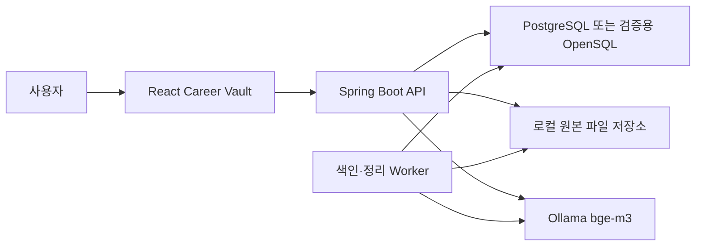
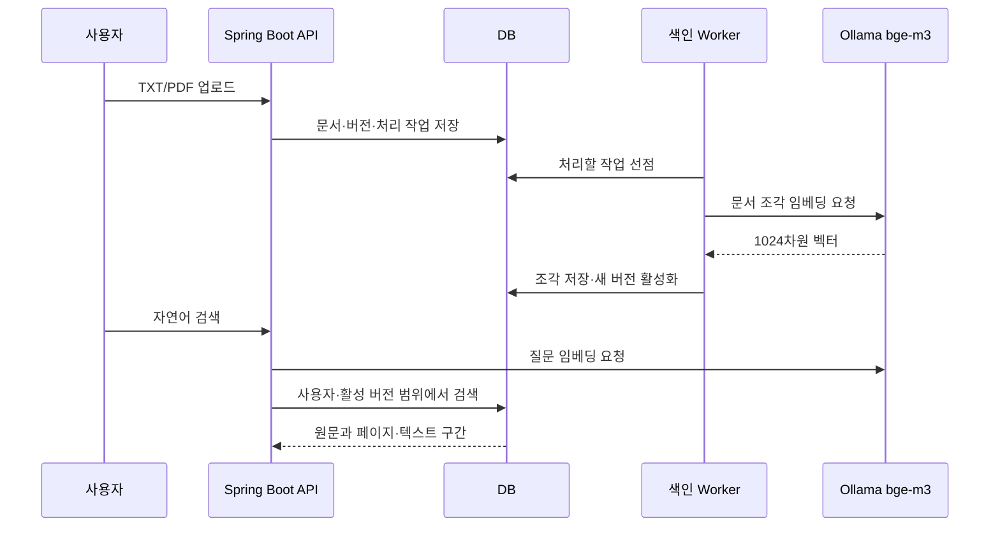

# PRIZM Architecture

> 공개 기준 main: `936e957132fcf54b5cee1f58d83f8d591e5786e2`
>
> PRZ-004 local source commit: 최종 검증 전에 고정 예정
>
> 범위: 현재 Spring Boot 애플리케이션과 React Career Vault Reference App

이 문서는 현재 구현의 구성 요소와 데이터 흐름을 설명합니다. 지금 저장소는
독립 Engine 패키지가 아니라 하나의 애플리케이션입니다. 현재 기능과 검증 상태는
[현재 구현 현황](project-status.md), 앞으로의 제품 순서는
[개발 로드맵](roadmap.md)을 따릅니다.

## 전체 구성 요소

사용자는 Career Vault 화면에서 문서를 등록하고 검색합니다. Spring Boot 백엔드는
인증·문서 관리·색인·검색을 처리합니다. 원본은 로컬 파일 저장소에, 문서 상태와
검색 벡터는 DB에 저장합니다. Ollama는 문장이나 문서 조각을 숫자 배열인
임베딩(embedding)으로 바꿉니다.

로컬 Docker Compose는 `db`, `backend`, `frontend`를 실행합니다. Ollama는
Compose 밖의 호스트에서 실행합니다. 색인 Worker와 파일 정리 Worker는 별도
제품이 아니라 현재 Spring Boot 프로세스 안에서 동작합니다.

근거:

- [Docker Compose](../compose.yaml)
- [React 진입점](../frontend/src/App.tsx)
- [Spring Boot 설정](../src/main/resources/application.yml)
- [색인 Scheduler](../src/main/java/com/prizm/ingestion/worker/IndexingScheduler.java)
- [파일 정리 Scheduler](../src/main/java/com/prizm/cleanup/worker/FileCleanupScheduler.java)

## Clean-clone demo 계정 경계

새 설치에는 공개 회원가입 API가 없습니다. 대신 로컬 실행자가 명시적으로 켠 한
번의 시작에서만 demo `USER`를 생성합니다. 이 bootstrap은 기본적으로 꺼져 있고,
역할을 바꾸는 설정도 제공하지 않습니다. 기존 email이 있거나 `SYSTEM_ADMIN`
bootstrap과 동시에 켜지면 기존 계정을 바꾸지 않고 시작을 실패시킵니다.

demo 계정도 일반 사용자의 로그인, JWT와 DB 사용자 재확인, owner-scoped 문서·검색
경로를 그대로 사용합니다. 별도 우회 권한은 없습니다. 로컬 실행 도구는 고유한
Compose project와 비밀값을 생성하고, 계정 생성 뒤 bootstrap을 끈 경우에만 합성
TXT/PDF smoke를 실행합니다.

근거:

- [demo USER bootstrap](../src/main/java/com/prizm/auth/bootstrap/DemoUserBootstrapRunner.java)
- [bootstrap 충돌 차단](../src/main/java/com/prizm/auth/bootstrap/BootstrapAccountConflictGuard.java)
- [BCrypt 입력 경계](../src/main/java/com/prizm/auth/bootstrap/BcryptPasswordPolicy.java)
- [demo 환경 생성](../scripts/prepare-clean-clone-demo-env.mjs)
- [clean-clone smoke](../scripts/verify-clean-clone-demo.mjs)
- [인증 통합 테스트](../src/integrationTest/java/com/prizm/infrastructure/AuthenticationIntegrationTest.java)
- [PRZ-004 Spec](../specs/PRZ-004-clean-clone-demo/spec.md)

## 문서 등록부터 검색까지

1. 사용자가 로그인하면 백엔드는 JWT를 확인하고 DB에서 사용자 상태와 역할을
   다시 읽습니다.
2. TXT 또는 PDF를 올리면 원본 파일, 문서 정보, 새 버전과 처리 작업을 저장합니다.
   새 버전은 검색에 바로 노출하지 않습니다.
3. 색인 Worker가 작업을 가져가 텍스트를 추출하고 작은 단위로 나눕니다. 각 조각은
   Ollama `bge-m3`로 1024차원 임베딩이 됩니다.
4. 모든 조각을 정상적으로 저장한 뒤에만 새 버전을 검색 대상
   버전(active version)으로 바꿉니다.
5. 검색 질문도 같은 모델로 임베딩합니다. DB는 현재 사용자의 검색 대상
   버전에서 가장 가까운 원문 조각을 찾습니다.

근거:

- [문서 업로드 서비스](../src/main/java/com/prizm/document/service/DocumentUploadService.java)
- [텍스트 추출](../src/main/java/com/prizm/ingestion/service/DocumentTextExtractor.java)
- [색인 처리](../src/main/java/com/prizm/ingestion/service/DocumentIndexingProcessor.java)
- [색인 완료](../src/main/java/com/prizm/ingestion/service/IndexingCompletionService.java)
- [검색 서비스](../src/main/java/com/prizm/search/service/SearchService.java)
- [문서·버전 migration](../src/main/resources/db/migration/V3__create_documents_and_document_versions.sql)
- [처리 작업 migration](../src/main/resources/db/migration/V4__create_processing_jobs.sql)
- [색인 단위 테스트](../src/test/java/com/prizm/ingestion/service/DocumentIndexingProcessorTest.java)
- [PostgreSQL 통합 테스트](../src/integrationTest/java/com/prizm/infrastructure/PgVectorInfrastructureTest.java)

## 사용자 소유권 격리

한 사용자의 문서가 다른 사용자의 목록이나 검색 후보에 들어가면 안 됩니다.
PRIZM은 API에서만 검사하지 않고 DB 관계와 조회 경로에도 사용자 식별자를
전달합니다. 이를 사용자 범위 소유권 격리(owner-scoped isolation)라고 합니다.

- JWT가 유효해도 요청마다 DB에서 현재 사용자와 역할을 다시 확인합니다.
- 문서·버전·처리 작업·문서 조각은 `owner_user_id`를 가집니다.
- 상위·하위 데이터의 소유자가 같도록 복합 외래 키(composite foreign key)를
  사용합니다.
- 검색 SQL은 거리 계산 전에 문서·버전·조각의 소유자와 활성 버전을 제한합니다.
- `SYSTEM_ADMIN`은 개인 문서 API를 대신 사용할 수 없습니다.

근거:

- [DB 사용자 재확인](../src/main/java/com/prizm/auth/security/DatabaseJwtAuthenticationConverter.java)
- [문서 조회 서비스](../src/main/java/com/prizm/document/service/DocumentQueryService.java)
- [벡터 검색 SQL](../src/main/java/com/prizm/search/repository/VectorSearchRepository.java)
- [사용자·소유권 migration](../src/main/resources/db/migration/V6__create_users.sql)
- [V8 소유권 migration](../src/main/resources/db/migration/V8__add_document_ownership.sql)
- [인증·격리 통합 테스트](../src/integrationTest/java/com/prizm/infrastructure/AuthenticationIntegrationTest.java)
- [migration 통합 테스트](../src/integrationTest/java/com/prizm/infrastructure/CareerPlatformMigrationTest.java)

## 변경 불가능한 버전과 검색 대상 버전

업로드한 문서 내용을 직접 덮어쓰지 않고 새 버전으로 남깁니다. 이를 변경
불가능한 버전(immutable version)이라고 합니다. 문서에는 검색에 사용할 버전을
가리키는 `active_version_id`가 하나 있습니다.

새 버전의 추출이나 임베딩이 실패하면 기존 검색 대상 버전을 그대로 유지합니다.
새 조각 저장, 버전 상태 변경, `active_version_id` 교체와 작업 완료는 하나의 DB
트랜잭션(transaction)에서 확정합니다. 따라서 일부 조각만 저장된 새 버전이
검색에 섞이지 않습니다.

근거:

- [문서·버전 migration](../src/main/resources/db/migration/V3__create_documents_and_document_versions.sql)
- [자동 처리 전환 migration](../src/main/resources/db/migration/V7__transition_to_automatic_document_processing.sql)
- [색인 완료 서비스](../src/main/java/com/prizm/ingestion/service/IndexingCompletionService.java)
- [문서 관리 DB 통합 테스트](../src/integrationTest/java/com/prizm/infrastructure/DocumentManagementDatabaseIntegrationTest.java)
- [색인 완료 소유권 테스트](../src/test/java/com/prizm/ingestion/service/IndexingCompletionOwnershipTest.java)

## 비동기 Worker 복구와 fencing

문서 처리에는 PDF 추출과 외부 Ollama 호출이 있어 시간이 걸릴 수 있습니다.
PRIZM은 긴 작업 동안 DB 행을 계속 잠그지 않고, 처리 권한을 일정 시간 빌리는
임대(lease) 방식으로 작업을 나눕니다.

- `FOR UPDATE SKIP LOCKED`로 여러 Worker가 같은 작업을 동시에 가져가지 않도록
  짧게 선점합니다.
- 처리 중에는 주기적으로 생존 신호(heartbeat)를 보내 임대 시간을 갱신합니다.
- 실패한 작업은 재시도 간격을 늘리는 방식(retry/backoff)으로 다시 시도합니다.
- Worker가 사라져 임대가 만료되면 복구 작업이 다시 처리할 수 있게 만듭니다.
- 선점할 때마다 `claim_version`을 올립니다. 이전 Worker는 이 값이 달라지면 완료나
  실패를 기록할 수 없습니다. 이 보호를 선점 세대 차단(claim-version fencing)이라고
  합니다.

현재 기본값은 색인 작업의 임대 시간 10분, 임대 시간의 3분의 1 간격 heartbeat,
최대 3회의 1분·5분·15분 재시도입니다. 이 값은 설정과 재시도 정책에서 관리합니다.

근거:

- [색인 설정](../src/main/java/com/prizm/ingestion/config/IngestionProperties.java)
- [lease migration](../src/main/resources/db/migration/V5__add_processing_job_lease.sql)
- [작업 선점 SQL](../src/main/java/com/prizm/ingestion/repository/ProcessingJobClaimRepository.java)
- [lease heartbeat](../src/main/java/com/prizm/ingestion/service/WorkerLeaseHeartbeat.java)
- [재시도 정책](../src/main/java/com/prizm/ingestion/service/IndexingRetryPolicy.java)
- [만료 작업 복구](../src/main/java/com/prizm/ingestion/service/ProcessingJobRecoveryService.java)
- [lease 단위 테스트](../src/test/java/com/prizm/ingestion/service/ProcessingJobLeaseServiceTest.java)
- [heartbeat 단위 테스트](../src/test/java/com/prizm/ingestion/service/WorkerLeaseHeartbeatTest.java)
- [Worker 통합 테스트](../src/integrationTest/java/com/prizm/infrastructure/PgVectorInfrastructureTest.java)

## 검색 구조

검색은 질문과 문서 조각의 의미가 얼마나 가까운지 비교합니다. `bge-m3`가 만든
벡터를 pgvector의 정확한 코사인 거리(exact cosine distance) 연산자 `<=>`로
정렬합니다. 현재 구현은 근사 최근접 탐색(ANN) 인덱스나 점수 임계값을 사용하지
않습니다.

후보는 현재 사용자와 `active_version_id`에 연결된 조각으로 먼저 제한합니다.
반환하는 `score = 1 - distance`는 정렬을 위한 유사도 값이며 정확도나 확률이
아닙니다. TXT는 텍스트 구간, PDF는 페이지 번호를 출처로 함께 반환합니다.

근거:

- [vector schema](../src/main/resources/db/migration/V2__create_document_chunks.sql)
- [출처 metadata migration](../src/main/resources/db/migration/V10__add_chunk_source.sql)
- [PDF 페이지 출처 migration](../src/main/resources/db/migration/V11__support_pdf_page_sources.sql)
- [임베딩 검증](../src/main/java/com/prizm/embedding/service/EmbeddingValidator.java)
- [벡터 검색 SQL](../src/main/java/com/prizm/search/repository/VectorSearchRepository.java)
- [검색 서비스 테스트](../src/test/java/com/prizm/search/service/SearchServiceTest.java)
- [pgvector 통합 테스트](../src/integrationTest/java/com/prizm/infrastructure/PgVectorInfrastructureTest.java)

## 안전한 파일 정리

원본 파일은 DB 트랜잭션 밖의 파일시스템에 있으므로 DB 작업 취소(rollback)만으로
지워지지 않습니다. PRIZM은 삭제에 실패한 원본을 별도 정리 작업으로 등록하고
나중에 다시 처리합니다.

파일 정리 Worker도 선점 세대 차단과 만료 작업 복구를 사용합니다. 기본 임대
시간은 5분이며 처리 중 heartbeat는 보내지 않습니다. 실패하면 색인 작업과 같은
정책으로 최대 3회, 1분·5분·15분 간격으로 재시도합니다.

실제 삭제는 파일 경로 문자열만 다시 계산하지 않습니다. 지원하는 파일시스템에서는
열어 둔 디렉터리를 기준으로 상대 삭제(descriptor-relative deletion)를 수행하고,
심볼릭 링크를 따라가지 않는 `NOFOLLOW_LINKS` 검사를 적용합니다. 이는 검사와 사용
사이에 경로가 바뀌는 경쟁 조건(TOCTOU)을 줄입니다. 필요한 기능인
`SecureDirectoryStream`을 제공하지 않는 파일시스템에서는 안전하지 않은 삭제로
대체하지 않고 중단(fail-closed)합니다.

근거:

- [cleanup job migration](../src/main/resources/db/migration/V12__add_file_cleanup_jobs.sql)
- [cleanup Worker migration](../src/main/resources/db/migration/V13__add_file_cleanup_worker_fields.sql)
- [cleanup 등록 서비스](../src/main/java/com/prizm/cleanup/service/FileCleanupJobService.java)
- [cleanup 선점 SQL](../src/main/java/com/prizm/cleanup/repository/FileCleanupJobRepository.java)
- [cleanup 설정](../src/main/java/com/prizm/cleanup/config/CleanupProperties.java)
- [cleanup 실패 처리](../src/main/java/com/prizm/cleanup/service/FileCleanupFailureService.java)
- [로컬 파일 저장소](../src/main/java/com/prizm/infrastructure/storage/LocalFileStorage.java)
- [cleanup 단위 테스트](../src/test/java/com/prizm/cleanup/service/FileCleanupCoordinatorTest.java)
- [파일 저장소 테스트](../src/test/java/com/prizm/infrastructure/storage/LocalFileStorageTest.java)

## PostgreSQL과 OpenSQL 검증 환경

두 환경은 같은 결과로 취급하지 않습니다.

| 환경 | 사용 목적 | 확인한 범위 | 확인하지 않은 범위 |
|---|---|---|---|
| PostgreSQL 16+pgvector | 로컬 개발, Docker Compose와 자동 통합 테스트 | 애플리케이션 회귀, migration, 벡터 검색, 소유권, Worker와 파일 정리 | OpenSQL 호환성 |
| OpenSQL single-node | 대회 지정 환경의 SQL 호환성 Gate | 실제 Rocky Linux 9.7 OpenSQL에서 Flyway V1~V13, `vector(1024)`, 검색·소유권·Worker SQL | OpenSQL+Ollama 전체 사용자 흐름, 브라우저 demo, OpenProxy, OpenHA, DB 장애 전환 |

OpenSQL 설치 성공만으로 PRIZM 호환성을 판정하지 않았습니다. 반대로 PostgreSQL
테스트 통과도 OpenSQL 결과로 사용하지 않습니다. 현재 `PASS`는 단일 노드 SQL
Gate에만 해당합니다.

근거:

- [PostgreSQL Docker Compose](../compose.yaml)
- [PostgreSQL·OpenSQL 공통 assertions](../src/integrationTest/java/com/prizm/infrastructure/OpenSqlCompatibilityAssertions.java)
- [OpenSQL opt-in 테스트](../src/integrationTest/java/com/prizm/infrastructure/OpenSqlInfrastructureTest.java)
- [OpenSQL 기술 Gate](opensql-gate.md)
- [PRZ-003 Evidence](../specs/PRZ-003-opensql-single-node-gate/evidence.md)

## 더 깊이 보기

소유권 격리, Worker fencing과 파일 정리에서 어떤 문제를 고려했고 어떤
트레이드오프를 선택했는지는
[대표 문제 해결 사례](showcase/problem-solving-case-studies.md)에서 설명합니다.
