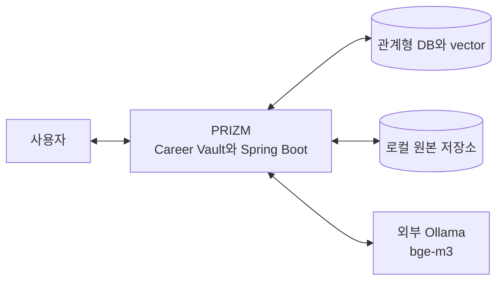
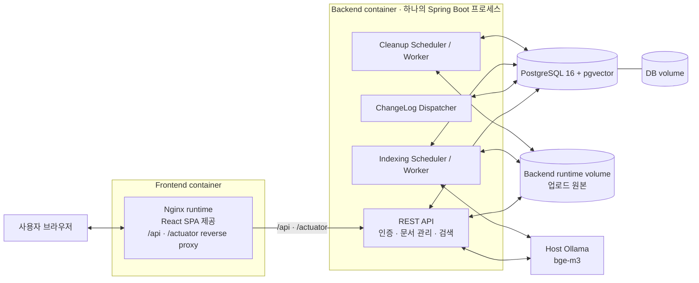
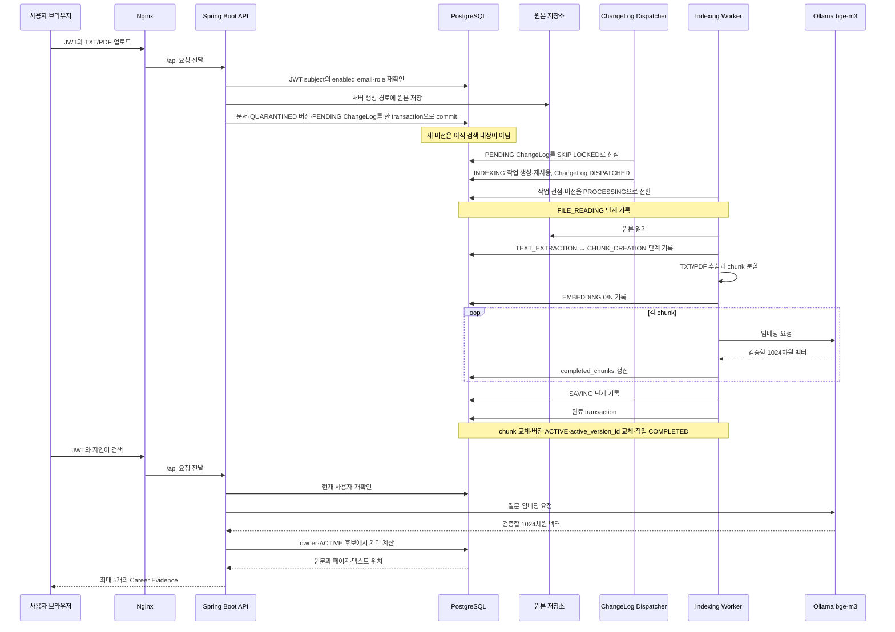
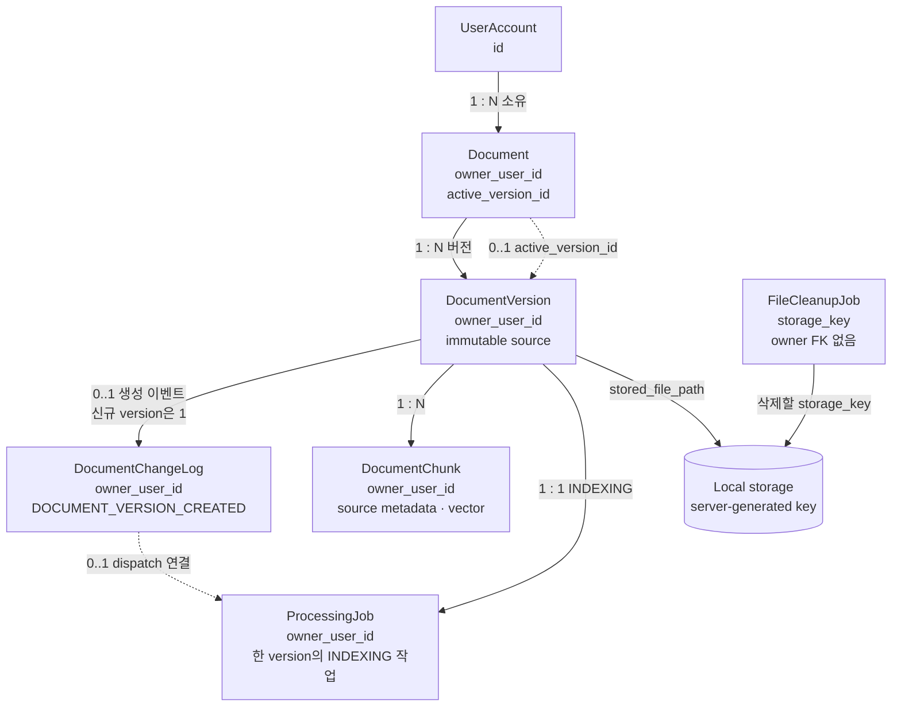
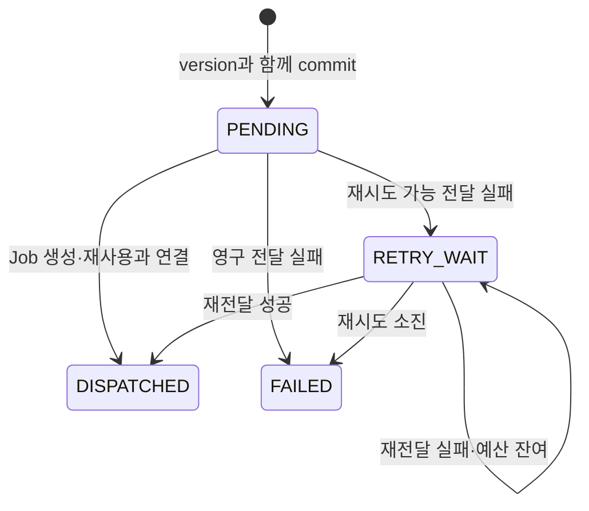
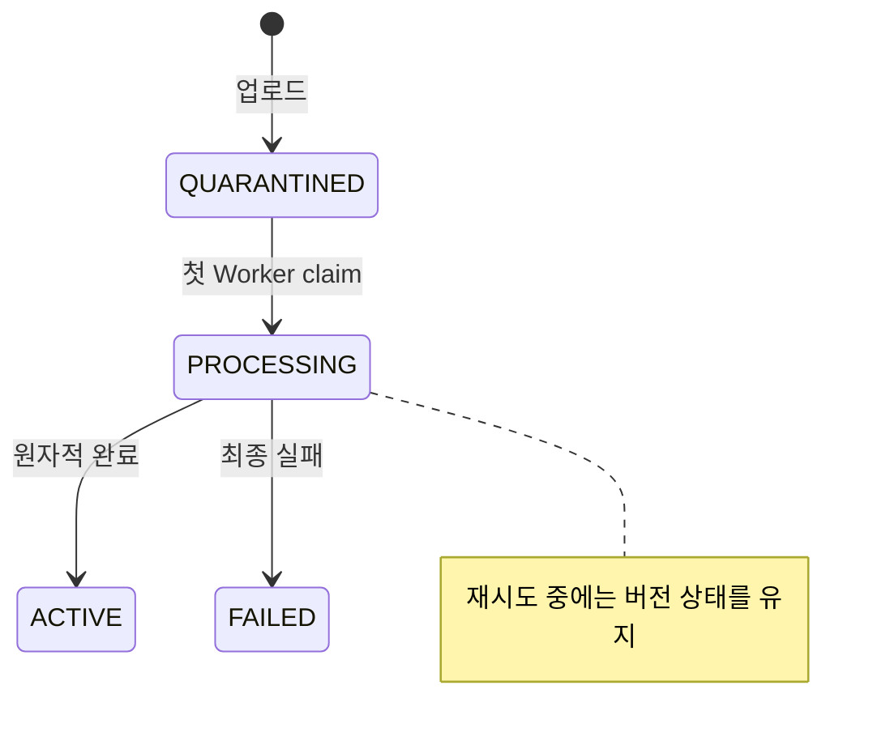
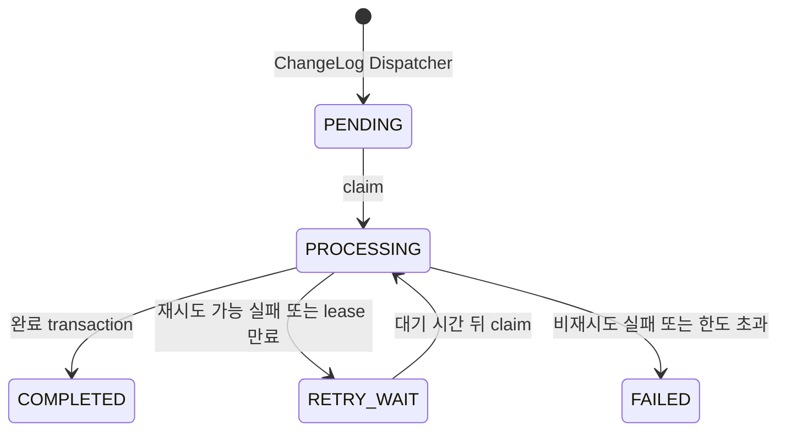

# PRIZM Architecture

> PRZ-004 GitHub 통합 merge commit:
> `1f9a5ad964778a2e72de9949a0fadae042008392`
>
> PRZ-004 전체 clean-clone 검증 source commit:
> `25d09e9eee9837cf4a63d7461699825ff22743e2`
>
> 최종 Windows·Linux 경로 교정·CI source commit:
> `aff3e87a9a912e44fcf217291a45328cf451cfc9`
>
> 문서 검토 기준일: `2026-08-14`
>
> PRZ-010 상태: `VERIFIED` — source
> `26c546b16eb9ea42d98460dd6e5aa0bf0752212a`, `main` 통합 merge
> `d616dac95b5d29c6f45babb51435d95d20f39fa8`
>
> PRZ-011 상태: `VERIFIED` — source
> `fbb3481626a3cba6f36f070845ffae502511569e`, `main` 통합 merge
> `e46d55f0c889bf570fa6fd796cb780b738ab75d7`
>
> PRZ-004 상태: `VERIFIED` — 독립 감사, PR #25 CI와 GitHub `main` 통합 완료
>
> PRZ-009 상태: `IMPLEMENTED_UNVERIFIED` — source
> `d52c6d01a3bef916e80a3c983a43c7b1fad1139b`은 `main`에 통합됐고 전체 PostgreSQL
> integration, browser와 최종 감사는 통과했으나 OpenSQL opt-in 검증은 `NOT_RUN`
>
> 범위: 현재 Spring Boot 애플리케이션과 React Career Vault Reference App

## 1. 문서 목적과 범위

이 문서는 현재 PRIZM의 구성 요소, 책임, 데이터 흐름, 상태 전이, 실패 복구와
코드 위치를 한 흐름으로 설명합니다. 지금 저장소는 재사용 가능한 독립 Engine
패키지가 아닙니다. 현재 구현은 하나의 Spring Boot 애플리케이션과 React 기반
Career Vault Reference App입니다.

제품 관점에서는 문서 업로드, 변경 로그 기반 색인 전달, 자동 임베딩, 안전한
`ACTIVE` 전환과 사용자별 원문 근거 검색을 연결한 자동화된 AI 문서 관리
플랫폼입니다. MCP 검색 인터페이스는 다음 구현 목표이며 현재 구성요소가 아닙니다.

장기 목표인 Career Intelligence Engine과 현재 구현을 구분합니다. 세부 기능의
구현·검증 상태는 [현재 구현 현황](project-status.md), 앞으로의 제품 개발 순서는
[개발 로드맵](roadmap.md), 설치와 실행 절차는 [로컬 Quickstart](quickstart.md)를
따릅니다. 이 문서는 실행 명령이나 날짜별 검증 결과를 반복하지 않습니다.

## 2. Architecture drivers와 핵심 불변식

PRIZM의 구조는 다음 조건을 지키기 위해 선택되었습니다.

- 사용자가 볼 수 있는 문서 목록뿐 아니라 검색 후보도 현재 사용자 소유 데이터로
  먼저 제한합니다.
- 업로드만 되었거나 처리에 실패한 문서 버전은 검색에 노출하지 않습니다.
- 새 버전 처리가 실패해도 이미 검색 중인 ACTIVE 버전은 그대로 유지합니다.
- Worker가 중단되면 만료된 작업을 다시 가져갈 수 있어야 합니다. 이전 Worker가
  늦게 돌아와 최신 결과를 덮어쓰지 못하도록 선점 세대도 확인합니다.
- 검색 결과에는 원문과 함께 TXT 텍스트 구간 또는 PDF 페이지 위치가 포함됩니다.
- PDF 추출과 Ollama 호출처럼 오래 걸리는 작업 중에는 DB 행 잠금을 계속 잡지
  않습니다.
- 파일을 경로 바꿔치기 위험 없이 지울 수 없는 환경에서는 삭제를 중단합니다.
- PostgreSQL에서 얻은 결과와 OpenSQL에서 얻은 결과를 서로의 검증 근거로
  바꾸어 쓰지 않습니다.

이 불변식의 구현 근거는 뒤 절의 source·migration·test 링크로 연결합니다.

## 3. System context

사용자는 브라우저의 Career Vault를 통해 PRIZM을 사용합니다. PRIZM은 원본 파일과
관계형·벡터 데이터를 각각 저장하고, 외부 Ollama에 임베딩 생성을 요청합니다.
Ollama는 벡터를 만들 뿐 사용자 권한이나 검색 가능 여부를 판단하지 않습니다.



로컬 애플리케이션 런타임의 DB는 PostgreSQL 16+pgvector입니다. OpenSQL은 별도
single-node 환경에서 SQL 호환성과 direct `5432` 애플리케이션 E2E를 검증했으며,
로컬 배포 그림에 PostgreSQL과 같은 런타임으로 합치지 않습니다.

## 4. 로컬 배포 아키텍처

Docker Compose는 `db`, `backend`, `frontend` 세 컨테이너와 두 named volume을
구성합니다. Ollama `bge-m3`는 Compose 서비스가 아니라 호스트에서 별도로
실행합니다.



Frontend 이미지는 Node build stage에서 React 정적 파일을 만든 뒤, 최종 Nginx
runtime stage에 결과만 복사합니다. 실제 요청은 Nginx가 `/api`와 `/actuator`를
backend로 전달합니다. ChangeLog Dispatcher와 Indexing·Cleanup Scheduler·Worker는
별도 컨테이너나 서비스가 아니라 API와 같은 Spring Boot 프로세스 안에서
실행됩니다. Dispatcher는 짧은 DB transaction만 수행하고, 검색 요청은 API 경로에서,
문서 색인은 Indexing Worker 경로에서 Ollama를 호출합니다.

근거:

- [Docker Compose](../compose.yaml)
- [Frontend 다단계 Dockerfile](../frontend/Dockerfile)
- [Nginx reverse proxy 설정](../frontend/nginx.conf)
- [React 진입점](../frontend/src/App.tsx)
- [Spring Boot 설정](../src/main/resources/application.yml)
- [ChangeLog Dispatcher](../src/main/java/com/prizm/changelog/worker/ChangeLogDispatchScheduler.java)
- [색인 Scheduler](../src/main/java/com/prizm/ingestion/worker/IndexingScheduler.java)
- [파일 정리 Scheduler](../src/main/java/com/prizm/cleanup/worker/FileCleanupScheduler.java)

## 5. 구성요소별 책임

| 구성요소 | 책임 | 직접 접근 대상 |
|---|---|---|
| React Career Vault | 로그인, 문서 목록·상세·업로드·관리, 검색 결과와 경력 키워드 맵 표시 | 같은 origin의 Nginx `/api` |
| Nginx | React SPA 정적 파일 제공, `/api`·`/actuator` reverse proxy | Spring Boot backend |
| Spring Boot API | JWT·DB 사용자 재검증, 문서 관리, 검색과 경력 키워드 요청 처리 | PostgreSQL, 파일 저장소, Ollama |
| ChangeLog Dispatcher | PENDING 변경 로그 선점, INDEXING 작업 생성·재사용과 DISPATCHED 확정 | PostgreSQL |
| Indexing Scheduler / Worker | 작업 선점, 추출·청킹·임베딩, ACTIVE 전환과 실패 복구 | PostgreSQL, 파일 저장소, Ollama |
| Cleanup Scheduler / Worker | 보상 삭제와 문서 삭제에서 생긴 파일 정리 작업의 재시도·복구 | PostgreSQL, 파일 저장소 |
| PostgreSQL+pgvector | 사용자·문서·버전·작업 상태 저장과 owner-scoped exact cosine 검색 | Spring Boot 프로세스 |
| Local storage | 서버가 만든 상대 경로에 업로드 원본 저장 | Spring Boot 프로세스 |
| Ollama `bge-m3` | 문서 조각과 검색 질문의 1024차원 임베딩 생성 | Spring Boot 프로세스 |

문서 목록과 열린 상세는 `PENDING`, `PROCESSING`, `RETRY_WAIT` 등 비종료 작업이
있는 동안 약 2초 간격으로 owner-scoped 문서 API를 다시 조회한다. 응답이
`COMPLETED`, `FAILED` 또는 다른 종료 상태가 되면 polling을 중지한다. 이 polling은
별도 push 채널이나 Worker 제어 경로가 아니라 기존 읽기 API의 화면 갱신 책임이다.

## 6. 문서 업로드부터 검색까지

정상 흐름은 다음과 같습니다. DB 작업을 짧게 나누기 때문에 파일 읽기, PDF 추출,
청킹과 Ollama 호출 중에는 완료 트랜잭션의 행 잠금을 유지하지 않습니다.



업로드 트랜잭션이 원본 저장 뒤 rollback되면 보상 삭제를 시도합니다. 이 삭제도
실패하면 정리 작업을 등록합니다. 색인 완료 시에는 생성한 모든 임베딩을 다시
검증하고, 기존 미완성 chunk 교체·저장 개수 확인·버전 ACTIVE 전환·문서의
`active_version_id` 교체·작업 완료를 하나의 transaction에서 확정합니다.

근거:

- [DB 사용자 재확인](../src/main/java/com/prizm/auth/security/DatabaseJwtAuthenticationConverter.java)
- [문서 업로드 서비스](../src/main/java/com/prizm/document/service/DocumentUploadService.java)
- [ChangeLog migration](../src/main/resources/db/migration/V14__create_document_change_logs.sql)
- [ChangeLog dispatch transaction](../src/main/java/com/prizm/changelog/service/ChangeLogDispatchTransaction.java)
- [텍스트 추출](../src/main/java/com/prizm/ingestion/service/DocumentTextExtractor.java)
- [작업 선점 서비스](../src/main/java/com/prizm/ingestion/service/ProcessingJobClaimService.java)
- [색인 처리](../src/main/java/com/prizm/ingestion/service/DocumentIndexingProcessor.java)
- [색인 완료](../src/main/java/com/prizm/ingestion/service/IndexingCompletionService.java)
- [검색 서비스](../src/main/java/com/prizm/search/service/SearchService.java)
- [PostgreSQL 통합 테스트](../src/integrationTest/java/com/prizm/infrastructure/PgVectorInfrastructureTest.java)

### 검색 결과의 생성과 해석

검색 질문과 문서 chunk를 같은 `bge-m3` 모델로 1024차원 embedding으로 바꿉니다.
저장과 검색 전에는 차원 수, 모든 값의 유한성, 0이 아닌 norm을 검사합니다.
PostgreSQL pgvector의 exact cosine distance 연산자 `<=>`로 후보를 정렬하며 ANN
인덱스는 사용하지 않습니다. 기본 `source-dedup-evidence-signals-v1` profile은 상위
20개 후보에서 같은 PDF page와 TXT overlap을 축약하고, dense score를 주 신호로
최대 5건을 반환합니다. GENERAL 검색은 기본 `0.50` floor를 유지하되 기존 결과가
비어 있고 정규화된 질의가 단일 2–4자 token이며 본문 exact token이 일치할 때만
`0.49 <= score < 0.50` 후보 한 건을 제한적으로 복구합니다. 부분 문자열은 인정하지
않고 원래 score와 distance를 반환합니다. 완료 배포·출시 검색은 이 복구 경로를
사용하지 않으며 기존 Claim Gate와 `0.50` floor를 유지합니다. 명시적
`legacy-dense-v1` override는 rollback 경로로 남아 있습니다.

`score = 1 - distance`는 정렬 결과를 보여 주는 유사도 값이지 정확도나 확률이
아닙니다. 단일 검색 API는 가장 가까운 한 건을 반환합니다. 기존 Career Evidence
API는 배열 형식을 유지하고, v2 API는 `EVIDENCE_FOUND`, `NO_RELEVANT_RESULTS`,
`NO_EVIDENCE`, `NO_SEARCHABLE_DOCUMENTS`와 결과 배열을 반환합니다. GENERAL 질의의
관련 결과 부재는 `NO_RELEVANT_RESULTS`, 완료 배포·출시 근거 검증 실패는
`NO_EVIDENCE`로 구분합니다. 최종 결과가 선택된 뒤 질문 핵심어의 포함 범위와
구현·개선·통합 같은 수행 문맥, 문제·행동·결과 신호를 함께 사용해 기존
`content`에서 연속된 원문 1–3문장을 `snippet`으로 선택합니다. ranking과 score는
다시 계산하지 않습니다. 응답은 전체 `content`도 유지합니다. frontend는 핵심 근거,
출처, 버전·관련도 순서로 표시하고 전체 원문을 펼치거나 접을 수 있습니다. TXT chunk는 `TEXT_CHUNK`와
텍스트 구간 번호를, PDF chunk는 `PAGE`와 페이지 번호를 원문 위치로 반환합니다.
PostgreSQL FTS·BGE-M3 Sparse·BGE reranker 실험은 평가 전용이며 Production 경로에
포함되지 않습니다.

추가 근거:

- [vector schema](../src/main/resources/db/migration/V2__create_document_chunks.sql)
- [출처 metadata migration](../src/main/resources/db/migration/V10__add_chunk_source.sql)
- [PDF 페이지 출처 migration](../src/main/resources/db/migration/V11__support_pdf_page_sources.sql)
- [임베딩 검증](../src/main/java/com/prizm/embedding/service/EmbeddingValidator.java)
- [벡터 검색 SQL](../src/main/java/com/prizm/search/repository/VectorSearchRepository.java)
- [검색 서비스 테스트](../src/test/java/com/prizm/search/service/SearchServiceTest.java)
- [Career Evidence API 테스트](../src/test/java/com/prizm/search/controller/CareerEvidenceSearchControllerTest.java)
- [opt-in 검색 profile](../src/main/java/com/prizm/search/profile/CompositeSearchProfile.java)
- [Career Evidence v2 API](../src/main/java/com/prizm/search/controller/CareerEvidenceSearchV2Controller.java)

### 경력 키워드 맵의 생성과 해석

PRZ-009 구현은 별도 keyword table이나 생성형 모델 없이 기존 active chunk를
요청 시 읽는다. SQL은 현재 사용자의 document·version·chunk owner를 모두 제한하고,
`active_version_id`가 가리키는 `ACTIVE` 이력서와 포트폴리오만 선택한다. TXT chunk는
overlap을 한 번만 남겨 전체 원문으로 조립하고 PDF chunk는 페이지별로 유지한다.

조립한 원문에 실제 등장한 token과 명시적으로 지원하는 복합 기술어만 정규화해
빈도와 문서 수를 계산한다. 등록된 한영 별칭과 Java 버전 표기는 canonical keyword에
합치되 source의 실제 표기는 variants와 matched terms로 보존한다. 각 keyword에는
언어·프레임워크·DB·인프라 등 고정 category가 붙고 React 화면은 언급 수·문서 수·
`log1p(frequency) * (1 + log1p(documentCount))` 균형 점수로 같은 목록을 재정렬한다.

이 값은 원문 탐색용 인덱스이며 CareerFact, 숙련도나 경력 진위 판정이 아니다. 화면에서
키워드를 선택하면 같은 active source의 발췌문을 document/version별로 묶어 대표 근거를
먼저 보여준다. owner-scoped original endpoint로 UTF-8 TXT의 첫 일치 표기를 강조하거나
PDF built-in viewer를 page/search fragment 위치로 연다.

현재 소스 구현과 단위·controller test, frontend lint·build, 전체 PostgreSQL integration,
synthetic browser 흐름과 최종 diff 감사는 완료됐다. OpenSQL opt-in integration은 전용
검증 target을 활성화하지 않아 `NOT_RUN`이므로 이 절은 계속 `IMPLEMENTED_UNVERIFIED`
구조를 설명하며 OpenSQL 검증 근거로 사용하지 않는다.

근거:

- [키워드 source SQL](../src/main/java/com/prizm/careerkeyword/repository/CareerKeywordRepository.java)
- [원문 overlap 조립](../src/main/java/com/prizm/careerkeyword/service/KeywordSourceAssembler.java)
- [키워드 추출](../src/main/java/com/prizm/careerkeyword/service/CareerKeywordExtractor.java)
- [키워드 API service](../src/main/java/com/prizm/careerkeyword/service/CareerKeywordService.java)
- [React 키워드 화면](../frontend/src/App.tsx)
- [PRZ-009 검증 기록](../specs/PRZ-009-career-keyword-map/evidence.md)

## 7. 핵심 데이터 관계

`owner_user_id`는 문서에서 버전·chunk·처리 작업까지 전달됩니다. 복합 외래 키는
상위와 하위 row의 owner가 달라지는 것을 막습니다. `active_version_id`는 한
문서가 여러 immutable version 중 검색에 사용할 한 버전을 가리킵니다.



`DocumentChangeLog`는 `(document_version_id, event_type)`와 `event_key`가 unique이고,
연결된 ProcessingJob과 owner·version이 일치하도록 복합 외래 키로 보호됩니다.
`ProcessingJob`은 `(document_version_id, job_type)`가 unique이고 현재 job type은
`INDEXING` 하나이므로 버전마다 최대 한 건입니다. `FileCleanupJob`은 사용자나
버전에 대한 외래 키를 두지 않고 서버가 생성한 `storage_key`만 보관합니다.
브라우저가 임의 경로를 등록하는 API는 없으며, owner-scoped 문서 작업이나 업로드
rollback 보상 경로가 정리 작업을 만듭니다.

근거:

- [사용자 entity](../src/main/java/com/prizm/user/entity/UserAccount.java)
- [문서 entity](../src/main/java/com/prizm/document/entity/Document.java)
- [문서 버전 entity](../src/main/java/com/prizm/document/entity/DocumentVersion.java)
- [ChangeLog entity](../src/main/java/com/prizm/changelog/entity/DocumentChangeLog.java)
- [처리 작업 entity](../src/main/java/com/prizm/ingestion/entity/ProcessingJob.java)
- [문서·버전 migration](../src/main/resources/db/migration/V3__create_documents_and_document_versions.sql)
- [처리 작업 migration](../src/main/resources/db/migration/V4__create_processing_jobs.sql)
- [소유권 migration](../src/main/resources/db/migration/V8__add_document_ownership.sql)
- [ChangeLog migration](../src/main/resources/db/migration/V14__create_document_change_logs.sql)
- [파일 정리 migration](../src/main/resources/db/migration/V12__add_file_cleanup_jobs.sql)

## 8. 상태 전이

### DocumentChangeLog

업로드 transaction이 신규 `DocumentVersion`과 `PENDING` ChangeLog를 함께
commit합니다. Dispatcher가 ProcessingJob 생성·재사용과 연결을 같은 짧은
transaction에서 확정하면 `DISPATCHED`가 됩니다. 전달 실패는 별도 failure recorder가
1분·5분·15분 backoff의 `RETRY_WAIT` 또는 최종 `FAILED`로 기록합니다.



`DISPATCHED`는 색인 완료가 아니라 기존 Indexing Worker에 작업을 전달했다는 뜻입니다.
그 뒤의 색인 재시도·실패는 ProcessingJob과 DocumentVersion에 기록하며 ChangeLog를
되돌리지 않습니다. 전달이 최종 실패하면 아직 `QUARANTINED`인 새 version도
`FAILED`로 전환하지만 기존 `active_version_id`는 유지합니다.

근거:

- [ChangeLog 상태](../src/main/java/com/prizm/changelog/entity/ChangeLogDispatchStatus.java)
- [ChangeLog dispatch](../src/main/java/com/prizm/changelog/service/ChangeLogDispatchTransaction.java)
- [ChangeLog 실패 기록](../src/main/java/com/prizm/changelog/service/ChangeLogDispatchFailureRecorder.java)

### DocumentVersion

업로드 직후 버전은 `QUARANTINED`이며 검색할 수 없습니다. 첫 claim에서
`PROCESSING`으로 바뀝니다. 재시도할 때 버전 상태는 `PROCESSING`을 유지하고
처리 작업만 `RETRY_WAIT`와 `PROCESSING` 사이를 이동합니다.



### ProcessingJob



수동 재시도나 terminal 상태에서 되돌아가는 경로는 현재 구현에 없습니다.

현재 claim의 실제 처리 단계는 `FILE_READING → TEXT_EXTRACTION → CHUNK_CREATION →
EMBEDDING → SAVING → COMPLETED`로 별도 저장한다. 단계와 청크 진행 갱신은
`processing_job_id`, `owner_user_id`, `PROCESSING`, `claim_version`을 모두 만족하는
Worker만 수행할 수 있다. 전체 청크 수가 확정되기 전에는 청크 수와 퍼센트를
제공하지 않으며, 확정 뒤에는 `completed_chunks / total_chunks`만 사용한다.
임베딩 중 DB 저장은 이 실제 비율의 정수 퍼센트가 바뀌거나 최종 청크가
완료될 때만 checkpoint로 수행하고, 단계 변경과 완료·실패·재시도 전이는
기존 짧은 transaction 계약을 유지한다.
재시도·실패 시 내부 예외는 서버 로그와 제한된 내부 필드에 남기고 API에는
Ollama 연결, model 미설치, GPU/model 실행, 일반 처리 실패의 allowlist 코드만
노출한다.

근거:

- [문서 버전 상태 enum](../src/main/java/com/prizm/document/entity/DocumentVersionStatus.java)
- [문서 버전 전이](../src/main/java/com/prizm/document/entity/DocumentVersion.java)
- [처리 작업 상태 enum](../src/main/java/com/prizm/ingestion/entity/ProcessingJobStatus.java)
- [처리 작업 전이](../src/main/java/com/prizm/ingestion/entity/ProcessingJob.java)
- [자동 처리 전환 migration](../src/main/resources/db/migration/V7__transition_to_automatic_document_processing.sql)
- [진행 상태 migration](../src/main/resources/db/migration/V15__add_processing_job_progress.sql)
- [진행 상태 갱신](../src/main/java/com/prizm/ingestion/service/ProcessingJobProgressService.java)
- [상태 전이 단위 테스트](../src/test/java/com/prizm/document/entity/DocumentVersionStateTest.java)

## 9. 사용자 소유권과 신뢰 경계

- 브라우저에서 받은 사용자 ID나 문서 ID만 믿지 않습니다. API는 인증된 JWT의
  subject를 현재 사용자 ID로 사용합니다.
- JWT 서명이 맞아도 사용자 상태가 확정된 것은 아닙니다. 매 요청마다 DB에서
  계정이 enabled인지 확인하고 JWT의 email·role이 현재 값과 같은지 비교합니다.
- 개인 문서와 검색 API는 `USER` 역할에만 열려 있습니다. `SYSTEM_ADMIN`은 개인
  USER 데이터를 대신 조회하는 우회 권한이 없습니다.
- document·version·ChangeLog·chunk·processing job에는 `owner_user_id`가 전달되고, service,
  repository SQL과 복합 외래 키가 같은 owner 관계를 확인합니다.
- 검색 SQL은 cosine distance를 계산하기 전에 document·version·chunk owner와
  `documents.active_version_id`, version의 `ACTIVE` 상태를 모두 제한합니다.
- Ollama는 전달된 텍스트의 embedding만 생성합니다. 사용자 권한은 Spring Boot와
  DB가 판단합니다.
- 파일 저장소의 상대 경로는 소유권의 원본이 아닙니다. 문서 작업의 권한은 DB
  owner 관계에서 결정합니다.

새 설치에서는 `POST /api/auth/signup`으로 활성 일반 `USER`를 만들 수 있습니다.
요청은 이메일과 비밀번호만 받고 BCrypt hash를 저장하며 성공 응답은 JWT나 세션을
만들지 않습니다. 사용자는 이어서 기존 로그인 API를 사용합니다. 자동 검증에는
기본적으로 꺼져 있고 명시적으로 한 번만 켜는 demo `USER` bootstrap을 계속
사용합니다. demo 계정도 일반 로그인, JWT·DB 사용자 재확인과 owner-scoped
문서·검색 경로를 그대로 사용합니다. 이메일 인증·계정 복구, 저장 데이터 암호화,
감사 로그, 기관용 workspace와 외부 인증은 현재 구조에 포함하지 않습니다.

근거:

- [보안 설정](../src/main/java/com/prizm/auth/config/SecurityConfiguration.java)
- [DB 사용자 재확인](../src/main/java/com/prizm/auth/security/DatabaseJwtAuthenticationConverter.java)
- [현재 사용자 추출](../src/main/java/com/prizm/auth/security/CurrentUserProvider.java)
- [문서 조회 서비스](../src/main/java/com/prizm/document/service/DocumentQueryService.java)
- [벡터 검색 SQL](../src/main/java/com/prizm/search/repository/VectorSearchRepository.java)
- [demo USER bootstrap](../src/main/java/com/prizm/auth/bootstrap/DemoUserBootstrapRunner.java)
- [bootstrap 충돌 차단](../src/main/java/com/prizm/auth/bootstrap/BootstrapAccountConflictGuard.java)
- [BCrypt 입력 경계](../src/main/java/com/prizm/auth/bootstrap/BcryptPasswordPolicy.java)
- [demo 환경 생성](../scripts/prepare-clean-clone-demo-env.mjs)
- [clean-clone smoke](../scripts/verify-clean-clone-demo.mjs)
- [인증·격리 통합 테스트](../src/integrationTest/java/com/prizm/infrastructure/AuthenticationIntegrationTest.java)
- [migration 통합 테스트](../src/integrationTest/java/com/prizm/infrastructure/CareerPlatformMigrationTest.java)
- [PRZ-004 Evidence](../specs/PRZ-004-clean-clone-demo/evidence.md)

## 10. Worker 실패와 복구

1. Worker는 `FOR UPDATE SKIP LOCKED`를 사용해 실행 가능한 작업 한 건을 짧은
   transaction에서 선점하고 lease 만료 시각과 `claim_version`을 갱신합니다.
2. 원본 읽기, PDF 추출, 청킹과 Ollama 호출은 이 선점 transaction 밖에서
   실행하므로 DB lock을 오래 유지하지 않습니다.
3. 별도 heartbeat가 lease의 3분의 1 간격으로 처리 권한을 갱신하고, chunk 처리
   중에도 설정된 간격마다 lease를 확인합니다.
4. Worker가 중단되어 lease가 만료되면 Recovery Scheduler가 작업을
   `RETRY_WAIT`로 돌리거나 재시도 한도를 넘은 작업을 실패 처리합니다.
5. `claim_version`이 바뀌면 이전 Worker의 claim은 오래된 선점(stale claim)이
   됩니다. 완료와 실패 반영은 현재 값이 같은 Worker에게만 허용됩니다. 이 보호를
   fencing이라고 합니다.
6. 재시도 가능한 실패는 1분·5분·15분 backoff로 최대 세 번 예약합니다.
7. 재시도할 수 없거나 한도를 넘으면 작업과 새 문서 버전을 `FAILED`로 바꿉니다.
8. 성공할 때만 chunk, 버전 상태, 문서의 active pointer와 job을 한 transaction에서
   확정합니다. 따라서 새 버전 실패는 기존 ACTIVE 버전을 바꾸지 않습니다.

근거:

- [작업 선점 SQL](../src/main/java/com/prizm/ingestion/repository/ProcessingJobClaimRepository.java)
- [lease heartbeat](../src/main/java/com/prizm/ingestion/service/WorkerLeaseHeartbeat.java)
- [실패 처리](../src/main/java/com/prizm/ingestion/service/IndexingFailureService.java)
- [재시도 정책](../src/main/java/com/prizm/ingestion/service/IndexingRetryPolicy.java)
- [만료 작업 복구](../src/main/java/com/prizm/ingestion/service/ProcessingJobRecoveryService.java)
- [lease migration](../src/main/resources/db/migration/V5__add_processing_job_lease.sql)
- [heartbeat 단위 테스트](../src/test/java/com/prizm/ingestion/service/WorkerLeaseHeartbeatTest.java)
- [Worker 통합 테스트](../src/integrationTest/java/com/prizm/infrastructure/PgVectorInfrastructureTest.java)

## 11. 파일 저장과 안전한 삭제

업로드와 삭제는 DB transaction만으로 원자성을 보장할 수 없는 파일시스템 작업을
포함합니다. PRIZM은 다음 두 경로로 차이를 복구합니다.

- **업로드 저장:** 서버가 `documents/{documentId}/{versionId}` 구조를 만들고,
  임시 파일을 먼저 쓴 뒤 최종 원본 위치로 이동합니다. DB에는 storage root 기준
  상대 경로만 저장합니다.
- **rollback 보상:** 원본 저장 뒤 DB transaction이 rollback되면 즉시 보상
  삭제를 시도합니다. 실패하면 `FileCleanupJob`을 등록합니다.
- **문서 삭제:** owner-scoped 문서가 terminal 상태일 때 같은 DB transaction에서
  각 버전의 정리 작업을 먼저 등록하고 문서 데이터를 삭제합니다.
- **Cleanup Worker:** 정리 작업을 짧게 선점하고 DB transaction 밖에서 파일을
  지웁니다. 파일 삭제 중에는 heartbeat를 보내지 않으며, 실패나 5분 lease 만료는
  색인과 같은 backoff 정책으로 복구합니다.

실제 삭제는 저장 root와 파일 이름을 문자열로 다시 조합해 바로 지우지 않습니다.
열어 둔 디렉터리를 기준으로 하위 항목을 탐색하는 descriptor-relative deletion과
`NOFOLLOW_LINKS`를 사용해 심볼릭 링크와 검사-사용 사이 경로 변경(TOCTOU) 위험을
줄입니다. 파일시스템이 필요한 `SecureDirectoryStream`을 제공하지 않으면 안전하지
않은 path 기반 fallback을 사용하지 않고 fail-closed로 중단합니다.

Windows에서는 `SecureDirectoryStream` 성공 경로를 제공하지 않아 fail-closed
동작만 확인했습니다. 성공 경로는 Linux에서 별도 재검증했으며, 두 결과를 같은
플랫폼 결과로 합치지 않습니다.

근거:

- [로컬 파일 저장소](../src/main/java/com/prizm/infrastructure/storage/LocalFileStorage.java)
- [문서 삭제 서비스](../src/main/java/com/prizm/document/service/DocumentManagementService.java)
- [cleanup 선점 SQL](../src/main/java/com/prizm/cleanup/repository/FileCleanupJobRepository.java)
- [cleanup 처리](../src/main/java/com/prizm/cleanup/service/FileCleanupCoordinator.java)
- [cleanup 만료 복구](../src/main/java/com/prizm/cleanup/service/FileCleanupJobRecoveryService.java)
- [cleanup worker migration](../src/main/resources/db/migration/V13__add_file_cleanup_worker_fields.sql)
- [파일 저장소 테스트](../src/test/java/com/prizm/infrastructure/storage/LocalFileStorageTest.java)
- [PRZ-003 플랫폼 검증 기록](../specs/PRZ-003-opensql-single-node-gate/evidence.md#Windows-UTF-8과-플랫폼-재검증)

## 12. PostgreSQL과 OpenSQL 검증 경계

### PostgreSQL 16+pgvector

- 목적: 로컬 실행, 자동 통합 테스트와 clean-clone 구성
- 검증한 범위: 애플리케이션 회귀, migration, 벡터 검색, ownership, Worker·파일
  정리와 두 독립 환경의 demo `USER` 로그인 → TXT/PDF 업로드 → `ACTIVE` →
  검색·브라우저 흐름
- 검증하지 않은 범위: OpenSQL 호환성

### OpenSQL single-node

- 목적: SQL 호환성 Gate와 실제 애플리케이션 환경 검증
- 검증한 범위: Flyway V1–V14, `vector(1024)`, owner·`ACTIVE` 검색 조건,
  processing·cleanup job SQL, V14 ChangeLog 제약·`SKIP LOCKED`·멱등 dispatch,
  Spring Boot·Ollama direct `5432` V1→V2 E2E와 실패 시 V1 보존
- 추가 검증 범위: V15 OpenSQL direct 기준선과 OpenProxy 단일 Primary
  SQL routing·`prizm_app` 인증·focused runtime E2E
- 명시적 비범위: OpenProxy 이중화·VIP와 다중 노드 service continuity
- 현재 미구현: 영구 journal

OpenSQL single-node SQL Gate는 PRZ-003 Evidence 기준 `PASS`입니다. PRZ-005에서는
직접 `5432` 경로의 OpenSQL·Ollama 전체 사용자 흐름을 별도로 검증했습니다.
현재 상태는 다음과 같습니다.

- OpenSQL+Ollama 직접 `5432` API·브라우저·두 사용자 격리: `VERIFIED`
- OpenProxy TCP 연결: `VERIFIED`
- OpenProxy 단일 Primary SQL routing과 `prizm_app` 인증: `VERIFIED`
- Flyway direct `:5432` / runtime OpenProxy `:6432` focused E2E: `VERIFIED`
- OpenProxy 재시작 후 새 SQL 연결: `VERIFIED`
- 지속 application process의 무재시작 회복: 명시적 비범위
- 대회 OpenSQL 다중 노드 구성: `REJECTED` — 공식 Single-only 설치 범위

PRZ-004에서는 PostgreSQL·pgvector와 호스트 Ollama를 사용한 두 독립 clean clone을
검증하고 PR #25로 `main`에 통합했습니다. 두 번째 browser의 업로드 전 빈 목록
직접 관찰은 여전히 `NOT_RUN`입니다.

PRZ-005에서는 실제 OpenSQL single-node에 Spring Boot와 Ollama `bge-m3`를 연결해
로그인, 합성 TXT/PDF 업로드, 임베딩 저장, `ACTIVE` 전환, 원문 검색과 브라우저
흐름을 확인했습니다. 두 사용자 문서·검색 격리와 전용 DB의 OpenSQL opt-in
integration test도 통과했으며 PR #26으로 `main`에 통합했습니다.

PRZ-010에서는 같은 direct `5432` 경계에서 V14 ChangeLog schema·제약,
`FOR UPDATE SKIP LOCKED`, ProcessingJob 멱등 생성과 owner isolation을 확인했습니다.
실제 Ollama `bge-m3`를 사용한 V1 ACTIVE→V2 ChangeLog→ProcessingJob→V2 ACTIVE와
dispatch·indexing 실패 시 V1 보존도 별도 E2E로 통과했습니다. 이 결과는 OpenProxy,
OpenHA나 V15 OpenSQL 적용의 근거가 아닙니다.

PostgreSQL 테스트 통과는 OpenSQL 결과가 아니며, OpenSQL SQL Gate 통과도 전체
사용자 흐름이나 고가용성 근거가 아닙니다.

근거:

- [PostgreSQL Docker Compose](../compose.yaml)
- [OpenSQL 기술 Gate](opensql-gate.md)
- [OpenSQL opt-in 테스트](../src/integrationTest/java/com/prizm/infrastructure/OpenSqlInfrastructureTest.java)
- [PRZ-003 Evidence](../specs/PRZ-003-opensql-single-node-gate/evidence.md)
- [PRZ-005 실제 OpenSQL 통합 작업 보고서](../specs/PRZ-005-opensql-ollama-e2e/implementation-report.md)

## 13. 패키지·코드 지도

```text
src/main/java/com/prizm/
├─ auth            로그인, JWT와 DB 사용자 재확인
├─ user            사용자 계정과 역할
├─ document        문서·immutable version 등록과 관리
├─ changelog       문서 버전 생성 사실과 INDEXING 작업 전달
├─ embedding       Ollama 연동과 embedding 검증
├─ ingestion       추출·청킹·색인 Worker와 복구
├─ search          owner-scoped 원문 근거 검색
├─ cleanup         파일 정리 작업·Worker와 복구
├─ infrastructure  로컬 파일 저장소 등 외부 인프라 구현
└─ common          공통 API 응답
```

```text
frontend/src/
├─ api             인증·문서·검색 HTTP 호출
├─ auth            브라우저 token 저장
├─ assets          화면용 정적 asset
├─ App.tsx         Career Vault 화면과 client-side navigation
├─ main.tsx        React 진입점
└─ styles.css      화면 스타일
```

전체 파일 목록보다 책임 단위로 먼저 찾고, 각 절의 근거 링크에서 실제 구현으로
내려가는 것을 권장합니다.

## 14. 현재 미구현·명시적 비범위

다음 항목은 계획된 목표 또는 이후 후보이며 현재 구현으로 보지 않습니다.

- 재사용 가능한 독립 Engine artifact
- 구조화된 CareerFact 후보·확인·거절
- 검증된 CareerFact 기반 portfolio 생성
- 기존 Career Evidence 검색을 재사용하는 읽기 전용 MCP 검색 API
- ChangeLog 다중 consumer별 delivery/checkpoint
- 기관용 workspace와 멤버십
- 여러 vector DB·storage adapter

다중 OpenSQL DB node, DB 장애전환, OpenProxy 이중화·VIP와 서비스 연속성 보장은
명시적 비범위이며 이후 제품 후보로 두지 않습니다.

상세 상태와 가장 가까운 제품 작업은 [현재 구현 현황](project-status.md)과
[개발 로드맵](roadmap.md)을 따릅니다.

## 15. 관련 문서

- [현재 구현 현황](project-status.md)
- [로컬 Quickstart](quickstart.md)
- [개발 로드맵](roadmap.md)
- [대표 문제 해결 사례](showcase/problem-solving-case-studies.md)
- [OpenSQL 기술 Gate](opensql-gate.md)
- [Spec Registry](../specs/README.md)
- [PRZ-000 플랫폼 기준선 Evidence](../specs/PRZ-000-platform-baseline/evidence.md)
- [PRZ-003 OpenSQL single-node Evidence](../specs/PRZ-003-opensql-single-node-gate/evidence.md)
- [PRZ-004 clean-clone Evidence](../specs/PRZ-004-clean-clone-demo/evidence.md)
- [PRZ-010 변경 로그 동기화 Evidence](../specs/PRZ-010-change-log-sync/evidence.md)
