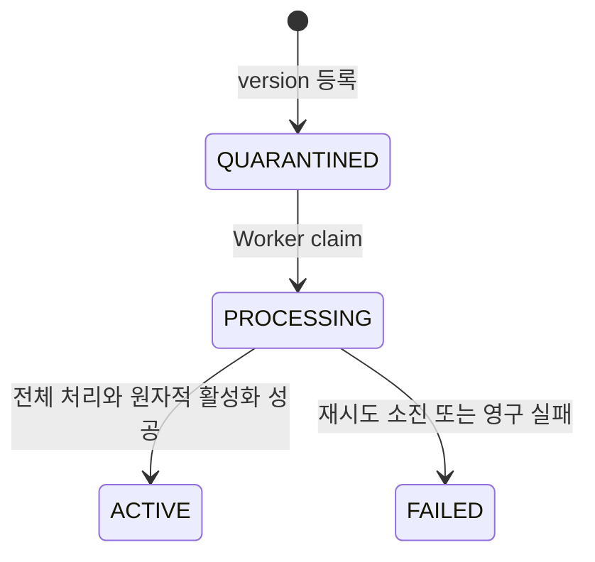

# PRZ-000 — 플랫폼 기반과 Career Vault 기준선

- **항목:** Spec ID
  - 값: `PRZ-000`
- **항목:** Status
  - 값: `AS_BUILT_BASELINE`
- **항목:** 성격
  - 값: spec registry 도입 전 구현을 사후 기록한 관찰 가능한 기준선
- **항목:** Source commit
  - 값: `e995a5fdecc63afbd383157dd5a8b6d74b607e3f`
- **항목:** Baseline date
  - 값: 2026-07-23
- **항목:** Issue / PR
  - 값: `N/A` — 이 기준선을 위해 과거 Issue·PR을 새로 만들지 않음
- **항목:** Evidence
  - 값: [evidence.md](evidence.md)

## 목적

현재 `main`에서 실제로 동작하는 플랫폼 기반과 Career Vault Reference App의 계약을 고정한다. 이 문서는 기능을 소급 승인하거나 과거 계획으로 꾸미지 않으며, 후속 spec이 보존해야 할 현재 동작을 설명한다.

## 기능 구성

- Spring Boot API가 JWT 인증, 사용자 DB 재확인과 owner 경계를 담당한다.
- 문서 도메인은 원본, immutable version, processing job과 chunk를 분리한다.
- Worker는 추출·청킹·embedding·활성화를 처리하고 cleanup Worker는 고아 원본을
  안전하게 정리한다.
- React Career Vault는 문서 관리, TXT/PDF 원본 열람과 Career Evidence 검색을
  제공한다.

## 동작 흐름

### 사용자 이야기 1 — 문서 등록과 근거 검색 (`P1`)

1. 활성 `USER`가 로그인한다.
2. UTF-8 TXT 또는 text-layer PDF를 문서 유형과 함께 등록한다.
3. 원본, immutable version과 비동기 processing job이 저장된다.
4. Worker가 텍스트 추출·청킹·1024차원 embedding을 처리한다.
5. 전체 처리가 성공하면 새 version과 `active_version_id`가 원자적으로 활성화된다.
6. 사용자는 자신의 ACTIVE version에서 단일 결과 또는 최대 5개 Career Evidence를 원문·출처와 함께 조회한다.

### 사용자 이야기 2 — 문서 관리와 version (`P1`)

1. 사용자는 자신의 문서를 유형·제목·최신 처리 상태로 필터링한다.
2. 상세와 version 이력을 확인하고 제목·문서 유형을 수정한다.
3. 같은 문서에 다음 TXT/PDF immutable version을 등록한다.
4. 새 version이 성공하기 전에는 기존 ACTIVE version이 검색 가능 상태를 유지한다.
5. terminal 문서는 명시적 확인 뒤 삭제하며, 모든 원본은 cleanup job으로 비동기 정리한다.
6. PDF version은 owner-scoped thumbnail과 원본 viewer로 연다.

### 사용자 이야기 3 — 비동기 장애 복구 (`P1`)

1. indexing job과 cleanup job은 짧은 `FOR UPDATE SKIP LOCKED` transaction에서 선점된다.
2. indexing은 lease·heartbeat·retry/backoff·recovery와 `claim_version` fencing으로 stale Worker의 갱신·완료를 차단한다.
3. cleanup은 heartbeat 없이 lease·retry/backoff·recovery와 `claim_version` fencing으로 stale Worker의 완료·실패 갱신을 차단한다.
4. 파일·PDF·Ollama 같은 외부 처리는 완료 transaction 밖에서 수행한다.
5. 처리 실패는 부분 결과를 활성화하지 않고 기존 ACTIVE version을 보존한다.

문서 version의 핵심 상태 전이는 다음과 같다.

다음 version이 처리되는 동안에는 이전 `ACTIVE` version과
`active_version_id`를 그대로 유지한다.

## 기능 요구사항

### `FR-001` — 요구사항

JWT를 검증한 뒤 요청마다 사용자의 활성 상태·email·role을 DB에서 다시 확인해야 한다.

### `FR-002` — 요구사항

document, version, processing job과 chunk의 owner가 API·repository·FK·검색 후보에서 일치해야 한다.

### `FR-003` — 요구사항

UTF-8 TXT와 비암호화 text-layer PDF만 기본 10MiB 안에서 등록하고, PDF는 기본 300페이지·추출 문자 2,000,000자 한도를 적용하며 원본 hash와 상대 storage key를 보존해야 한다.

### `FR-004` — 요구사항

document와 immutable version을 분리하고 완성된 version만 `active_version_id`로 원자적으로 활성화해야 한다.

### `FR-005` — 요구사항

indexing은 기본 10분 lease·1/3 주기 heartbeat·최대 3회 retry·1/5/15분 backoff·recovery·claim fencing을 유지해야 한다.

### `FR-006` — 요구사항

저장·검색 vector는 1024차원, finite 값과 0보다 큰 L2 norm을 만족해야 한다.

### `FR-007` — 요구사항

최대 500자 query를 pgvector exact cosine `<=>`로 검색하고 owner의 ACTIVE version만 대상으로 해야 한다. 단일 검색은 최대 1개·없으면 404 `SEARCH_NO_RESULT`, Career Evidence는 최대 5개·없으면 HTTP 200 빈 배열을 반환하며 `score = 1 - distance` 계약을 유지해야 한다.

### `FR-008` — 요구사항

문서 목록·필터·상세·metadata 수정·terminal 삭제·다음 version 등록·PDF thumbnail/원본 API를 owner 범위에서 제공해야 한다.

### `FR-009` — 요구사항

orphan-file cleanup은 기본 5분 lease·fencing·retry/recovery를 사용하고 heartbeat 없이 동작해야 한다. 지원 filesystem에서는 descriptor-relative로 삭제하며, 미지원 환경에서는 fail-closed해야 한다.

### `FR-010` — 요구사항

V1–V13 Flyway migration을 순서대로 적용하고 이미 적용된 migration은 수정하지 않아야 한다.

### `FR-011` — 요구사항

Career Vault는 로그인, 문서 관리, TXT/PDF 업로드, version/PDF 열람과 최대 5개 근거 검색 흐름을 제공해야 한다.

### `FR-012` — 요구사항

등록 문서에서 근거를 찾지 못하면 찾지 못했다고 표현하고 score를 확률·정확도·합격 가능성으로 표시하지 않아야 한다.

### `FR-013` — 요구사항

12개 `DocumentType` 계약을 유지하고 생략 시 `OTHER`를 저장하며 owner-scoped 단일 유형 필터를 제공해야 한다.

### `FR-014` — 요구사항

TXT chunk는 `TEXT_CHUNK`, PDF chunk는 `PAGE` 출처를 사용하고 1부터 시작하는 `sourceIndex`와 대응하는 `sourceLabel`을 반환해야 한다.

## 보존해야 할 비기능 경계

- DB transaction을 긴 파일·PDF·모델 호출 동안 열어 두지 않는다.
- 실패하거나 아직 완료되지 않은 version을 기본 검색 후보에 포함하지 않는다.
- 저장 경로, JWT, 원문 전체와 내부 Worker 오류를 API 오류로 노출하지 않는다.
- 실제 커리어 문서, local 평가 결과, 비밀정보와 모델 cache를 Git에 commit하지 않는다.
- 문서나 계획만으로 OpenSQL·OpenProxy·OpenHA 호환성을 주장하지 않는다.

## 현재 범위가 아닌 기능

다음은 이 baseline의 구현 기능이 아니다.

- CareerFact 후보·확인·거절과 `INSUFFICIENT_EVIDENCE`
- 검증된 CareerFact 기반 JSON·Markdown portfolio와 source manifest
- `/api/v1` OpenAPI, MCP, webhook/outbox와 재사용 가능한 독립 Engine artifact
- signup/demo `USER`, 처리 job 직접 조회·수동 재시도와 idempotency key
- OCR, image-only PDF, DOCX, PPTX와 여러 vector DB·embedding·storage adapter
- OpenSQL·OpenProxy·OpenHA 실환경 호환성과 장애전환
- frontend 자동 test suite와 처리 상태 polling

## 완료 조건

이 `AS_BUILT_BASELINE`은 다음 조건을 만족할 때 유효하다.

- 모든 `FR-*`가 [evidence.md](evidence.md)의 source·migration·test에 연결된다.
- 현재 미구현 기능을 구현된 기능으로 표현하지 않는다.
- 환경별 검증 결과와 `NOT_RUN`을 분리한다.
- 이 기준선을 위해 과거 Issue·PR을 인위적으로 만들지 않는다.

후속 변경은 이 baseline의 불변식을 회귀시키지 않는 별도 `PRZ-###` spec으로 진행한다.
