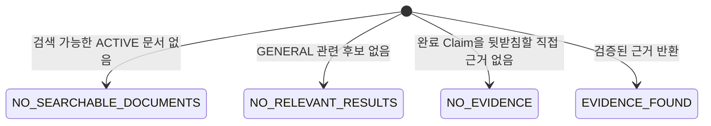

# PRZ-008 — 검색 근거 신뢰성

> **상태:** `IN_PROGRESS`
> **유형:** Search Reliability
> **선행 문서:** [PRZ-001](../PRZ-001-search-evaluation-integrity/spec.md)
> **기준 소스:** `2190d47ff013384cf9d8c441449149233f79b0e9`
> **통합:** [PR #40](https://github.com/jaemin-devlog/PRIZM/pull/40), merge `9b24808b37424f2d11ca0afe374d5703c81868fc`
> **최종 확인:** 2026-08-13

> **역사 기록 안내:** 이 Spec은 검색 개선과 후속 실험의 2026-08-13 snapshot을
> 보존합니다. 제품에 통합된 범위와 별개로 미완료 연구 Gate가 있어 lifecycle
> 상태 `IN_PROGRESS`를 그대로 유지합니다. 현재 Production 검색은
> [PRZ-016 검색 문서 안내](../PRZ-016-search-performance-v2/README.md)와 실제
> source·test를 먼저 확인합니다. 이 안내는 아래 판정과 실험 이력을 바꾸지 않습니다.

## 상태

`IN_PROGRESS` — P0–P18과 snippet·완전중복 표시 보정의 구현·평가·전체 회귀가
완료됐다. 개선 profile의 기본값 승격, 제한적 GENERAL exact-token rescue, v2 세 상태,
완료 Claim Gate와 전체 backend·frontend 검증을 통과한 제품 범위는 `main`에 통합됐다.
의미 단위 청킹·batch embedding·PDF 중복 최적화의 제품 적용 Gate가 남아 있어 전체
Spec 상태는 `IN_PROGRESS`다.

이 문서에서 `CONFIRMED`는 source·test·migration으로 확인한 사실,
`OPEN_DECISION`은 후속 단계에서 측정 후 확정할 사항을 뜻한다.

## 목적

Career Vault 검색이 단순히 가까운 청크를 반환하는 데서 그치지 않고, 사용자의
`ACTIVE` 문서에 질문을 뒷받침할 원문 근거가 있는지 신뢰할 수 있게 판정하도록
공통 계약을 정한다.

기존 [PRZ-001](../PRZ-001-search-evaluation-integrity/spec.md)은 TUNING·TEST 분할과
Direct MRR 계산을 교정한 완료 Spec이다. PRZ-008은 그 평가 기반을 재사용해
제품 검색의 근거 판정과 후속 실험을 다룬다.

## 기능 구성

- owner의 ACTIVE version에서 dense 후보를 조회한다.
- intent, bounded evidence signal과 검증된 profile이 후보를 판정한다.
- v2 응답은 검색 가능 문서 유무, 관련 결과와 완료 Claim 근거를 구분한다.
- UI는 결과 snippet과 원문을 제공하며 score를 확률로 표시하지 않는다.
- 청킹·sparse·reranker 실험은 평가 전용으로 분리하고 Gate를 통과한 변경만 제품에
  적용한다.

## 동작 흐름과 결과 상태

```text
질의 정규화와 intent 판정
↓
owner·ACTIVE version 후보 조회
↓
검증된 profile로 후보 판정·순위화
↓
결과 상태와 최대 5개 근거 구성
↓
snippet 기본 표시와 owner-scoped 원문 열람
```



## 범위

### 착수 당시 구현 기준선

아래는 PRZ-008 착수 당시 `CONFIRMED`한 기준선이다. 이후 통합된 현재 동작은 앞의
기능 구성과 [Evidence](evidence.md)의 최종 판정을 따른다.

- 검색 흐름과 응답: [`SearchService`](../../src/main/java/com/prizm/search/service/SearchService.java),
  [`VectorSearchRepository`](../../src/main/java/com/prizm/search/repository/VectorSearchRepository.java),
  [`search/controller`](../../src/main/java/com/prizm/search/controller),
  [`search/dto`](../../src/main/java/com/prizm/search/dto)
- 프론트엔드: [`searchApi.ts`](../../frontend/src/api/searchApi.ts),
  [`App.tsx`](../../frontend/src/App.tsx)
- 청킹과 색인: [`TextChunker`](../../src/main/java/com/prizm/ingestion/service/TextChunker.java),
  [`IngestionProperties`](../../src/main/java/com/prizm/ingestion/config/IngestionProperties.java),
  [`DocumentIndexingProcessor`](../../src/main/java/com/prizm/ingestion/service/DocumentIndexingProcessor.java)
- source 위치와 ownership: [`V8`](../../src/main/resources/db/migration/V8__add_document_ownership.sql),
  [`V10`](../../src/main/resources/db/migration/V10__add_chunk_source.sql),
  [`V11`](../../src/main/resources/db/migration/V11__support_pdf_page_sources.sql)
- 평가: [검색 품질 평가](../../docs/evaluation/search-evaluation.md),
  [`SearchEvaluationMetrics`](../../src/searchEvaluation/java/com/prizm/search/evaluation/SearchEvaluationMetrics.java),
  [`questions.jsonl`](../../src/test/resources/search-evaluation/sample/questions.jsonl)

- **항목:** 요청
  - 현재 동작: 질의를 검증하고 Ollama로 1024차원 임베딩한 뒤 pgvector 검색을 호출한다.
- **항목:** 검색 경계
  - 현재 동작: 로그인 사용자가 소유한 문서 중 `active_version_id`가 가리키는 `ACTIVE` 버전의 청크만 검색한다.
- **항목:** 순위·점수
  - 현재 동작: exact cosine distance 오름차순이며 `score = 1 - distance`다. score는 확률이나 검증된 신뢰도가 아니다.
- **항목:** 결과 수
  - 현재 동작: `/api/search`는 1건, `/api/career-evidence/search`는 최대 5건이다. 제품 검색에 threshold는 없다.
- **항목:** 빈 후보
  - 현재 동작: 검색 가능한 청크가 없으면 단일 검색은 `404 SEARCH_NO_RESULT`, Career Evidence는 `200`과 빈 배열을 반환한다.
- **항목:** 무관한 질문
  - 현재 동작: 청크가 하나라도 있으면 의미상 근거가 없어도 가장 가까운 결과를 반환한다.
- **항목:** UI
  - 현재 동작: 빈 배열은 근거 없음으로, 결과 score는 “관련도”로 표시한다. 인증 오류 외 오류는 일반 오류로 표시한다.
- **항목:** 청킹·색인
  - 현재 동작: TXT와 PDF 각 페이지를 최대 800자·overlap 120자로 나누고 청크마다 Ollama를 순차 호출한다. PDF는 `PAGE`와 page 번호를 저장한다.
- **항목:** 평가
  - 현재 동작: 합성 문서 11개·질문 30개를 TUNING 20개와 TEST 10개로 나눠 top-20 순위 지표와 전체 지연을 측정한다.

현재 상태 문서의 “근거가 없을 때 안내”는 빈 배열 처리만 뜻했다. 검색 가능한
청크가 있지만 질문과 무관한 경우를 판정하는 기능은 아직 없다.

### 검색 실패 사례

- **질문 유형:** 문서에 답이 없는 일반 질문
  - 목표 결과: `NO_RELEVANT_RESULTS`
  - 현재 예상 동작: 가까운 결과 반환
  - 단계: 1·2
  - 평가: 포함
- **질문 유형:** 주제는 비슷하지만 근거가 없는 일반 질문
  - 목표 결과: `NO_RELEVANT_RESULTS`
  - 현재 예상 동작: 용어가 가까운 결과 반환 가능
  - 단계: 1·2
  - 평가: 포함
- **질문 유형:** 없는 회사·자격증·기술 일반 질문
  - 목표 결과: `NO_RELEVANT_RESULTS`
  - 현재 예상 동작: 가까운 결과 반환
  - 단계: 1·2
  - 평가: 포함
- **질문 유형:** 실제 역할·수치를 바꾼 일반 질문
  - 목표 결과: `NO_RELEVANT_RESULTS`
  - 현재 예상 동작: 원래 프로젝트를 반환할 수 있음
  - 단계: 1·2
  - 평가: 포함
- **질문 유형:** 다른 사용자의 문서에만 있는 일반 근거
  - 목표 결과: 현재 사용자에게 청크가 있으면 `NO_RELEVANT_RESULTS`, 없으면 `NO_SEARCHABLE_DOCUMENTS`
  - 현재 예상 동작: owner 경계 안의 결과만 반환
  - 단계: 1·2
  - 평가: 포함
- **질문 유형:** 과거 버전에만 있는 일반 근거
  - 목표 결과: active 청크가 있으면 `NO_RELEVANT_RESULTS`, 없으면 `NO_SEARCHABLE_DOCUMENTS`
  - 현재 예상 동작: 과거 버전 제외
  - 단계: 1·2
  - 평가: 포함
- **질문 유형:** 검색 가능한 문서가 없는 사용자
  - 목표 결과: `NO_SEARCHABLE_DOCUMENTS`
  - 현재 예상 동작: 단일 404, Career Evidence 빈 배열
  - 단계: 1·2
  - 평가: 포함
- **질문 유형:** overlap 구간 반복
  - 목표 결과: 중복 없는 `EVIDENCE_FOUND`
  - 현재 예상 동작: 같은 사실이 반복될 수 있음
  - 단계: 1·4A·4B
  - 평가: 포함
- **질문 유형:** 직접 근거
  - 목표 결과: `EVIDENCE_FOUND`
  - 현재 예상 동작: 가까운 결과 반환
  - 단계: 1·2
  - 평가: 포함
- **질문 유형:** 의미가 같은 다른 표현
  - 목표 결과: `EVIDENCE_FOUND`
  - 현재 예상 동작: dense 순위에 따라 반환
  - 단계: 1·2·4A
  - 평가: 포함
- **질문 유형:** 날짜·숫자·고유명사
  - 목표 결과: 정확한 값이 있을 때만 `EVIDENCE_FOUND`
  - 현재 예상 동작: 비슷한 다른 값도 반환 가능
  - 단계: 1·2·4A
  - 평가: 포함

현재 TEST의 `exact-fifty-percent`는 실제 30% 근거를 relevance 1로 두고
`noEvidence=false`로 분류한다. 새 계약과 맞지 않으므로 1단계에서 dataset
version과 TEST 정책을 다시 고정한다. 조용히 재라벨링한 뒤 같은 TEST를 최종
검증에 재사용하지 않는다.

### 검색 상태 계약

- **상태:** `EVIDENCE_FOUND`
  - 의미: owner 범위의 검색 가능한 `ACTIVE` 청크가 있고 판정 기준을 통과한 근거가 있다.
  - 결과 배열: 1개 이상
- **상태:** `NO_RELEVANT_RESULTS`
  - 의미: 검색 가능한 `ACTIVE` 청크는 있지만 `GENERAL` 질의에 관련된 결과가 없다.
  - 결과 배열: 비어 있음
- **상태:** `NO_EVIDENCE`
  - 의미: 검색 가능한 `ACTIVE` 청크는 있지만 `COMPLETED_RELEASE_EVIDENCE` 질의를 검증할 완료 근거가 없다.
  - 결과 배열: 비어 있음
- **상태:** `NO_SEARCHABLE_DOCUMENTS`
  - 의미: 현재 사용자에게 검색 가능한 `ACTIVE` 청크가 없다.
  - 결과 배열: 비어 있음

네 상태는 정상적인 검색 결과이므로 `200`이 적합하다. 잘못된 질의는 `400`,
인증·권한 문제는 `401`·`403`, 임베딩·DB 장애는 기존 `5xx` 계약을 유지한다.

### 제품 API 호환 계약

기존 client를 깨지 않도록 현재 API를 제거하거나 응답 형태를 바꾸지 않는다.

- **API:** `POST /api/search`
  - 제품 적용 후 계약: 단일 결과와 검색 가능한 청크가 없을 때의 `404 SEARCH_NO_RESULT`를 그대로 유지한다. PRZ-008 profile 적용 대상이 아니다.
- **API:** `POST /api/career-evidence/search`
  - 제품 적용 후 계약: 최대 5개의 기존 JSON 배열을 유지한다. 새 profile을 사용하더라도 v2 상태의 `results`만 반환해 기존 client와 호환한다.
- **API:** `POST /api/v2/career-evidence/search`
  - 제품 적용 후 계약: 상태를 구분해야 하는 새 client용 API다. `state`와 `results`를 반환한다.

v2의 정상 응답은 다음 두 필드만 필수 계약으로 고정한다.

```json
{
  "state": "NO_EVIDENCE",
  "results": []
}
```

- `state`는 `EVIDENCE_FOUND`, `NO_RELEVANT_RESULTS`, `NO_EVIDENCE`,
  `NO_SEARCHABLE_DOCUMENTS` 중 하나다.
- `EVIDENCE_FOUND`의 `results`는 기존 전체 `content`를 유지하고, 선택이 끝난 결과
  안에서 질문 관련 문장과 인접 문장을 뽑은 `snippet`을 함께 제공하며 1–5개다.
  snippet 생성은 후보 선택·ranking·score에 관여하지 않고, 생성 실패 시 전체
  `content`를 fallback으로 사용한다. 나머지 세 상태의 `results`는 빈 배열이다.
- `distance`와 `score`는 기존 결과 호환을 위해 유지하지만 확률·정확도·신뢰도로
  설명하지 않는다.
- GENERAL 결과가 비어 있고 정규화된 질의가 단일 2–4자 token이며 본문에 동일한
  exact token이 있을 때만 원래 dense score가 `0.49` 이상 `0.50` 미만인 후보를
  최대 한 건 복구한다. 부분 문자열은 인정하지 않고 반환 score·distance는 원래
  값을 유지한다. `COMPLETED_RELEASE_EVIDENCE`에는 적용하지 않는다.
- profile 이름, threshold와 내부 판정 신호는 응답에 노출하지 않는다.
- frontend 검색 카드는 `snippet`을 기본 표시하고, 사용자가 기존 전체 `content`를
  펼치거나 접을 수 있게 한다. 문서 제목과 source 위치 표시는 유지한다.
- 정상 네 상태는 `200`, 잘못된 질의는 `400`, 인증·권한은 `401`·`403`,
  임베딩·DB 장애는 기존 `5xx`를 유지한다.

Career Evidence v1과 v2는 같은 선택 profile을 사용한다. v1은 결과 배열만 소비하고,
v2는 상태까지 소비한다. 프론트엔드는 제품 적용 Batch에서 v2로 이행하되 v1 제거
시점은 PRZ-008 범위에서 정하지 않는다.

### 평가 정책과 지표

- TUNING은 threshold, 후보 수, 오거부율, 중복 기준과 청킹 매개변수 선택에만 쓴다.
- TEST는 모든 설정과 라벨을 고정한 뒤 최종 비교에만 쓴다.
- 같은 문서·사실·`evidenceGroup`과 그 paraphrase를 두 split에 나누지 않는다.
- 관련 청크는 relevance `2`(직접)·`1`(부분)·`0`(무관)으로 표시하고, 같은 사실의
  반복 청크는 같은 `evidenceGroup`으로 묶는다.

- **지표:** Precision@5
  - 계산 기준: top-5의 relevance 1 이상 청크 수를 5로 나눈 질문별 평균. 정답 청크가 하나뿐이면 질문별 최대값은 0.2다.
- **지표:** Direct MRR@5·@20
  - 계산 기준: relevance 2가 있는 질문만 대상으로 cutoff 안 첫 직접 근거의 역순위를 평균한다. 거부되면 0이다.
- **지표:** nDCG@5
  - 계산 기준: gain은 `2^relevance - 1`이며 같은 `evidenceGroup`의 두 번째 결과부터 gain 0으로 계산한다.
- **지표:** 무관 질문 거부율
  - 계산 기준: 검색 가능한 문서가 있는 no-evidence 질문 중 `NO_EVIDENCE` 비율이다.
- **지표:** 근거 질문 오거부율
  - 계산 기준: relevance 1 이상 근거가 있는데 `NO_EVIDENCE`로 판정된 비율이다.
- **지표:** top-1 직접 정확도
  - 계산 기준: 직접 근거 질문 중 첫 결과의 group relevance가 2인 비율이다.
- **지표:** page 인용 정확도
  - 계산 기준: PDF 직접 근거 질문 중 반환 `PAGE` index가 gold page와 일치한 비율이다.
- **지표:** 중복 결과 비율
  - 계산 기준: top-5에서 앞선 `evidenceGroup`을 반복한 결과 수 ÷ 실제 반환 수다.
- **지표:** 결과 개수
  - 계산 기준: 질문별 사용자 반환 수를 상태·split·category별로 기록한다.
- **지표:** 전체 지연
  - 계산 기준: embedding 시작부터 DB 결과 mapping 종료까지의 p50·p95다.
- **지표:** embedding 지연
  - 계산 기준: Ollama 요청 시작부터 벡터 검증 종료까지다.
- **지표:** DB 지연
  - 계산 기준: JDBC 호출 직전부터 row mapping 종료까지다.

기존 하네스에는 Direct MRR@5, 거부·오거부, top-1 직접 정확도, page 정확도,
결과 수와 분리 지연이 없다. 1단계에서 순위를 바꾸기 전에 이 측정을 교정한다.

#### Dataset v2.2·v2.3 TUNING Gate

score 단독 threshold는 근거 질문과 무근거 질문의 분포가 겹쳐 채택하지 않는다.
제품 변경 전 평가 전용 profile에서 다음 순서를 검증한다.

1. exact cosine 상위 20개 후보를 유지한다.
2. 같은 PDF 페이지와 고정 overlap으로 본문이 반복된 인접 TXT 청크를 한 근거로
   축약한다.
3. 고유 식별자·수치·핵심어 일치와 긍정 주장에 대한 명시적 부정 표현을 score와
   별도 신호로 사용한다.
4. 각 후보가 신호를 통과해야 하며, 강한 식별자 또는 수치와 핵심어가 함께 반복되는
   요약 근거는 출처 문서가 달라도 한 결과로 축약한다.
5. 남은 근거만 최대 5개를 `EVIDENCE_FOUND`로 반환한다.

식별자·수치·Unicode 핵심어는 NFKC 정규화와 제한된 조사 제거 후 완전한 토큰으로
비교하며, 더 긴 토큰 안의 부분 문자열은 일치로 보지 않는다. 유효한 식별자나 Unicode
핵심어가 하나뿐인 질문은 그 단일 토큰의 정확 일치로 coverage를 충족할 수 있다. 출시
완료 표현은 `출시한`·`출시했다`와 `배포한`·`배포했다` 계열의 명시적 완료 활용형만
같은 판정 토큰으로 정규화한다. `배포 계획`, `배포 자동화`, 부정문과 `출시일`·`배포판`·
`재배포` 같은 더 긴 단어에는 이 동등성을 적용하지 않는다.
ASCII 식별자 뒤의 한국어 조사는 명시된 조사만 제거하며, `Kafka랩`처럼 식별자가
다른 Unicode 복합어 안에 포함된 경우에는 일치로 보지 않는다. 완료 표현 뒤에 `?` 또는
`？`가 붙은 질문형 문장은 완료 사실로 판정하지 않는다. 완료 표현의 문장 양태는 다음
합성 사례로 고정한다.

- **양태:** 명확한 완료 서술
  - 합성 사례: `주문 API를 배포했습니다.`
  - 완료 사실 판정: 맞음
- **양태:** 직접 질문
  - 합성 사례: `주문 API를 배포했습니다?`
  - 완료 사실 판정: 아님
- **양태:** 꼬리질문
  - 합성 사례: `주문 API를 배포했습니다, 맞나요?`
  - 완료 사실 판정: 아님
- **양태:** 인용·전언
  - 합성 사례: `“주문 API를 배포했습니다”라고 했나요?`
  - 완료 사실 판정: 아님
- **양태:** 완료 여부
  - 합성 사례: `주문 API 배포 여부를 확인했다.`
  - 완료 사실 판정: 아님
- **양태:** 바로 다음 문장의 부정·철회
  - 합성 사례: `배포했습니다. 그러나 실제로는 하지 않았습니다.`
  - 완료 사실 판정: 아님

임의의 한국어 의미를 판정하는 것은 제품 계약이 아니다. 완료 이력 판정은 다음의
폐쇄형 지원 문법만 다루며, 문법 밖 표현을 새 동의어로 추정하지 않는다.

- **구분:** 관형형 질의
  - 지원 문법: `<대상구> <등록 관형 완료형> <이력·경험·여부> [등록 존재형] <질의 종결부호>*`
  - 문법 밖 처리: marker 누락, 중간 구두점, 비등록 후행 token은 `UNSUPPORTED_COMPLETED_RELEASE_QUERY`
- **구분:** 유한형 질의
  - 지원 문법: `<대상구> <등록 유한 완료형> <질의 종결부호>*`
  - 문법 밖 처리: 완료형 뒤의 marker·다른 token은 `UNSUPPORTED_COMPLETED_RELEASE_QUERY`
- **구분:** 명사형 질의
  - 지원 문법: `<대상구> <출시·배포> <바로 인접한 이력·경험·여부> [등록 존재형] <질의 종결부호>*`
  - 문법 밖 처리: 떨어진 다른 절의 marker와 합성하지 않음
- **구분:** 직접 완료 주장
  - 지원 문법: `[등록된 날짜·문제없이·실제로] <질의 대상구> [후행 v버전 또는 균형 잡힌 제품 별칭] <등록 완료 평서형> <평서 종결부호>+`
  - 문법 밖 처리: claim unit 전체가 맞지 않으면 `MISSING_ASSERTED_COMPLETED_RELEASE_CLAIM`
- **구분:** 인접 unit
  - 지원 문법: 질문부호·등록된 질문 종결형 또는 등록된 부정·철회 marker가 있으면 앞 주장을 승인하지 않음
  - 문법 밖 처리: marker 없는 별도 unit은 이 제한 문법에서 독립 unit으로 취급

질의 파서는 `SUPPORTED`·`UNSUPPORTED`·`NONE`의 세 상태를 반환한다. 등록 관형형은
`출시한`·`출시했다는`·`배포한`·`배포했다는`, 등록 유한형은 동작별
`했다`·`했습니다`·`했나요`·`하였다`·`하였습니다`·`하였나요`·`하였는지`·
`했는지`·`했어요` 결합만 지원한다. 등록 존재형은 `있`·`있나요`·`있나`·`있어`·
`있습니까`·`있었나`·`있었나요`·`있었어`·`있는지`다. 출시·배포를 활용한 비등록
질의형은 `UNSUPPORTED`이며 일반 핵심어 검색으로 되돌아가지 않는다. bare `출시`·
`배포`는 바로 다음 token이 `이력`·`경험`·`여부`일 때만 완료 이력 의도다. 따라서
`출시 계획과 운영 경험`의 서로 다른 명사절을 합성하지 않는다.

명사형 동작과 marker에는 exact base 또는 base에 정확히 하나 붙은 등록 조사
`이`·`가`·`을`·`를`·`은`·`는`·`의`·`에`·`도`·`만`만 허용한다. 존재형은 위
등록 token과 exact match해야 한다. 범용 어간화는 query 문법에 사용하지 않으며,
bare 동작 바로 뒤 token이 marker 문자열을 포함하지만 이 규칙으로 복원되지 않으면
malformed nominal intent로 `UNSUPPORTED` 처리한다.

질의 문법 token 사이에는 공백만 허용하고 `. ! ！ 。 ? ？`는 마지막 token 뒤에만
허용한다. 마지막 구두점은 선택이며, 중간 구두점이나 문법 생산식 뒤의 추가 token은
전체 질의를 `UNSUPPORTED`로 닫는다. 대상구는 완료 동작 앞의 token에서 정확한
`실제로` modifier를 제거한 나머지 불투명 token 순서다. 이 순서는 재배열하거나 다른
절의 token과 합산하지 않는다. 대상 token은 NFKC·소문자와 ASCII 식별자에 붙은 등록
한국어 조사만 정규화한다. 내부 `+`·`#`·`_`·`-`는 기술 token의 일부로 보존한다.
내부 `.`은 양쪽이 ASCII 영숫자인 `Node.js`·`v1.2`·`1.25` 형식만 지원한다. token
끝의 `.`·`_`·`-` 뒤에 다른 grammar token이 오면 공백-only separator 위반으로
문법 밖이다. `하는`·`한`·`된` 같은 의미 어간 suffix와 Unicode 대상의 조사는
제거하지 않는다.

ASCII 식별자에 허용하는 조사 목록은 `으로부터`·`에게서`·`에서는`·`에서도`·
`이라고`·`이라도`·`이라면`·`에는`·`에도`·`에서`·`에게`·`까지`·`부터`·`처럼`·
`보다`·`으로`·`라고`·`라는`·`로`·`을`·`를`·`은`·`는`·`이`·`가`·`와`·`과`·
`의`·`에`·`도`·`만`이다. 조사 제거 뒤 전체 token이 ASCII 식별자 문법과 맞을 때만
제거한다.

완료 질의 탐지 경계도 폐쇄한다. parser는 등록 완료형과 조사 정규화 뒤의 bare
`출시`·`배포`+인접 marker 후보 각각에 대해 대상구·separator·tail 전체 생산식을
검증하고, 유일하게 성공한 parse만 `SUPPORTED`로 채택한다. 대상구 안의 등록 완료
token이나 marker도 불투명 token이므로, tail이 맞지 않는 앞선 후보만으로 전체 질의를
거절하지 않는다. 성공 parse가 없을 때 bare 동작 바로 다음의 `하`·`했`·`한`·`되`·
`됐` 시작 보조 token, 또는 raw 한 token 안에 `출시`·`배포`가 포함된 비등록형을
`UNSUPPORTED`로 탐지한다. 이 탐지 집합에 없는 임의의 우회 문장을 의미적으로
추론하는 것은 계약이 아니다.

후보는 문장·줄바꿈을 정규화한 `claim unit`별로 판정한다. 등록 완료 평서형은 동작별
`했다`·`했습니다`·`하였다`·`하였습니다`·`했어요` 결합만 지원하고, 평서 종결부호는
`. ! ！ 。` 중 하나 이상이 반드시 있어야 한다. 지원 직접 주장 parser는 predicate
앞의 대상구를 질의에서 얻은 정규화 token 순서와 완전히 비교하며, 식별자·수치가 부정
절에 있고 다른 대상의 완료 predicate가 뒤따르는 token bag을 승인하지 않는다.
질문·전언·인용 같은 비등록 prefix와 predicate 뒤의 비등록 suffix, 종결부호 없는
문장도 전체 문법 불일치로 닫는다. 문서 제목은 이 parser 입력에 포함하지 않는다.
token이 `했고`·`하고` 등으로 끝난다는 이유만으로 claim unit을 나누지 않는다.
접속형처럼 보이는 token도 대상구에서는 불투명하게 유지하며, 실제 절간 신호 합성은
unit 전체의 exact target+predicate full match 실패로 차단한다.
후행 annotation은 없거나 정확히 하나다. version은 `v<숫자>(.<숫자>)+`, 제품 별칭은
`""`·`“”`·`‘’`·`「」`·`『』` 중 한 쌍으로 균형을 이루고 body는 Unicode 문자·숫자·
ASCII space·tab·`+`·`#`·`_`·`-` 하나 이상으로 제한한다. 둘 모두 등록 조사 `을`·`를`·`은`·
`는`만 선택적으로 붙일 수 있다. version과 별칭을 함께 쓰거나 별칭 body에 그 밖의
구두점이 있으면 문법 밖이다.

claim 선두의 등록 prefix는 날짜 `YYYY년 M월 D일에`, `문제없이`, `실제로`이며 0개
이상을 공백으로 연결한다. parser는 prefix를 0개 소비한 해석부터 한 요소씩 소비한
해석까지 유한하게 비교해 질의 대상 token과 exact match하는 해석을 사용한다. 따라서
등록 prefix와 같은 token으로 시작하는 대상 자체도 오거절하지 않는다.

바로 다음 claim unit의 등록 비단언 양태는 (1) `?`·`？` 포함, (2) `나요`·`습니까`·
`인가요`·`일까요`·`죠` 종결, (3) `하지 않/못`, `사실이 아니/아닙`, `거짓입/이/으`,
`부인합/했/하`, `철회합/했/하`, `취소합/했/하`, `정정합/했/하`, `번복합/했/하`,
`거둡`, `거두`, `되돌`, `미배포`, `사실무근`, `여부` 포함으로 한정한다. 이 marker가
바로 다음 unit에 있으면 보수적으로 앞 주장을 무효화하며, 그 밖의 임의 담화 관계는
추론하지 않는다.

이 Gate의 P1은 (1) 위 질의 생산식이나 완료 민감 탐지 집합의 오분류, (2) 직접 주장
full match를 하지 않은 claim unit 자체의 근거 승인, (3) 서로 다른 unit·제목에서
대상과 완료 predicate를 합성한 승인, (4) 등록 변환 범위 안의 직접 완료 평서문
오거절로 한정한다. 등록 직접 주장과 함께 있는 별도 비등록 unit은 등록 질문·교정
관계에 해당하지 않으면 독립 unit으로 취급하며, 그 임의 문장의 숨은 의미 관계를
추론하지 않는 것은 P1이 아니다. `배포했고`, 선두 제품 별칭, predicate 뒤 괄호 주석
등 명시하지 않은 자연어 형식을 `NO_EVIDENCE`로 거절하는 것도 의도된 fail-closed
제품 한계이며 P1이 아니다. 새 표현 지원은 개별 finding 패치가 아니라 이 문법과
변환 기반 테스트를 함께 확장하는 별도 계약 변경으로만 수행한다.

이 TUNING 측정 당시 `source-dedup-evidence-signals-v1`은 평가 전용 profile이었고
제품 동작이 아니었다. 이후 Batch 2B에서 같은 판정 계약을 opt-in 제품 profile로
옮겼다. 기존 TEST 10문항은 최종 비교 Gate까지 실행·재라벨링하지 않는다.

#### S2C-02 직접 근거·정확 사실 지원 문법

완료 **이력** 질의는 계속 하나의 동일 claim unit 안에 질의 대상·완료 동작·직접 긍정
양태가 함께 있어야 한다. 이 규칙은 질문·전언·인용·부정·철회와 서로 다른 unit의 신호
합성을 막는 필수 Gate이며, 아래 문법으로 완화하지 않는다.

별도 직접 근거·정확 수치·날짜 질의에서는 본문에 명시된 프로젝트 이름 선언
`프로젝트 이름은 <ASCII 식별자>이다` 또는 직접 참여 선언
`<ASCII 식별자> 프로젝트에서 … 참여했다` 바로 뒤의 직접 완료 평서 claim을 제한적으로
사용할 수 있다. 이때 질의 식별자는 선언과 정확히 일치하고, 수치·날짜 질의의 모든 수치는
완료 claim unit 안에 있으며, 제목은 사용하지 않는다. 구현·API endpoint 직접 근거의
등록 동의어는 직접 완료 평서 claim에만 연결한다. 선언 자체, 인용·질문·전언·부정·철회
claim, 다른 이름 선언 뒤의 claim은 근거가 아니다.

ASCII 식별자의 종결 계사 `이다`만 정확 식별자 경계로 해석한다. `Kafka랩`처럼 더 긴
Unicode 복합어 내부의 ASCII 부분 문자열은 계속 식별자가 아니다. 이 지원 문법 밖의
질의와 문서는 `NO_EVIDENCE`로 fail-closed 처리한다.

근거 존재 여부는 사용자에게 인용되는 본문 `content`만으로 판정한다. 문서 제목은
순위 보조에는 사용할 수 있지만 본문에 없는 대상·사실을 근거로 보충할 수 없다.
Dataset v2.3은 v2.2를 보존한 새 버전이며, Atlas PDF gold page가 문서 식별자와 완료
사실을 본문 안에서 함께 제공하도록 원문 한 곳만 교정했다. 질문·split·label·gold
page는 v2.2와 동일하다. Dataset v2 평가는 기본적으로 `TUNING`만 허용한다. 고정
최종 비교는 Dataset ID가 정확히 `prizm-search-evidence-synthetic-v2.3`이고 split이
`TEST`이며 `PRIZM_SEARCH_EVALUATION_ALLOW_FROZEN_TEST=true`를 명시한 경우에만 허용한다.
flag가 없거나 v2.2·다른 Dataset·다른 split이면 계속 거절하며, 이 예외는 평가 runner
밖의 제품 profile·검색 설정·Dataset을 바꾸지 않는다. runner는 선택된 split의 질문이
참조한 fixture만 seed한다. 따라서 선택 split에 있으나 어떤 질문도 참조하지 않는 fixture는
owner·version scenario를 추론해 seed하지 않으며, 원본 Dataset 파일도 변경하지 않는다.

TUNING 15문항 Gate는 직접 근거 top-1 `8/8`, 오타 질문 top-1 `2/2`, 중복 결과
비율 `0`, 무근거 질문 거부율 `1.0`, 근거 질문 오거부율 `0`이다. 이 수치는 작은
합성 TUNING 집합의 통과 조건일 뿐 일반 검색 품질이나 최종 TEST 성능을 뜻하지
않는다.

S2C-02는 Dataset v2.2/v2.3과 고정 TEST를 변경하지 않는다. 변환 기반 단위 테스트로
지원 문법·오거절·`Kafka랩` 경계·제목 배제를 먼저 고정하고, 대상 PostgreSQL 회귀와
기존 v2.3 TUNING 15문항을 통과한 뒤에만 고정 TEST를 한 번 재비교한다.

2026-08-08 최종 TUNING 15문항은 Direct MRR@5/@20 `1.0000`, nDCG@5 `0.9783`,
중복 `0`, 무근거 거부 `1.0`, 근거 오거부 `0`으로 통과했다. 이어 고정 v2.3 TEST에서
legacy와 opt-in을 각각 한 번 실행했다. opt-in은 Direct MRR@5/@20 `1.0000`,
nDCG@5 `0.9710`, top-1 직접 근거 `1.0`, 무근거 거부 `1.0`, 근거 오거부 `0`, 중복 `0`,
PDF page 정확도 `1.0`, total p95 `160ms`(legacy `138ms`, +`15.9%`)로 모든 TEST Gate를
통과했다. TEST 뒤 구현·설정 재조정은 하지 않았으며, 이후 실제 OpenSQL direct
`5432` API·UI Gate도 통과했다.

### 제품 profile 설정 계약

- Spring property는 `prizm.search.profile`, 환경변수는
  `PRIZM_SEARCH_PROFILE`로 고정한다.
- 허용값은 `legacy-dense-v1`과 `source-dedup-evidence-signals-v1`이다. 알 수 없는
  값은 애플리케이션 시작 시 실패시킨다.
- 최종 TEST와 실제 OpenSQL direct `5432` Gate를 통과한 뒤 기본값은
  `source-dedup-evidence-signals-v1`이다. `legacy-dense-v1`은 명시적 rollback
  override로만 선택한다.
- 후보 수 20, 최종 결과 수 5와 판정 신호는 versioned profile 내부의 고정값으로
  둔다. 개별 threshold나 신호를 환경변수로 분해하지 않는다.
- rollback은 profile 값을 `legacy-dense-v1`로 되돌리는 것이다. migration,
  재색인, 데이터·권한 변경은 필요하지 않아야 한다.

### 제품 적용 검증 계약

제품 구현은 다음 Gate를 모두 통과해야 한다.

- **범위:** unit·service
  - 필수 검증: profile 신호와 중복 축약, 세 상태, 최대 5건, owner·`ACTIVE` 경계, 기존 `/api/search` 무변경
- **범위:** controller·API
  - 필수 검증: v1 배열 호환, v2 세 상태와 빈 배열, 기존 `400`·`401`·`403`·`5xx`, 내부 판정 신호 미노출
- **범위:** frontend
  - 필수 검증: 세 상태별 안내, 인증·server 오류 분리, score 비확률 표현, lint·typecheck·build
- **범위:** PostgreSQL·pgvector
  - 필수 검증: 후보 20건 exact cosine, owner·version 격리, 근거·무근거·검색 문서 없음과 중복 축약
- **범위:** OpenSQL
  - 필수 검증: direct `5432` 합성 TXT/PDF API·UI에서 동일 상태와 owner 격리를 별도 검증
- **범위:** 회귀
  - 필수 검증: backend 전체 test, frontend 공식 검사, OSS·SBOM·문서·민감정보 검사

설정과 구현을 고정한 뒤 TEST는 기존 profile과 새 profile을 한 번의 최종 비교에서만
실행한다. 실패 결과를 보고 TEST에 맞춰 profile을 다시 조정하지 않는다.

- **TEST Gate:** Direct Recall@20
  - 통과 조건: `1.0`
- **TEST Gate:** top-1 직접 근거 정확도
  - 통과 조건: `1.0`
- **TEST Gate:** 무관 질문 거부율·근거 질문 오거부율
  - 통과 조건: 각각 `1.0`·`0`
- **TEST Gate:** 중복 결과 비율·PDF page 인용 정확도
  - 통과 조건: 각각 `0`·`1.0`
- **TEST Gate:** Direct MRR@5·@20
  - 통과 조건: 같은 실행의 `legacy-dense-v1` 이상
- **TEST Gate:** nDCG@5
  - 통과 조건: 같은 실행의 legacy 결과보다 `0.02`를 넘게 낮아지지 않음
- **TEST Gate:** total p95
  - 통과 조건: 같은 실행의 legacy 결과 대비 20% 초과 증가하지 않음

필수 Gate가 실패하거나 OpenSQL 검증이 `NOT_RUN`이면 새 profile은 기본값으로
승격하지 않는다. Batch 2A 계약 확정 당시에는 제품 source와 TEST를 변경·실행하지
않았으며, Batch 2B에서 opt-in 제품 source와 계약 테스트만 구현했다.

## 요구사항

### `PRZ-008-R1` — 요구사항

현재 dense 검색을 재현 가능하게 측정하고 TUNING·TEST 누출을 차단한다.

### `PRZ-008-R2` — 요구사항

세 상태를 배타적으로 판정하고 근거 없는 후보를 사용자 근거로 반환하지 않는다.

### `PRZ-008-R3` — 요구사항

owner와 `ACTIVE` version 경계를 유지한다. 다른 사용자·과거 version은 현재 근거가 아니다.

### `PRZ-008-R4` — 요구사항

UI는 세 상태와 server·인증 오류를 구분하고 score를 확률처럼 표시하지 않는다.

### `PRZ-008-R5` — 요구사항

의미 단위 청킹은 실험에서 Gate를 통과한 경우에만 제품에 적용한다.

### `PRZ-008-R6` — 요구사항

청킹·batch embedding·PDF 최적화는 source 위치, embedding 검증과 atomic activation을 보존한다.

### `PRZ-008-R7` — 요구사항

PostgreSQL과 OpenSQL 결과를 별도로 실행·기록한다.

### `PRZ-008-R8` — 요구사항

각 단계는 별도 branch·PR로 수행하고 이전 Gate 통과 전 후속 구현을 섞지 않는다.

## 보존 계약

- 문서·버전·청크·질의·결과의 사용자 ownership을 유지한다.
- 완성된 `ACTIVE` version만 검색하고 새 version 실패 시 기존 active를 유지한다.
- immutable version, 원본·hash, TXT `TEXT_CHUNK`와 PDF `PAGE` source를 유지한다.
- embedding의 1024차원·finite·0이 아닌 norm 검증을 유지한다.
- Worker lease·recovery·fencing, atomic activation과 파일 안전 계약을 약화하지 않는다.
- 적용된 Flyway migration을 수정하지 않고 PostgreSQL·OpenSQL 결과를 구분한다.

## 제외 범위

HNSW, IVFFlat, FTS, RRF, hybrid search, OCR, 다단 PDF layout 복원, page 경계를
넘는 청크, `document_chunk_spans`, 별도 모델을 호출하는 reranker, MMR, Worker
부분 저장·checkpoint·병렬화, 별도 vector DB와 LLM 답변 생성은 필수 계획에
포함하지 않는다. 1단계의 후보 축약과 결정 신호는 저장된 결과의 출처·본문과
질문만 사용하는 평가 전용 후처리로 제한한다.

0단계에서는 제품·test source, API DTO, UI, threshold, 청킹, Ollama·PDF 처리,
migration, dependency, 기존 문서 재색인을 변경하지 않는다.

## 완료 조건

### 0단계

- 현재 동작, 실패 유형, 세 상태와 평가 정책이 source 근거와 일치한다.
- [Plan](plan.md)에 각 단계의 입력·산출물·변경 범위·Gate·중단 조건이 있다.
- 비범위가 후속 필수 구현으로 표현되지 않는다.
- 제품·test source, migration과 dependency 변경이 0건이다.
- Markdown 링크·상태 일관성과 `git diff --check`가 통과한다.

### 후속 단계 잠정 목표

실측 전 수치를 성능 사실로 확정하지 않는다.

- **항목:** 무관 질문 거부율
  - 초기 방향: 현재 semantic rejection 부재보다 개선
  - TUNING 후: 수치 Gate 확정
  - TEST: 고정 Gate 검증
- **항목:** 근거 질문 오거부율
  - 초기 방향: 낮을수록 좋음
  - TUNING 후: 직접·부분 근거별 허용치 확정
  - TEST: 설정 변경 없이 검증
- **항목:** Direct MRR·nDCG
  - 초기 방향: 의미 있는 회귀 금지
  - TUNING 후: 허용 하락 폭 확정
  - TEST: 고정 폭 검증
- **항목:** 중복률
  - 초기 방향: 현재 기준선보다 감소
  - TUNING 후: 4A 적용 Gate 확정
  - TEST: 4B 결과 검증
- **항목:** 색인 시간
  - 초기 방향: 안전·품질을 유지하며 감소
  - TUNING 후: 동일 corpus budget 확정
  - TEST: 환경별 검증
- **항목:** 검색 p50·p95
  - 초기 방향: 유의한 회귀 금지
  - TUNING 후: latency budget 확정
  - TEST: 고정 profile 검증
