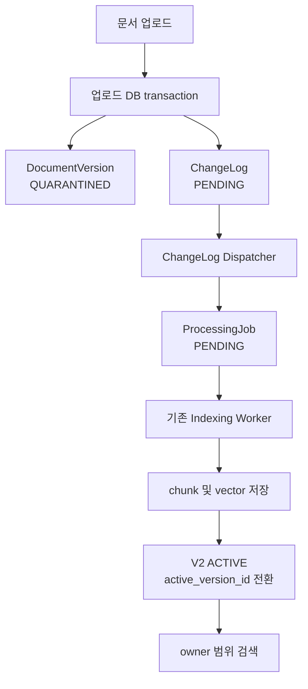
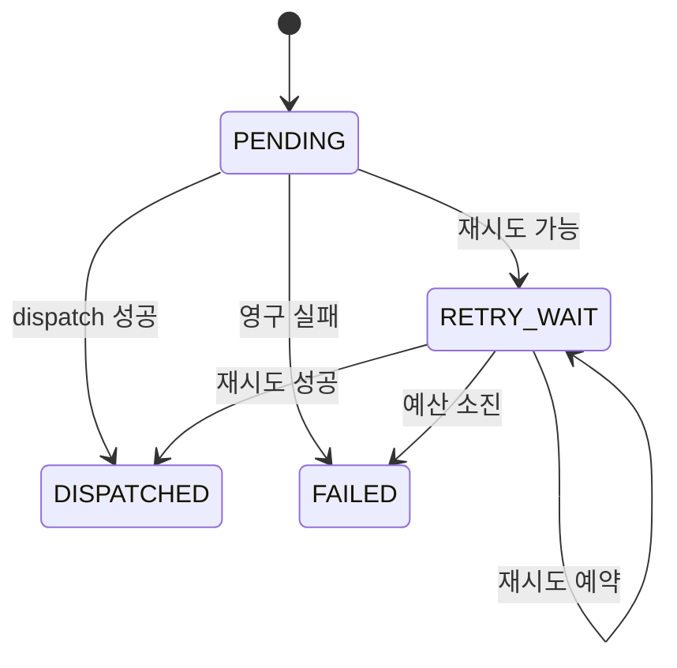

# PRZ-010 — 변경 로그 동기화

> **상태:** `VERIFIED`
> **유형:** Feature
> **선행 문서:** [PRZ-000](../PRZ-000-platform-baseline/spec.md)
> **기준 소스:** `26c546b16eb9ea42d98460dd6e5aa0bf0752212a`
> **최종 확인:** 2026-08-12

## 목적

문서 버전 생성 사실과 색인 작업 생성을 분리해, 문서 변경을 누락하거나 중복하지
않고 기존 색인 파이프라인에 전달한다.

PRZ-010 이전에는 `DocumentUploadService`가 문서 버전과 ProcessingJob을 같은 업로드
트랜잭션에서 직접 생성했다. 이 방식은 색인에는 충분했지만, 변경 사실과 실행 작업을
구분하지 않아 변경을 독립적으로 재생하거나 후속 consumer에 전달할 영속 기준이
없었다.

이번 범위는 `DOCUMENT_VERSION_CREATED`를 기존 `INDEXING` ProcessingJob으로
전달하는 consumer 하나만 구현한다. MCP와 다른 저장소 consumer는 포함하지 않는다.

## 현재 기준선

계획 수립 기준 source
`5a8ea8d2b85e7d87342e11e96d1d58d1181ab6b8`에서는 다음 동작을 확인했다.

- [`DocumentUploadService`](../../src/main/java/com/prizm/document/service/DocumentUploadService.java)가
  immutable `DocumentVersion`을 저장한 뒤
  `ProcessingJob.pendingIndexing()`을 직접 저장했다.
- [`DocumentManagementService`](../../src/main/java/com/prizm/document/service/DocumentManagementService.java)는
  새 version과 문서 삭제 가능 여부를 연결된 ProcessingJob의 비종료 상태를 중심으로
  판단했다.
- `(document_version_id, job_type)` ProcessingJob unique와 owner composite FK가
  [V4](../../src/main/resources/db/migration/V4__create_processing_jobs.sql)와
  [V8](../../src/main/resources/db/migration/V8__add_document_ownership.sql)에 적용돼 있었다.
- [`ProcessingJobClaimRepository`](../../src/main/java/com/prizm/ingestion/repository/ProcessingJobClaimRepository.java)는
  `FOR UPDATE SKIP LOCKED`, lease·recovery·fencing을 사용했고,
  [`IndexingCompletionService`](../../src/main/java/com/prizm/ingestion/service/IndexingCompletionService.java)는
  atomic activation을 담당했다.
- [`VectorSearchRepository`](../../src/main/java/com/prizm/search/repository/VectorSearchRepository.java)는
  owner가 일치하고 `active_version_id`가 가리키는 `ACTIVE` version만 반환했다.
- DB rollback 뒤 원본 파일은 보상 삭제하고, 실패하면 `FileCleanupJob`으로
  복구했다.
- ChangeLog table, entity, repository, Dispatcher와 전용 scheduler는 없었다.

현재 기준 소스에서는 같은
[`DocumentUploadService`](../../src/main/java/com/prizm/document/service/DocumentUploadService.java)가
V14 `document_change_logs`를 기록하고 ChangeLog Dispatcher와 Failure Recorder가
구현돼 있다. 검증 결과는 [Evidence](evidence.md)를 따른다.

## 기능 구성



- `DocumentChangeLog`는 문서 버전 생성 사실을 owner 범위로 보존한다.
- ChangeLog Dispatcher는 변경 사실을 기존 `INDEXING` ProcessingJob으로 전달한다.
- ProcessingJob과 기존 Indexing Worker는 원문 추출, 청킹, 임베딩, vector 저장과
  activation을 담당한다.
- 검색 repository는 owner와 `ACTIVE` version 경계를 유지한다.

### ChangeLog 데이터 계약

논리 table 이름은 `document_change_logs`다. V14 forward-only Flyway migration으로
추가하며 이전 migration은 수정하지 않는다.

- `id`: DB가 생성하는 ChangeLog 식별자.
- `owner_user_id`: document·version과 같은 소유자.
- `document_version_id`: 생성된 immutable version.
- `event_type`: 이번 범위에서는 `DOCUMENT_VERSION_CREATED`만 허용.
- `event_key`: `DOCUMENT_VERSION_CREATED:{documentVersionId}` 형식의 멱등 키.
- `dispatch_status`: `PENDING`, `RETRY_WAIT`, `DISPATCHED`, `FAILED` 중 하나.
- `processing_job_id`: dispatch 성공 뒤 연결된 `INDEXING` ProcessingJob. 그전에는
  `NULL`.
- `retry_count`: Failure Recorder가 commit한 retry 예약 횟수. 최초 dispatch 전에는
  0이고 최대 3.
- `next_retry_at`: `RETRY_WAIT`의 다음 처리 가능 시각.
- `dispatched_at`: ProcessingJob 전달이 성공한 시각.
- `failed_at`: dispatch가 최종 실패한 시각.
- `last_error_message`: 길이를 제한하고 제어 문자를 제거한 마지막 실패 메시지.
- `created_at`: 변경 사실을 DB에 기록한 시각.

`DISPATCHED`는 ProcessingJob 연결이 끝났다는 뜻이며 색인 완료가 아니다. 이후의
색인 성공·재시도·최종 실패는 ProcessingJob과 DocumentVersion이 나타낸다.

### 무결성과 멱등성

- `event_key`는 unique다.
- `(document_version_id, event_type)`는 unique다.
- 기존 `(document_version_id, job_type)` ProcessingJob unique를 유지한다.
- `processing_jobs(id, owner_user_id, document_version_id)` unique와 ChangeLog의
  composite FK가 Job·owner·version 관계를 보호한다.
- nullable `processing_job_id` unique는 전달된 하나의 ProcessingJob을 둘 이상의
  ChangeLog에 연결하지 못하게 한다.
- event identity와 변경 사실 필드는 생성 뒤 바꾸지 않는다. 상태·오류·Job 연결
  필드만 상태 전이에 따라 갱신한다.
- 애플리케이션 사전 조회뿐 아니라 DB unique와 transaction이 동시 실행의 최종
  일관성을 보장한다.

### 업로드와 파일 저장

- `DocumentVersion` 메타데이터와 ChangeLog는 같은 DB transaction에서 기록한다.
- 둘 중 하나라도 저장에 실패하면 둘 다 rollback한다.
- 원본 TXT·PDF 저장은 DB와 원자적이지 않으므로 기존 보상 계약을 유지한다.
- 원본 저장 뒤 DB rollback이면 즉시 보상 삭제를 시도한다.
- 보상 삭제 실패는 `FileCleanupJob`으로 복구한다.
- transaction 결과가 불명확하면 원본을 보존하고 reconciliation 필요를 기록한다.
- 업로드 service, controller와 다른 scheduler는 신규 version의 ProcessingJob을
  우회 생성하지 않는다.
- 기존 data와 test fixture의 ProcessingJob에는 소급 ChangeLog를 만들지 않는다.

### Dispatcher 책임

Transaction A는 외부 서비스와 파일 저장소를 호출하지 않는 짧은 DB transaction이다.

1. `PENDING` 또는 실행 시각이 지난 `RETRY_WAIT` 한 건을 생성 순서로 선택한다.
2. `FOR UPDATE SKIP LOCKED`로 여러 인스턴스의 중복 claim을 막는다.
3. 같은 owner·version의 `INDEXING` ProcessingJob을 생성한다.
4. unique 충돌로 작업이 이미 있으면 기존 작업을 조회해 재사용한다.
5. Job 연결과 ChangeLog `DISPATCHED`를 같은 transaction에서 확정한다.

Job 생성, ChangeLog 연결과 상태 전환 중 하나라도 실패하면 A 전체를 rollback한다.
고아 Job이나 거짓 `DISPATCHED`가 남아서는 안 된다.

Transaction A가 실패하면 scheduler는 예외를 밖에서 처리하고 별도 Transaction B를
실행한다.

- 다른 Dispatcher가 이미 `DISPATCHED`로 전환했다면 상태를 되돌리지 않는다.
- 재시도 가능한 실패면 `retry_count`, `next_retry_at`과 오류 메시지를 갱신한다.
- 영구 실패 또는 retry 소진이면 ChangeLog와 아직 `QUARANTINED`인 version을
  `FAILED`로 바꾼다.
- B도 시작하거나 commit하지 못하면 마지막 commit 상태를 유지하고 다음 scheduler
  실행에서 다시 시도한다.
- 짧은 DB 작업이므로 ChangeLog에는 별도 `PROCESSING`, lease, heartbeat와 claim
  fencing을 추가하지 않는다.

### 버전 경쟁과 삭제

- owner-scoped document row를 잠근 뒤 최신 version 상태를 먼저 검사한다.
- `QUARANTINED`와 `PROCESSING`이면 새 version 업로드와 문서 삭제를 거부한다.
- `ACTIVE`와 `FAILED`이면 기존 terminal 절차에 따라 업로드와 삭제를 허용한다.
- 기존 ProcessingJob의 `PENDING`, `RETRY_WAIT`, `PROCESSING`도 2차 방어선으로
  확인한다.
- frontend는 Job이 없어도 version이 `QUARANTINED` 또는 `PROCESSING`이면 입력을
  비활성화한다.
- 기존 `DOCUMENT_PROCESSING` API 오류 계약을 유지한다.
- terminal 문서 삭제 transaction에서는 ChangeLog를 ProcessingJob과 version보다
  먼저 제거한다.
- 삭제된 문서의 ChangeLog는 감사 이력으로 보존하지 않고 `DOCUMENT_DELETED`
  event도 만들지 않는다.

### 배포와 확장 경계

- 기존 document, version, chunk와 ProcessingJob을 수정하거나 삭제하지 않는다.
- 과거 version과 ProcessingJob에 ChangeLog를 소급 생성하지 않는다.
- 기존 non-terminal ProcessingJob은 기존 Worker가 계속 처리한다.
- 새 코드가 배포된 뒤 생성되는 version부터 ChangeLog 경로를 사용한다.
- 구 writer와 신 writer가 신규 업로드를 동시에 처리하는 rolling deployment는
  허용하지 않는다.
- 구 writer를 먼저 중지하거나 신규 업로드를 일시 중지한 뒤 migration과 신 writer를
  전환한다.
- Dispatcher 중단 중에는 새 version이 검색되지 않고 이전 active가 유지된다.
- 단순 코드 rollback보다 Dispatcher를 포함한 검증된 roll-forward를 우선한다.
- 향후 다른 consumer는 `change_log_id + consumer_type` 기준의 독립
  delivery·checkpoint를 별도 Spec에서 정의해야 한다.
- PRZ-010의 `DISPATCHED`를 미래 모든 consumer의 완료로 해석하지 않는다.

## 동작 흐름

```text
V1 ACTIVE
→ V2 업로드
→ V2 QUARANTINED + ChangeLog PENDING
→ Dispatcher가 ProcessingJob 생성 또는 재사용
→ ChangeLog DISPATCHED + ProcessingJob PENDING
→ 기존 Indexing Worker 처리
→ V2 chunk 및 vector 저장
→ V2 ACTIVE + active_version_id = V2
→ V2 검색 결과만 반환
```

V2가 `ACTIVE`가 되기 전에는 V1이 검색 대상이다. V2의 dispatch나 indexing이 최종
실패해도 V1의 `active_version_id`를 바꾸지 않는다.

## 상태와 실패 흐름



- 최초로 commit된 dispatch 실패는 `retry_count=1`과 1분 retry를 기록한다.
- 두 번째와 세 번째 실패는 각각 5분과 15분 retry를 기록한다.
- 네 번째로 commit된 실패는 추가 retry 없이 `FAILED`가 된다.
- B가 commit하지 못한 실패는 시도 예산을 소비하지 않는다.
- 지원하지 않는 event, owner·version 불일치와 복구 불가능한 무결성 오류는
  재시도하지 않는다.
- 기존 ProcessingJob을 재사용하는 replay는 실패가 아니다.
- dispatch 최종 실패는 ChangeLog와 새 version을 `FAILED`로 만들고 기존 active를
  유지한다.
- `DISPATCHED` 뒤 indexing 최종 실패는 ChangeLog를 `DISPATCHED`로 유지하고,
  ProcessingJob과 새 version만 `FAILED`가 된다.

## 범위

### 포함

- 앞으로 생성되는 모든 DocumentVersion의 `DOCUMENT_VERSION_CREATED` ChangeLog.
- version과 ChangeLog의 원자적 DB 기록.
- 업로드 서비스의 직접 ProcessingJob 생성 경로 제거.
- Dispatcher의 유일한 운영 진입점과 멱등 Job 생성·재사용.
- dispatch retry, backoff와 최종 실패 기록.
- ProcessingJob 생성 전 version·삭제 guard.
- V2 업로드부터 검색까지의 E2E.
- PostgreSQL과 OpenSQL direct `5432`의 분리 검증.

### 제외

- `METADATA_UPDATED`, `DOCUMENT_DELETED`와 다른 event type.
- MCP, webhook, CDC, Kafka와 범용 event bus.
- 공개 ChangeLog REST API와 관리자 재처리 API.
- 여러 consumer의 독립 delivery·checkpoint table.
- 과거 data backfill.
- 기존 Worker의 lease·heartbeat·fencing·retry와 chunk 처리 변경.
- embedding model, chunker, vector 순위와 검색 API 변경.
- `DocumentTextExtractor`, `TextChunker`, `DocumentIndexingProcessor`와 embedding
  service 동작 변경.
- PRZ-008 검색 source·평가·dataset 변경.
- 영구 감사 원장과 삭제된 문서의 변경 이력 보존.
- OpenProxy SQL routing, OpenHA와 DB failover.

## 요구사항

### PRZ-010-R1 — 원자적 ChangeLog 기록

- 앞으로 생성되는 모든 DocumentVersion은 같은 DB transaction에서 정확히 하나의
  owner-scoped `DOCUMENT_VERSION_CREATED` ChangeLog를 가져야 한다.

### PRZ-010-R2 — 유일한 Job 생성 진입점

- 업로드의 직접 ProcessingJob 생성 경로를 제거한다.
- Dispatcher를 신규 `INDEXING` ProcessingJob 생성의 유일한 운영 진입점으로 쓴다.

### PRZ-010-R3 — event와 Job 멱등성

- DB unique와 원자적 dispatch로 event와 ProcessingJob 멱등성을 보장한다.
- replay와 동시 Dispatcher가 작업을 중복 생성해서는 안 된다.

### PRZ-010-R4 — 짧은 Dispatcher transaction

- Dispatcher는 `FOR UPDATE SKIP LOCKED` DB transaction에서 Job 생성·조회, 연결과
  `DISPATCHED`를 함께 확정한다.
- 파싱·청킹·임베딩·vector 저장은 수행하지 않는다.

### PRZ-010-R5 — version과 삭제 guard

- ProcessingJob이 아직 없어도 `QUARANTINED`·`PROCESSING` version은 추가 업로드와
  문서 삭제를 차단한다.

### PRZ-010-R6 — 실패와 이전 active 보존

- dispatch retry와 최종 실패를 기록한다.
- 최종 실패 version을 `FAILED`로 만들되 이전 active와 검색 결과를 보존한다.

### PRZ-010-R7 — 기존 기술 계약 보존

- immutable version, 원본 hash, 파일 rollback compensation, owner 경계,
  Worker lease·fencing과 atomic activation을 유지한다.

### PRZ-010-R8 — migration과 환경 분리

- migration은 forward-only다.
- 과거 ChangeLog를 조작해 넣지 않는다.
- PostgreSQL과 OpenSQL 결과를 분리한다.

### PRZ-010-R9 — V1에서 V2까지의 E2E

- V2 업로드, ChangeLog, ProcessingJob, 기존 색인, V2 `ACTIVE`와 V2 검색을 하나의
  수직 시나리오로 검증한다.

### PRZ-010-R10 — 검색·평가 영역 분리

- PRZ-008과 병렬 진행할 수 있도록 검색 알고리즘·평가·dataset과 기존
  파싱·청킹·임베딩 구현을 수정하지 않는다.

### PRZ-010-R11 — Transaction A와 B 분리

- dispatch 실패는 별도 Failure Recorder Transaction에서만 `RETRY_WAIT` 또는
  `FAILED`로 기록한다.
- `DISPATCHED` 뒤 indexing 실패는 기존 ProcessingJob만 기록한다.

### PRZ-010-R12 — writer 전환 경계

- 배포 중 구 writer와 신 writer가 동시에 신규 업로드를 처리하지 않는다.

## 보존 계약

- document, version, ChangeLog, ProcessingJob, chunk와 검색 결과의 ownership을 모든
  read·write·claim 경로와 DB 관계에서 유지한다.
- `SYSTEM_ADMIN`은 개인 `USER` 문서와 ChangeLog를 우회 조회·처리하지 않는다.
- 미완성·실패 version은 검색 후보가 아니다. 새 version 성공 전까지 이전 active를
  유지한다.
- immutable version, 원본 저장, SHA-256 hash, 12-value `DocumentType`, TXT·PDF
  제한, TXT `TEXT_CHUNK`와 PDF `PAGE` source 계약을 유지한다.
- embedding 1024차원·finite·non-zero norm 검증과 검색 결과 수·score 계약을
  바꾸지 않는다.
- Worker lease·heartbeat·recovery·claim fencing과 완료 transaction을 유지한다.
- 파일 rollback compensation, cleanup recovery와 `SecureDirectoryStream`
  fail-closed 삭제를 유지한다.
- 적용된 Flyway migration과 OpenSQL 검증 경계를 보존한다.

## 완료 조건

### Schema와 migration

- 새 DB에 모든 migration을 적용하면 ChangeLog table, check·unique·composite FK와
  claim index가 생성된다.
- 중복 event와 owner·version·job 불일치를 DB가 거부한다.
- 같은 ProcessingJob을 여러 ChangeLog에 연결할 수 없다.
- V13 fixture를 V14로 올려도 기존 version, Job, chunk와 vector가 변하지 않는다.
- 소급 ChangeLog가 생기지 않고 migration 재실행이 pending 0건으로 끝난다.

### 업로드와 경쟁 조건

- V1과 V2 업로드에서 version과 ChangeLog가 함께 commit된다.
- 업로드 직후 ProcessingJob은 0건이다.
- 부분 DB 실패 시 version과 ChangeLog가 함께 rollback되고 원본 보상이 실행된다.
- V2 `QUARANTINED`·ChangeLog `PENDING` 구간에 V3 업로드와 삭제가 거부된다.
- non-terminal Job이 남아 있어도 업로드와 삭제가 거부된다.
- `ACTIVE` 또는 `FAILED`가 최신 version이면 새 version 등록이 가능하다.
- 다른 사용자는 문서와 처리 상태를 추론하거나 변경할 수 없다.

### Dispatcher와 retry

- 한 ChangeLog는 정확히 한 ProcessingJob과 연결된다.
- replay와 동시 Dispatcher에도 Job 수가 증가하지 않는다.
- A rollback 뒤 고아 Job과 거짓 `DISPATCHED`가 없다.
- 빈 queue는 변경 없이 끝나며 외부 파싱·임베딩 호출은 0건이다.
- A와 B가 분리되고 B는 이미 `DISPATCHED`인 상태를 되돌리지 않는다.
- 영속된 실패는 `1분 → 5분 → 15분` 뒤 네 번째 실패에서 종료된다.
- 최종 실패에도 이전 `active_version_id`가 유지된다.

### 전체 흐름과 회귀

- PostgreSQL·pgvector와 실제 Ollama 환경에서 V1부터 V2 검색까지 검증한다.
- 실제 OpenSQL direct `5432`에서 V14, unique·FK, `SKIP LOCKED`, Job upsert와 owner
  격리를 별도로 검증한다.
- dispatch와 indexing 실패 시 V1 검색 유지 시나리오를 통과한다.
- backend·integration test, frontend lint·build, Compose와 정적 검사를 통과한다.
- 검색·평가·dataset, parser·chunker·embedding 구현 변경이 0건이다.
- 새 dependency가 없고 LICENSE·NOTICE·SBOM 경계가 바뀌지 않는다.
- 필수 OpenSQL 검증이 `NOT_RUN`이면 `VERIFIED`로 판정하지 않는다.

## Gate

- P1–P10과 `PRZ-010-R1`–`R12`가 연결돼 있다.
- ChangeLog `DISPATCHED`와 indexing 완료의 의미를 구분한다.
- event·Job 멱등성, owner 관계, 파일 transaction 경계, version·삭제 경쟁,
  retry·최종 실패와 이전 active 보존을 실행 가능한 조건으로 판정한다.
- Transaction A와 B, 최대 네 번의 영속 실패, version·Job 이중 guard와 writer 전환
  경계를 명시한다.
- PostgreSQL·Ollama와 OpenSQL 결과를 분리한다.
- 검증 source에서 모든 필수 조건과 최종 감사가 통과했다.
