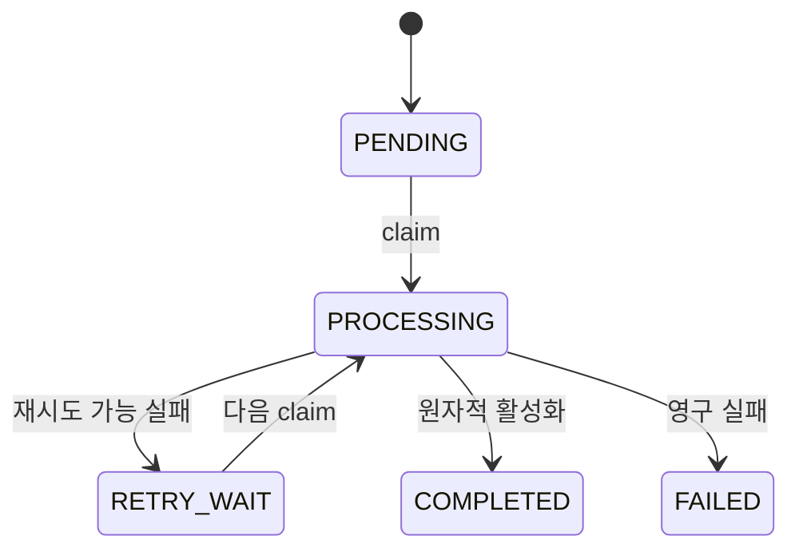

# PRZ-011 — 문서 처리 진행 상태 UX

> **상태:** `VERIFIED`
> **유형:** Feature
> **선행 문서:** [PRZ-010](../PRZ-010-change-log-sync/spec.md)
> **기준 소스:** `fbb3481626a3cba6f36f070845ffae502511569e`
> **최종 확인:** 2026-08-13

IMPLEMENT·VERIFY와 blocking finding 수정 뒤 재-AUDIT Gate를 통과했고, PR #41로
`main`에 통합됐다. 시작 기준 source는
`9b24808b37424f2d11ca0afe374d5703c81868fc`이다.

## 목적

문서 업로드 뒤 새로고침 없이 실제 처리 상태를 갱신하고, 사용자가 현재 단계와
재시도 근거 및 안전하게 분류된 실패 원인을 이해할 수 있게 한다.

현재 API는 ProcessingJob 상태와 일반 오류 코드만 반환하고 frontend는 문서 상태를
한 번만 조회한다. ProcessingJob에는 재시도 횟수와 다음 재시도 시각이 이미 있지만
API에 노출되지 않으며 단계와 청크 진행 수는 저장하지 않는다.

## 기능 구성과 동작 흐름

- ProcessingJob의 단계, 실제 청크 수, 재시도 시각과 안전한 실패 코드를 DB에
  저장한다.
- owner-scoped 문서 API가 진행 정보를 계산해 반환한다.
- frontend는 비종료 상태만 약 2초 간격으로 polling하고 최종 상태에서 중지한다.

`PROCESSING` 안의 실제 진행 단계는 `FILE_READING → TEXT_EXTRACTION →
CHUNK_CREATION → EMBEDDING n/N → SAVING → COMPLETED` 순서로 기록한다.

## 범위

### 포함

- 문서 목록과 열린 문서 상세의 비종료 상태를 약 2초 간격으로 다시 조회한다.
- `PENDING`, `PROCESSING`, `RETRY_WAIT`, version의 `QUARANTINED`를 비종료 상태로
  취급하고 현재 코드의 최종 상태가 되면 polling을 중지한다.
- 기존 `retry_count`, `next_retry_at`을 owner-scoped 문서 API에 노출한다.
- 처리 단계와 실제 임베딩 청크 진행 수를 ProcessingJob에 저장한다.
- Ollama 연결 실패, embedding model 미설치, GPU/model runner 실패와 일반 처리
  실패를 안전한 코드와 사용자 메시지로 구분한다.
- 원래 예외 메시지와 cause는 서버 진단 로그 및 기존 제한 길이 내부 오류 필드에
  유지하되 API로 노출하지 않는다.

### 제외

- 검색 로직, P18 검색 profile, chunk 크기·overlap·검색 결과 계약 변경
- 기존 retry 횟수, 1분·5분·15분 backoff와 scheduler 정책 변경
- Ollama GPU·CUDA·ROCm 환경 설정 강제, Docker 구조 변경
- SSE, WebSocket, push notification과 범용 작업 모니터링 프레임워크
- 처리 예상 완료 시간 또는 시간 기반·단계 가중치 기반 가짜 진행률
- 문서 처리와 직접 관계없는 frontend/backend 리팩터링

## 데이터 및 진행 계약

forward-only Flyway V15로 `processing_jobs`에 다음 nullable 필드만 추가한다. 기존
migration은 수정하지 않는다.

- **필드:** `progress_stage`
  - 계약: `FILE_READING`, `TEXT_EXTRACTION`, `CHUNK_CREATION`, `EMBEDDING`, `SAVING`, `COMPLETED` 중 현재 실제 단계
- **필드:** `completed_chunks`
  - 계약: 현재 claim에서 임베딩과 검증을 끝낸 청크 수. 전체 수 확정 전에는 `NULL`
- **필드:** `total_chunks`
  - 계약: 추출·청킹으로 실제 확정된 전체 청크 수. 확정 전에는 `NULL`
- **필드:** `failure_code`
  - 계약: allowlist된 안전한 실패 분류. 원래 예외 메시지가 아님

- claim 시 단계는 `FILE_READING`으로 시작하고 이전 retry의 진행 수와 실패 코드를
  지운다.
- 단계와 청크 수 갱신은 `processing_job_id + owner_user_id + PROCESSING +
  claim_version` 조건을 모두 만족해야 한다. stale worker는 진행 상태를 쓰지 못한다.
- 청킹 완료 뒤에만 `total_chunks`와 `completed_chunks=0`을 기록한다. 이후 성공한
  embedding의 `floor(completed * 100 / total)` 정수 퍼센트가 바뀌거나 최종
  청크가 완료될 때 실제 완료 수를 checkpoint로 갱신한다.
- 재시도 예약 시 진행 수는 초기화하고 안전한 실패 코드는 유지한다. 최종 실패에는
  실패가 발생한 마지막 단계와 안전한 실패 코드를 유지한다.
- 완료 transaction은 기존 chunk 저장·version 활성화·active pointer·job 완료의
  원자성과 fencing을 보존하고 진행 상태를 `COMPLETED`, 비율을 100%로 확정한다.
- 기존 작업은 모든 신규 필드가 `NULL`이어도 유효해야 한다.

## API 및 표시 계약

owner-scoped 문서 요약과 버전 응답에 처리 단계, 실제 청크 수, 계산된 진행률,
재시도 횟수·최대 횟수·다음 시각 및 안전한 실패 코드를 제공한다.

- `progressPercent`는 `COMPLETED`이면 100이다.
- 그 외에는 `totalChunks > 0`이고 `completedChunks`가 있을 때만
  `floor(completedChunks * 100 / totalChunks)`로 계산한다.
- 전체 청크 수를 모르면 `progressPercent=null`이다. frontend는 spinner와 단계
  텍스트만 표시한다.
- `nextRetryAt`은 DB에 저장된 실제 값만 반환한다. frontend는 그 절대 시각과 현재
  브라우저 시각의 차이만 countdown으로 표시하며 임의 예정 시간을 만들지 않는다.
- `retryCount / maxRetries`는 실제 DB 횟수와 기존 정책 상수에서 가져온다.
- API는 `error_message`, stack trace, 내부 URL·파일 경로를 반환하지 않는다.
- frontend는 status를 우선해 `COMPLETED`일 때만 완료로 표시하며,
  `FAILED`나 `PROCESSING/SAVING`의 100%를 완료로 해석하지 않는다.

안전한 실패 코드는 다음 allowlist를 사용한다.

- **코드:** `OLLAMA_UNAVAILABLE`
  - 사용자 의미: Ollama API에 연결할 수 없거나 실행되지 않음
- **코드:** `OLLAMA_MODEL_NOT_INSTALLED`
  - 사용자 의미: 설정된 embedding model이 설치되지 않음
- **코드:** `OLLAMA_RUNTIME_FAILURE`
  - 사용자 의미: Ollama가 응답했으나 GPU/model runner 실행이 실패함
- **코드:** `DOCUMENT_PROCESSING_FAILED`
  - 사용자 의미: 그 밖의 파일 읽기·추출·검증·처리 실패

## 보존 계약

- 모든 조회와 진행 갱신은 기존 사용자 owner 경계를 유지한다.
- stale-worker lease·claim-version fencing, retry와 recovery 계약을 유지한다.
- 실패하거나 미완성인 version은 검색 후보가 되지 않으며 기존 active version을
  유지한다.
- TXT/PDF 추출, 청킹, 임베딩 검증, chunk source metadata와 완료 transaction을
  보존한다.
- 검색 source, SQL, P18 profile과 평가 dataset은 수정하지 않는다.

## 요구사항 및 완료 조건

### `PRZ-011-R1` — 요구사항

비종료 문서 목록·상세가 약 2초 간격으로 갱신되고 새로고침 없이 상태 변화가 반영되며 최종 상태에서 추가 polling이 중지된다.

### `PRZ-011-R2` — 요구사항

RETRY_WAIT가 실제 `retry_count`, 기존 최대 3회, 실제 `next_retry_at` 기반 횟수와 countdown을 표시한다.

### `PRZ-011-R3` — 요구사항

Ollama 연결, model 미설치, GPU/model 실행, 일반 처리 실패가 allowlist 코드로 구분되고 내부 오류는 API에 노출되지 않는다.

### `PRZ-011-R4` — 요구사항

FILE_READING → TEXT_EXTRACTION → CHUNK_CREATION → EMBEDDING n/N → SAVING → COMPLETED의 실제 단계가 owner·claim fenced DB 갱신으로 관찰된다.

### `PRZ-011-R5` — 요구사항

전체 청크 수 확정 전에는 퍼센트가 `null`이고 spinner/단계만 보이며, 확정 뒤에는 실제 completed/total 비율만 표시하고 완료는 100%다.

### `PRZ-011-R6` — 요구사항

정상 TXT 또는 PDF가 단계와 실제 진행 수를 거쳐 ACTIVE/COMPLETED가 된다.

### `PRZ-011-R7` — 요구사항

기존 retry 정책, 문서 활성화 원자성, stale-worker 보호, 소유권과 기존 문서 처리 계약이 회귀하지 않는다.

### `PRZ-011-R8` — 요구사항

기존 검색 및 P18 profile을 변경하지 않고 문서 처리 뒤 기존 검색 회귀 검증이 통과한다.

## SPEC Gate

- 요구사항과 제외 범위가 충돌하지 않는다.
- 각 요구사항은 migration/source/unit·integration/frontend build 및 실제 로컬
  PostgreSQL·Ollama 흐름으로 판정할 수 있다.
- owner, migration, retry, stale worker, active version과 검색 보존 계약이 명시됐다.

판정: `PASS`
