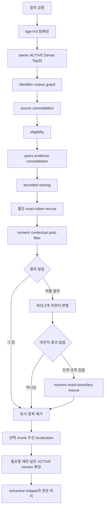

# PRZ-016 현재 검색 아키텍처

> **현재 문서:** 2026-08-27 `origin/main` `4e80417`의 `src/main`과 현재 test를
> 기준으로 한다. 과거 통합 시점의 구조 설명은
> [역사 snapshot](history/2026-08-search-integration-architecture.md)에 원문 그대로 보존한다.

이 문서는 현재 경력 근거 검색의 호출 순서, 데이터 경계와 fallback을 확인하려는
개발자를 위한 문서다. 단계별 benchmark와 연구 판정은 [Evidence](evidence.md), 짧은
제품 설명은 [현재 검색 요약](SEARCH-FINAL-SUMMARY.md)을 따른다.

## 구성 요소

| 구성 요소 | 현재 책임 |
|---|---|
| `SearchService` | 질의 검증, 임베딩, profile 실행, fallback·rescue, 표시 결과 조립 |
| `SearchProperties`·`SearchProfile` | 기본 `source-dedup-evidence-signals-v1`과 `legacy-dense-v1` 선택 |
| `VectorSearchRepository` | owner·현재 `ACTIVE` version 범위의 Dense Top20, identifier·numeric 후보 조회 |
| `CompositeSearchProfile` | source/query-evidence consolidation, eligibility, bounded ranking |
| `EvidenceQualityReranker` | GENERAL 자격 후보에만 상·하한이 있는 품질 보정값을 적용 |
| `ShortGeneralExactTokenRescueProfile` | 짧은 단일 exact-token 질의의 제한적 한 건 복구 |
| `NaturalLanguageQueryFallback` | 결과가 빈 허용 질의의 후보를 최대 두 변형으로 확장 |
| `NumericAnchorRescueProfile` | 단위 숫자의 정확한 경계를 사용하는 마지막 rescue |
| `EvidenceExpansionService` | 선택 chunk 우선 위치 찾기와 같은 ACTIVE version의 제한적 주변 근거 확장 |
| `SearchSnippetGenerator` | 원문 offset을 보존한 최대 3문장 snippet, 분리 불가 시 선택 원문 fallback |

## 호출 순서

### 1. 후보 조회와 격리

`SearchService`는 500자 이하의 유효한 질의를 임베딩하고 벡터를 검증한다.
`VectorSearchRepository`는 PostgreSQL pgvector의 exact cosine `<=>`로 최대 20개 후보를
조회한다. SQL은 distance 계산 후보부터 document, version, chunk의 owner가 현재 사용자와
같은지 확인하고, `document.active_version_id = version.id`와 version `ACTIVE`를 함께
요구한다.

identifier를 직접 구현·완료한 근거를 묻는 질의에는 strong identifier가 해당 사용자의
현재 검색 corpus에 실제로 있는지 먼저 확인한다. 이 guard는 다른 사용자의 문서나 과거
version을 후보로 가져오는 우회 경로가 아니다.

### 2. 후보 정리와 선택

기본 `CompositeSearchProfile`은 겹치는 source 위치를 먼저 정리한다. Dense score, exact
identifier, numeric anchor와 query core term 같은 제한된 신호로 후보 자격을 판정한다.
자격을 통과한 후보에서 같은 질문 근거의 반복을 정리하고, GENERAL 검색은
`EvidenceQualityReranker`의 제한된 보정값을 포함해 순위를 정한 뒤 최대 5건을 선택한다.

GENERAL 검색은 기본 floor를 유지한다. 결과가 비고 정규화된 질의가 단일 2–4자 token인
경우에만 exact token이 일치하는 좁은 점수 구간의 후보 한 건을 복구할 수 있다. 부분
문자열은 인정하지 않고 원래 score와 distance를 반환한다. 단위가 붙은 숫자 질의는 선택
결과에 숫자 주변 문맥이 있는지 후처리한다.

### 3. 빈 결과의 fallback과 rescue

결과가 비고 질의 형태가 허용될 때 `SearchService`가 `NaturalLanguageQueryFallback`이
만든 최대 두 개의 변형을 순서대로 조회한다. 변형은 후보 조회만 넓히며, 최종 profile
선택과 위치 찾기는 원래 질의를 사용하고 원래 질의의 필수 anchor를 보존한다.

그래도 결과가 없고 단위가 붙은 숫자가 있으면 `SearchService`가 숫자 경계를 정확히
일치시키는 후보를 조회하고 `NumericAnchorRescueProfile`로 제한해 다시 평가한다. 이 단계
뒤에는 사용자에게 표시할 원문 내용이 같은 결과를 한 번 더 제거한다.

### 4. 위치 찾기와 주변 근거

`EvidenceExpansionService`는 선택된 chunk 안에서 먼저 질문과 맞는 원문 위치를 찾는다.
그 chunk가 충분하면 다른 위치를 조회하지 않는다. 부족할 때만 같은 owner, document와
현재 `ACTIVE` version의 주변 chunk를 확인한다. 이 과정은 이미 선택한 결과, 순위와
score를 바꾸지 않으며 실패하면 선택 chunk로 돌아간다.

`SearchSnippetGenerator`는 생성형 요약을 만들지 않는다. 가능하면 원문 offset을 보존한
연속 1–3문장을 고른다. 문장을 분리할 수 없거나 위치화 중 예외가 발생하면 선택된 chunk
원문으로 돌아가며, 전체 content와 TXT `TEXT_CHUNK` 또는 PDF `PAGE` 위치를 응답에 남긴다.

## 현재 경로에 없는 연구 구성

과거 snapshot에 등장하는 `StructuredClaimSupportEvaluator`, `QueryClaimRequirements`,
`ClaimSupportDecision`은 현재 `src/main`과 test에 없다. 현재 제품 검색은 actor, 부정,
채택 상태, 진실성 또는 metric 의미를 판정하지 않는다.

GPT judge, Qwen/NLI verifier, FTS/RRF, 별도 BGE reranker와 P16 literal candidate는 연구·평가
기록이다. 해당 결과의 `FAIL`, `NO_GO`, `NEEDS_ADJUSTMENT`를 현재 제품 적용으로 바꾸지
않는다.

## 구현과 test

- [SearchService](../../src/main/java/com/prizm/search/service/SearchService.java)
- [SearchProperties](../../src/main/java/com/prizm/search/config/SearchProperties.java)
- [CompositeSearchProfile](../../src/main/java/com/prizm/search/profile/CompositeSearchProfile.java)
- [EvidenceQualityReranker](../../src/main/java/com/prizm/search/profile/EvidenceQualityReranker.java)
- [VectorSearchRepository](../../src/main/java/com/prizm/search/repository/VectorSearchRepository.java)
- [EvidenceExpansionRepository](../../src/main/java/com/prizm/search/repository/EvidenceExpansionRepository.java)
- [NaturalLanguageQueryFallbackTest](../../src/test/java/com/prizm/search/profile/NaturalLanguageQueryFallbackTest.java)
- [EvidenceQualityRerankerTest](../../src/test/java/com/prizm/search/profile/EvidenceQualityRerankerTest.java)
- [NumericAnchorRescueProfileTest](../../src/test/java/com/prizm/search/profile/NumericAnchorRescueProfileTest.java)
- [SearchSnippetGeneratorTest](../../src/test/java/com/prizm/search/service/SearchSnippetGeneratorTest.java)
- [CareerEvidenceSearchControllerTest](../../src/test/java/com/prizm/search/controller/CareerEvidenceSearchControllerTest.java)

현재 API와 사용자별·`ACTIVE` 격리 계약은 유지된다. 연구 runner와 frozen artifact는 이
호출 경로를 바꾸는 근거가 아니며, [PRZ-016 문서 안내](README.md)에서 별도로 찾을 수 있다.
