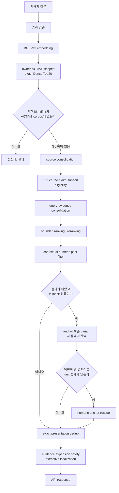

# PRIZM Search 최종 Production 구조

> **역사 snapshot:** 아래 `현재`와 Production 표현은 이 문서를 작성한 당시를 뜻한다.
> 현행 구조는 [현재 검색 아키텍처](../SEARCH-FINAL-ARCHITECTURE.md)를 따른다.

## 문서 범위

이 문서는 `PRZ-016-search-performance-v2`의 현재 source를 기준으로 검색 요청이 API
응답이 되기까지의 실행 순서를 설명한다. spec의 계획이 아니라 `SearchService`,
`CompositeSearchProfile`, `VectorSearchRepository`, `StructuredClaimSupportEvaluator`,
`EvidenceExpansionService`, `SearchSnippetGenerator`의 실제 호출 관계가 기준이다.

Evaluation-only `ClaimVerifierV2`와 `LocalClaimWindowPreselector`는 Production 구조에
포함하지 않는다. 두 클래스는 `src/searchEvaluation`에만 남아 있으며 현재
`CompositeSearchProfile`은 `StructuredClaimSupportEvaluator`를 직접 사용한다.

## 한눈에 보는 흐름

`LEGACY_DENSE_V1` override는 별도 rollback 경로다. 아래 설명은 기본 composite profile의
Production 흐름을 다룬다.

## 1. Query validation과 embedding

### 왜 존재하는가

빈 질문이나 허용 길이를 벗어난 입력을 검색 계층에 보내지 않고, 모든 Dense 검색에 같은
embedding 계약을 적용하기 위해서다.

### 입력과 처리

- 입력: 인증된 owner ID와 원문 query
- 처리: `SearchService.validateQuery` 뒤 `EmbeddingService.embed`
- 검증: embedding dimension, finite value, non-zero norm

현재 기본 embedding model은 설정상 `bge-m3`다. 검색 코드는 embedding을 사실 판정
확률로 해석하지 않는다. cosine similarity를 후보 정렬 신호로만 사용한다.

### 제거·보존 기준

이 단계는 career evidence를 제거하지 않는다. 유효하지 않은 query나 embedding만
요청 실패로 처리한다.

### 유지 이유

검색 알고리즘 이전의 입력·벡터 안전 계약이며, 이후 모든 profile이 같은 조건을 공유한다.

## 2. owner / ACTIVE scoped Dense retrieval

### 왜 존재하는가

질문과 의미상 가까운 문서 chunk를 넓게 회수하되 다른 사용자나 비활성 version이 후보에
들어오는 것을 SQL 단계에서 막기 위해서다.

### 입력과 처리

- 입력: owner ID, 검증된 query embedding
- 구현: `VectorSearchRepository.findCareerEvidenceCandidates`
- 거리: pgvector exact cosine distance 연산자 `<=>`
- 후보 수: distance 오름차순, chunk ID tie-break로 최대 20개

SQL은 document, version, chunk 세 계층의 `owner_user_id`를 모두 같은 owner로 제한한다.
또한 `document.active_version_id = version.id`와 `version.status = 'ACTIVE'`를 함께
확인한다. 별도 ANN index 경로가 아니라 현재 corpus에 대한 exact ordering이다.

### 제거·보존 기준

- 제거: 다른 owner, inactive version, 현재 document의 active version이 아닌 chunk
- 보존: 점수가 낮더라도 우선 Dense Top20 안의 후보. `0.50` floor는 이 단계가 아니라
  eligibility에서 적용된다.

### 유지 이유

PRZ-016 Fresh와 P8.1, Judge A/B/C에서 Dense Top20 안에 정답이 있던 사례가 많았다.
검색 채널을 늘리는 것보다 후속 단계의 과잉 제거와 표시 오류가 더 큰 병목인 시기가
확인됐다.

## 3. Identifier corpus guard

### 왜 존재하는가

문서에 없는 강한 기술명·제품명도 embedding 유사도만으로 관련 결과를 만들 수 있다.
명시적인 경험·근거 질문에서는 해당 identifier가 owner의 ACTIVE corpus에 실제로
있는지 먼저 확인한다.

### 입력과 처리

- 입력: 원문 query에서 추출한 required identifier
- 구현: `CompositeSearchProfile.strongIdentifiersForEvidenceGuard`와
  `VectorSearchRepository.hasAllActiveIdentifiers`
- 범위: 같은 owner의 ACTIVE 문서 제목과 chunk content

### 제거·보존 기준

- 제거: guard 대상 identifier 중 하나라도 ACTIVE corpus에 없을 때 전체 요청을 정상
  빈 결과로 종료
- 보존: 일반 설명 질문, guard 대상이 없는 질문, 모든 identifier가 corpus에 있는 질문

### 유지 이유

없는 강한 identifier가 semantic similarity만으로 통과하는 오탐을 SQL 범위 확인으로
차단한다. owner와 ACTIVE 격리도 그대로 유지된다.

## 4. Source consolidation

### 왜 존재하는가

overlap chunk나 같은 원문 구간이 Dense Top20을 채우는 현상을 줄이되, 같은 PDF page의
서로 다른 프로젝트·claim을 보존하기 위해서다.

### 입력과 처리

- 입력: Dense 후보와 query signal
- 구현: `CompositeSearchProfile.consolidateSourceLocations`
- PDF: 같은 version과 page/sourceIndex만으로 합치지 않는다. source boundary와
  content overlap이 실질적으로 겹칠 때 같은 evidence로 본다.
- TXT: ingestion overlap 특성을 고려한 content overlap을 사용한다.

### 제거·보존 기준

- 제거: 실제 중복 또는 강하게 겹친 source span의 비대표 후보
- 보존: 같은 page라도 다른 프로젝트, 다른 claim, 다른 내용인 후보

### 유지 이유

P11 전 규칙은 page identity를 evidence identity로 오인했다. P11은 실제 이력서의
서로 다른 근거를 복구했고, P11.1은 그 결과 생긴 반복 evidence만 다음 consolidation
단계에서 좁게 줄였다.

## 5. Eligibility와 Structured Claim Support

### 왜 존재하는가

Dense similarity는 “관련해서 언급됨”과 “사용자가 실제로 수행함”을 구분하지 못한다.
부정, 미도입, prototype-only, 다른 actor, 틀린 숫자·unit·metric, 상태 모순을 결과에서
차단해야 한다.

### 입력과 처리

- 입력: query requirement와 source-consolidated candidate content
- 구현: `CompositeSearchProfile.rejectionReasons`와
  `StructuredClaimSupportEvaluator`
- 주요 해석: query/claim 분류, entity·action·actor binding, negation scope,
  adoption/production state, numeric·unit·metric, local 1~3문장 support

`ClaimSupportDecision`은 support 상태, 이유, direct support 여부를 profile에 전달한다.
명확한 direct support 계약은 일부 candidate가 `0.50` 아래여도 floor를 통과할 수 있게
하지만, contradiction과 mere mention은 bypass 대상이 아니다. threshold 값 자체는
`0.50`으로 유지된다.

### 제거·보존 기준

- 제거: claim contradiction, 부정·미도입, 다른 actor, numeric/metric/state 불일치,
  direct support가 없는 floor 미달 후보 등
- 보존: project-scoped 기술 선언, entity와 직접 행동이 결속된 문장, 기존 안전 규칙을
  통과한 일반 evidence

### 유지 이유

P9는 P8.1의 큰 Negative FPR을 0으로 낮췄고, P12와 Final Fix는 실제 이력서의 기술
선언과 scope 오류를 보완했다. evaluator가 크고 새 자연어 표현에 취약하다는 한계는
남아 있지만, V2 Production 통합은 더 넓은 P9/P10 regression에서 오탐과 Positive
누락을 만들었다. 현재 안정 경로가 넓은 frozen 계약에서는 더 안전했다.

## 6. Query-evidence consolidation

### 왜 존재하는가

source span이 조금 달라도 같은 document/version에서 같은 claim을 반복하면 최종 결과가
중복될 수 있다. 반대로 같은 기술을 서로 다른 프로젝트에서 쓴 경험은 모두 남겨야 한다.

### 입력과 처리

- 입력: eligibility를 통과한 후보
- 구현: `CompositeSearchProfile.consolidateQueryEvidence`
- 결속 조건: 같은 document/version, 강한 shared content span, query anchor 공유

### 제거·보존 기준

- 제거: 실질적으로 같은 query-specific claim을 반복하는 후보
- 보존: 다른 프로젝트, 다른 실제 경험, 같은 기술이라도 독립된 source evidence

### 유지 이유

P11.1은 Stress `RS-S02-P02`를 5건에서 3건으로 되돌리면서 실제 이력서의
multi-project retention `4/4/3/3`을 유지했다.

## 7. Ranking / bounded reranking / Top5

### 왜 존재하는가

남은 후보 중 질문에 직접 답하는 evidence를 앞에 두되 Dense 의미 점수를 뒤집는 큰
휴리스틱 점수를 만들지 않기 위해서다.

### 입력과 처리

- 입력: query-evidence distinct 후보
- 기본 신호: 원래 Dense score
- 보조 신호: identifier, core term, numeric boost, bounded evidence quality adjustment
- 출력: GENERAL intent는 comparator로 정렬하고 최대 5건 선택

완료·출시 근거 intent는 별도 안전 계약을 유지한다. 모든 boost와 adjustment는 trace에서
분리해 볼 수 있다.

### 제거·보존 기준

- 제거: 최대 5건 밖의 낮은 순위 후보
- 보존: Dense와 bounded evidence 신호를 함께 반영한 상위 후보

### 유지 이유

별도 BGE reranker는 PRZ-008 평가에서 Recall과 FPR을 개선하지 못한 채 Top1과 비용을
악화시켰다. 현재 방식은 새 model 없이 설명 가능한 작은 조정만 사용한다.

## 8. Post-filter, fallback, numeric rescue

### 8.1 Contextual numeric post-filter

원래 질문의 숫자와 문맥이 정확히 맞지 않는 선택 결과를 `SearchService`에서 한 번 더
제한한다. 이 단계는 새로운 candidate를 만들지 않는다.

### 8.2 Limited natural-language fallback

최초 선택이 비었고 intent가 GENERAL이거나 경험 요청일 때만 실행한다. variant가 원래
질문의 required anchor를 보존하는지 확인하고, 각 variant를 BGE-M3로 다시 embedding해
owner·ACTIVE Dense Top20을 가져온다. 원본 후보와 merge한 뒤 같은 composite profile을
다시 적용하며, 첫 성공에서 멈춘다.

### 8.3 Numeric anchor rescue

fallback 뒤에도 비었고 query에 unit이 있는 숫자가 있으면, owner·ACTIVE SQL에서 exact
numeric boundary가 있는 후보를 최대 20개 가져온다. `NumericAnchorRescueProfile`이 같은
안전 조건으로 최대 범위를 제한한다.

### 유지 이유

fallback과 rescue는 일반 Dense 정책을 우회하는 무제한 경로가 아니다. anchor 보존,
owner·ACTIVE scope, exact numeric boundary, 동일 eligibility를 통해 좁게 운영한다.

## 9. Exact presentation duplicate handling

### 왜 존재하는가

variant merge나 rescue 뒤 내용이 완전히 같은 result가 API에 반복되는 것을 막기 위해서다.

### 입력과 처리

`SearchService.deduplicateExactPresentationContent`가 최종 선택의 normalized presentation
content 기준으로 중복을 제거한다. source/query consolidation을 대체하지 않는 마지막
안전망이다.

### 유지 이유

검색 result의 다양성을 높이되 서로 다른 실제 evidence를 내용 유사도만으로 공격적으로
합치지 않는다.

## 10. Evidence expansion과 localization

### 왜 존재하는가

정답 result chunk와 사용자가 읽어야 할 1~3문장 evidence는 같지 않을 수 있다. 다만
무관한 chunk로 이동하면 올바른 검색 결과도 잘못된 답처럼 보인다.

### 입력과 처리

- 입력: 최종 result와 원문 query
- local selection: `SearchSnippetGenerator`가 `SentenceWindowExtractor`와
  `EvidenceSentenceScorer`로 연속 1~3문장 extractive window를 고른다.
- expansion: `EvidenceExpansionService`가 같은 owner/document/version 안에서만 인접
  evidence를 검토한다.
- 안전 조건: selected chunk의 direct evidence가 충분하면 이동하지 않는다. 확장 후보는
  query의 required ASCII entity/identifier anchor를 보존하고 local evidence보다
  분명히 나아야 한다.

설명형 질문은 problem-only 문장보다 action/result를 포함한 claim-complete window를
우선한다. 문장을 생성하거나 요약하지 않는다.

### 제거·보존 기준

- 제거: 필수 anchor를 잃는 expansion, local evidence보다 낫지 않은 이동
- 보존: 원래 result chunk와 ID·순위·score. evidence chunk가 달라질 때는 별도 source
  metadata로 응답한다.

### 유지 이유

P13은 FCM result 108이 무관한 evidence 106으로 이동하던 문제를 막았고, P14는 같은
chunk에서 해결 행동을 빠뜨리던 snippet을 2문장 span으로 복구했다.

## 11. API response와 상태

결과가 있으면 `EVIDENCE_FOUND`와 최대 5개 결과를 반환한다. 빈 결과는 intent와 corpus
상태에 따라 `NO_SEARCHABLE_DOCUMENTS`, `NO_RELEVANT_RESULTS`, `NO_EVIDENCE`로
구분한다. 각 결과에는 선택 result의 document/version/chunk 정보와 localization된
evidence source가 함께 들어간다.

UI의 “찾은 내용” 축약과 “주변 내용” 펼침은 Frontend presentation이다. Backend 결과
ID, 순서, 개수, score, result/evidence source 계약을 바꾸지 않는다.

## 12. 관찰 가능성과 평가 경계

`SearchDecisionTrace`는 evaluation/debug 실행에서 다음을 구조화해 기록한다.

- ORIGINAL/FALLBACK query variant와 회수 후보
- Dense rank/score와 source metadata
- source/query-evidence group과 representative
- eligibility decision/reason
- ranking 성분과 최종 rank
- result chunk, evidence chunk, snippet, expansion 여부
- candidate가 처음 사라진 단계

Trace는 Production API schema나 검색 결과를 바꾸지 않는다. P7-B `48/48`, Fresh
`44/44`에서 Production parity를 확인했다.

## 13. Research-only / Rejected

다음 구성은 현재 Production pipeline에 없다.

| 구성 | 상태 | Production에 없는 이유 |
|---|---|---|
| PostgreSQL FTS + RRF | 평가 전용 NO_GO | 제한된 lexical hit, 추가 조회, 무관 결과 회귀 |
| BGE-M3 Sparse + RRF | 평가 전용 NO_GO | Recall 이득과 함께 Negative 결과가 크게 증가 |
| 별도 BGE reranker | 평가 전용 NO_GO | Recall/FPR 개선 없이 Top1·지연·메모리 악화 |
| mDeBERTa / KLUE NLI | 연구 종료 | strict entailment와 career evidence/local window의 task mismatch |
| GPT evidence judge | 연구 종료 | Positive 회귀, 미완료 호출, 외부 비용 계약 부족 |
| Qwen semantic verifier | 연구 종료 | safety-first D1보다 Positive 이득 없이 FP와 평균 679.31ms 추가 |
| ClaimVerifierV2 + LocalClaimWindowPreselector | `src/searchEvaluation` 연구 전용 | 좁은 replay는 통과했지만 P9/P10·Stress·실제 이력서 regression 실패 |

## 14. 현재 구조를 읽을 때 주의할 점

- Dense score는 정확도나 사실 확률이 아니다.
- Dense R@20 `100%`는 특정 평가셋의 관측값이며 보편적 보장이 아니다.
- `StructuredClaimSupportEvaluator`는 사실 판정기가 아니라 검색 eligibility guard다.
- 결과가 없다는 이유로 경력이 없다고 말하지 않는다.
- 결과가 있어도 질문의 전제를 자동 확정하지 않는다. 사용자가 extractive 원문과 출처를
  보고 판단한다.
- 새로운 claim-verification 구조를 다시 시도하려면 Judge A/B/C replay만이 아니라
  P9/P10, Stress, 실제 이력서, owner/ACTIVE, localization 전체 계약을 함께 통과해야 한다.

## 관련 기록

- [전체 R&D 흐름](../PRZ-016-SEARCH-RND-HISTORY.md)
- [현재 검색 요약](../SEARCH-FINAL-SUMMARY.md)
- 실패한 V2 Production 통합과 Claim Verification Architecture Audit의 query-level
  evidence는 local-only 연구 artifact로 보존하며 공개 저장소에는 포함하지 않는다.
