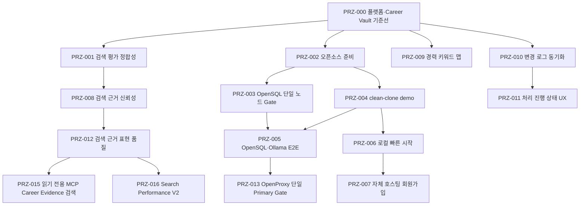

# PRIZM Spec Registry

`specs/`는 기능의 의도, 사전 계획, 작업 상태와 검증 근거를 연결한다. Spec
문서는 구현 증거가 아니며 실제 상태는 source code, 적용된 Flyway migration과
실행 가능한 test로 판정한다.

## 읽는 순서

각 PRZ는 다음 순서로 읽는다. Phase를 가진 PRZ는 상위 `spec.md`와 `evidence.md`를 먼저
읽고, 필요한 Phase의 하위 문서를 확인한다.

1. `spec.md`에서 목적, 기능 구성, 동작·상태 흐름과 보존 계약을 확인한다.
2. `plan.md`에서 구현 전에 선택한 단계, 검증·rollback과 중단 조건을 확인한다.
3. `tasks.md`에서 Plan과 같은 단계별 완료 상태를 확인한다.
4. `evidence.md`에서 실제로 실행한 수직 흐름, source와 환경별 판정을 확인한다.

PRZ-000은 Registry 도입 이전 구현 기준선이라 Plan과 Tasks가 없다. PRZ-005는
표준 [Evidence](PRZ-005-opensql-ollama-e2e/evidence.md)에서 최종 판정을 먼저 확인하고,
명령·실패·복구 이력이 필요할 때만
[상세 작업 보고서](PRZ-005-opensql-ollama-e2e/implementation-report.md)를 읽는다.

## PRZ 전체 흐름

화살표는 제품 전체의 엄격한 build dependency가 아니라, 각 문서가 직접 확장하거나
검증한 기준선을 나타낸다.

## 상태

- **상태:** `AS_BUILT_BASELINE`
  - 의미: Spec Registry 도입 전에 존재하던 기능을 현재 구현 근거로 기록한 기준선
- **상태:** `PLANNED`
  - 의미: 구현 전 요구사항과 범위가 합의된 상태
- **상태:** `IN_PROGRESS`
  - 의미: 구현 또는 검증이 진행 중인 상태
- **상태:** `IMPLEMENTED_UNVERIFIED`
  - 의미: 코드가 있으나 필수 환경 검증이 끝나지 않은 상태
- **상태:** `VERIFIED`
  - 의미: 요구사항과 필수 자동·환경 검증을 모두 충족한 상태
- **상태:** `DEFERRED`
  - 의미: 범위와 재개 조건을 기록하고 미룬 상태
- **상태:** `REJECTED`
  - 의미: 검토 또는 실험 후 채택하지 않은 상태

환경별 결과는 Spec 상태와 분리한다.

- **결과:** `PASS`
  - 의미: 표시한 source commit과 환경에서 실제 검증을 실행해 통과
- **결과:** `FAIL`
  - 의미: 검증을 실행했으나 실패
- **결과:** `SKIPPED`
  - 의미: 명시적인 환경 조건 때문에 검증이 실행되지 않음. `PASS`나 구현 증거가 아님
- **결과:** `NOT_RUN`
  - 의미: 해당 환경이나 명령을 실행하지 않음
- **결과:** `NOT_VERIFIED`
  - 의미: 일부 사실은 확인했지만 목표 동작을 입증하지 못함
- **결과:** `HISTORICAL_PASS_NOT_RERUN`
  - 의미: 과거 성공 기록은 있으나 현재 기준선에서 재실행하지 않음

## 문서별 역할

- **문서:** `spec.md`
  - 단일 역할: 목적, 범위, 요구사항, 보존 계약, 제외 범위와 측정 가능한 완료 조건
- **문서:** `plan.md`
  - 단일 역할: 구현·검증 전에 선택한 접근, 예상 변경, 위험, 검증 환경, rollback·중단 조건, dependency·license와 branch·PR 계획
- **문서:** `tasks.md`
  - 단일 역할: ID, 작업, 최종 상태와 결과 문서 링크만 담은 짧은 체크리스트
- **문서:** `evidence.md`
  - 단일 역할: 최종 상태, 기준 source commit, 요구사항별 판정, 실제 환경·명령·결과, GitHub 통합·review와 남은 제한

최초 실패와 보완 결과 중 현재 판정에 필요한 핵심 이력은 `evidence.md`에 짧게
남긴다. 날짜별 명령과 상세 과정은 실제 Git commit, PR과 CI 기록으로 확인한다.
실행 결과를 spec·plan에 되돌려 넣거나 긴 실행 로그와 선택 이유를 tasks에
복제하지 않는다.

## 운영 규칙

- ID는 `PRZ-###` 형식으로 이 Registry에서 유일하게 관리한다. 실제 `SPEC`을
  시작할 때만 다음 번호를 발급하며 미래 작업 번호를 예약하지 않는다.
- Registry 도입 전 기능은 `AS_BUILT_BASELINE`으로만 기록한다. 존재하지 않았던
  Issue·PR·review를 만들거나 과거에 있었던 것처럼 기록하지 않는다.
- 새 기능과 observable contract 변경은 구현 전에 `spec.md`를 작성한다.
- PRZ는 독립적인 기능 또는 자체 목적이 있는 기술 목표 단위로만 발급한다. 동일 목표의
  순차 개선·실험은 새 PRZ를 만들지 않고 상위 PRZ의 `P0`, `P1` 등의 Phase로 관리한다.
  예를 들어 Search Performance V2의 benchmark, numeric retrieval, reranking과 query
  understanding은 각각 Phase이며 독립 PRZ가 아니다.
- 새 기능과 관찰 가능한 계약 변경에는 구현 전에 `plan.md`와 `tasks.md`가
  필요하다. 제품 동작을 바꾸지 않는 문서 전용 수정은 생략 이유와 확인 결과를
  남길 수 있다.
- 요구사항은 `evidence.md`에서 source·migration·test·실행 환경·결과와 연결한다.
- Issue, PR, CI, merge와 review URL은 실제 존재할 때만 기록한다.
  `REVIEW_NOT_AVAILABLE_SOLO`는 review evidence가 아니다.
- [AGENTS.md](../AGENTS.md)가 프로젝트 불변식의 원본이다. Spec에 같은 규칙을
  별도 헌법처럼 복제하지 않는다.
- PostgreSQL 성공을 OpenSQL·OpenProxy·OpenHA 성공으로 바꾸어 표현하지 않는다.
- 안정 상태에서 장기 branch는 `main`만 유지한다. Branch 이름은 보존 수단이 아니다.

## Registry

- **Spec ID:** [PRZ-000](PRZ-000-platform-baseline/spec.md)
  - 이름: 플랫폼 기반 및 Career Vault 기준선
  - 상태: `AS_BUILT_BASELINE`
  - Source commit: `e995a5f`
  - Last verified: 2026-07-23
- **Spec ID:** [PRZ-001](PRZ-001-search-evaluation-integrity/spec.md)
  - 이름: 검색 평가 분할 및 지표 정합성
  - 상태: `VERIFIED`
  - Source commit: `36c8610`
  - Last verified: 2026-07-24
- **Spec ID:** [PRZ-002](PRZ-002-open-source-readiness/spec.md)
  - 이름: 오픈소스 준비: 출처·라이선스·기여 기준선
  - 상태: `VERIFIED`
  - Source commit: `f54e3d9`
  - Last verified: 2026-07-30
- **Spec ID:** [PRZ-003](PRZ-003-opensql-single-node-gate/spec.md)
  - 이름: OpenSQL 단일 노드 검증 환경
  - 상태: `VERIFIED`
  - Source commit: `777e184`
  - Last verified: 2026-07-30
- **Spec ID:** [PRZ-004](PRZ-004-clean-clone-demo/spec.md)
  - 이름: 안전한 demo USER와 clean-clone 전체 흐름
  - 상태: `VERIFIED`
  - Source commit: `aff3e87`
  - Last verified: 2026-08-01
- **Spec ID:** [PRZ-005](PRZ-005-opensql-ollama-e2e/spec.md)
  - 이름: OpenSQL·Ollama 전체 사용자 흐름
  - 상태: `VERIFIED`
  - Source commit: `eab32c8`
  - Last verified: 2026-08-02
- **Spec ID:** [PRZ-006](PRZ-006-local-single-user-demo/spec.md)
  - 이름: 로컬 보관함 빠른 시작
  - 상태: `VERIFIED`
  - Source commit: `bfd8600`
  - Last verified: 2026-08-04
- **Spec ID:** [PRZ-007](PRZ-007-self-hosted-signup/spec.md)
  - 이름: 자체 호스팅 회원가입
  - 상태: `VERIFIED`
  - Source commit: `2b8b600`
  - Last verified: 2026-08-05
- **Spec ID:** [PRZ-008](PRZ-008-search-evidence-reliability/spec.md)
  - 이름: 검색 근거 신뢰성
  - 상태: `IN_PROGRESS`
  - Source commit: `2190d47`
  - Last verified: 2026-08-13 (통합된 제품 범위)
- **Spec ID:** [PRZ-009](PRZ-009-career-keyword-map/spec.md)
  - 이름: 경력 키워드 맵
  - 상태: `IMPLEMENTED_UNVERIFIED`
  - Source commit: core `d52c6d0`; UI·문서 관리 확장 `3af28492` (origin branch push)
  - Last verified: 2026-08-21
- **Spec ID:** [PRZ-010](PRZ-010-change-log-sync/spec.md)
  - 이름: 변경 로그 동기화
  - 상태: `VERIFIED`
  - Source commit: `26c546b`
  - Last verified: 2026-08-12
- **Spec ID:** [PRZ-011](PRZ-011-document-processing-status-ux/spec.md)
  - 이름: 문서 처리 진행 상태 UX
  - 상태: `VERIFIED`
  - Source commit: `fbb3481`
  - Last verified: 2026-08-13
- **Spec ID:** [PRZ-012](PRZ-012-search-evidence-presentation/spec.md)
  - 이름: 검색 근거 표현 품질 개선
  - 상태: `VERIFIED`
  - Source commit: —
  - Last verified: 2026-08-13 (`VERIFY PASS`: 실제 개인 문서 대표 7개 질의와 검색 불변성 확인)
- **Spec ID:** [PRZ-013](PRZ-013-openproxy-single-primary-gate/spec.md)
  - 이름: OpenProxy 단일 Primary SQL Gate
  - 상태: `VERIFIED`
  - Source commit: `a65f91d`
  - Last verified: 2026-08-14 (`G1 PASS`: OpenProxy `:6432` 단일 Primary SQL,
    Flyway direct/runtime proxy 분리, focused TXT/PDF·Ollama E2E)
- **Spec ID:** [PRZ-014](PRZ-014-openha-topology-gate/spec.md)
  - 이름: 대회 OpenHA Topology 시도 거절 기록
  - 상태: `REJECTED`
  - Source commit: `a65f91d`
  - Last verified: 2026-08-14 (공식 Single-only 설치 지침에 따라 다중 DB node와
    장애전환을 제품 로드맵에서 제거. etcd는 Node A 단일 member로 복귀했고
    Replica/Witness VM은 삭제 완료)
- **Spec ID:** [PRZ-015](PRZ-015-mcp-career-evidence-search/spec.md)
  - 이름: 읽기 전용 MCP Career Evidence 검색
  - 상태: `VERIFIED`
  - Source commit: `97c01cb`
  - Last verified: 2026-08-15 (`P2 PASS`: Flyway는 실제 OpenSQL `:5432`에 직접
    연결하고 애플리케이션은 OpenProxy `:6432/opensql`을 거쳐 실행. Ollama `bge-m3`,
    공식 Java MCP Client와 USER JWT 전체 흐름 통과; `P3 PASS`: OSS 문서 통합)
  - GitHub: [PR #46](https://github.com/jaemin-devlog/PRIZM/pull/46), merge commit `23166e7`
- **Spec ID:** [PRZ-016](PRZ-016-search-performance-v2/spec.md)
  - 이름: Search Performance V2
  - 상태: `IN_PROGRESS` (`P10 EVIDENCE_LOCALIZATION VERIFIED`; `P11 SOURCE_CONSOLIDATION PARTIAL_PASS`, `P11.1 DUPLICATE_EVIDENCE_CONSOLIDATION PASS`, `P12 SIMPLE_TECH_USAGE_ELIGIBILITY PASS`, `P12.1 DIRECT_SUPPORT_FLOOR_BYPASS PASS`, `P13 EVIDENCE_EXPANSION_SAFETY PASS`, `P14 CLAIM_COMPLETE_SNIPPET PASS`)
  - Source commit: —
  - Last verified: 2026-08-19 (P10 localization-only; frozen P8.1 Judge
    selected/displayed/localization 87.5%, FPR 0%; Stress 100/100/100%, FPR 0%;
    Dense/selection regression 0, owner/ACTIVE isolation `PASS`)

## 환경별 판정 주의

- PRZ-005의 OpenSQL direct `5432` API·브라우저·두 사용자 격리와 격리 opt-in
  integration test는 `VERIFIED`다. PRZ-013은 OpenProxy `:6432` 단일 Primary
  SQL routing·`prizm_app` 인증·focused runtime E2E를 `VERIFIED`했다. 대회 제공
  OpenSQL은 Single 구성만 사용하며 다중 노드 장애전환은 후속 Gate로 두지 않는다.
  OpenProxy 이중화와 지속 application process 회복은 명시적 비범위이며, 영구
  journal은 구현·검증하지 않았다.
- PRZ-010은 실제 OpenSQL direct `5432` SQL Gate와 OpenSQL·Ollama `bge-m3` V1→V2
  흐름을 검증했다. 환경 이력과 남은 범위는
  [PRZ-010 Evidence](PRZ-010-change-log-sync/evidence.md)를 따른다. 이 결과도
  OpenProxy, OpenHA 또는 failover 증거가 아니다.
- PRZ-008의 실험 결과와 PRZ-009의 PostgreSQL 검증을 OpenSQL 결과로 확대하지 않는다.

세부 환경, 자동 검증과 GitHub 통합 기록은 각 PRZ의 Evidence를 따른다. 현재 구현과
계획 기능의 구분은 [프로젝트 상태](../docs/project-status.md), 개발 순서는
[로드맵](../docs/roadmap.md)에서 확인한다.
