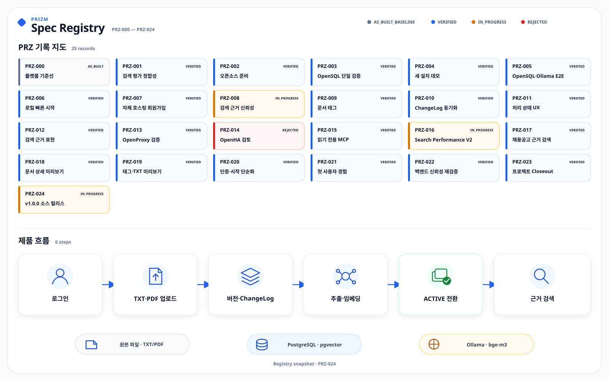

# PRIZM 개발 기록 인덱스

PRZ는 PRIZM의 기능 개발과 기술 검증을 작업 단위로 남기는 기록 번호입니다. 각
폴더에는 무엇을 바꾸려 했는지, 어떻게 진행했는지, 무엇으로 검증했는지가
정리되어 있습니다. 이 문서는 현재 PRZ 목록과 상태를 빠르게 찾는 인덱스이며,
실제 구현 여부는 소스 코드·마이그레이션·테스트와 [현재 구현 현황](../docs/project-status.md)을 기준으로 판단합니다.

`PRZ&#8209;000`은 Registry 도입 전에 이미 존재하던 구현을 소스 기준으로 기록한
`AS_BUILT_BASELINE`입니다. 과거 작업을 새 계획처럼 꾸미거나 Issue·PR·검토 이력을
소급해 만들지 않습니다.

## PRZ 기록과 제품 흐름

그림 위쪽은 `PRZ&#8209;000`부터 `PRZ&#8209;024`까지의 상태와 공식 변경 절차를,
아래쪽은 문서 업로드부터 `ACTIVE` 전환과 근거 검색까지의 대표 흐름을 보여 줍니다.
기본 실행 환경인 PostgreSQL·pgvector와 별도로 검증한 OpenSQL direct·OpenProxy 경로는
서로의 근거를 대신하지 않습니다.

## PRZ 폴더 읽는 법

- `spec.md` — 무엇을 할지
- `plan.md` — 어떻게 할지
- `tasks.md` — 무엇을 했는지
- `evidence.md` — 무엇으로 검증했는지

필요하면 벤치마크와 실패 분석 같은 보조 기록이 함께 들어 있습니다.
`PRZ&#8209;000`은 이미 존재하던 구현의 기준선이므로 `plan.md`와 `tasks.md`가 없습니다.

## 상태 표시

- `AS_BUILT_BASELINE` — Registry 도입 전 구현을 소스 기준으로 남긴 역사적 기준선
- `VERIFIED` — Registry에서 근거를 검토해 검증 완료로 판정한 상태
- `IN_PROGRESS` — 구현 또는 필수 검증 일부가 남은 상태. 현재 제품 전체의 실패를 뜻하지 않음
- `REJECTED` — 검토나 실험 뒤 채택하지 않기로 한 결정

`PASS`, `FAIL`, `NOT_RUN`, `NOT_VERIFIED` 같은 개별 검사 결과와 전체 상태의 차이는
[AI 에이전트 작업 절차](../docs/ai-agent-workflow.md#상태-전이)에서 확인할 수 있습니다.
검사를 실행하지 않은 `NOT_RUN`은 통과로 보지 않으며, PostgreSQL 결과를 OpenSQL
근거로 바꾸어 쓰지 않습니다. 과거 기록과 판정은 현재 결과처럼 소급 수정하지 않습니다.

## PRZ Registry

Search V3의 실험 흐름, 채택·비채택 결과와 전용 branch 운영 경계는
[Search V3 개발 기록](search-v3/README.md)에 따로 정리했습니다.
PRZ-025~045의 문서는 `search-v3/research`, `search-v3/runtime`,
`search-v3/evaluation`에서 읽을 수 있습니다. 기존 경로가 남은 여섯 폴더에는 평가 코드가
경로와 SHA를 함께 검증하는 동결 JSON만 보존했습니다.

| PRZ | 작업 | 상태 | 통합/근거 |
| --- | --- | --- | --- |
| PRZ&#8209;000 | [플랫폼·문서 보관함 기준](PRZ-000-platform-baseline/spec.md) | `AS_BUILT_BASELINE` | [근거](PRZ-000-platform-baseline/evidence.md) · [도입 전 이력](000-pre-spec-implementation-history.md) |
| PRZ&#8209;001 | [검색 평가 정합성](PRZ-001-search-evaluation-integrity/spec.md) | `VERIFIED` | [근거](PRZ-001-search-evaluation-integrity/evidence.md) |
| PRZ&#8209;002 | [오픈소스 준비](PRZ-002-open-source-readiness/spec.md) | `VERIFIED` | [근거](PRZ-002-open-source-readiness/evidence.md) |
| PRZ&#8209;003 | [OpenSQL 단일 서버 검증](PRZ-003-opensql-single-node-gate/spec.md) | `VERIFIED` | [근거](PRZ-003-opensql-single-node-gate/evidence.md) |
| PRZ&#8209;004 | [새 설치 환경 데모](PRZ-004-clean-clone-demo/spec.md) | `VERIFIED` | [근거](PRZ-004-clean-clone-demo/evidence.md) |
| PRZ&#8209;005 | [OpenSQL·Ollama E2E](PRZ-005-opensql-ollama-e2e/spec.md) | `VERIFIED` | [근거](PRZ-005-opensql-ollama-e2e/evidence.md) |
| PRZ&#8209;006 | [로컬 빠른 시작](PRZ-006-local-single-user-demo/spec.md) | `VERIFIED` | [근거](PRZ-006-local-single-user-demo/evidence.md) |
| PRZ&#8209;007 | [자체 호스팅 회원가입](PRZ-007-self-hosted-signup/spec.md) | `VERIFIED` | [근거](PRZ-007-self-hosted-signup/evidence.md) |
| PRZ&#8209;008 | [검색 근거 신뢰성](PRZ-008-search-evidence-reliability/spec.md) | `IN_PROGRESS` | [근거](PRZ-008-search-evidence-reliability/evidence.md) |
| PRZ&#8209;009 | [사용자가 관리하는 문서 태그](PRZ-009-career-keyword-map/spec.md) | `VERIFIED` | [근거](PRZ-009-career-keyword-map/evidence.md) |
| PRZ&#8209;010 | [ChangeLog 동기화](PRZ-010-change-log-sync/spec.md) | `VERIFIED` | [근거](PRZ-010-change-log-sync/evidence.md) |
| PRZ&#8209;011 | [문서 처리 상태 UX](PRZ-011-document-processing-status-ux/spec.md) | `VERIFIED` | [근거](PRZ-011-document-processing-status-ux/evidence.md) |
| PRZ&#8209;012 | [검색 근거 표현](PRZ-012-search-evidence-presentation/spec.md) | `VERIFIED` | [근거](PRZ-012-search-evidence-presentation/evidence.md) |
| PRZ&#8209;013 | [OpenProxy 단일 Primary 검증](PRZ-013-openproxy-single-primary-gate/spec.md) | `VERIFIED` | [근거](PRZ-013-openproxy-single-primary-gate/evidence.md) |
| PRZ&#8209;014 | [OpenHA topology 검토](PRZ-014-openha-topology-gate/spec.md) | `REJECTED` | [근거](PRZ-014-openha-topology-gate/evidence.md) |
| PRZ&#8209;015 | [읽기 전용 MCP 검색](PRZ-015-mcp-career-evidence-search/spec.md) | `VERIFIED` | [근거](PRZ-015-mcp-career-evidence-search/evidence.md) |
| PRZ&#8209;016 | [Search Performance V2](PRZ-016-search-performance-v2/README.md) | `IN_PROGRESS` | [근거](PRZ-016-search-performance-v2/evidence.md) |
| PRZ&#8209;017 | [채용공고 항목별 근거 검색 V1](PRZ-017-job-posting-evidence-v1/spec.md) | `VERIFIED` | [근거](PRZ-017-job-posting-evidence-v1/evidence.md) |
| PRZ&#8209;018 | [문서 상세 미리보기](PRZ-018-document-detail-page/spec.md) | `VERIFIED` | [근거](PRZ-018-document-detail-page/evidence.md) |
| PRZ&#8209;019 | [태그 문서 수·TXT 원문 미리보기](PRZ-019-document-usability-fixes/spec.md) | `VERIFIED` | [근거](PRZ-019-document-usability-fixes/evidence.md) |
| PRZ&#8209;020 | [인증 초기화 제거·빠른 시작 단순화](PRZ-020-auth-bootstrap-cleanup/spec.md) | `VERIFIED` | [근거](PRZ-020-auth-bootstrap-cleanup/evidence.md) |
| PRZ&#8209;021 | [Fresh Clone 첫 사용자 경험 정합화](PRZ-021-first-user-experience/spec.md) | `VERIFIED` | [근거](PRZ-021-first-user-experience/evidence.md) |
| PRZ&#8209;022 | [백엔드 신뢰성 근거 재검증](PRZ-022-backend-reliability-evidence/spec.md) | `VERIFIED` | [근거](PRZ-022-backend-reliability-evidence/evidence.md) |
| PRZ&#8209;023 | [PRIZM 프로젝트 최종 Closeout](PRZ-023-project-closeout/spec.md) | `VERIFIED` | [근거](PRZ-023-project-closeout/evidence.md) |
| PRZ&#8209;024 | [PRIZM v1.0.0 소스 릴리스](PRZ-024-release-v1.0.0/spec.md) | `VERIFIED` | [근거](PRZ-024-release-v1.0.0/evidence.md) |
| PRZ&#8209;025 | [Search V3 기반 계약](search-v3/research/PRZ-025-search-v3-foundation/spec.md) | `IN_PROGRESS` | [근거](search-v3/research/PRZ-025-search-v3-foundation/evidence.md) |
| PRZ&#8209;026 | [Search V3 구조 분할과 Parent-Child 검색](search-v3/research/PRZ-026-structural-parsing-parent-child/spec.md) | `IN_PROGRESS` | [근거](search-v3/research/PRZ-026-structural-parsing-parent-child/evidence.md) |
| PRZ&#8209;027 | [Search V3 Cross Encoder 재정렬](search-v3/research/PRZ-027-cross-encoder-reranking/spec.md) | `VERIFIED` | [근거](search-v3/research/PRZ-027-cross-encoder-reranking/evidence.md) |
| PRZ&#8209;028 | [Search V3 정확 조건 검증](search-v3/research/PRZ-028-typed-exact-constraints/spec.md) | `VERIFIED` | [근거](search-v3/research/PRZ-028-typed-exact-constraints/evidence.md) |
| PRZ&#8209;029 | [Search V3 근거 검증과 선택](search-v3/research/PRZ-029-evidence-validation-selection/spec.md) | `VERIFIED` | [근거](search-v3/research/PRZ-029-evidence-validation-selection/evidence.md) |
| PRZ&#8209;030 | [Search V3 의미 근거 검증 상한](search-v3/research/PRZ-030-semantic-evidence-validation-ceiling/spec.md) | `VERIFIED` | [근거](search-v3/research/PRZ-030-semantic-evidence-validation-ceiling/evidence.md) |
| PRZ&#8209;031 | [Search V3 의미 직접성 판별](search-v3/research/PRZ-031-semantic-evidence-directness/spec.md) | `VERIFIED` | [근거](search-v3/research/PRZ-031-semantic-evidence-directness/evidence.md) |
| PRZ&#8209;032 | [최소 Search V3 Shadow 비교](search-v3/research/PRZ-032-minimal-v3-shadow-comparison/spec.md) | `VERIFIED` | [근거](search-v3/research/PRZ-032-minimal-v3-shadow-comparison/evidence.md) |
| PRZ&#8209;033 | [EvidenceChild 선택 상한](search-v3/research/PRZ-033-atomic-evidence-child-selection-ceiling/spec.md) | `VERIFIED` | [근거](search-v3/research/PRZ-033-atomic-evidence-child-selection-ceiling/evidence.md) |
| PRZ&#8209;034 | [EvidenceChild 선택기](search-v3/research/PRZ-034-atomic-evidence-child-selector/spec.md) | `VERIFIED` | [근거](search-v3/research/PRZ-034-atomic-evidence-child-selector/evidence.md) |
| PRZ&#8209;035 | [Child embedding 운영 전략](search-v3/research/PRZ-035-child-embedding-operation-strategy/spec.md) | `VERIFIED` | [근거](search-v3/research/PRZ-035-child-embedding-operation-strategy/evidence.md) |
| PRZ&#8209;036 | [Search V3 색인 생명주기](search-v3/runtime/PRZ-036-search-v3-index-lifecycle/spec.md) | `VERIFIED` | [근거](search-v3/runtime/PRZ-036-search-v3-index-lifecycle/evidence.md) |
| PRZ&#8209;037 | [Search V3 Shadow Storage](search-v3/runtime/PRZ-037-search-v3-shadow-storage/spec.md) | `VERIFIED` | [근거](search-v3/runtime/PRZ-037-search-v3-shadow-storage/evidence.md) |
| PRZ&#8209;038 | [Search V3 job fencing runtime](search-v3/runtime/PRZ-038-search-v3-job-fencing-runtime/spec.md) | `VERIFIED` | [근거](search-v3/runtime/PRZ-038-search-v3-job-fencing-runtime/evidence.md) |
| PRZ&#8209;039 | [Search V3 inventory와 원자 활성화 runtime](search-v3/runtime/PRZ-039-search-v3-inventory-activation-runtime/spec.md) | `VERIFIED` | [근거](search-v3/runtime/PRZ-039-search-v3-inventory-activation-runtime/evidence.md) |
| PRZ&#8209;040 | [Search V3 Shadow Indexing Worker](search-v3/runtime/PRZ-040-search-v3-shadow-indexing-worker/spec.md) | `VERIFIED` | [근거](search-v3/runtime/PRZ-040-search-v3-shadow-indexing-worker/evidence.md) |
| PRZ&#8209;041 | [Search V3 Runtime Completion](search-v3/runtime/PRZ-041-search-v3-runtime-completion/spec.md) | `VERIFIED` | [근거](search-v3/runtime/PRZ-041-search-v3-runtime-completion/evidence.md) |
| PRZ&#8209;042 | [Search V3 최종 평가](search-v3/evaluation/PRZ-042-search-v3-final-evaluation/spec.md) | `VERIFIED` | [근거](search-v3/evaluation/PRZ-042-search-v3-final-evaluation/evidence.md) |
| PRZ&#8209;043 | [Search V3 Release-grade 평가](search-v3/evaluation/PRZ-043-search-v3-release-grade-evaluation/spec.md) | `VERIFIED` | [근거](search-v3/evaluation/PRZ-043-search-v3-release-grade-evaluation/evidence.md) |
| PRZ&#8209;044 | [Search V3 Release-grade prediction 동결](search-v3/evaluation/PRZ-044-search-v3-release-grade-evaluation/spec.md) | `VERIFIED` | [근거](search-v3/evaluation/PRZ-044-search-v3-release-grade-evaluation/evidence.md) — `EVALUATION_INTEGRITY_BLOCKED` |
| PRZ&#8209;045 | [Search V3 Top2 문서 순위 집계](search-v3/evaluation/PRZ-045-search-v3-top2-document-aggregation/spec.md) | `VERIFIED` | [근거](search-v3/evaluation/PRZ-045-search-v3-top2-document-aggregation/evidence.md) |

## 연구·미채택 기록

`IN_PROGRESS`인 연구 기록은 현재 제품에 기능이 없거나 제품 전체가 실패했다는 뜻이
아닙니다. 통합된 결과와 아직 닫지 않은 검증을 구분해 보존한 상태입니다.

- [PRZ&#8209;008](PRZ-008-search-evidence-reliability/evidence.md) — 기본 profile과 API 개선은 `main`에 통합됐지만 의미 단위 청킹·batch embedding·PDF 중복 최적화의 제품 적용 Gate가 남아 `IN_PROGRESS`입니다.
- [PRZ&#8209;014](PRZ-014-openha-topology-gate/evidence.md) — 다중 OpenSQL DB node와 장애전환을 현재 제품 로드맵에서 제외해 `REJECTED`로 보존합니다.
- [PRZ&#8209;016](PRZ-016-search-performance-v2/README.md) — P15의 인증된 PDF 이동은 `NOT_VERIFIED`, P16은 `NEEDS_ADJUSTMENT`·제품 미적용이어서 전체 상태를 `IN_PROGRESS`로 유지합니다.
- [PRZ&#8209;026](search-v3/research/PRZ-026-structural-parsing-parent-child/evidence.md) — B3 `RetrievalPassage`는 `PROMISING`이지만 C1 Parent Context의 공식 판정은 `NEEDS_ADJUSTMENT`이며 제품에 적용하지 않았습니다.
- [PRZ&#8209;027](search-v3/research/PRZ-027-cross-encoder-reranking/evidence.md) — GTE Cross Encoder 재정렬은 공식 평가 결과 `NO_GO`로 채택하지 않았습니다.
- [PRZ&#8209;031](search-v3/research/PRZ-031-semantic-evidence-directness/evidence.md) — Qwen 직접성 판별은 D1 protocol 실패와 D2 의미 품질 실패를 거쳐 최종 `NO_GO`로 남겼습니다.

## 더 자세히 보기

- [현재 구현 현황](../docs/project-status.md)
- [빠른 시작](../docs/quickstart.md)
- [AI 에이전트 작업 절차](../docs/ai-agent-workflow.md)
- [기여 안내](../CONTRIBUTING.md)
- [전체 개발 기록](../docs/archive/development-log-full-history.md)
